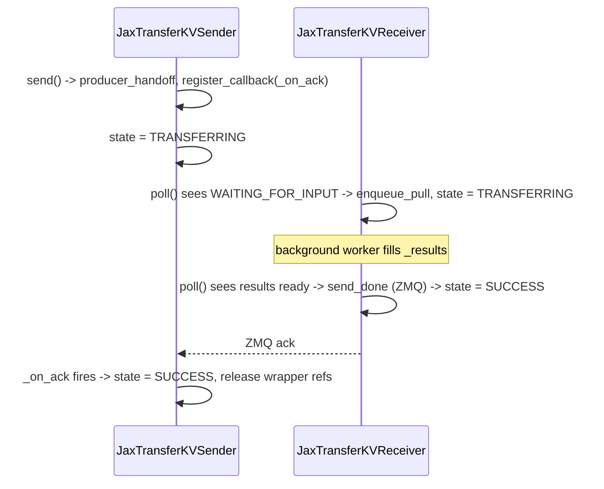

# sgl_jax.srt.disaggregation.jax_transfer.conn — non-blocking KVPoll state machine for prefill/decode disaggregation

## Overview

[`JaxTransferKVSender`](../catalog/python/sgl_jax/srt/disaggregation/jax_transfer/conn.md#JaxTransferKVSender.send)/[`JaxTransferKVReceiver`](../catalog/python/sgl_jax/srt/disaggregation/jax_transfer/conn.md#JaxTransferKVReceiver.poll)
implement prefill→decode KV-cache transfer for disaggregated serving as a **non-blocking**
[`KVPoll`](../catalog/python/sgl_jax/srt/disaggregation/base/kv_manager.md#KVPoll) state machine
(`WAITING_FOR_INPUT` → `TRANSFERRING` → `SUCCESS`/`FAILED`) — every scheduler-facing call
([`poll`](../catalog/python/sgl_jax/srt/disaggregation/jax_transfer/conn.md#JaxTransferKVReceiver.poll),
[`send`](../catalog/python/sgl_jax/srt/disaggregation/jax_transfer/conn.md#JaxTransferKVSender.send))
returns immediately, delegating the actual blocking data movement to a background pull worker or a
ZMQ ack callback so the scheduler's event loop never stalls on cross-host transfer latency.

## Diagram

## Design rationale (why it's built this way)

**`poll()` is deliberately split into a fast, lock-scoped state check and a background handoff, so
the scheduler thread never blocks on the transfer itself.**
[`JaxTransferKVReceiver.poll`](../catalog/python/sgl_jax/srt/disaggregation/jax_transfer/conn.md#JaxTransferKVReceiver.poll)'s
own comment states: "Hand the blocking pull to the background worker. `poll()` stays non-blocking;
a later poll drives `is_ready()` -> ack -> SUCCESS" — since
[`process_decode_queue`](../catalog/python/sgl_jax/srt/disaggregation/decode.md#SchedulerDisaggregationDecodeMixin.process_decode_queue)
runs `poll()` on every scheduling tick for potentially many in-flight requests, a blocking pull
here would serialize all decode-side scheduling behind cross-host RPC latency.

**Callback registration happens *before* the data handoff, not after, to close a race window.**
[`JaxTransferKVSender.send`](../catalog/python/sgl_jax/srt/disaggregation/jax_transfer/conn.md#JaxTransferKVSender.send)'s
comment is explicit: "Register callback before producer_handoff so the ack can't arrive between
data registration and callback registration" — if the order were reversed, a fast decode-side pull
could complete and send its ack before the sender had anywhere to route it, silently dropping a
legitimate completion signal.

**State transitions are validated against an explicit legality table rather than trusted from call
order.**
[`StateHolder._transition_to`](../catalog/python/sgl_jax/srt/disaggregation/base/kv_manager.md#StateHolder._transition_to)
calls
[`is_legal_transition`](../catalog/python/sgl_jax/srt/disaggregation/base/kv_manager.md#is_legal_transition)
against [`LEGAL_TRANSITIONS`](../catalog/python/sgl_jax/srt/disaggregation/base/kv_manager.md#LEGAL_TRANSITIONS.LEGAL_TRANSITIONS)
and raises `ValueError` on a violation — because sender/receiver state is mutated from both the
scheduler thread (via `poll`/`send`) and asynchronous ZMQ callback threads (`_on_ack`), an
unguarded transition could silently corrupt the state machine under a race; the explicit table
turns an illegal concurrent transition into a loud failure instead of a subtly wrong terminal
state.

## Entry points

- [`JaxTransferKVSender.send`](../catalog/python/sgl_jax/srt/disaggregation/jax_transfer/conn.md#JaxTransferKVSender.send) —
  reached from
  [`process_prefill_chunk`](../catalog/python/sgl_jax/srt/disaggregation/prefill.md#SchedulerDisaggregationPrefillMixin.process_prefill_chunk)
  once a prefill request's KV has been extracted and attached as payload.
- [`JaxTransferKVReceiver.poll`](../catalog/python/sgl_jax/srt/disaggregation/jax_transfer/conn.md#JaxTransferKVReceiver.poll) —
  reached every tick from
  [`process_decode_queue`](../catalog/python/sgl_jax/srt/disaggregation/decode.md#SchedulerDisaggregationDecodeMixin.process_decode_queue)
  and [`DecodeTransferQueue.drain_terminal`](../catalog/python/sgl_jax/srt/disaggregation/decode.md#DecodeTransferQueue.drain_terminal)
  to advance the state machine and check for terminal states.
- [`JaxTransferKVSender.fail`](../catalog/python/sgl_jax/srt/disaggregation/jax_transfer/conn.md#JaxTransferKVSender.fail) —
  reached on abort/error paths to force the sender to `FAILED`, releasing wrapper references and
  recording the terminal reason.

## Mechanism (step-by-step)

1. **The sender attaches its payload and calls
   [`JaxTransferKVSender.send`](../catalog/python/sgl_jax/srt/disaggregation/jax_transfer/conn.md#JaxTransferKVSender.send)**,
   which registers the ack callback, then calls
   [`producer_handoff`](../catalog/python/sgl_jax/srt/disaggregation/jax_transfer/conn.md#JaxTransferKVManager.producer_handoff)
   to register each payload entry under a sub-uuid with the wrapper (staging to host first if
   `use_d2h_staging`), and transitions to `TRANSFERRING`.
2. **The receiver's [`poll`](../catalog/python/sgl_jax/srt/disaggregation/jax_transfer/conn.md#JaxTransferKVReceiver.poll)
   first observes `WAITING_FOR_INPUT`**, transitions to `TRANSFERRING`, starts a phase timer via
   [`time_phase`](../catalog/python/sgl_jax/srt/disaggregation/common/metrics.md#time_phase), and
   calls [`enqueue_pull`](../catalog/python/sgl_jax/srt/disaggregation/jax_transfer/conn.md#JaxTransferKVManager.enqueue_pull)
   to hand the blocking remote-array fetch to a background worker — returning immediately without
   waiting for the fetch.
3. **A later `poll()` call, once `_results` is populated and every leaf array `is_ready()`, sends a
   ZMQ done notification** via [`send_done`](../catalog/python/sgl_jax/srt/disaggregation/common/zmq_notifier.md#ZmqPullNotifier.send_done)
   and transitions to `SUCCESS`, recording the terminal event via
   [`record_terminal`](../catalog/python/sgl_jax/srt/disaggregation/common/core.md#CommonKVManager.record_terminal).
4. **On the prefill side, [`_on_ack`](../catalog/python/sgl_jax/srt/disaggregation/jax_transfer/conn.md#JaxTransferKVSender._on_ack)
   fires from the ZMQ callback thread** when the decode side's ack arrives, releasing the
   wrapper's held sub-uuid buffers and transitioning the sender to `SUCCESS` — or to `FAILED` if
   cleanup itself raises.

## Key data structures

- **[`KVPoll`](../catalog/python/sgl_jax/srt/disaggregation/base/kv_manager.md#KVPoll)** — the
  5-state enum (`BOOTSTRAPPING`, `WAITING_FOR_INPUT`, `TRANSFERRING`, `SUCCESS`, `FAILED`) shared
  by both sender and receiver.
- **[`_state_lock`](../catalog/python/sgl_jax/srt/disaggregation/jax_transfer/conn.md#JaxTransferKVReceiver._state_lock)** —
  guards every state read-modify-write on both
  [`JaxTransferKVSender`](../catalog/python/sgl_jax/srt/disaggregation/jax_transfer/conn.md#JaxTransferKVSender._state_lock)
  and `JaxTransferKVReceiver`, since transitions race between the scheduler thread and ZMQ callback
  threads.
- **[`_terminal_records`](../catalog/python/sgl_jax/srt/disaggregation/common/core.md#CommonKVManager._terminal_records)** /
  [`_retired`](../catalog/python/sgl_jax/srt/disaggregation/common/zmq_notifier.md#ZmqPullNotifier._retired) —
  bounded `OrderedDict`s (evicted oldest-first once over a max size) that retain a small window of
  terminal-state history so late/duplicate acks for already-completed transfers can be recognized
  as benign rather than errors.

## Dynamics (design intent)

Because [`register_callback`](../catalog/python/sgl_jax/srt/disaggregation/common/zmq_notifier.md#ZmqPullNotifier.register_callback)
raises if a uuid already has a pending callback, and
[`mark_retired`](../catalog/python/sgl_jax/srt/disaggregation/common/zmq_notifier.md#ZmqPullNotifier.mark_retired)
records terminal-state history with a bounded size, the notifier can distinguish three cases for an
incoming ack: a live pending transfer (normal path), a retired/already-terminal transfer (benign
late ack, ignored), and a genuinely unknown uuid (a real bug) — without unbounded memory growth
from tracking every uuid forever.

## Edge cases

- [`JaxTransferKVSender._on_ack`](../catalog/python/sgl_jax/srt/disaggregation/jax_transfer/conn.md#JaxTransferKVSender._on_ack)
  wraps its cleanup in a `try/except` that itself transitions to `FAILED` and records the failure
  if cleanup raises — a double-fault path (ack arrives, but releasing the wrapper's buffers
  throws) is still driven to a terminal state rather than left stuck in `TRANSFERRING`.
- [`producer_handoff`](../catalog/python/sgl_jax/srt/disaggregation/jax_transfer/conn.md#JaxTransferKVManager.producer_handoff)
  rejects entry names containing `:` since sub-uuids are built as `f"{uuid}:{entry_name}"` — a
  payload key collision with the separator would corrupt sub-uuid parsing.
- [`JaxTransferKVSender.send`](../catalog/python/sgl_jax/srt/disaggregation/jax_transfer/conn.md#JaxTransferKVSender.send)
  drops its own reference to `_payload` after handoff only when `use_d2h_staging` is set — the
  comment notes staging already copied data to host, so the device-side gather output's HBM can be
  freed immediately, whereas the non-staging path must keep the payload alive until the ack.

## Open questions

- The `BOOTSTRAPPING` state appears in
  [`KVPoll`](../catalog/python/sgl_jax/srt/disaggregation/base/kv_manager.md#KVPoll) but no
  transition into or out of it is visible within this packet's cited subgraph.

## See also
- [python-sgl_jax-srt-mem_cache-memory_pool](python-sgl_jax-srt-mem_cache-memory_pool.md) — the KV
  pool this transfer path reads from (prefill) and writes into (decode).
- [python-sgl_jax-srt-managers-scheduler](python-sgl_jax-srt-managers-scheduler.md) — `Scheduler`,
  whose disaggregation mixins drive `process_prefill_chunk`/`process_decode_queue`.

## Sources
- `raw/code/sglang-jax/python/sgl_jax/srt/disaggregation/jax_transfer/conn.py`
- `raw/code/sglang-jax/python/sgl_jax/srt/disaggregation/base/kv_manager.py`
- `raw/code/sglang-jax/python/sgl_jax/srt/disaggregation/common/core.py`
- `raw/code/sglang-jax/python/sgl_jax/srt/disaggregation/common/zmq_notifier.py`
- `raw/code/sglang-jax/python/sgl_jax/srt/disaggregation/decode.py`
- `raw/code/sglang-jax/python/sgl_jax/srt/disaggregation/prefill.py`
