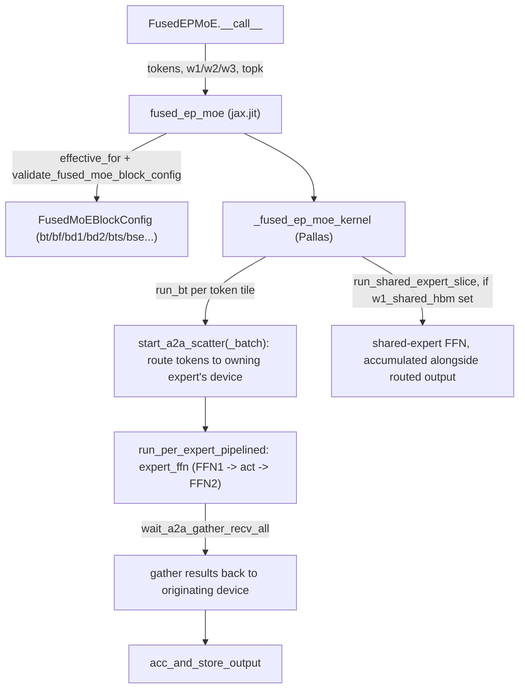

# sgl_jax.srt.kernels.fused_moe.v1.kernel — fused expert-parallel MoE Pallas kernel with inline all-to-all

<!-- connect:up:begin -->
> **Cross-repo concept:** part of [expert-parallelism](../../../concepts/expert-parallelism.md), [pallas-kernel](../../../concepts/pallas-kernel.md) across this wiki's repos.
<!-- connect:up:end -->
## Overview

[`fused_ep_moe`](../catalog/python/sgl_jax/srt/kernels/fused_moe/v1/kernel.md#fused_ep_moe) is a
single Pallas TPU kernel ([`_fused_ep_moe_kernel`](../catalog/python/sgl_jax/srt/kernels/fused_moe/v1/kernel.md#_fused_ep_moe_kernel))
that fuses token routing, cross-device all-to-all (scatter tokens to their expert's device, gather
results back), the FFN1/FFN2 GEMMs, and an optional shared-expert path into one kernel body —
avoiding materializing routed/gathered token tensors in HBM between separate XLA ops. Its block
tile sizes are governed by an immutable
[`FusedMoEBlockConfig`](../catalog/python/sgl_jax/srt/kernels/fused_moe/v1/kernel.md#FusedMoEBlockConfig)
that is resolved per-shape via
[`effective_for`](../catalog/python/sgl_jax/srt/kernels/fused_moe/v1/kernel.md#FusedMoEBlockConfig.effective_for)
and checked via
[`validate_fused_moe_block_config`](../catalog/python/sgl_jax/srt/kernels/fused_moe/v1/kernel.md#validate_fused_moe_block_config)
before every launch.

## Diagram

## Design rationale (why it's built this way)

**Block config resolution is split into two passes — `effective_for` then `validate` — because
overrides change the compiled kernel's actual shapes.**
[`FusedMoEBlockConfig.effective_for`](../catalog/python/sgl_jax/srt/kernels/fused_moe/v1/kernel.md#FusedMoEBlockConfig.effective_for)'s
docstring is explicit: "validate after overrides, because these overrides affect the actual
compiled kernel shapes/scratch" — e.g. it reduces `bt` to `math.gcd(bt, local_num_tokens)` and can
shrink `bf` to a common multiple-of-128 divisor of `intermediate_size`, so validating the
*original* (pre-override) config against divisibility/alignment constraints would check the wrong
numbers.

**The per-expert token tile size `bts` is deliberately allowed to exceed the outer token tile `bt`,
trading routing-tile granularity for decode-time GEMM efficiency.**
[`effective_for`](../catalog/python/sgl_jax/srt/kernels/fused_moe/v1/kernel.md#FusedMoEBlockConfig.effective_for)'s
comment explains: for `ep_size>1` and `top_k>1` a single local expert can receive up to `bt *
ep_size` tokens in one `bt` tile (one token from each device), and "keeping `bts <= bt` forces
small GEMM M-tiles in decode (where local_num_tokens can be tiny), which can significantly hurt
performance" — so `bts` is capped at `bt * ep_size`, not `bt`, letting the per-expert compute GEMM
batch tokens gathered from multiple devices into one larger, more MXU-efficient matmul.

**Quantization scale tensors are read as F32 to simplify slicing, accepting extra data-movement
latency on the assumption the pipeline hides it.** The `w1_scale_hbm` inline comment reads: "We
choose F32 scale for easier slicing. The extra latency should be hidden in the pipeline
overlapping" (flagged with a `TODO` questioning whether a better approach exists) — this documents
an explicit, not-yet-revisited trade-off between implementation simplicity and per-block DMA
volume for quantized MoE.

**`bt` must be 2, 4, or a multiple of 8 — not any divisor — to bound the tuned-config search
space while still covering small-batch decode.**
[`validate_fused_moe_block_config`](../catalog/python/sgl_jax/srt/kernels/fused_moe/v1/kernel.md#validate_fused_moe_block_config)'s
comment states this explicitly: bt=2,4 exist only "for small-batch decode (e.g.
local_num_tokens=2 when ep_size=32)," while prefill is restricted to multiples of 8 — an
intentional narrowing of the tuning grid rather than a hardware constraint alone.

## Entry points

- [`FusedEPMoE.__call__`](../catalog/python/sgl_jax/srt/layers/fused_moe.md#FusedEPMoE.__call__) —
  the model-facing forward pass; unpacks layer parameters and calls
  [`fused_ep_moe`](../catalog/python/sgl_jax/srt/kernels/fused_moe/v1/kernel.md#fused_ep_moe)
  directly.
- [`fused_ep_moe`](../catalog/python/sgl_jax/srt/kernels/fused_moe/v1/kernel.md#fused_ep_moe) —
  the `jax.jit`-wrapped kernel launcher; validates args via
  [`_validate_fused_ep_moe_args`](../catalog/python/sgl_jax/srt/kernels/fused_moe/v1/kernel.md#_validate_fused_ep_moe_args)
  and dispatches into `_fused_ep_moe_kernel`.
- [`get_tuned_fused_moe_block_config`](../catalog/python/sgl_jax/srt/kernels/fused_moe/v1/tuned_block_configs.md#get_tuned_fused_moe_block_config) —
  reached when no explicit `block_config` is supplied; looks up a per-device, per-shape tuned
  config, falling back to
  [`DEFAULT_FUSED_MOE_BLOCK_CONFIG`](../catalog/python/sgl_jax/srt/kernels/fused_moe/v1/tuned_block_configs.md#DEFAULT_FUSED_MOE_BLOCK_CONFIG)
  if the exact shape wasn't tuned.

## Mechanism (step-by-step)

1. **[`fused_ep_moe`](../catalog/python/sgl_jax/srt/kernels/fused_moe/v1/kernel.md#fused_ep_moe)
   resolves the block config** (tuned lookup or explicit override), calls
   [`effective_for`](../catalog/python/sgl_jax/srt/kernels/fused_moe/v1/kernel.md#FusedMoEBlockConfig.effective_for)
   to adjust it for the actual `num_tokens`/`ep_size`/`dtype`, then
   [`validate_fused_moe_block_config`](../catalog/python/sgl_jax/srt/kernels/fused_moe/v1/kernel.md#validate_fused_moe_block_config)
   to reject an incompatible shape before compiling.
2. **`_fused_ep_moe_kernel`'s outer loop is [`run_bt`](../catalog/python/sgl_jax/srt/kernels/fused_moe/v1/kernel.md#_fused_ep_moe_kernel.run_bt),
   iterating over token tiles of size `bt`.** Each iteration prefetches the *next* tile's routing
   metadata while computing the current one (`start_fetch_topk`/`start_fetch_se_tokens` gated by
   `@pl.when(next_bt_id < num_bt)`), then issues the scatter DMAs that route this tile's tokens to
   their assigned expert's device.
3. **[`run_per_expert_pipelined`](../catalog/python/sgl_jax/srt/kernels/fused_moe/v1/kernel.md#_fused_ep_moe_kernel.run_bt.run_per_expert_pipelined)
   runs the routed-expert FFN (`expert_ffn`) once per local expert**, overlapped with issuing the
   next expert's scatter (`start_a2a_scatter`) so compute and inter-device communication pipeline
   against each other rather than serializing.
4. **If a shared expert is configured,
   [`run_shared_expert_slice`](../catalog/python/sgl_jax/srt/kernels/fused_moe/v1/kernel.md#_fused_ep_moe_kernel.run_shared_expert_slice)
   computes its FFN1/FFN2 for every token** (not just routed ones), double-buffering weight
   prefetch (`start_fetch_se_w1`/`start_fetch_se_w3`) across `bd1` slices, and its output is
   accumulated alongside the routed-expert output before the final store.

## Key data structures

- **[`FusedMoEBlockConfig`](../catalog/python/sgl_jax/srt/kernels/fused_moe/v1/kernel.md#FusedMoEBlockConfig)** —
  a frozen, pytree-registered dataclass of block sizes:
  [`bt`](../catalog/python/sgl_jax/srt/kernels/fused_moe/v1/kernel.md#FusedMoEBlockConfig.bt) (outer
  token tile),
  [`bf`](../catalog/python/sgl_jax/srt/kernels/fused_moe/v1/kernel.md#FusedMoEBlockConfig.bf)
  (intermediate/FFN tile),
  [`bd1`](../catalog/python/sgl_jax/srt/kernels/fused_moe/v1/kernel.md#FusedMoEBlockConfig.bd1)/[`bd2`](../catalog/python/sgl_jax/srt/kernels/fused_moe/v1/kernel.md#FusedMoEBlockConfig.bd2)
  (hidden-dim tiles for FFN1/FFN2),
  [`bts`](../catalog/python/sgl_jax/srt/kernels/fused_moe/v1/kernel.md#FusedMoEBlockConfig.bts)
  (per-expert token tile, may exceed `bt`),
  [`bse`](../catalog/python/sgl_jax/srt/kernels/fused_moe/v1/kernel.md#FusedMoEBlockConfig.bse)
  (shared-expert intermediate tile).
- **`_fused_ep_moe_kernel`'s HBM ref list** — includes routing/metadata buffers
  (`metadata_starts_hbm`, `metadata_sizes_hbm`, `metadata_d2e_counts_hbm`) used for the
  all-reduce-based token-count metadata path, and double-buffered (`_x2_`) VMEM scratch for every
  weight tensor to overlap the next tile's fetch with current compute.

## Dynamics (design intent)

Because `run_bt`'s prefetch of tile `next_bt_id` is issued before the current tile finishes
computing (`@pl.when(next_bt_id < num_bt)` gate at the top of the loop body), and
`run_per_expert_pipelined` similarly overlaps each expert's compute with the next expert's scatter
DMA, the kernel is structured as a software-pipelined loop nest: the goal is that all-to-all
network/DMA latency for token routing is hidden behind MXU compute for the previous tile/expert,
rather than the two phases alternating serially.

## Edge cases

- [`get_tuned_fused_moe_block_config`](../catalog/python/sgl_jax/srt/kernels/fused_moe/v1/tuned_block_configs.md#get_tuned_fused_moe_block_config)
  falls back through three tiers — exact device-name tuned entry, a wildcard `"*"` device entry,
  then [`DEFAULT_FUSED_MOE_BLOCK_CONFIG`](../catalog/python/sgl_jax/srt/kernels/fused_moe/v1/tuned_block_configs.md#DEFAULT_FUSED_MOE_BLOCK_CONFIG) —
  so an untuned (device, shape) combination silently gets a possibly-suboptimal default rather
  than failing.
- [`validate_fused_moe_block_config`](../catalog/python/sgl_jax/srt/kernels/fused_moe/v1/kernel.md#validate_fused_moe_block_config)
  requires `hidden_size % 128 == 0` and `intermediate_size % 128 == 0` unconditionally — a model
  whose FFN dims aren't 128-aligned cannot use this kernel path at all.
- Every `disable_*` flag on
  [`fused_ep_moe`](../catalog/python/sgl_jax/srt/kernels/fused_moe/v1/kernel.md#fused_ep_moe) is
  annotated "Profiling / ablation flags (reserved; no-op in this branch)" in the source — they are
  part of the static-argnames signature but do not currently alter kernel behavior in this file.

## Open questions

- Whether the `w1_scale_hbm`/etc. F32-scale "extra latency hidden in pipeline overlapping" claim
  has been measured (vs. asserted in the `TODO` comment) is not resolved within this packet's
  cited subgraph.

## See also
- [python-sgl_jax-srt-kernels-fused_moe-v2-kernel](python-sgl_jax-srt-kernels-fused_moe-v2-kernel.md) —
  the v2 successor kernel, comparable via
  [`v1_bc_eff`](../catalog/python/sgl_jax/srt/kernels/fused_moe/v2/bench_compare.md#v1_bc_eff) in
  the bench-compare harness.
- [python-sgl_jax-srt-kernels-fused_moe-v2-bench_compare](python-sgl_jax-srt-kernels-fused_moe-v2-bench_compare.md) —
  the benchmark that directly compares this v1 kernel's effective block config against v2.

## Sources
- `raw/code/sglang-jax/python/sgl_jax/srt/kernels/fused_moe/v1/kernel.py`
- `raw/code/sglang-jax/python/sgl_jax/srt/kernels/fused_moe/v1/tuned_block_configs.py`
- `raw/code/sglang-jax/python/sgl_jax/srt/layers/fused_moe.py`
