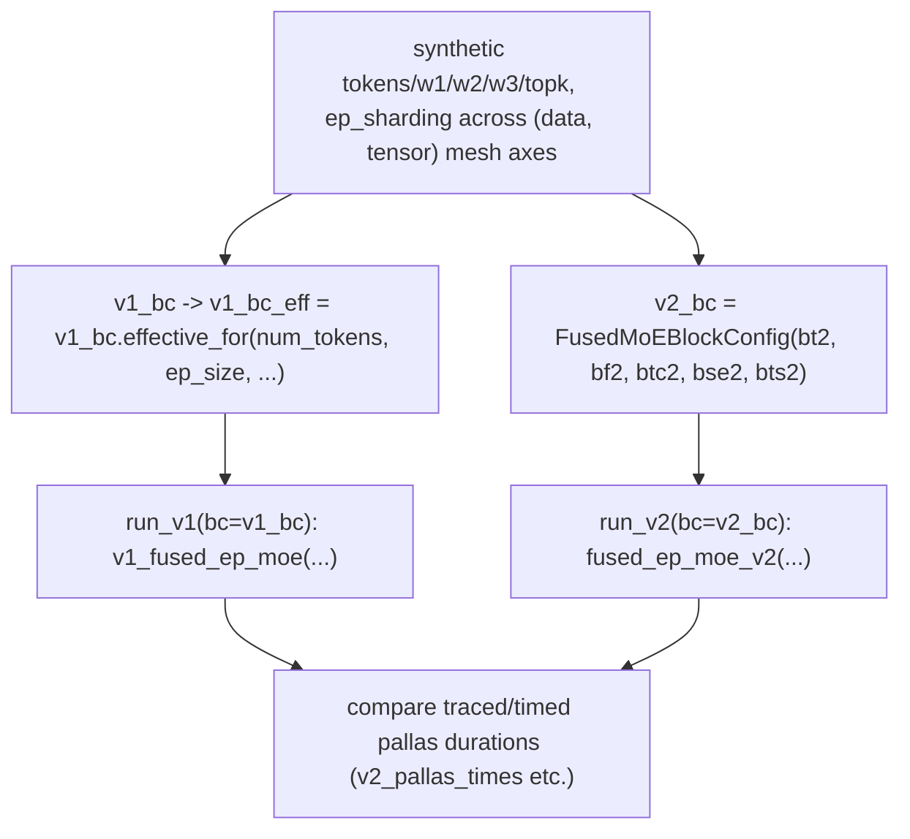

# sgl_jax.srt.kernels.fused_moe.v2.bench_compare — v1-vs-v2 fused MoE kernel A/B microbenchmark

## Overview

This module is a standalone benchmark script that runs the same synthetic MoE workload through
both the v1 ([`v1_fused_ep_moe`](../catalog/python/sgl_jax/srt/kernels/fused_moe/v2/bench_compare.md#run_v1))
and v2 ([`fused_ep_moe_v2`](../catalog/python/sgl_jax/srt/kernels/fused_moe/v2/kernel.md#fused_ep_moe_v2))
fused expert-parallel MoE kernels under matched block configs, to quantify the v2 kernel's speedup
(or regression) over v1 for a given (num_tokens, num_experts, top_k, ep_size) point. It resolves
v1's block config through v1's own
[`effective_for`](../catalog/python/sgl_jax/srt/kernels/fused_moe/v1/kernel.md#FusedMoEBlockConfig.effective_for)
override rules before comparison, ensuring both kernels run under a config each considers valid for
the shape rather than a raw, possibly-invalid shared config.

## Diagram

## Design rationale (why it's built this way)

**v1's block config is passed through v1's own `effective_for` before the comparison run, rather
than comparing raw configs.**
[`v1_bc_eff`](../catalog/python/sgl_jax/srt/kernels/fused_moe/v2/bench_compare.md#v1_bc_eff) calls
[`v1_bc.effective_for`](../catalog/python/sgl_jax/srt/kernels/fused_moe/v1/kernel.md#FusedMoEBlockConfig.effective_for)
with the benchmark's `num_tokens`/`ep_size` — since `effective_for`'s own docstring warns that
overrides "affect the actual compiled kernel shapes/scratch," skipping this step would risk
comparing v2 against a v1 config that v1 itself would never actually run with for this shape,
making the comparison meaningless.

**Tokens are explicitly sharded across the combined `(data, tensor)` mesh axes for the
expert-parallel benchmark.**
[`ep_sharding`](../catalog/python/sgl_jax/srt/kernels/fused_moe/v2/bench_compare.md#ep_sharding) is
built as `NamedSharding(mesh, P(("data", "tensor")))` — since expert-parallelism in this codebase
is not a single dedicated mesh axis but a composite over both DP and TP axes, the benchmark must
reproduce that composite sharding to measure realistic all-to-all costs rather than an
artificially simpler single-axis split.

**`run_v1`/`run_v2` are defined as closures over shared synthetic tensors with only `bc` as a
parameter,** so repeated timed calls (e.g. across a shape sweep or a warmup/measurement loop) swap
only the block config, isolating the config's effect on latency from setup/data-generation cost
that would otherwise dominate a naive per-call benchmark.

## Entry points

- [`run_v1`](../catalog/python/sgl_jax/srt/kernels/fused_moe/v2/bench_compare.md#run_v1) —
  invokes the v1 kernel (`v1_fused_ep_moe`) with the effective v1 block config.
- [`run_v2`](../catalog/python/sgl_jax/srt/kernels/fused_moe/v2/bench_compare.md#run_v2) —
  invokes [`fused_ep_moe_v2`](../catalog/python/sgl_jax/srt/kernels/fused_moe/v2/kernel.md#fused_ep_moe_v2)
  with the v2 block config; both share the same synthetic `tokens`/`w1`/`w2`/`w3`/`topk_wts`.

## Mechanism (step-by-step)

1. **Synthetic MoE tensors (`w1`/`w2`/`w3`, routing weights/ids) are constructed and sharded**
   ([`w1`](../catalog/python/sgl_jax/srt/kernels/fused_moe/v2/bench_compare.md#w1)/[`w2`](../catalog/python/sgl_jax/srt/kernels/fused_moe/v2/bench_compare.md#w2)/[`w3`](../catalog/python/sgl_jax/srt/kernels/fused_moe/v2/bench_compare.md#w3))
   across the mesh via
   [`ep_sharding`](../catalog/python/sgl_jax/srt/kernels/fused_moe/v2/bench_compare.md#ep_sharding),
   with token-count candidates driving
   [`num_tokens`](../catalog/python/sgl_jax/srt/kernels/fused_moe/v2/bench_compare.md#num_tokens)
   across the swept shapes.
2. **v1's block config is built (`v1_bc`) then resolved to its effective form** via
   [`v1_bc_eff`](../catalog/python/sgl_jax/srt/kernels/fused_moe/v2/bench_compare.md#v1_bc_eff)
   against the current `num_tokens`/`ep_size`, while v2's config
   ([`v2_bc`](../catalog/python/sgl_jax/srt/kernels/fused_moe/v2/bench_compare.md#v2_bc)) is built
   directly from swept `bt2`/`bf2`/`btc2`/`bse2`/`bts2` values.
3. **[`run_v1`](../catalog/python/sgl_jax/srt/kernels/fused_moe/v2/bench_compare.md#run_v1) and
   [`run_v2`](../catalog/python/sgl_jax/srt/kernels/fused_moe/v2/bench_compare.md#run_v2) are each
   traced/timed**, and Pallas-kernel-specific durations are extracted (e.g.
   [`v2_pallas_times`](../catalog/python/sgl_jax/srt/kernels/fused_moe/v2/bench_compare.md#v2_pallas_times)
   pulled from a trace dict) to isolate kernel time from surrounding dispatch overhead.

## Key data structures

- **[`v1_bc_eff`](../catalog/python/sgl_jax/srt/kernels/fused_moe/v2/bench_compare.md#v1_bc_eff)** —
  the v1 `FusedMoEBlockConfig` after `effective_for` overrides, the config v1's kernel is actually
  compiled and run with in this comparison.
- **[`v2_bc`](../catalog/python/sgl_jax/srt/kernels/fused_moe/v2/bench_compare.md#v2_bc)** — the v2
  `FusedMoEBlockConfig`, built directly (v2 has no analogous override-then-validate call visible in
  this packet's benchmark path).

## Dynamics (design intent)

Because both `run_v1` and `run_v2` close over the *same* synthetic input tensors and mesh sharding,
any timing difference measured between them is attributable to the kernel implementation and block
config alone, not to differences in data layout or generation between the two runs.

## Edge cases

- [`log`](../catalog/python/sgl_jax/srt/kernels/fused_moe/v2/bench_compare.md#log) prefixes every
  message with elapsed wall time and `jax.process_index()`, indicating this benchmark is expected
  to run (and be legible) under multi-process/multi-host JAX execution, not just single-host.

## Open questions

- The specific shape/`ep_size` sweep points used for the reported v1-vs-v2 comparison (and the
  resulting speedup numbers) are not resolved within this packet's cited subgraph.

## See also
- [python-sgl_jax-srt-kernels-fused_moe-v1-kernel](python-sgl_jax-srt-kernels-fused_moe-v1-kernel.md) —
  the v1 kernel under comparison.
- [python-sgl_jax-srt-kernels-fused_moe-v2-kernel](python-sgl_jax-srt-kernels-fused_moe-v2-kernel.md) —
  the v2 kernel under comparison.
- [python-sgl_jax-srt-kernels-fused_moe-v2-bench_v2](python-sgl_jax-srt-kernels-fused_moe-v2-bench_v2.md) —
  the v2-only microbenchmark exercising v2's full flag surface.

## Sources
- `raw/code/sglang-jax/python/sgl_jax/srt/kernels/fused_moe/v2/bench_compare.py`
- `raw/code/sglang-jax/python/sgl_jax/srt/kernels/fused_moe/v1/kernel.py`
- `raw/code/sglang-jax/python/sgl_jax/srt/kernels/fused_moe/v2/kernel.py`
