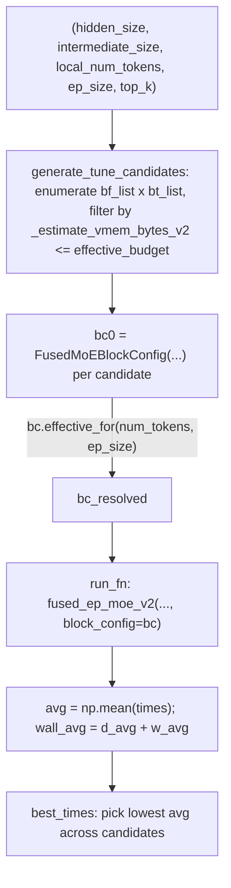

# sgl_jax.srt.kernels.fused_moe.v2.bench_v2 — VMEM-budget-aware block-config tuning search for fused_ep_moe_v2

<!-- connect:up:begin -->
> **Cross-repo concept:** part of [vmem](../../../concepts/vmem.md), [vmem-budget](../../../concepts/vmem-budget.md) across this wiki's repos.
<!-- connect:up:end -->
## Overview

[`generate_tune_candidates`](../catalog/python/sgl_jax/srt/kernels/fused_moe/v2/bench_v2.md#generate_tune_candidates)
enumerates a bounded grid of `FusedMoEBlockConfig` block-size combinations (`bt`, `bf`, `bts`, ...)
for a given (hidden_size, intermediate_size, local_num_tokens, ep_size, top_k) shape, filtered by an
estimated VMEM footprint against a budget, and
[`run_fn`](../catalog/python/sgl_jax/srt/kernels/fused_moe/v2/bench_v2.md#run_fn)/[`result`](../catalog/python/sgl_jax/srt/kernels/fused_moe/v2/bench_v2.md#result)
time-execute
[`fused_ep_moe_v2`](../catalog/python/sgl_jax/srt/kernels/fused_moe/v2/kernel.md#fused_ep_moe_v2)
under each candidate to find the best-performing config. This is the harness that produces the
tuned-config tables the kernel launcher consults at runtime.

## Diagram

## Design rationale (why it's built this way)

**Candidate generation is filtered by an estimated VMEM footprint against a configurable budget
with headroom, not just by shape-divisibility constraints.**
[`generate_tune_candidates`](../catalog/python/sgl_jax/srt/kernels/fused_moe/v2/bench_v2.md#generate_tune_candidates)
computes `effective_budget = int(vmem_budget * vmem_headroom)` (default `vmem_headroom=0.95`) and
only keeps candidates whose estimated scratch/double-buffer usage fits under it — since a Pallas
kernel that overflows VMEM fails to compile at all, filtering before compilation avoids wasting
tuning-search time attempting configs doomed to fail, and the 95% headroom leaves margin against
the estimate being slightly optimistic.

**`bt_list` special-cases very small token counts (2, 4) alongside a doubling sequence from 8
upward**, rather than a uniform stride — this mirrors the same `bt in (2, 4) or bt % 8 == 0`
constraint the v1 kernel's `validate_fused_moe_block_config` enforces, ensuring the tuning search
only explores configs the kernel would actually accept for extreme small-batch decode shapes
(`local_num_tokens` as low as 2 under high `ep_size`).

**Timing measures both a Pallas-internal duration and a wall-clock duration, summed into
`wall_avg`.** [`wall_avg`](../catalog/python/sgl_jax/srt/kernels/fused_moe/v2/bench_v2.md#wall_avg)
is computed as `d_avg + w_avg` — separating a dispatch/wait component from the kernel's own
measured duration lets the tuning search account for per-call overhead that a Pallas-only timer
would miss, avoiding a tuned config that looks fast in-kernel but has hidden dispatch cost.

## Entry points

- [`generate_tune_candidates`](../catalog/python/sgl_jax/srt/kernels/fused_moe/v2/bench_v2.md#generate_tune_candidates) —
  the candidate-enumeration entry point; called once per shape to be tuned.
- [`run_fn`](../catalog/python/sgl_jax/srt/kernels/fused_moe/v2/bench_v2.md#run_fn) —
  the per-candidate timed closure invoking
  [`fused_ep_moe_v2`](../catalog/python/sgl_jax/srt/kernels/fused_moe/v2/kernel.md#fused_ep_moe_v2)
  with the full flag surface (`direct_scaled_dot`, `enable_act_quant`, `cross_expert_prefetch_mode`,
  `interleave_bt`, `enable_bt_scatter_overlap`).

## Mechanism (step-by-step)

1. **[`generate_tune_candidates`](../catalog/python/sgl_jax/srt/kernels/fused_moe/v2/bench_v2.md#generate_tune_candidates)
   builds `bf_list` from a fixed candidate set `[128, 256, 512, 1024, 2048]`** filtered to values
   that evenly divide `intermediate_size`, and `bt_list` from the 2/4-or-power-of-2-multiples-of-8
   rule bounded by `local_num_tokens`.
2. **Each `(bt, bf, ...)` combination is checked against the VMEM budget** inside
   [`generate_tune_candidates`](../catalog/python/sgl_jax/srt/kernels/fused_moe/v2/bench_v2.md#generate_tune_candidates)
   (via an internal estimator) before being added to `configs`, so the returned candidate list is
   pre-filtered to configs expected to compile.
3. **Each candidate config is wrapped in a [`bc0`](../catalog/python/sgl_jax/srt/kernels/fused_moe/v2/bench_v2.md#bc0)
   `FusedMoEBlockConfig`**, resolved to [`bc_resolved`](../catalog/python/sgl_jax/srt/kernels/fused_moe/v2/bench_v2.md#bc_resolved)
   via `bc.effective_for(num_tokens=padded_nt, ep_size=ep_size)`, then run through
   [`run_fn`](../catalog/python/sgl_jax/srt/kernels/fused_moe/v2/bench_v2.md#run_fn) for timing.
4. **Per-candidate timings are averaged** ([`avg`](../catalog/python/sgl_jax/srt/kernels/fused_moe/v2/bench_v2.md#avg)
   over repeated calls) and combined into
   [`wall_avg`](../catalog/python/sgl_jax/srt/kernels/fused_moe/v2/bench_v2.md#wall_avg), with the
   best-performing candidate surfaced via
   [`best_times`](../catalog/python/sgl_jax/srt/kernels/fused_moe/v2/bench_v2.md#best_times).
5. **A reference (unfused or alternate) computation is run for correctness comparison** —
   [`ref`](../catalog/python/sgl_jax/srt/kernels/fused_moe/v2/bench_v2.md#ref) is invoked with
   [`ref_kwargs`](../catalog/python/sgl_jax/srt/kernels/fused_moe/v2/bench_v2.md#ref_kwargs)
   (`swiglu_limit`/`shared_swiglu_limit`) matching the tuned run's activation-clamping parameters,
   so the numeric check exercises the same activation-function behavior as the timed candidate.

## Key data structures

- **`bt_list`/`bf_list`** — the enumerated candidate axes for the tuning grid, shape-dependent and
  bounded by both divisibility and the kernel's small-batch special cases.
- **[`bc0`](../catalog/python/sgl_jax/srt/kernels/fused_moe/v2/bench_v2.md#bc0)** — the
  per-candidate `FusedMoEBlockConfig` before `effective_for` resolution.

## Dynamics (design intent)

Because candidates are filtered by estimated VMEM footprint *before* any are compiled/timed, the
search avoids spending compile time on configs that would fail — the estimator acts as a cheap
static pre-filter ahead of the expensive dynamic step (actual `jax.jit` compilation and timed
execution) for every remaining candidate.

## Edge cases

- The exception handler at [`e`](../catalog/python/sgl_jax/srt/kernels/fused_moe/v2/bench_v2.md#e)
  is commented "e.g. num_tokens not aligned to ep_size" — the tuning loop expects and tolerates
  candidates that fail shape validation for a given `num_tokens`, rather than treating any
  exception as fatal to the whole sweep.
- `max_configs` (default 48) caps the candidate list even if more combinations pass the VMEM
  filter, bounding total tuning-search wall time at the cost of potentially missing an
  untried-but-better config.

## Open questions

- The internal VMEM-estimation function's accuracy (how closely `_estimate_vmem_bytes_v2`'s
  estimate tracks actual compiled VMEM usage) is not verified within this packet's cited subgraph.

## See also
- [python-sgl_jax-srt-kernels-fused_moe-v2-kernel](python-sgl_jax-srt-kernels-fused_moe-v2-kernel.md) —
  the kernel this harness tunes block configs for.
- [python-sgl_jax-srt-kernels-fused_moe-v2-bench_compare](python-sgl_jax-srt-kernels-fused_moe-v2-bench_compare.md) —
  the sibling v1-vs-v2 comparison benchmark.

## Sources
- `raw/code/sglang-jax/python/sgl_jax/srt/kernels/fused_moe/v2/bench_v2.py`
- `raw/code/sglang-jax/python/sgl_jax/srt/kernels/fused_moe/v2/kernel.py`
