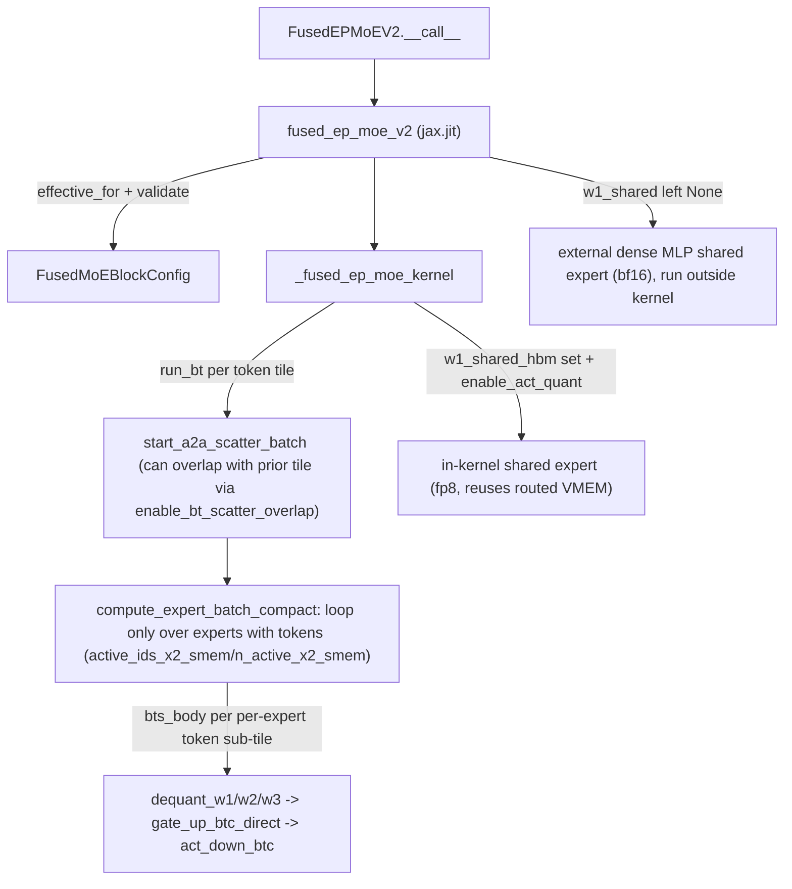

# sgl_jax.srt.kernels.fused_moe.v2.kernel — fused_ep_moe_v2, compact active-expert loop, in-kernel vs external shared expert

## Overview

[`fused_ep_moe_v2`](../catalog/python/sgl_jax/srt/kernels/fused_moe/v2/kernel.md#fused_ep_moe_v2)
is the successor to the v1 fused expert-parallel MoE kernel, adding a **compact active-expert
loop** ([`compute_expert_batch_compact`](../catalog/python/sgl_jax/srt/kernels/fused_moe/v2/kernel.md#_fused_ep_moe_kernel.run_bt.compute_expert_batch_compact))
that iterates only over experts that actually received tokens in a tile, scatter/gather-tile
overlap toggles (`enable_bt_scatter_overlap`, `interleave_bt`), and an explicit choice between
running the shared expert *inside* the Pallas kernel (fp8, reusing routed-expert VMEM) or as a
separate *external* dense MLP (bf16). Block sizing again goes through an
[`effective_for`](../catalog/python/sgl_jax/srt/kernels/fused_moe/v2/kernel.md#FusedMoEBlockConfig.effective_for)/[`validate_fused_moe_block_config`](../catalog/python/sgl_jax/srt/kernels/fused_moe/v2/kernel.md#validate_fused_moe_block_config)
pair, mirroring v1's contract but with a smaller `FusedMoEBlockConfig` (`bt`/`bf`/`btc`/`bts`/`bse`,
no separate `bd1`/`bd2`).

## Diagram

## Design rationale (why it's built this way)

**The shared expert can run inside this kernel or as a separate external op, and the code picks a
default based on a measured near-tie, not a hard constraint.**
[`fused_ep_moe_v2`](../catalog/python/sgl_jax/srt/kernels/fused_moe/v2/kernel.md#fused_ep_moe_v2)'s
own comment lays out the trade explicitly: in-kernel "reuses routed VMEM, requires
enable_act_quant" and runs in fp8, while external "keeps bf16 precision"; it states "Both are ~equal
speed (SE is MXU-bound dense FFN, ~85us @ 512 local tokens; in-kernel +81us)" and sets the default
to external (`w1_shared=None`) — i.e. the team measured the two paths, found them close, and chose
to default to the higher-precision option since the speed difference is small at that token count.

**The active-expert loop is "compact" — it iterates only over experts that received at least one
token in the current tile, tracked via `active_ids_x2_smem`/`n_active_x2_smem`,** rather than
always looping over every local expert. For MoE workloads with many experts per device but modest
`top_k` and per-device token counts (especially at decode-time small batch), most local experts
receive zero tokens in a given tile — looping over all of them would waste iterations on
empty-expert no-ops; compacting the loop to active experts only turns wasted iterations into work
proportional to actual routing.

**`bts_body`'s tile load explicitly separates the token load from weight reuse: "Load tokens for
this bts tile once; weights reuse it across bf tiles."** This inline comment marks the loop
structure's key locality assumption — the per-expert token tile (`bts`) is loaded into VMEM once
via [`bts_body`](../catalog/python/sgl_jax/srt/kernels/fused_moe/v2/kernel.md#_fused_ep_moe_kernel.expert_ffn._run_active.bts_body),
then reused across every `bf` (intermediate-dimension) sub-tile of that expert's FFN, rather than
being re-fetched from HBM per `bf` iteration.

**Activation quantization embeds the per-token scale in the data tensor itself, then zeroes it out
before the matmul.** `bts_body`'s `enable_act_quant` branch extracts a `scale_f32` from "the last
fp8 column" of the loaded token tile, stores it separately, then explicitly zeros that column "so
it doesn't pollute the FFN1 dot" — packing the scale alongside the data avoids a second HBM fetch
for scales, at the cost of this extra in-VMEM unpack/rezero step every tile.

## Entry points

- [`FusedEPMoEV2.__call__`](../catalog/python/sgl_jax/srt/layers/fused_moe.md#FusedEPMoEV2.__call__) —
  the model-facing forward pass; resolves scale/shared-weight values and calls
  [`fused_ep_moe_v2`](../catalog/python/sgl_jax/srt/kernels/fused_moe/v2/kernel.md#fused_ep_moe_v2)
  directly (imported locally, not at module scope).
- [`fused_ep_moe_v2`](../catalog/python/sgl_jax/srt/kernels/fused_moe/v2/kernel.md#fused_ep_moe_v2) —
  the `jax.jit`-wrapped launcher; resolves/validates the block config then dispatches into
  `_fused_ep_moe_kernel`.
- [`run_fn`](../catalog/python/sgl_jax/srt/kernels/fused_moe/v2/bench_v2.md#run_fn) —
  the microbenchmark harness's call site, exercising the full flag surface
  (`direct_scaled_dot`, `enable_act_quant`, `cross_expert_prefetch_mode`, `interleave_bt`,
  `enable_bt_scatter_overlap`) for perf sweeps.

## Mechanism (step-by-step)

1. **[`_fused_ep_moe_kernel`](../catalog/python/sgl_jax/srt/kernels/fused_moe/v2/kernel.md#_fused_ep_moe_kernel)'s
   [`run_bt`](../catalog/python/sgl_jax/srt/kernels/fused_moe/v2/kernel.md#_fused_ep_moe_kernel.run_bt)
   loops over token tiles**, prefetching the next tile's routing (`start_fetch_topk`) and, when
   `can_bt_scatter_overlap`, deferring `start_a2a_scatter_batch` for the *current* tile until after
   checking whether it was already prefetched by the previous iteration
   (`current_bt_scatter_prefetched`).
2. **For each tile, [`compute_expert_batch_compact`](../catalog/python/sgl_jax/srt/kernels/fused_moe/v2/kernel.md#_fused_ep_moe_kernel.run_bt.compute_expert_batch_compact)
   iterates only over the tile's active local experts**, using the compacted `active_ids`/`n_active`
   SMEM scratch built during routing rather than a fixed `local_num_experts` loop bound.
3. **Within each active expert, `bts_body` tiles the per-expert token range by `bts`**, loading
   the token tile once and reusing it across `bf` intermediate-dimension sub-tiles, dequantizing
   weights ([`dequant_w1`](../catalog/python/sgl_jax/srt/kernels/fused_moe/v2/kernel.md#_fused_ep_moe_kernel.expert_ffn._run_active.bts_body)-adjacent
   helpers) and computing gate/up/down projections per `btc` compute sub-tile.
4. **[`_run_bt_post_gather`](../catalog/python/sgl_jax/srt/kernels/fused_moe/v2/kernel.md#_fused_ep_moe_kernel._run_bt_post_gather)
   waits for the gather (`wait_a2a_gather_recv_all`) and accumulates/stores the tile's output**,
   decoupled from `run_bt`'s main body so the post-gather bookkeeping for tile `bt_id - 2` can run
   overlapped with tile `bt_id`'s scatter/compute.

## Key data structures

- **[`FusedMoEBlockConfig`](../catalog/python/sgl_jax/srt/kernels/fused_moe/v2/kernel.md#FusedMoEBlockConfig)** —
  [`bt`](../catalog/python/sgl_jax/srt/kernels/fused_moe/v2/kernel.md#FusedMoEBlockConfig.bt)/[`bf`](../catalog/python/sgl_jax/srt/kernels/fused_moe/v2/kernel.md#FusedMoEBlockConfig.bf)/[`btc`](../catalog/python/sgl_jax/srt/kernels/fused_moe/v2/kernel.md#FusedMoEBlockConfig.btc)/[`bts`](../catalog/python/sgl_jax/srt/kernels/fused_moe/v2/kernel.md#FusedMoEBlockConfig.bts)/[`bse`](../catalog/python/sgl_jax/srt/kernels/fused_moe/v2/kernel.md#FusedMoEBlockConfig.bse) —
  the same tile-size vocabulary as v1 minus the separate `bd1`/`bd2` hidden-dim tiles.
- **`active_ids_x2_smem`/`n_active_x2_smem`** — the compact active-expert index list and count per
  tile bank, the data structure that turns the expert loop from fixed-`local_num_experts` into
  data-dependent-length.
- **`bt_bank_id`** — [`_fused_ep_moe_kernel.bt_bank_id`](../catalog/python/sgl_jax/srt/kernels/fused_moe/v2/kernel.md#_fused_ep_moe_kernel.bt_bank_id)
  maps a tile index to its double-buffer bank, used consistently across scatter/gather/output
  bookkeeping to keep the pipelined stages addressing the correct buffer generation.

## Dynamics (design intent)

Because `run_bt`'s scatter-prefetch decision (`current_bt_scatter_prefetched`) depends on whether
`can_bt_scatter_overlap` was true *and* `bt_id > 0`, the very first tile can never be prefetched —
overlap only kicks in from the second tile onward, once there is a previous iteration to have
issued the prefetch from. This is consistent with a software-pipelined loop where steady-state
tiles overlap but the pipeline has a fixed fill/drain cost at the boundaries.

## Edge cases

- The in-kernel shared-expert path requires `enable_act_quant` (per the `fused_ep_moe_v2` comment)
  — passing `w1_shared`/etc. without also enabling activation quantization is an unsupported
  combination per the documented contract, though the exact runtime failure mode isn't shown in
  this packet's cited subgraph.
- `bts_body`'s activation-quantization column-zeroing (`b_x_vmem.at[..., h_per_t - 1]` set to
  zero) only applies `if enable_act_quant`; the non-quantized path never touches that column,
  meaning the "scale-in-last-column" packing convention is exclusively a quantized-path concern.

## Open questions

- The precise conditions under which `cross_expert_prefetch_mode` values other than `"full"` are
  chosen (and their performance trade-offs) are not detailed within this packet's cited subgraph.

## See also
- [python-sgl_jax-srt-kernels-fused_moe-v1-kernel](python-sgl_jax-srt-kernels-fused_moe-v1-kernel.md) —
  the v1 predecessor kernel this version replaces/extends.
- [python-sgl_jax-srt-kernels-fused_moe-v2-bench_v2](python-sgl_jax-srt-kernels-fused_moe-v2-bench_v2.md) —
  the microbenchmark harness exercising this kernel's full flag surface.
- [python-sgl_jax-srt-kernels-fused_moe-v2-bench_compare](python-sgl_jax-srt-kernels-fused_moe-v2-bench_compare.md) —
  the v1-vs-v2 comparison benchmark.

## Sources
- `raw/code/sglang-jax/python/sgl_jax/srt/kernels/fused_moe/v2/kernel.py`
- `raw/code/sglang-jax/python/sgl_jax/srt/kernels/fused_moe/v2/bench_v2.py`
- `raw/code/sglang-jax/python/sgl_jax/srt/layers/fused_moe.py`
