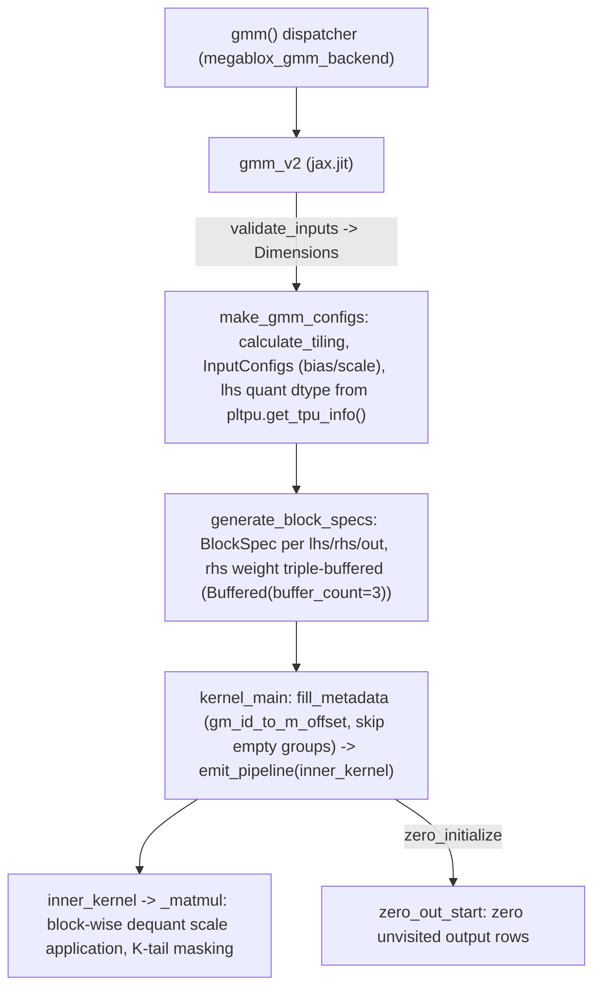

# sgl_jax.srt.kernels.gmm.megablox_gmm_kernel.gmm_v2 — grouped matmul kernel with dynamic tile offsets and hardware-gated quantization

## Overview

[`gmm_v2`](../catalog/python/sgl_jax/srt/kernels/gmm/megablox_gmm_kernel/gmm_v2.md#gmm_v2) is a
Pallas grouped-matmul (GMM) kernel — the MegaBlocks-style building block used for MoE FFNs where
`lhs` rows are partitioned into variable-size groups (one per expert) and each group multiplies
against its own `rhs` weight slice. Unlike a naive per-group dense matmul, it "Dynamically
calculate[s] offset lhs/out tiles to reduce redundant computations" (its own docstring) and
triple-buffers weight fetches, and its
[`make_gmm_configs`](../catalog/python/sgl_jax/srt/kernels/gmm/megablox_gmm_kernel/gmm_v2.md#make_gmm_configs)
setup picks the LHS quantization dtype based on which low-precision ops the *specific* TPU
generation actually accelerates, not a static default.

## Diagram

## Design rationale (why it's built this way)

**LHS quantization dtype is chosen from the *specific* TPU's measured op throughput, not a fixed
default.** [`make_gmm_configs`](../catalog/python/sgl_jax/srt/kernels/gmm/megablox_gmm_kernel/gmm_v2.md#make_gmm_configs)
calls `pltpu.get_tpu_info()` and only sets `lhs_q_dtype = jnp.float8_e4m3fn` if
`tpu_info.fp8_ops_per_second > 0` (similarly `int8` gated on `int8_ops_per_second > 0`) — since not
every TPU generation has native fp8/int8 MXU support, quantizing the activation on a generation
without hardware acceleration for that dtype would add dequant/pack overhead without a compute
speedup; the config resolution defers to what the actual chip can accelerate.

**The "gm" (batch-tiling) dimension is a *virtual* tiling dimension, not the raw batch index —
metadata maps it to actual row offsets, skipping empty groups.**
[`kernel_main`](../catalog/python/sgl_jax/srt/kernels/gmm/megablox_gmm_kernel/gmm_v2.md#kernel_main)'s
docstring defines "gm: Batch tiling dimension... Skips over empty groups and accounts for revisited
tiles" — because MoE group sizes are data-dependent (some experts may receive zero or few tokens),
a naive fixed grid over `(group, tile)` pairs would waste kernel iterations on empty groups;
[`fill_metadata`](../catalog/python/sgl_jax/srt/kernels/gmm/megablox_gmm_kernel/gmm_v2.md#fill_metadata)
precomputes `gm_id_to_m_offset` so the grid iterates only over tiles that actually contain data,
including tiles that straddle a group boundary ("revisited tiles").

**Weight buffers use `pl.Buffered(buffer_count=3)` (triple buffering), not the usual double
buffering.** [`generate_block_specs`](../catalog/python/sgl_jax/srt/kernels/gmm/megablox_gmm_kernel/gmm_v2.md#generate_block_specs)'s
`rhs_weight_spec` is explicitly `pipeline_mode=pl.Buffered(buffer_count=3)` — `gmm_v2`'s own
docstring notes this is to "better utilize memory" for weight fetches; a third buffer gives the
pipeline more slack to hide DMA latency when the per-group tile boundaries (driven by
data-dependent group sizes) make prefetch timing less regular than a fixed dense matmul's.

**The K-dimension tail is masked to zero rather than requiring `size_k` to divide `tile_k`
evenly.** [`_matmul`](../catalog/python/sgl_jax/srt/kernels/gmm/megablox_gmm_kernel/gmm_v2.md#inner_kernel._matmul)
computes `valid_k = cfgs.dims.size_k % cfgs.tiles.tile_k` and, on the last K step, masks
out-of-range columns of `tiled_rhs` to zero via `broadcasted_iota` — this lets the kernel accept
arbitrary `size_k` rather than forcing callers to pad every input to a `tile_k` multiple
beforehand.

## Entry points

- [`gmm`](../catalog/python/sgl_jax/srt/kernels/gmm/megablox_gmm_backend.md#gmm) — "Dispatch GMM to
  v2 or v1, with optional activation quantization"; the stable public entry point that routes to
  [`gmm_v2`](../catalog/python/sgl_jax/srt/kernels/gmm/megablox_gmm_kernel/gmm_v2.md#gmm_v2).
- [`gmm_v2`](../catalog/python/sgl_jax/srt/kernels/gmm/megablox_gmm_kernel/gmm_v2.md#gmm_v2) — the
  `jax.jit`-wrapped kernel launcher; builds configs via
  [`make_gmm_configs`](../catalog/python/sgl_jax/srt/kernels/gmm/megablox_gmm_kernel/gmm_v2.md#make_gmm_configs)
  and dispatches to `kernel_main`.
- [`kernel_main`](../catalog/python/sgl_jax/srt/kernels/gmm/megablox_gmm_kernel/gmm_v2.md#kernel_main) —
  "Entry point for GMM kernel"; computes tiling metadata then invokes the `emit_pipeline`-driven
  inner kernel.

## Mechanism (step-by-step)

1. **[`make_gmm_configs`](../catalog/python/sgl_jax/srt/kernels/gmm/megablox_gmm_kernel/gmm_v2.md#make_gmm_configs)
   validates inputs** via
   [`validate_inputs`](../catalog/python/sgl_jax/srt/kernels/gmm/megablox_gmm_kernel/gmm_v2.md#validate_inputs)
   to get [`Dimensions`](../catalog/python/sgl_jax/srt/kernels/gmm/megablox_gmm_kernel/gmm_v2.md#Dimensions.size_lhs_sublane),
   resolves tiling via
   [`calculate_tiling`](../catalog/python/sgl_jax/srt/kernels/gmm/megablox_gmm_kernel/gmm_v2.md#calculate_tiling)
   (or accepts an explicit override), and picks the LHS quantization dtype based on TPU hardware
   support when `rhs` is already quantized.
2. **[`generate_block_specs`](../catalog/python/sgl_jax/srt/kernels/gmm/megablox_gmm_kernel/gmm_v2.md#generate_block_specs)
   builds per-operand `BlockSpec`s** using an `IndexMaps` helper (
   [`lhs_index_map`](../catalog/python/sgl_jax/srt/kernels/gmm/megablox_gmm_kernel/gmm_v2.md#IndexMaps.lhs_index_map)/[`out_index_map`](../catalog/python/sgl_jax/srt/kernels/gmm/megablox_gmm_kernel/gmm_v2.md#IndexMaps.out_index_map))
   that maps the virtual "gm" tile index to the correct data offset via
   [`gm_id_to_m_offset`](../catalog/python/sgl_jax/srt/kernels/gmm/megablox_gmm_kernel/gmm_v2.md#MetadataRef.gm_id_to_m_offset),
   with the weight block triple-buffered.
3. **[`kernel_main`](../catalog/python/sgl_jax/srt/kernels/gmm/megablox_gmm_kernel/gmm_v2.md#kernel_main)
   calls [`fill_metadata`](../catalog/python/sgl_jax/srt/kernels/gmm/megablox_gmm_kernel/gmm_v2.md#fill_metadata)
   to compute the tile-to-offset mapping** ("which rows of lhs needs processing and how they will
   be tiled"), skipping empty groups, then runs `emit_pipeline` over
   [`inner_kernel`](../catalog/python/sgl_jax/srt/kernels/gmm/megablox_gmm_kernel/gmm_v2.md#inner_kernel).
4. **[`inner_kernel`](../catalog/python/sgl_jax/srt/kernels/gmm/megablox_gmm_kernel/gmm_v2.md#inner_kernel)'s
   [`_matmul`](../catalog/python/sgl_jax/srt/kernels/gmm/megablox_gmm_kernel/gmm_v2.md#inner_kernel._matmul)
   branches on quantization state**: unquantized, block-wise-scaled (W8A16-style, looping over
   `rhs_block`-sized K sub-blocks and scaling each partial accumulation), or fully quantized LHS+RHS,
   masking the K-dimension tail on the last K step.
5. **If `zero_initialize`,**
   [`zero_out_start`](../catalog/python/sgl_jax/srt/kernels/gmm/megablox_gmm_kernel/gmm_v2.md#zero_out_start)
   "zero[s] out output rows that are not used in the computation" — rows never touched by any
   group's tile (e.g. past the last valid group) are explicitly zeroed rather than left with
   stale/garbage buffer contents.

## Key data structures

- **[`GmmConfigs`](../catalog/python/sgl_jax/srt/kernels/gmm/megablox_gmm_kernel/gmm_v2.md#GmmConfigs.tiles)** —
  bundles [`tiles`](../catalog/python/sgl_jax/srt/kernels/gmm/megablox_gmm_kernel/gmm_v2.md#GmmConfigs.tiles)
  ([`TileSizes`](../catalog/python/sgl_jax/srt/kernels/gmm/megablox_gmm_kernel/gmm_v2.md#TileSizes):
  [`tile_m`](../catalog/python/sgl_jax/srt/kernels/gmm/megablox_gmm_kernel/gmm_v2.md#TileSizes.tile_m)/[`tile_k`](../catalog/python/sgl_jax/srt/kernels/gmm/megablox_gmm_kernel/gmm_v2.md#TileSizes.tile_k)/[`tile_n`](../catalog/python/sgl_jax/srt/kernels/gmm/megablox_gmm_kernel/gmm_v2.md#TileSizes.tile_n)),
  [`dims`](../catalog/python/sgl_jax/srt/kernels/gmm/megablox_gmm_kernel/gmm_v2.md#GmmConfigs.dims)
  ([`Dimensions`](../catalog/python/sgl_jax/srt/kernels/gmm/megablox_gmm_kernel/gmm_v2.md#Dimensions.size_k):
  [`size_m`](../catalog/python/sgl_jax/srt/kernels/gmm/megablox_gmm_kernel/gmm_v2.md#Dimensions.size_m)/[`size_k`](../catalog/python/sgl_jax/srt/kernels/gmm/megablox_gmm_kernel/gmm_v2.md#Dimensions.size_k)/[`size_n`](../catalog/python/sgl_jax/srt/kernels/gmm/megablox_gmm_kernel/gmm_v2.md#Dimensions.size_n)/[`size_lhs_sublane`](../catalog/python/sgl_jax/srt/kernels/gmm/megablox_gmm_kernel/gmm_v2.md#Dimensions.size_lhs_sublane)),
  and [`rhs_cfgs`](../catalog/python/sgl_jax/srt/kernels/gmm/megablox_gmm_kernel/gmm_v2.md#GmmConfigs.rhs_cfgs)
  (quantization/bias/scale metadata for the weight tensor).
- **`MetadataRef`** — holds
  [`gm_id_to_m_offset`](../catalog/python/sgl_jax/srt/kernels/gmm/megablox_gmm_kernel/gmm_v2.md#MetadataRef.gm_id_to_m_offset),
  the precomputed virtual-tile-to-row-offset mapping that lets the grid skip empty groups.

## Dynamics (design intent)

Because tile-to-offset metadata is computed once per call (via `fill_metadata`) before the pipelined
matmul loop runs, the grid's actual iteration count and offsets adapt to the runtime `group_sizes`
without recompiling the kernel — the same compiled program handles varying per-group token counts
(the common case for MoE routing) by consulting data-dependent metadata rather than requiring a
fixed, padded grid shape per call.

## Edge cases

- [`gmm_v2`](../catalog/python/sgl_jax/srt/kernels/gmm/megablox_gmm_kernel/gmm_v2.md#gmm_v2)'s
  `precision` parameter is documented "Unused. Exists for compatibility reasons" — passing a
  non-default `precision` has no effect on this kernel's numerics.
- [`generate_block_specs`](../catalog/python/sgl_jax/srt/kernels/gmm/megablox_gmm_kernel/gmm_v2.md#generate_block_specs)
  asserts `tile_k % rhs_block == 0` when block-wise RHS scaling is active and the block size is
  smaller than `size_k` — an incompatible `(tile_k, quant_block_size)` pairing fails fast with an
  assertion rather than producing silently wrong dequantized results.

## Open questions

- The exact conditions determining `gmm`'s v1-vs-v2 dispatch choice (beyond "Dispatch GMM to v2 or
  v1, with optional activation quantization") are not detailed within this packet's cited subgraph.

## See also
- [python-sgl_jax-srt-kernels-fused_moe-v2-kernel](python-sgl_jax-srt-kernels-fused_moe-v2-kernel.md) —
  the fused expert-parallel MoE kernel that plays a similar role (per-expert compute) via a
  different (all-to-all-fused) mechanism rather than grouped matmul.

## Sources
- `raw/code/sglang-jax/python/sgl_jax/srt/kernels/gmm/megablox_gmm_kernel/gmm_v2.py`
- `raw/code/sglang-jax/python/sgl_jax/srt/kernels/gmm/megablox_gmm_backend.py`
