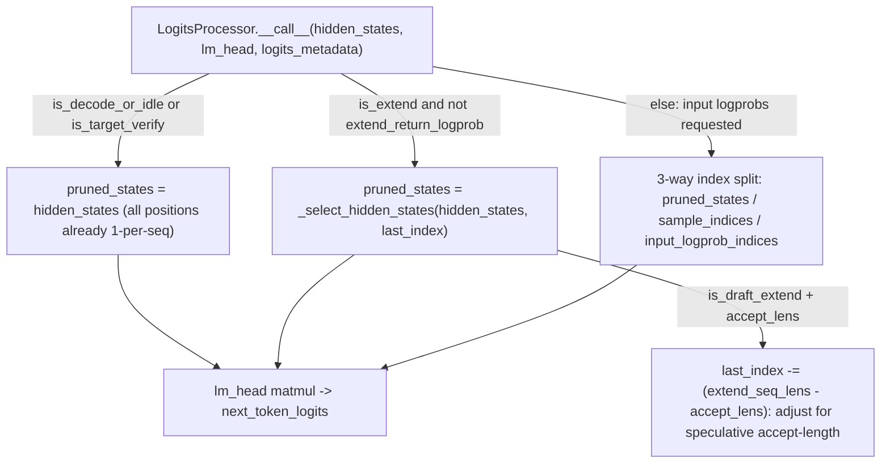

# sgl_jax.srt.layers.logits_processor — LogitsProcessor hidden-state pruning before lm_head

## Overview

[`LogitsProcessor.__call__`](../catalog/python/sgl_jax/srt/layers/logits_processor.md#LogitsProcessor.__call__)
selects which token positions' hidden states actually need the (large, vocab-sized) `lm_head`
matmul applied, branching on
[`ForwardMode`](../catalog/python/sgl_jax/srt/model_executor/forward_batch_info.md#ForwardMode)
and whether input logprobs were requested — during a plain extend/prefill step with no logprob
request, only the *last* position of each sequence needs its logits computed, so
[`_select_hidden_states`](../catalog/python/sgl_jax/srt/layers/logits_processor.md#LogitsProcessor.__call__)
prunes the hidden-state tensor down to those positions before the matmul, avoiding a full-sequence
× vocab_size matmul when only the last token's distribution is needed.
[`LogitsMetadata`](../catalog/python/sgl_jax/srt/layers/logits_processor.md#LogitsMetadata.tree_flatten)
is a pytree-registered dataclass carrying the routing information for this selection across `jit`
boundaries.

## Diagram

## Design rationale (why it's built this way)

**Hidden-state pruning before the `lm_head` matmul only happens in the plain-extend,
no-logprob-requested branch — every other mode either already has one position per sequence, or
needs multiple positions and takes a different index-splitting path.**
[`LogitsProcessor.__call__`](../catalog/python/sgl_jax/srt/layers/logits_processor.md#LogitsProcessor.__call__)'s
first branch (`is_decode_or_idle` or `is_target_verify`) skips pruning entirely since those modes
already process one position per sequence; the middle branch (`is_extend` and not
`extend_return_logprob`) is exactly the case where a prefill/extend step processes many positions
per sequence but only the final one's logits matter for sampling — pruning here is the actual
compute-saving optimization, since without it every position of a long prompt would go through the
`vocab_size`-wide matmul for no benefit.

**Draft-extend mode adjusts the "last" index by the accept/reject length delta, not just
`extend_seq_lens - 1`.** The inline comment gives a concrete worked example: "if accept_lens is
[1, 1, 2, 1, 1], extend_seq_lens is [4,4,4,4,4], last_index should be [1, 5, 9, 13, 17] - 1 =
[0,4,8,12,16]" — because in speculative-decoding draft-extend, the sequence positions actually
*accepted* by the target model vary per-request (not always the full padded `extend_seq_lens`),
the position whose hidden state feeds the next round must be computed from `accept_lens`, not
assumed to be the last padded position.

**`LogitsMetadata.tree_flatten` conditionally nulls out CPU-side length fields when padded
device-side logprob indices are already present.** It computes `has_padded_input_logprob_indices =
self.input_logprob_indices_device is not None` and sets `extend_seq_lens_cpu`/etc. to `None` in
that case — since the device-side padded indices already encode the same information needed
downstream, keeping the redundant CPU lists around would be unnecessary pytree leaves/aux-data to
carry through every `jit` call.

## Entry points

- [`LogitsProcessor.__call__`](../catalog/python/sgl_jax/srt/layers/logits_processor.md#LogitsProcessor.__call__) —
  the forward-pass entry point; called once per model forward step after the transformer body,
  before sampling.
- [`LogitsMetadata.from_model_worker_batch`](../catalog/python/sgl_jax/srt/layers/logits_processor.md#LogitsMetadata.from_model_worker_batch) —
  reached once per batch to build the metadata `__call__` consumes, computing which positions need
  logprobs from `batch.top_logprobs_nums`/`token_ids_logprobs`/`extend_logprob_start_lens`.

## Mechanism (step-by-step)

1. **[`LogitsMetadata.from_model_worker_batch`](../catalog/python/sgl_jax/srt/layers/logits_processor.md#LogitsMetadata.from_model_worker_batch)
   determines `extend_return_logprob`** by checking, per sequence, whether `extend_len - start_len
   > 0` — any sequence needing input logprobs beyond its start offset flips the whole batch's
   `extend_return_logprob` flag.
2. **[`LogitsProcessor.__call__`](../catalog/python/sgl_jax/srt/layers/logits_processor.md#LogitsProcessor.__call__)
   branches on forward mode and `extend_return_logprob`** to decide whether to prune to last-token
   positions, keep all positions (decode/target-verify), or compute the 3-way
   pruned/sample/input-logprob index split.
3. **In the draft-extend sub-case,** `last_index` is corrected by `extend_seq_lens - accept_lens`
   before being passed to
   [`_select_hidden_states`](../catalog/python/sgl_jax/srt/layers/logits_processor.md#LogitsProcessor.__call__),
   so the pruned hidden state corresponds to each sequence's actual accepted position, not a
   uniform padded offset.
4. **The pruned hidden states are passed through the `lm_head` `Embed` matmul**, producing
   [`LogitsProcessorOutput.next_token_logits`](../catalog/python/sgl_jax/srt/layers/logits_processor.md#LogitsProcessorOutput.next_token_logits).

## Key data structures

- **[`LogitsMetadata`](../catalog/python/sgl_jax/srt/layers/logits_processor.md#LogitsMetadata.tree_flatten)** —
  pytree-registered; device-side children (`extend_seq_lens`, `accept_lens`, `logits_indices`,
  `extend_input_logprob_token_ids_device`, `input_logprob_indices_device`, `temperature`, `top_p`)
  plus static aux-data (`forward_mode`, `capture_hidden_mode`, logprob-request flags, CPU-side
  length lists).
- **[`LogitsProcessorOutput`](../catalog/python/sgl_jax/srt/layers/logits_processor.md#LogitsProcessorOutput)** —
  pytree-registered dataclass carrying
  [`next_token_logits`](../catalog/python/sgl_jax/srt/layers/logits_processor.md#LogitsProcessorOutput.next_token_logits)
  and [`hidden_states`](../catalog/python/sgl_jax/srt/layers/logits_processor.md#LogitsProcessorOutput.hidden_states)
  (when captured, e.g. for EAGLE draft input).

## Dynamics (design intent)

Because `LogitsMetadata` is a registered pytree, it can be constructed once per batch outside the
`jit`-compiled forward function and passed straight through as an argument — `LogitsProcessor.__call__`
itself is decorated with
[`named_scope`](../catalog/python/sgl_jax/srt/utils/profiling_utils.md#named_scope) ("Decorator to
add a JAX named_scope based on the first argument"), so its contribution is separately attributable
in a profiler trace from the rest of the forward pass.

## Edge cases

- The `is_decode_or_idle()`/`is_target_verify()` branch performs no pruning at all — this is safe
  only because those modes already guarantee one hidden-state row per sequence; applying this
  branch's logic to a multi-position-per-sequence mode would silently skip pruning that's actually
  needed.
- When `aux_hidden_states` is provided (used for EAGLE's auxiliary hidden-state capture), the same
  `last_index`/pruning logic is applied per auxiliary layer independently in a list comprehension,
  keeping all captured layers consistent with the primary hidden state's selected positions.

## Open questions

- The full 3-way index-split logic in the `else` (input-logprobs-requested) branch beyond the
  `input_logprob_indices_device is not None` fast path is not detailed within this packet's cited
  subgraph.

## See also
- [python-sgl_jax-srt-speculative-eagle_util](python-sgl_jax-srt-speculative-eagle_util.md) —
  `EagleDraftInput`, whose `prepare_for_extend_after_verify` constructs `LogitsMetadata` for the
  draft-extend-after-verify path.
- [python-sgl_jax-srt-model_executor-forward_batch_info](python-sgl_jax-srt-model_executor-forward_batch_info.md) —
  `ForwardMode`/`CaptureHiddenMode`, the enums this module branches on.

## Sources
- `raw/code/sglang-jax/python/sgl_jax/srt/layers/logits_processor.py`
- `raw/code/sglang-jax/python/sgl_jax/srt/speculative/eagle_util.py`
