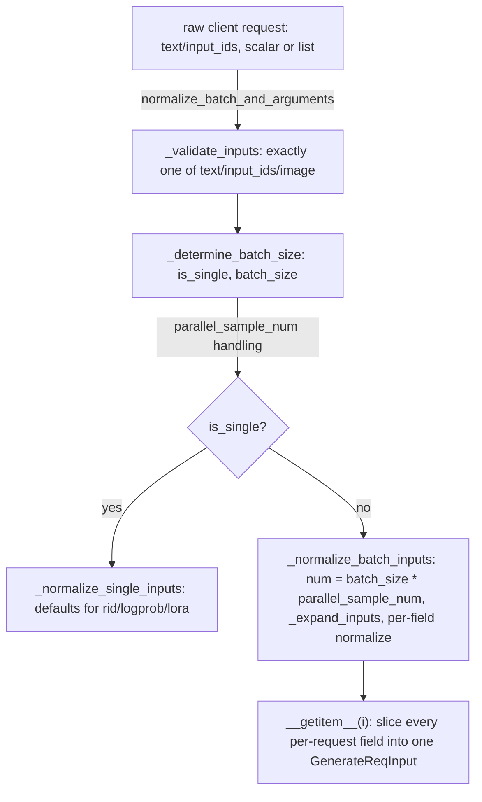

# sgl_jax.srt.managers.io_struct — GenerateReqInput normalization, single-vs-batch detection, parallel-sampling expansion

## Overview

[`GenerateReqInput`](../catalog/python/sgl_jax/srt/managers/io_struct.md#GenerateReqInput.normalize_batch_and_arguments)
is the entry-facing request struct that normalizes a client's raw request (text or token IDs,
scalar or list-shaped, possibly with `parallel_sample_num > 1`) into a single canonical
per-request shape before it enters the scheduler. This module's job is entirely at the request
*ingestion* boundary — expanding batched/parallel-sampled requests into individually indexable
sub-requests via [`__getitem__`](../catalog/python/sgl_jax/srt/managers/io_struct.md#GenerateReqInput.__getitem__)
so downstream scheduling code always deals with one logical request at a time.
[`RpcReqInput`](../catalog/python/sgl_jax/srt/managers/io_struct.md#RpcReqInput) is a distinct,
unrelated base class for control-plane RPCs (session management, tracing, logging config) rather
than generation requests.

## Diagram

## Design rationale (why it's built this way)

**Text and `input_ids` are mutually exclusive by explicit validation, and at least one (or image)
must be present, checked before any batch-size logic runs.**
[`GenerateReqInput.normalize_batch_and_arguments`](../catalog/python/sgl_jax/srt/managers/io_struct.md#GenerateReqInput.normalize_batch_and_arguments)
raises immediately if `text is None and input_ids is None and image_data is None`, and separately
if both `text` and `input_ids` are provided — rejecting an ambiguous request shape upfront avoids
every downstream normalization helper having to re-check which input modality is active.

**Parallel sampling expansion multiplies the *batch size*, not just duplicates sampling params,
before any per-field normalization runs.**
[`_normalize_batch_inputs`](../catalog/python/sgl_jax/srt/managers/io_struct.md#GenerateReqInput._normalize_batch_inputs)
computes `num = self.batch_size * self.parallel_sample_num` up front and passes that expanded count
into every subsequent `_normalize_*` helper (`_expand_inputs`, `_normalize_rid`,
`_normalize_sampling_params`, `_normalize_logprob_params`, ...) — since each of `parallel_sample_num`
samples for a given input needs its own independent `rid`/sampling state downstream, treating the
expansion as a batch-size multiplication (rather than a nested per-input loop) lets every
normalization helper share one uniform "operate on `num` slots" contract.

**`__getitem__` explicitly branches per-field on whether disaggregation fields are scalar or
list-shaped**, e.g. `self.bootstrap_host[i] if isinstance(self.bootstrap_host, list) else
self.bootstrap_host` — since PD-disaggregation bootstrap fields may be supplied either as one value
shared across the whole batch or as a per-request list, `__getitem__` must handle both without
requiring the client to always list-wrap a value that's the same for every request in the batch.

## Entry points

- [`GenerateReqInput.normalize_batch_and_arguments`](../catalog/python/sgl_jax/srt/managers/io_struct.md#GenerateReqInput.normalize_batch_and_arguments) —
  the single entry point called once per incoming request/batch, before any per-request object is
  created.
- [`GenerateReqInput.__getitem__`](../catalog/python/sgl_jax/srt/managers/io_struct.md#GenerateReqInput.__getitem__) —
  reached once per index to materialize an individually-schedulable `GenerateReqInput` from the
  normalized batch state.

## Mechanism (step-by-step)

1. **[`normalize_batch_and_arguments`](../catalog/python/sgl_jax/srt/managers/io_struct.md#GenerateReqInput.normalize_batch_and_arguments)
   validates mutual-exclusivity of `text`/`input_ids`** via
   [`_validate_inputs`](../catalog/python/sgl_jax/srt/managers/io_struct.md#GenerateReqInput._validate_inputs),
   then calls
   [`_determine_batch_size`](../catalog/python/sgl_jax/srt/managers/io_struct.md#GenerateReqInput._determine_batch_size)
   to set [`is_single`](../catalog/python/sgl_jax/srt/managers/io_struct.md#GenerateReqInput.is_single)/[`batch_size`](../catalog/python/sgl_jax/srt/managers/io_struct.md#GenerateReqInput.batch_size)
   based on whether `text`/`input_ids`/`input_embeds` is a scalar or list at the top level.
2. **For a single request,**
   [`_normalize_single_inputs`](../catalog/python/sgl_jax/srt/managers/io_struct.md#GenerateReqInput._normalize_single_inputs)
   fills in defaults ([`rid`](../catalog/python/sgl_jax/srt/managers/io_struct.md#GenerateReqInput.rid)
   via `uuid.uuid4().hex`,
   [`return_logprob`](../catalog/python/sgl_jax/srt/managers/io_struct.md#GenerateReqInput.return_logprob)
   `False`, etc.) and rejects a multi-value
   [`lora_path`](../catalog/python/sgl_jax/srt/managers/io_struct.md#GenerateReqInput.lora_path)
   list for a single request.
3. **For a batch,**
   [`_normalize_batch_inputs`](../catalog/python/sgl_jax/srt/managers/io_struct.md#GenerateReqInput._normalize_batch_inputs)
   computes the parallel-sampling-expanded count and calls
   [`_expand_inputs`](../catalog/python/sgl_jax/srt/managers/io_struct.md#GenerateReqInput._expand_inputs)
   (expanding
   [`text`](../catalog/python/sgl_jax/srt/managers/io_struct.md#GenerateReqInput.text)/[`input_ids`](../catalog/python/sgl_jax/srt/managers/io_struct.md#GenerateReqInput.input_ids)/[`input_embeds`](../catalog/python/sgl_jax/srt/managers/io_struct.md#GenerateReqInput.input_embeds))
   followed by per-field normalizers including
   [`_normalize_logprob_params`](../catalog/python/sgl_jax/srt/managers/io_struct.md#GenerateReqInput._normalize_logprob_params).
4. **The scheduler indexes into the normalized batch via**
   [`__getitem__`](../catalog/python/sgl_jax/srt/managers/io_struct.md#GenerateReqInput.__getitem__),
   producing one fully-populated `GenerateReqInput` per logical request/sample.

## Key data structures

- **[`GenerateReqInput`](../catalog/python/sgl_jax/srt/managers/io_struct.md#GenerateReqInput.normalize_batch_and_arguments)** —
  [`text`](../catalog/python/sgl_jax/srt/managers/io_struct.md#GenerateReqInput.text)/[`input_ids`](../catalog/python/sgl_jax/srt/managers/io_struct.md#GenerateReqInput.input_ids)/[`input_embeds`](../catalog/python/sgl_jax/srt/managers/io_struct.md#GenerateReqInput.input_embeds),
  [`sampling_params`](../catalog/python/sgl_jax/srt/managers/io_struct.md#GenerateReqInput.sampling_params),
  [`rid`](../catalog/python/sgl_jax/srt/managers/io_struct.md#GenerateReqInput.rid),
  logprob-related fields
  ([`return_logprob`](../catalog/python/sgl_jax/srt/managers/io_struct.md#GenerateReqInput.return_logprob)/[`logprob_start_len`](../catalog/python/sgl_jax/srt/managers/io_struct.md#GenerateReqInput.logprob_start_len)/[`top_logprobs_num`](../catalog/python/sgl_jax/srt/managers/io_struct.md#GenerateReqInput.top_logprobs_num)/[`token_ids_logprob`](../catalog/python/sgl_jax/srt/managers/io_struct.md#GenerateReqInput.token_ids_logprob)),
  [`parallel_sample_num`](../catalog/python/sgl_jax/srt/managers/io_struct.md#GenerateReqInput.parallel_sample_num),
  [`return_routed_experts`](../catalog/python/sgl_jax/srt/managers/io_struct.md#GenerateReqInput.return_routed_experts).
- **[`RpcReqInput`](../catalog/python/sgl_jax/srt/managers/io_struct.md#RpcReqInput)** — "Base class
  for RPC request input," parent to a wide set of control-plane request types (session open/close,
  memory occupation release/resume, tracing start/stop, logging config).

## Dynamics (design intent)

Because `_normalize_batch_inputs` computes the expanded slot count once (`batch_size *
parallel_sample_num`) and threads it through every subsequent normalizer, adding a new per-request
field to `GenerateReqInput` only requires writing one more `_normalize_*` helper that also accepts
`num` — the expansion arithmetic itself doesn't need to be duplicated per field.

## Edge cases

- [`_determine_batch_size`](../catalog/python/sgl_jax/srt/managers/io_struct.md#GenerateReqInput._determine_batch_size)
  raises if `input_ids` is an empty list — an empty batch is rejected rather than silently treated
  as a zero-size batch.
- [`_normalize_single_inputs`](../catalog/python/sgl_jax/srt/managers/io_struct.md#GenerateReqInput._normalize_single_inputs)'s
  `token_ids_logprob` default check is `if not self.token_ids_logprob:` which the inline comment
  notes "covers both None and []" — an explicit empty list is treated identically to unset.

## Open questions

- The full set of `RpcReqInput` subclasses and their individual field contracts are not detailed
  within this packet's cited subgraph beyond their names.

## See also
- [python-sgl_jax-srt-managers-scheduler](python-sgl_jax-srt-managers-scheduler.md) — `Scheduler`,
  which consumes per-request `GenerateReqInput` instances produced by `__getitem__`.

## Sources
- `raw/code/sglang-jax/python/sgl_jax/srt/managers/io_struct.py`
