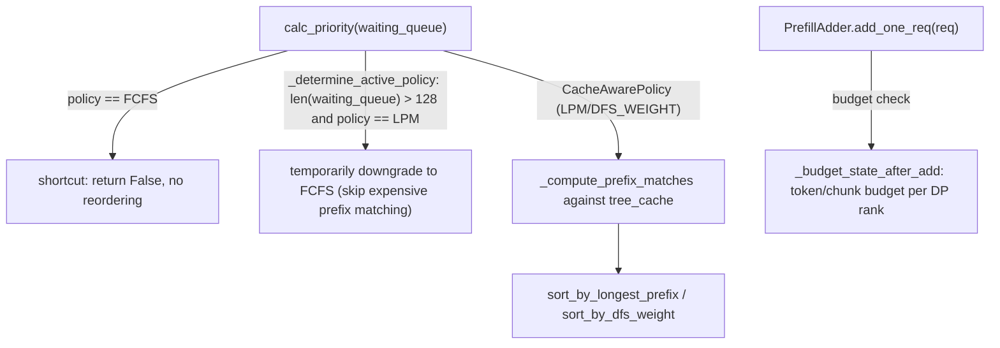

# sgl_jax.srt.managers.schedule_policy — cache-aware (LPM) scheduling with a queue-size fallback, PrefillAdder budgets

## Overview

[`SchedulePolicy.calc_priority`](../catalog/python/sgl_jax/srt/managers/schedule_policy.md#SchedulePolicy.calc_priority)
reorders the waiting request queue to maximize prefix-cache reuse — cache-aware policies (Longest
Prefix Match, DFS-weight) sort by radix-cache hit potential, computed via
[`SchedulePolicy._compute_prefix_matches`](../catalog/python/sgl_jax/srt/managers/schedule_policy.md#SchedulePolicy._compute_prefix_matches),
while cache-agnostic policies (FCFS, longest-output-first, random) skip this computation entirely.
[`PrefillAdder`](../catalog/python/sgl_jax/srt/managers/schedule_policy.md#PrefillAdder.add_one_req)
then admits requests into a new prefill batch against per-DP-rank token/chunk budgets.

## Diagram

## Design rationale (why it's built this way)

**Cache-aware (LPM) prefix-matching scheduling is automatically disabled once the waiting queue
exceeds a fixed size, trading scheduling quality for scheduling speed at high queue depth.**
[`SchedulePolicy._determine_active_policy`](../catalog/python/sgl_jax/srt/managers/schedule_policy.md#SchedulePolicy._compute_prefix_matches)'s
comment states plainly: "Turn off the expensive prefix matching and sorting when the #queue is
large," downgrading to FCFS once `len(waiting_queue) > 128` — computing longest-prefix-match
scores against the radix cache for every queued request is worthwhile when it meaningfully
improves cache hit rate for a small queue, but its own O(queue size) cost becomes the bottleneck
at large queue depths, so the policy explicitly bounds how much scheduling overhead it will pay.

**`calc_priority` has an FCFS fast-path that skips policy dispatch entirely**, returning `False`
immediately — since FCFS requires no reordering or prefix computation at all, this avoids even the
policy-dispatch overhead for the common/default case.

## Entry points

- [`SchedulePolicy.calc_priority`](../catalog/python/sgl_jax/srt/managers/schedule_policy.md#SchedulePolicy.calc_priority) —
  reached once per scheduling cycle to reorder the waiting queue before prefill batch admission.
- [`PrefillAdder.add_one_req`](../catalog/python/sgl_jax/srt/managers/schedule_policy.md#PrefillAdder.add_one_req) /
  [`add_one_req_ignore_eos`](../catalog/python/sgl_jax/srt/managers/schedule_policy.md#PrefillAdder.add_one_req_ignore_eos) —
  reached per request to attempt admission into the batch being assembled, checking remaining
  token/chunk budget.

## Mechanism (step-by-step)

1. **[`SchedulePolicy.calc_priority`](../catalog/python/sgl_jax/srt/managers/schedule_policy.md#SchedulePolicy.calc_priority)
   checks the FCFS shortcut**, then determines the active policy (possibly downgrading LPM to
   FCFS for large queues).
2. **For cache-aware policies,**
   [`_compute_prefix_matches`](../catalog/python/sgl_jax/srt/managers/schedule_policy.md#SchedulePolicy._compute_prefix_matches)
   **scores each request's prefix-cache hit potential**, and the queue is sorted by longest-prefix
   or DFS-weight accordingly.
3. **[`PrefillAdder.add_one_req`](../catalog/python/sgl_jax/srt/managers/schedule_policy.md#PrefillAdder.add_one_req)
   is called per prioritized request**, checking
   [`cur_rem_tokens_for_dp`](../catalog/python/sgl_jax/srt/managers/schedule_policy.md#PrefillAdder.cur_rem_tokens_for_dp)/
   [`rem_chunk_tokens_list`](../catalog/python/sgl_jax/srt/managers/schedule_policy.md#PrefillAdder.rem_chunk_tokens_list)
   budgets before admitting the request into
   [`can_run_list`](../catalog/python/sgl_jax/srt/managers/schedule_policy.md#PrefillAdder.can_run_list).

## Key data structures

- **[`PrefillAdder`](../catalog/python/sgl_jax/srt/managers/schedule_policy.md#PrefillAdder.add_one_req)** —
  [`can_run_list`](../catalog/python/sgl_jax/srt/managers/schedule_policy.md#PrefillAdder.can_run_list)
  (per-DP-rank admitted requests),
  [`is_hybrid`](../catalog/python/sgl_jax/srt/managers/schedule_policy.md#PrefillAdder.is_hybrid),
  [`rem_chunk_tokens_list`](../catalog/python/sgl_jax/srt/managers/schedule_policy.md#PrefillAdder.rem_chunk_tokens_list).

## Dynamics (design intent)

Because the LPM-to-FCFS downgrade is evaluated fresh on every `calc_priority` call (not a one-time
mode switch), the scheduler transparently adapts as queue depth fluctuates — a burst of incoming
requests that temporarily exceeds 128 falls back to cheap FCFS ordering, then resumes cache-aware
prioritization once the queue drains below the threshold.

## Edge cases

- The 128-request threshold in
  [`_determine_active_policy`](../catalog/python/sgl_jax/srt/managers/schedule_policy.md#SchedulePolicy._compute_prefix_matches)
  is a hardcoded constant, not a configurable server argument per this packet's cited subgraph —
  changing it requires a code edit, not a runtime flag.

## Open questions

- Whether the 128-request threshold has been tuned/benchmarked, or is a placeholder default, is
  not addressed by this packet's cited subgraph.

## See also
- [python-sgl_jax-srt-managers-scheduler](python-sgl_jax-srt-managers-scheduler.md) — `Scheduler`,
  which calls `calc_priority` before building each prefill batch.
- [python-sgl_jax-srt-mem_cache-radix_cache](python-sgl_jax-srt-mem_cache-radix_cache.md) —
  `RadixCache`, the prefix-cache structure `_compute_prefix_matches` scores requests against.
