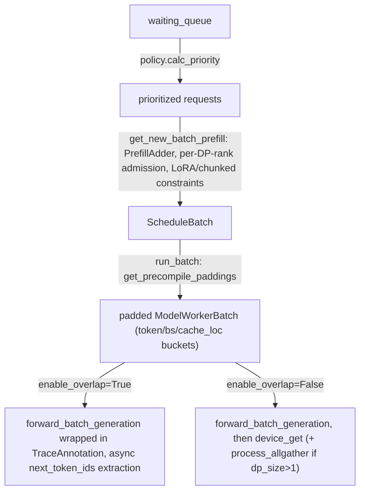

# sgl_jax.srt.managers.scheduler — continuous-batching Scheduler, precompile padding buckets, overlap mode

## Overview

[`Scheduler`](../catalog/python/sgl_jax/srt/managers/scheduler.md#Scheduler) is sglang-jax's
continuous-batching request scheduler: it admits new requests into prefill batches
([`get_new_batch_prefill`](../catalog/python/sgl_jax/srt/managers/scheduler.md#Scheduler.get_new_batch_prefill)),
runs forward passes
([`run_batch`](../catalog/python/sgl_jax/srt/managers/scheduler.md#Scheduler.run_batch)), and
manages data-parallel (DP) rank assignment, chunked prefill, LoRA batching constraints, and
speculative decoding gating. `run_batch` fetches
[`get_precompile_paddings`](../catalog/python/sgl_jax/srt/managers/scheduler.md#Scheduler.run_batch)
buckets (token count / batch size / cache-location padding) before building the
`ModelWorkerBatch` — the JAX-specific mechanism that keeps a variable-length serving workload from
triggering excessive recompilation.

## Diagram

## Design rationale (why it's built this way)

**`run_batch` fetches static padding buckets (`get_precompile_paddings`) before building the
model-worker batch, so that batches of different actual sizes share a small number of compiled
program shapes.**
[`Scheduler.run_batch`](../catalog/python/sgl_jax/srt/managers/scheduler.md#Scheduler.run_batch)
calls `self.tp_worker.get_precompile_paddings()` for token/batch-size/cache-location paddings
before
`ScheduleBatch.get_model_worker_batch` —
since JAX recompiles for each distinct traced shape, and a serving workload's actual batch
size/sequence lengths vary continuously request-to-request, rounding up to a small set of static
buckets is what keeps the number of distinct compiled programs bounded, trading some wasted
padding compute for avoiding per-request recompilation.

**Multi-host DP output extraction explicitly replicates `next_token_ids` before `device_get`,
because they may span non-addressable devices.** The comment states: "In multi-host DP,
`next_token_ids` may span non-addressable devices. Replicate first so `device_get` can proceed" —
`self.dp_size > 1` triggers `jax.experimental.multihost_utils.process_allgather(...,
tiled=True)` before converting to a host-side `np.array` — since a multi-host JAX process can only
call `device_get` on data resident on its own addressable devices, output tokens computed on a
different DP rank's host must be gathered across hosts first.

**`enable_overlap` wraps the forward pass in a named trace annotation and defers output-ID
extraction, implying an asynchronous execution pipeline distinct from the synchronous path.**
[`Scheduler.run_batch`](../catalog/python/sgl_jax/srt/managers/scheduler.md#Scheduler.run_batch)'s
`if self.enable_overlap` branch wraps
`self.tp_worker.forward_batch_generation` in `jax.profiler.TraceAnnotation(f"forward_batch_generation_overlap
{self.forward_ct}")` and calls a separate `_extract_dp_output_ids` path — this distinguishes a
mode where scheduling of the *next* batch can proceed while the *current* batch's device
computation is still in flight (classic scheduler/execution overlap for throughput), from the
simpler synchronous mode.

## Entry points

- [`Scheduler.get_new_batch_prefill`](../catalog/python/sgl_jax/srt/managers/scheduler.md#Scheduler.get_new_batch_prefill) —
  admits waiting requests into a new prefill batch, gated by running-batch fullness, speculative
  decoding state, and chunked-prefill continuation.
- [`Scheduler.run_batch`](../catalog/python/sgl_jax/srt/managers/scheduler.md#Scheduler.run_batch) —
  executes one forward pass for a `ScheduleBatch`.
- [`Scheduler.handle_generate_request`](../catalog/python/sgl_jax/srt/managers/scheduler.md#Scheduler.handle_generate_request) —
  reached to admit a new incoming generation request into the waiting queue.
- [`Scheduler.abort_request`](../catalog/python/sgl_jax/srt/managers/scheduler.md#Scheduler.abort_request) —
  reached to cancel an in-flight or queued request.

## Mechanism (step-by-step)

1. **[`Scheduler.get_new_batch_prefill`](../catalog/python/sgl_jax/srt/managers/scheduler.md#Scheduler.get_new_batch_prefill)
   checks admission gates** (spec-decode-in-progress, running-batch fullness, empty waiting
   queue), then prioritizes the waiting queue via
   [`SchedulePolicy.calc_priority`](../catalog/python/sgl_jax/srt/managers/schedule_policy.md#SchedulePolicy.calc_priority).
2. **A `PrefillAdder` admits requests per DP rank**, respecting per-DP-rank running-request limits,
   chunked-prefill continuation, and global LoRA-batch constraints, via
   [`PrefillAdder.add_one_req`](../catalog/python/sgl_jax/srt/managers/schedule_policy.md#PrefillAdder.add_one_req).
3. **[`Scheduler.run_batch`](../catalog/python/sgl_jax/srt/managers/scheduler.md#Scheduler.run_batch)
   fetches precompile padding buckets**, builds a `ModelWorkerBatch`, and
   dispatches to the (overlap or synchronous) forward-execution path.
4. **In multi-host [`Scheduler.dp_size`](../catalog/python/sgl_jax/srt/managers/scheduler.md#Scheduler.dp_size)
   mode**, output token IDs are gathered across hosts via `process_allgather` before host-side
   extraction.

## Key data structures

- **[`Scheduler`](../catalog/python/sgl_jax/srt/managers/scheduler.md#Scheduler)** —
  [`running_batch`](../catalog/python/sgl_jax/srt/managers/scheduler.md#Scheduler.running_batch)/
  [`tree_cache`](../catalog/python/sgl_jax/srt/managers/scheduler.md#Scheduler.tree_cache)/
  [`dp_size`](../catalog/python/sgl_jax/srt/managers/scheduler.md#Scheduler.dp_size)/
  [`enable_overlap`](../catalog/python/sgl_jax/srt/managers/scheduler.md#Scheduler.enable_overlap)/
  [`spec_algorithm`](../catalog/python/sgl_jax/srt/managers/scheduler.md#Scheduler.spec_algorithm)/
  [`mesh`](../catalog/python/sgl_jax/srt/managers/scheduler.md#Scheduler.mesh).
- **`ScheduleBatch`** — `reqs_info`/`forward_mode`/`dp_size`; exposes `prepare_for_decode`/
  `prepare_for_extend`/`get_model_worker_batch` (defined in `schedule_batch.py`, outside this
  packet's indexed module set).

## Dynamics (design intent)

Because precompile padding buckets are fetched fresh each `run_batch` call (not cached once at
startup), the scheduler can adapt bucket selection based on live workload characteristics (e.g.
`self.tp_worker.get_precompile_paddings()` reflecting currently observed shapes), while still
bounding the total number of distinct compiled programs relative to a naive "compile per exact
shape" approach.

## Edge cases

- [`Scheduler.get_new_batch_prefill`](../catalog/python/sgl_jax/srt/managers/scheduler.md#Scheduler.get_new_batch_prefill)
  returns `None` (no new batch) whenever speculative decoding is active, overlap is disabled, and
  the running batch is non-empty — new prefill admission is deferred until the current spec-decode
  round completes in that specific combination of settings.
- LoRA-batch constraints are enforced *globally* across DP ranks (`max_loras_per_batch`), not
  independently per rank — a request can be blocked from admission on one DP rank due to LoRA
  saturation elsewhere in the batch.

## Open questions

- The precise relationship between `enable_overlap` and multi-host DP's `process_allgather` usage
  (whether overlap mode changes when/how the allgather is triggered) is not fully detailed within
  this packet's cited subgraph.

## See also
- [python-sgl_jax-srt-managers-schedule_policy](python-sgl_jax-srt-managers-schedule_policy.md) —
  `SchedulePolicy`, the prioritization logic `get_new_batch_prefill` consults.
- [python-sgl_jax-srt-mem_cache-radix_cache](python-sgl_jax-srt-mem_cache-radix_cache.md) —
  the prefix-cache mechanism `Scheduler.tree_cache` refers to.
- [python-sgl_jax-srt-model_executor-forward_batch_info](python-sgl_jax-srt-model_executor-forward_batch_info.md) —
  `ForwardMode`, the mode `ScheduleBatch.forward_mode` selects between (prefill/decode/etc).
