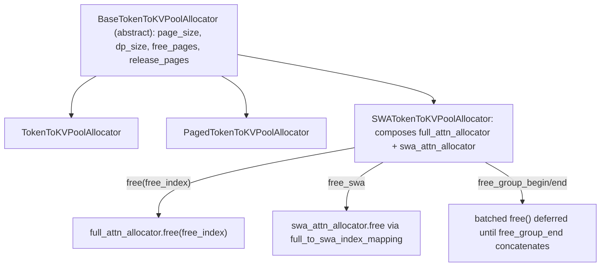

# sgl_jax.srt.mem_cache.allocator — BaseTokenToKVPoolAllocator, SWA dual-pool free-group batching

## Overview

[`BaseTokenToKVPoolAllocator`](../catalog/python/sgl_jax/srt/mem_cache/allocator.md#BaseTokenToKVPoolAllocator)
is the page-granularity allocator abstraction over the KV-cache token pool, tracking
[`free_pages`](../catalog/python/sgl_jax/srt/mem_cache/allocator.md#BaseTokenToKVPoolAllocator.page_size)-style
availability per DP rank. Its hybrid-attention specialization,
[`SWATokenToKVPoolAllocator`](../catalog/python/sgl_jax/srt/mem_cache/allocator.md#SWATokenToKVPoolAllocator),
composes *two* independent sub-allocators —
[`full_attn_allocator`](../catalog/python/sgl_jax/srt/mem_cache/allocator.md#SWATokenToKVPoolAllocator.full_attn_allocator)
and
[`swa_attn_allocator`](../catalog/python/sgl_jax/srt/mem_cache/allocator.md#SWATokenToKVPoolAllocator.swa_attn_allocator) —
because sliding-window-attention layers and full-attention layers in a hybrid model retain
different numbers of KV positions and must be freed/allocated independently while remaining
consistent for the same logical token.

## Diagram

## Design rationale (why it's built this way)

**Freeing under a hybrid SWA cache always frees *both* the full-attention and SWA allocators for
the same logical index, never just one.**
[`SWATokenToKVPoolAllocator.free`](../catalog/python/sgl_jax/srt/mem_cache/allocator.md#SWATokenToKVPoolAllocator.free)
calls `self.full_attn_allocator.free(free_index, dp_rank=dp_rank)` immediately followed by
`self.free_swa(free_index, dp_rank=dp_rank)` — since a single logical token position occupies slots
in both underlying pools (full retains every position, SWA retains only the sliding window), a
free that touched only one pool would leak the other pool's slot for that token.

**Freeing can be deferred and batched via an explicit free-group protocol
(`is_not_in_free_group`/`free_group`), rather than always freeing immediately.** When
`is_not_in_free_group` is false, `free` appends to `self.free_group[dp_rank]` instead of calling
the sub-allocators' `free` directly; `free_group_end` (on `BaseTokenToKVPoolAllocator`) then
concatenates all deferred indices and issues one batched `free()` call — collecting many small free
calls into a single batched array operation reduces per-call overhead when a scheduling step
retires many requests' KV ranges at once (e.g. a full batch eviction).

**Every `free` call ends with a post-condition assertion that available size never exceeds the
allocator's nominal capacity.**
[`SWATokenToKVPoolAllocator.free`](../catalog/python/sgl_jax/srt/mem_cache/allocator.md#SWATokenToKVPoolAllocator.free)
asserts `self.full_attn_allocator.available_size(dp_rank=dp_rank) <= full_expected` (and the
analogous SWA check) after every free — this catches a double-free or accounting bug immediately at
the point it occurs, rather than letting corrupted free-list state silently propagate into a later,
harder-to-diagnose allocation failure.

**Disaggregated-decode admission reserves headroom per in-flight request rather than admitting
until the pool is merely non-empty.**
[`_admit_decode_prealloc`](../catalog/python/sgl_jax/srt/disaggregation/decode.md#SchedulerDisaggregationDecodeMixin._admit_decode_prealloc)'s
docstring states it reserves `num_reserved_decode_tokens` "per in-flight/running request so a
running decode step can always alloc its next token even when every other req is mid-transfer" —
since transfer-queue requests can't be retracted once admitted, admitting too many would risk a
running request being unable to allocate its next decode token, so the reservation is computed
*before* admission, not discovered after an allocation failure.

## Entry points

- [`SWATokenToKVPoolAllocator.free`](../catalog/python/sgl_jax/srt/mem_cache/allocator.md#SWATokenToKVPoolAllocator.free) —
  reached whenever a request's KV range is released (eviction, completion, abort).
- [`SWATokenToKVPoolAllocator.alloc`](../catalog/python/sgl_jax/srt/mem_cache/allocator.md#SWATokenToKVPoolAllocator.alloc) /
  [`alloc_decode`](../catalog/python/sgl_jax/srt/mem_cache/allocator.md#SWATokenToKVPoolAllocator.alloc_decode) /
  [`alloc_extend`](../catalog/python/sgl_jax/srt/mem_cache/allocator.md#SWATokenToKVPoolAllocator.alloc_extend) —
  reached from `ScheduleBatch.prepare_for_extend`/`prepare_for_decode` to reserve KV slots for a
  batch.
- [`BaseTokenToKVPoolAllocator.available_size`](../catalog/python/sgl_jax/srt/mem_cache/allocator.md#BaseTokenToKVPoolAllocator.available_size) —
  reached by admission/scheduling logic (e.g.
  [`_admit_decode_prealloc`](../catalog/python/sgl_jax/srt/disaggregation/decode.md#SchedulerDisaggregationDecodeMixin._admit_decode_prealloc))
  to check capacity before committing an allocation.

## Mechanism (step-by-step)

1. **[`SWATokenToKVPoolAllocator.free`](../catalog/python/sgl_jax/srt/mem_cache/allocator.md#SWATokenToKVPoolAllocator.free)
   short-circuits on an empty index array**, then either frees both sub-allocators immediately or
   appends to the per-rank free group, depending on
   [`is_not_in_free_group`](../catalog/python/sgl_jax/srt/mem_cache/allocator.md#BaseTokenToKVPoolAllocator).
2. **[`free_swa`](../catalog/python/sgl_jax/srt/mem_cache/allocator.md#SWATokenToKVPoolAllocator.free_swa)
   translates full-attention indices to SWA-pool indices via**
   [`full_to_swa_index_mapping`](../catalog/python/sgl_jax/srt/mem_cache/allocator.md#SWATokenToKVPoolAllocator.full_to_swa_index_mapping)
   before freeing them in
   [`swa_attn_allocator`](../catalog/python/sgl_jax/srt/mem_cache/allocator.md#SWATokenToKVPoolAllocator.swa_attn_allocator) —
   the two pools use different index spaces since SWA retains fewer positions.
3. **Post-free, both sub-allocators'
   [`available_size`](../catalog/python/sgl_jax/srt/mem_cache/allocator.md#BaseTokenToKVPoolAllocator.available_size)
   are asserted against their expected capacity** (`size_per_rank` under DP, else `size`), turning
   any accounting inconsistency into an immediate crash.
4. **On the eviction path,**
   [`SWARadixCache.evict`](../catalog/python/sgl_jax/srt/mem_cache/swa_radix_cache.md#SWARadixCache.evict)
   walks the LRU list, calling
   [`token_to_kv_pool_allocator.free`](../catalog/python/sgl_jax/srt/mem_cache/allocator.md#BaseTokenToKVPoolAllocator.free)
   per evicted node while tracking `full_num_evicted`/`swa_num_evicted` separately, since the two
   attention types free different token counts for the same tree node.

## Key data structures

- **[`BaseTokenToKVPoolAllocator`](../catalog/python/sgl_jax/srt/mem_cache/allocator.md#BaseTokenToKVPoolAllocator)** —
  [`page_size`](../catalog/python/sgl_jax/srt/mem_cache/allocator.md#BaseTokenToKVPoolAllocator.page_size)/[`dp_size`](../catalog/python/sgl_jax/srt/mem_cache/allocator.md#BaseTokenToKVPoolAllocator.dp_size);
  tracks `free_pages`/`release_pages` per DP rank, plus the free-group deferral flag.
- **[`SWATokenToKVPoolAllocator`](../catalog/python/sgl_jax/srt/mem_cache/allocator.md#SWATokenToKVPoolAllocator)** —
  composes
  [`full_attn_allocator`](../catalog/python/sgl_jax/srt/mem_cache/allocator.md#SWATokenToKVPoolAllocator.full_attn_allocator)/[`swa_attn_allocator`](../catalog/python/sgl_jax/srt/mem_cache/allocator.md#SWATokenToKVPoolAllocator.swa_attn_allocator)
  plus [`full_to_swa_index_mapping`](../catalog/python/sgl_jax/srt/mem_cache/allocator.md#SWATokenToKVPoolAllocator.full_to_swa_index_mapping)
  and [`free_group`](../catalog/python/sgl_jax/srt/mem_cache/allocator.md#SWATokenToKVPoolAllocator.free_group)
  (per-DP-rank list of deferred free-index arrays).

## Dynamics (design intent)

Because `free_group_begin`/`free_group_end` bracket a batch of frees with a single deferred-then-
batched flush, a scheduling step that frees many requests at once (e.g. a full running-batch
retraction) issues one concatenated `free()` call per sub-allocator instead of one call per
request — reducing per-call Python/array-op overhead proportional to batch size.

## Edge cases

- [`PagedTokenToKVPoolAllocator.free`](../catalog/python/sgl_jax/srt/mem_cache/allocator.md#PagedTokenToKVPoolAllocator.free)
  is a distinct override from
  [`SWATokenToKVPoolAllocator.free`](../catalog/python/sgl_jax/srt/mem_cache/allocator.md#SWATokenToKVPoolAllocator.free) —
  the paged (non-hybrid) allocator's free path does not go through the dual-pool full/SWA split at
  all.
- [`_admit_decode_prealloc`](../catalog/python/sgl_jax/srt/disaggregation/decode.md#SchedulerDisaggregationDecodeMixin._admit_decode_prealloc)'s
  in-flight-transfer cap check happens *before* the paged-pool budget check in the same loop
  iteration — a request can be deferred by either constraint independently, and both are FIFO
  (deferral, never abort) per its docstring.

## Open questions

- Whether `free_group` batching is used on any path other than explicit `free_group_begin`/`end`
  bracketing (e.g. whether the scheduler always brackets multi-request retraction this way) is not
  shown within this packet's cited subgraph.

## See also
- [python-sgl_jax-srt-mem_cache-swa_radix_cache](python-sgl_jax-srt-mem_cache-swa_radix_cache.md) —
  `SWARadixCache`, the eviction-driving cache that calls this allocator's `free`.
- [python-sgl_jax-srt-mem_cache-memory_pool](python-sgl_jax-srt-mem_cache-memory_pool.md) — the
  underlying `KVCache`/pool storage this allocator manages indices into.

## Sources
- `raw/code/sglang-jax/python/sgl_jax/srt/mem_cache/allocator.py`
- `raw/code/sglang-jax/python/sgl_jax/srt/mem_cache/swa_radix_cache.py`
- `raw/code/sglang-jax/python/sgl_jax/srt/disaggregation/decode.py`
