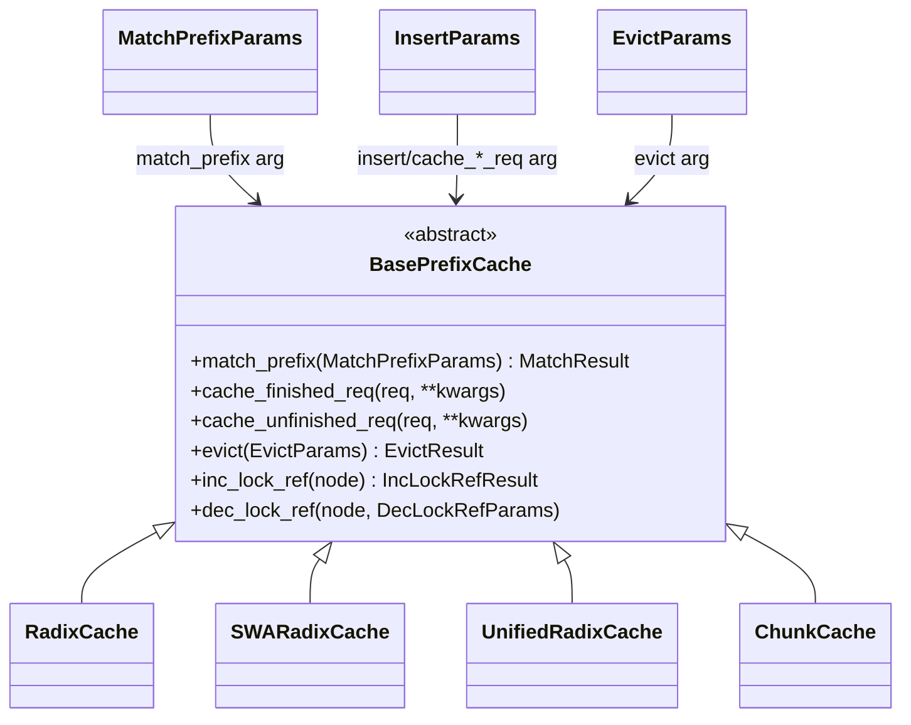

# sgl_jax.srt.mem_cache.base_prefix_cache — BasePrefixCache abstract interface, unified param dataclasses across cache backends

## Overview

[`BasePrefixCache`](../catalog/python/sgl_jax/srt/mem_cache/base_prefix_cache.md#BasePrefixCache)
is the abstract interface implemented by every KV prefix-cache backend
(`RadixCache`, `SWARadixCache`, `UnifiedRadixCache`, `ChunkCache`), and
[`MatchPrefixParams`](../catalog/python/sgl_jax/srt/mem_cache/base_prefix_cache.md#MatchPrefixParams)/[`InsertParams`](../catalog/python/sgl_jax/srt/mem_cache/base_prefix_cache.md#InsertParams)/[`EvictParams`](../catalog/python/sgl_jax/srt/mem_cache/base_prefix_cache.md#EvictParams)
are "Unified parameters" dataclasses (their own docstrings) that let the scheduler call
`match_prefix`/`cache_finished_req`/`cache_unfinished_req`/`evict` identically across every
backend, even though fields like `swa_evicted_seqlen` or `recurrent_num` are meaningful to only
some of them.

## Diagram

## Design rationale (why it's built this way)

**Every cache backend accepts the same parameter dataclasses even though most fields only apply to
some backends, letting the scheduler stay backend-agnostic.**
[`InsertParams`](../catalog/python/sgl_jax/srt/mem_cache/base_prefix_cache.md#InsertParams)'s
`prev_prefix_len`/`swa_evicted_seqlen` fields are commented "SWA-specific: consumed by
SWARadixCache, ignored by RadixCache" — rather than giving each backend a distinct method
signature, every backend accepts (and simply ignores irrelevant parts of) the same unified struct,
so callers like [`SchedulePolicy._compute_prefix_matches`](../catalog/python/sgl_jax/srt/managers/schedule_policy.md#SchedulePolicy._compute_prefix_matches)
can call `match_prefix`/`insert` without knowing which concrete cache backend is configured.

**`MatchPrefixParams.full_only` exists specifically so a request's own re-match doesn't get gated
on auxiliary tree components.** Its comment: "a request's own prefix re-match must not be gated on
aux components (its recurrent state lives in the running slot, not the tree)" — for
[`UnifiedRadixCache`](../catalog/python/sgl_jax/srt/mem_cache/unified_radix_cache.md#UnifiedRadixCache.cache_unfinished_req)-style
caches composing multiple tree "components" (radix + recurrent-state), a full re-match against
every component would incorrectly require the recurrent component to also match, even though that
state is tracked per-request outside the tree during active generation.

**Most `BasePrefixCache` capability methods (`evictable_size`, `supports_recurrent`,
`full_evictable_size`, `swa_evictable_size`, `protected_size`, ...) have concrete
zero/False default implementations rather than being abstract.** Only `reset`, `match_prefix`,
`cache_finished_req`, `cache_unfinished_req`, `evict`, `inc_lock_ref`, `dec_lock_ref` are
`@abc.abstractmethod`. This means a new, simple cache backend (e.g. `ChunkCache`, which has no
eviction or recurrent-state concept) needs to implement only the core operations and inherits
sensible no-op defaults for every capability query it doesn't support, rather than every backend
having to stub out every capability method explicitly.

**`cache_unfinished_req` advances `prefix_indices` even when nothing was actually inserted into the
tree, to avoid leaking pages on the next chunked round.**
[`UnifiedRadixCache.cache_unfinished_req`](../catalog/python/sgl_jax/srt/mem_cache/unified_radix_cache.md#UnifiedRadixCache.cache_unfinished_req)'s
comment explains: when `effective_cache_len <= 0`, "the chunk's KV is committed" but nothing entered
the tree, so `req.prefix_indices` is still advanced to the freshly-read `kv_indices` — otherwise the
next chunked-prefill round (which doesn't re-match) would extend from the stale prefix and
re-allocate over already-committed pages, leaking them.

## Entry points

- [`BasePrefixCache.match_prefix`](../catalog/python/sgl_jax/srt/mem_cache/base_prefix_cache.md#BasePrefixCache) —
  abstract; every backend's [`RadixCache.match_prefix`](../catalog/python/sgl_jax/srt/mem_cache/radix_cache.md#RadixCache.match_prefix)
  implements it against a
  [`MatchPrefixParams`](../catalog/python/sgl_jax/srt/mem_cache/base_prefix_cache.md#MatchPrefixParams).
- [`UnifiedRadixCache.cache_unfinished_req`](../catalog/python/sgl_jax/srt/mem_cache/unified_radix_cache.md#UnifiedRadixCache.cache_unfinished_req) —
  reached mid-generation (e.g. after a chunked-prefill step) for the multi-component cache variant.
- [`default_radix_cache_factory`](../catalog/python/sgl_jax/srt/mem_cache/registry.md#default_radix_cache_factory) —
  reached at KV-cache build time to construct the concrete
  [`BasePrefixCache`](../catalog/python/sgl_jax/srt/mem_cache/base_prefix_cache.md#BasePrefixCache)
  backend (`ChunkCache`/`RadixCache`/`SWARadixCache`/`UnifiedRadixCache`) selected for the run.

## Mechanism (step-by-step)

1. **[`build_kv_cache`](../catalog/python/sgl_jax/srt/mem_cache/kv_cache_builder.md#build_kv_cache)
   calls [`default_radix_cache_factory`](../catalog/python/sgl_jax/srt/mem_cache/registry.md#default_radix_cache_factory)**,
   which returns a concrete
   [`BasePrefixCache`](../catalog/python/sgl_jax/srt/mem_cache/base_prefix_cache.md#BasePrefixCache)
   subclass chosen from the model/hybrid configuration.
2. **Scheduling calls
   [`_compute_prefix_matches`](../catalog/python/sgl_jax/srt/managers/schedule_policy.md#SchedulePolicy._compute_prefix_matches)**,
   which builds a
   [`MatchPrefixParams`](../catalog/python/sgl_jax/srt/mem_cache/base_prefix_cache.md#MatchPrefixParams)
   and calls `match_prefix` polymorphically without knowing the concrete backend.
3. **On request completion,
   [`cache_finished_req`](../catalog/python/sgl_jax/srt/mem_cache/radix_cache.md#RadixCache.cache_finished_req)
   (or the `UnifiedRadixCache`/`SWARadixCache` equivalents) builds an**
   [`InsertParams`](../catalog/python/sgl_jax/srt/mem_cache/base_prefix_cache.md#InsertParams)
   and calls `insert`, letting SWA-specific fields
   (`swa_evicted_seqlen`/`prev_prefix_len`) flow through unused for backends that don't need them.
4. **When the cache is under memory pressure,**
   [`SWARadixCache.evict`](../catalog/python/sgl_jax/srt/mem_cache/swa_radix_cache.md#SWARadixCache.evict)
   is called with an
   [`EvictParams`](../catalog/python/sgl_jax/srt/mem_cache/base_prefix_cache.md#EvictParams)
   specifying separate `num_tokens`/`swa_num_tokens`/`recurrent_num` targets, since a hybrid cache
   must evict against multiple independent budgets simultaneously.

## Key data structures

- **[`MatchPrefixParams`](../catalog/python/sgl_jax/srt/mem_cache/base_prefix_cache.md#MatchPrefixParams)** —
  `key`, `cow_recurrent` (copy-on-write recurrent-state clone marker), `full_only`.
- **[`InsertParams`](../catalog/python/sgl_jax/srt/mem_cache/base_prefix_cache.md#InsertParams)** —
  `key`, `value`, `prev_prefix_len`/`swa_evicted_seqlen` (SWA-only), `recurrent_value` (a
  `RecurrentStatePool` slot index whose ownership "passes to the tree at commit").
- **[`EvictParams`](../catalog/python/sgl_jax/srt/mem_cache/base_prefix_cache.md#EvictParams)** —
  `num_tokens`, `swa_num_tokens`, `dp_rank`, `recurrent_num` — independent eviction targets per
  cache dimension.

## Dynamics (design intent)

Because the unified parameter dataclasses carry fields for capabilities a given backend doesn't
have (SWA fields on a plain `RadixCache`, recurrent fields on a non-recurrent cache), swapping the
configured cache backend for a model (e.g. moving from plain radix caching to hybrid SWA) requires
no changes to the calling code in the scheduler — only the factory's backend selection changes.

## Edge cases

- [`UnifiedRadixCache.cache_unfinished_req`](../catalog/python/sgl_jax/srt/mem_cache/unified_radix_cache.md#UnifiedRadixCache.cache_unfinished_req)'s
  `self.disable` branch still calls `cleanup_after_caching_req` on every component even though
  nothing is cached — cleanup bookkeeping runs unconditionally regardless of whether the cache
  itself is active.
- `effective_cache_len` in
  [`UnifiedRadixCache.cache_unfinished_req`](../catalog/python/sgl_jax/srt/mem_cache/unified_radix_cache.md#UnifiedRadixCache.cache_unfinished_req)
  is the *minimum* across all components' `prepare_for_caching_req` return values — one component
  restricting the cacheable length constrains the whole multi-component insert, not just its own
  sub-tree.

## Open questions

- The full set of concrete `BasePrefixCache` subclasses beyond `RadixCache`/`SWARadixCache`/
  `UnifiedRadixCache`/`ChunkCache` (if any) is not enumerated within this packet's cited subgraph.

## See also
- [python-sgl_jax-srt-mem_cache-radix_cache](python-sgl_jax-srt-mem_cache-radix_cache.md) —
  `RadixCache`, the simplest concrete implementation of this interface.
- [python-sgl_jax-srt-mem_cache-swa_radix_cache](python-sgl_jax-srt-mem_cache-swa_radix_cache.md) —
  `SWARadixCache`, the hybrid full+SWA implementation using the SWA-specific `InsertParams` fields.
- [python-sgl_jax-srt-mem_cache-unified_radix_cache](python-sgl_jax-srt-mem_cache-unified_radix_cache.md) —
  `UnifiedRadixCache`, the multi-component (radix + recurrent-state) implementation.

## Sources
- `raw/code/sglang-jax/python/sgl_jax/srt/mem_cache/base_prefix_cache.py`
- `raw/code/sglang-jax/python/sgl_jax/srt/mem_cache/unified_radix_cache.py`
- `raw/code/sglang-jax/python/sgl_jax/srt/mem_cache/radix_cache.py`
- `raw/code/sglang-jax/python/sgl_jax/srt/mem_cache/swa_radix_cache.py`
