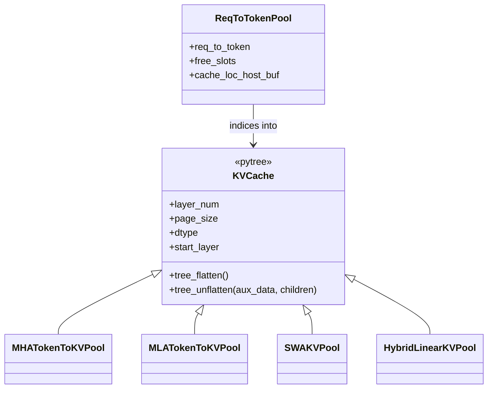

# sgl_jax.srt.mem_cache.memory_pool — pytree-registered KV pools, sharded kv_sharding, ReqToTokenPool

<!-- connect:up:begin -->
> **Cross-repo concept:** part of [kv-cache](../../../concepts/kv-cache.md), [sharding](../../../concepts/sharding.md) across this wiki's repos.
<!-- connect:up:end -->
## Overview

[`ReqToTokenPool`](../catalog/python/sgl_jax/srt/mem_cache/memory_pool.md#ReqToTokenPool) and the
`KVCache` family ([`MHATokenToKVPool`](../catalog/python/sgl_jax/srt/mem_cache/memory_pool.md#MHATokenToKVPool.kv_sharding),
[`MLATokenToKVPool`](../catalog/python/sgl_jax/srt/mem_cache/memory_pool.md#MLATokenToKVPool.kv_sharding),
`SWAKVPool`, `HybridLinearKVPool`) are all registered as JAX pytree nodes
([`tree_flatten`](../catalog/python/sgl_jax/srt/mem_cache/memory_pool.md#KVCache.tree_flatten)/[`tree_unflatten`](../catalog/python/sgl_jax/srt/mem_cache/memory_pool.md#KVCache.tree_unflatten))
so the pool objects themselves — not just the raw arrays inside them — can cross `jax.jit`
boundaries as arguments/return values. Each concrete pool computes its own
[`kv_sharding`](../catalog/python/sgl_jax/srt/mem_cache/memory_pool.md#MHATokenToKVPool.kv_sharding)
(`NamedSharding`) from the mesh and attention-layout parameters, since MHA and MLA caches have
different physical layouts and therefore different sharding specs for the same logical KV
semantics.

## Diagram

## Design rationale (why it's built this way)

**`KVCache.tree_flatten` puts the actual buffer(s) in `children` but static metadata (`size`,
`page_size`, `dtype`, `layer_num`, `mesh`, `start_layer`, `end_layer`, `mem_usage`) entirely in
`aux_data`.** [`KVCache.tree_flatten`](../catalog/python/sgl_jax/srt/mem_cache/memory_pool.md#KVCache.tree_flatten)
(the base class) returns `children=()` with everything in `aux_data` — subclasses like
[`MHATokenToKVPool.tree_flatten`](../catalog/python/sgl_jax/srt/mem_cache/memory_pool.md#MHATokenToKVPool.tree_flatten)
add the actual [`kv_buffer`](../catalog/python/sgl_jax/srt/mem_cache/memory_pool.md#MHATokenToKVPool.kv_buffer)
arrays to `children`. Since `aux_data` is treated as a static (hashable, trace-invariant) part of
the pytree by JAX, this split ensures `jax.jit` retraces only when the actual buffer *arrays*
change shape/sharding — not on every call — while metadata like `mesh`/`dtype` participate in the
cache key without themselves being traced values.

**`ReqToTokenPool`'s persistent host scratch buffer is explicitly excluded from pytree
reconstruction rather than round-tripped through `tree_flatten`/`tree_unflatten`.**
[`ReqToTokenPool.__init__`](../catalog/python/sgl_jax/srt/mem_cache/memory_pool.md#ReqToTokenPool)'s
comment on `cache_loc_host_buf` explains: "Persistent host scratch buffer reused by
`ScheduleBatch._merge_cache_loc` to avoid a fresh `np.zeros` every step" — and `tree_unflatten`
does not restore it from `aux_data`/`children` at all, since it is "transient host memory, not
model state" — reallocating it fresh after unflatten (rather than serializing/restoring stale
scratch contents) is both correct and cheaper.

**Each KV pool variant computes its own `kv_sharding`, because MHA and MLA caches have physically
different tensor layouts for the same logical KV data.**
[`MHATokenToKVPool.kv_sharding`](../catalog/python/sgl_jax/srt/mem_cache/memory_pool.md#MHATokenToKVPool.kv_sharding)
is built from `head_num`/`head_dim`/`attention_data_partition_axis`/`kv_partition_axis`, while
[`MLATokenToKVPool.kv_sharding`](../catalog/python/sgl_jax/srt/mem_cache/memory_pool.md#MLATokenToKVPool.kv_sharding)
is built from `kv_dim`/`nope_dim` instead — MLA's compressed latent KV representation has no
per-head dimension to shard the same way MHA's does, so the sharding spec must be derived from
each layout's own dimensions rather than shared logic.

## Entry points

- [`ModelRunnerKVCacheMixin._init_pools`](../catalog/python/sgl_jax/srt/model_executor/model_runner_kv_cache_mixin.md#ModelRunnerKVCacheMixin._init_pools) —
  "Create ReqToTokenPool, KV pool, allocator, and MemoryPools"; the sole construction site for
  [`ReqToTokenPool`](../catalog/python/sgl_jax/srt/mem_cache/memory_pool.md#ReqToTokenPool) in the
  non-hybrid, non-recurrent case, and for the concrete `KVCache` subclass otherwise.
- [`build_kv_cache`](../catalog/python/sgl_jax/srt/mem_cache/kv_cache_builder.md#build_kv_cache) —
  reached after pool construction to wire the pool and allocator into the selected prefix-cache
  backend.

## Mechanism (step-by-step)

1. **[`_init_pools`](../catalog/python/sgl_jax/srt/model_executor/model_runner_kv_cache_mixin.md#ModelRunnerKVCacheMixin._init_pools)
   constructs [`ReqToTokenPool`](../catalog/python/sgl_jax/srt/mem_cache/memory_pool.md#ReqToTokenPool)
   only for the non-hybrid, non-recurrent path** (`if self.req_to_token_pool is None and not
   has_recurrent_state`) — hybrid models defer `ReqToTokenPool` construction to after the KV pool
   is built, since hybrid layer-ID bookkeeping affects its sizing.
2. **For a hybrid model,
   [`_init_pools`](../catalog/python/sgl_jax/srt/model_executor/model_runner_kv_cache_mixin.md#ModelRunnerKVCacheMixin._init_pools)
   computes per-attention-type head counts/dims** (padding `swa_head_dim` up to a 128 multiple)
   before constructing `SWAKVPool` with separate full- and SWA-attention layer ID lists and a
   shared `token_to_kv_pool_class=MHATokenToKVPool` for both sub-pools.
3. **Each concrete pool's
   [`kv_sharding`](../catalog/python/sgl_jax/srt/mem_cache/memory_pool.md#MHATokenToKVPool.kv_sharding)
   is computed once at construction**, from the mesh and the pool's own layout parameters, and
   reused for every buffer allocation that pool performs.
4. **When a pool instance crosses a `jax.jit` boundary**,
   [`tree_flatten`](../catalog/python/sgl_jax/srt/mem_cache/memory_pool.md#KVCache.tree_flatten)/[`tree_unflatten`](../catalog/python/sgl_jax/srt/mem_cache/memory_pool.md#KVCache.tree_unflatten)
   split it into traced buffer children and static aux-data metadata, reconstructing an equivalent
   object on the other side via `object.__new__(cls)` plus direct attribute assignment (bypassing
   `__init__`).

## Key data structures

- **[`ReqToTokenPool`](../catalog/python/sgl_jax/srt/mem_cache/memory_pool.md#ReqToTokenPool)** —
  `req_to_token` (the sharded request-to-token-index table), `free_slots`, and a `cache_loc_host_buf`
  scratch buffer reused across steps (not part of the pytree state).
- **`KVCache` (base) / `MHATokenToKVPool` / `MLATokenToKVPool`** —
  [`layer_num`](../catalog/python/sgl_jax/srt/mem_cache/memory_pool.md#KVCache.layer_num)/[`page_size`](../catalog/python/sgl_jax/srt/mem_cache/memory_pool.md#KVCache.page_size)/[`dtype`](../catalog/python/sgl_jax/srt/mem_cache/memory_pool.md#KVCache.dtype)/[`start_layer`](../catalog/python/sgl_jax/srt/mem_cache/memory_pool.md#KVCache.start_layer)
  as shared metadata; subclasses add
  [`kv_buffer`](../catalog/python/sgl_jax/srt/mem_cache/memory_pool.md#MHATokenToKVPool.kv_buffer)
  (MHA) or `kv_buffer`+`kv_dim`/`nope_dim` (MLA) as the actual pytree children.

## Dynamics (design intent)

Because `mesh` lives in `aux_data` (static) rather than `children` (traced) for every `KVCache`
subclass's pytree registration, the same pool object can be passed across `jit` boundaries
repeatedly without the mesh itself being retraced or copied per call — only the buffer contents are
treated as dynamic pytree leaves.

## Edge cases

- [`ReqToTokenPool.tree_unflatten`](../catalog/python/sgl_jax/srt/mem_cache/memory_pool.md#ReqToTokenPool) —
  reconstructs the object via `object.__new__(cls)` and manual attribute assignment rather than
  calling `__init__`, meaning any invariant normally enforced in `__init__` (e.g. `req_to_token`
  shape derived from `size`/`max_context_len`) is not re-validated on unflatten.
- `SWAKVPool`'s `tree_flatten`/`tree_unflatten` carry `full_kv_pool`/`swa_kv_pool`/`layers_mapping`
  as their own children/aux-data set, distinct from the plain `MHATokenToKVPool` shape — a
  composite pool's pytree structure nests its sub-pools' state rather than flattening to a single
  buffer list.

## Open questions

- The exact conditions distinguishing when `HybridLinearKVPool` (vs. `SWAKVPool`) is selected for
  a hybrid model are not detailed within this packet's cited subgraph.

## See also
- [python-sgl_jax-srt-mem_cache-allocator](python-sgl_jax-srt-mem_cache-allocator.md) — the
  allocator layer that manages indices into these pools.
- [python-sgl_jax-srt-model_executor-model_runner](python-sgl_jax-srt-model_executor-model_runner.md) —
  `ModelRunner`, whose KV-cache mixin constructs these pools at startup.

## Sources
- `raw/code/sglang-jax/python/sgl_jax/srt/mem_cache/memory_pool.py`
- `raw/code/sglang-jax/python/sgl_jax/srt/model_executor/model_runner_kv_cache_mixin.py`
- `raw/code/sglang-jax/python/sgl_jax/srt/mem_cache/kv_cache_builder.py`
