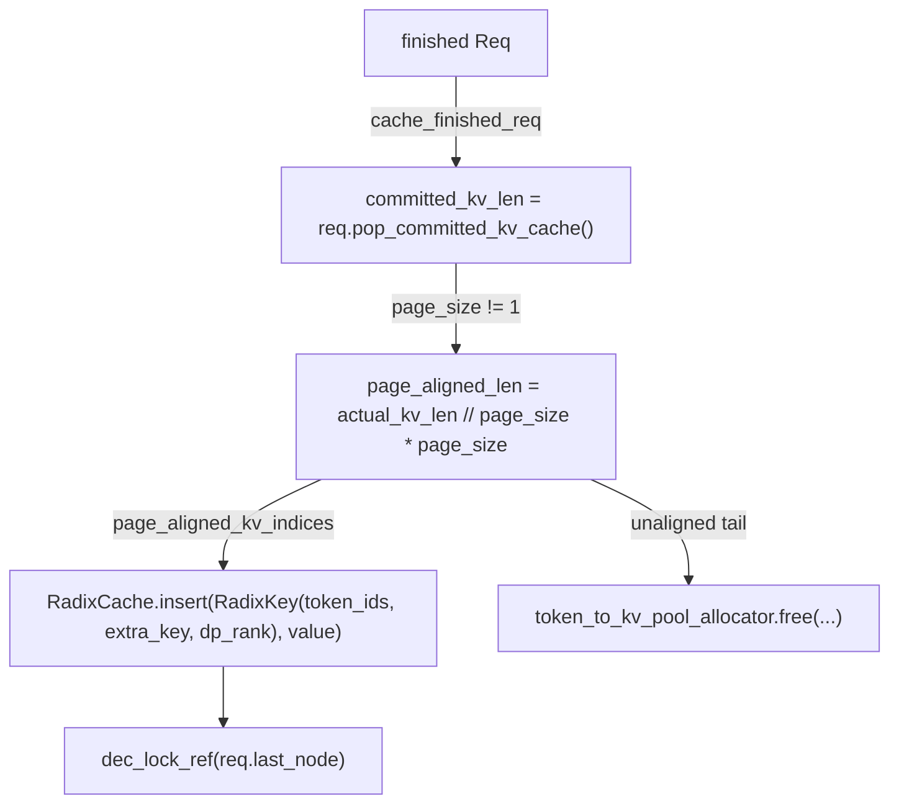

# sgl_jax.srt.mem_cache.radix_cache — RadixCache prefix caching, page-aligned KV insertion, EAGLE bigram keys

## Overview

`RadixCache` is sglang-jax's
prefix-caching KV-cache index: a radix tree keyed by
[`RadixKey`](../catalog/python/sgl_jax/srt/mem_cache/radix_cache.md#RadixKey) (token IDs plus an
optional `extra_key` for cache-namespace isolation, e.g. per-LoRA-adapter, and `dp_rank` for
DP-sharded caches), letting requests sharing a prompt prefix reuse already-computed KV cache
entries.
[`cache_finished_req`](../catalog/python/sgl_jax/srt/mem_cache/radix_cache.md#RadixCache.cache_finished_req)
only inserts the *page-aligned* portion of a finished request's KV cache into the tree — the
unaligned tail is freed directly rather than cached, since it doesn't correspond to a complete,
reusable page.

## Diagram

## Design rationale (why it's built this way)

**Only page-aligned KV cache ranges are inserted into the radix tree; the unaligned remainder is
freed directly, never cached.**
[`RadixCache.cache_finished_req`](../catalog/python/sgl_jax/srt/mem_cache/radix_cache.md#RadixCache.cache_finished_req)
computes `page_aligned_len = actual_kv_len // self.page_size * self.page_size` and only the KV
indices up to that length become the inserted value; the remainder (`kv_indices[page_aligned_len:]`)
is freed via the allocator — since the KV-cache allocator manages memory in fixed-size pages, a
partial page can't be independently referenced/evicted at page granularity, so caching it would
either require over-provisioning a whole page for a partial prefix or break the allocator's
paging invariant.

**`RadixKey` bundles `extra_key`/`dp_rank` into the cache key itself, not as external partitioning
logic.** The class docstring states `extra_key` "enables cache namespace isolation (e.g., for
different LoRA adapters)" — since two requests with identical token IDs but different LoRA
adapters must *not* share cached KV values (the adapter changes the computed activations), folding
this into the key itself (rather than maintaining separate cache instances per namespace) lets one
`RadixCache` implementation serve all namespaces correctly by construction.

**EAGLE speculative decoding requires bigram-key conversion and an off-by-one length adjustment
throughout the caching path.** The code comment explains: "For EAGLE radix cache, we will convert
the key to bigram key, e.g. `[1,2,3,4] -> [(1,2), (2,3), (3,4)]`, the length will -1" — and
`cache_finished_req` correspondingly computes `actual_kv_len = committed_kv_len - 1 if
self.is_eagle else committed_kv_len` — because EAGLE's draft-verification scheme changes what a
"token" means for caching purposes (a bigram of consecutive tokens rather than a single token),
every length calculation downstream must consistently apply this adjustment to avoid off-by-one
cache corruption.

## Entry points

- [`RadixCache.match_prefix`](../catalog/python/sgl_jax/srt/mem_cache/radix_cache.md#RadixCache.match_prefix) —
  reached to find the longest cached prefix for a new request's token sequence.
- [`RadixCache.cache_finished_req`](../catalog/python/sgl_jax/srt/mem_cache/radix_cache.md#RadixCache.cache_finished_req) —
  reached when a request completes, to insert its newly-computed KV cache (page-aligned portion)
  into the tree.
- [`RadixCache.cache_unfinished_req`](../catalog/python/sgl_jax/srt/mem_cache/radix_cache.md#RadixCache.cache_unfinished_req) —
  reached mid-generation (e.g. after a chunked-prefill step) to cache partial progress.
- [`RadixCache.insert`](../catalog/python/sgl_jax/srt/mem_cache/radix_cache.md#RadixCache.insert) —
  the underlying tree-insertion primitive both cache-request methods call.

## Mechanism (step-by-step)

1. **[`RadixCache.cache_finished_req`](../catalog/python/sgl_jax/srt/mem_cache/radix_cache.md#RadixCache.cache_finished_req)
   reads the request's committed KV indices** from the token pool and computes the page-aligned
   length.
2. **If `is_insert`, [`RadixCache.insert`](../catalog/python/sgl_jax/srt/mem_cache/radix_cache.md#RadixCache.insert)
   is called with a [`RadixKey`](../catalog/python/sgl_jax/srt/mem_cache/radix_cache.md#RadixKey)**
   built from the page-aligned token IDs plus `extra_key`/`dp_rank`, taking over a reference to
   that KV range from the memory pool.
3. **Any KV range outside the newly-cached prefix (old prefix through new prefix, or the whole
   unaligned tail if not inserting) is freed** via the
   [`token_to_kv_pool_allocator`](../catalog/python/sgl_jax/srt/mem_cache/allocator.md#BaseTokenToKVPoolAllocator.free).
4. **[`RadixCache.dec_lock_ref`](../catalog/python/sgl_jax/srt/mem_cache/radix_cache.md#RadixCache.dec_lock_ref)
   releases the request's lock** on its last matched tree node, allowing eviction to proceed if no
   other request still references it.

## Key data structures

- **[`RadixKey`](../catalog/python/sgl_jax/srt/mem_cache/radix_cache.md#RadixKey)** — `token_ids`,
  [`extra_key`](../catalog/python/sgl_jax/srt/mem_cache/radix_cache.md#RadixKey) (namespace
  isolation), [`dp_rank`](../catalog/python/sgl_jax/srt/mem_cache/radix_cache.md#RadixKey.dp_rank).
- **`RadixCache`** —
  [`root_node`](../catalog/python/sgl_jax/srt/mem_cache/radix_cache.md#RadixCache.root_node); the
  tree root; exposes
  [`inc_lock_ref`](../catalog/python/sgl_jax/srt/mem_cache/radix_cache.md#RadixCache.inc_lock_ref)/
  [`dec_lock_ref`](../catalog/python/sgl_jax/srt/mem_cache/radix_cache.md#RadixCache.dec_lock_ref)
  for reference-counted eviction protection.

## Dynamics (design intent)

Because cache insertion only ever operates on page-aligned ranges, the allocator's page-granularity
eviction/reuse bookkeeping never has to reason about partial pages living in the cache — every
cached tree node's value corresponds to a whole number of pages, keeping the allocator and cache
invariants consistent.

## Edge cases

- [`RadixCache.cache_finished_req`](../catalog/python/sgl_jax/srt/mem_cache/radix_cache.md#RadixCache.cache_finished_req)'s
  `is_insert=False` path ("the retract path") skips tree insertion and frees the would-be-cached
  range directly — used when a request is retracted (e.g. preempted) rather than genuinely
  completed, so its KV cache shouldn't be preserved for future reuse.
- The EAGLE `old_prefix_len -= 1` adjustment only applies "In EAGLE chunked prefill case" per the
  inline comment — this is a narrower condition than `is_eagle` alone, requiring both EAGLE mode
  and a specific prefix-length relationship (`old_prefix_len > req.last_matched_prefix_len`).

## Open questions

- The precise interaction between page-size alignment and EAGLE's bigram-key length adjustment
  (whether page alignment is computed before or after the bigram conversion in all code paths) is
  not fully traceable within this packet's cited subgraph.

## See also
- [python-sgl_jax-srt-mem_cache-allocator](python-sgl_jax-srt-mem_cache-allocator.md) —
  `BaseTokenToKVPoolAllocator`, the page-granularity allocator this module frees/reuses KV ranges
  through.
- [python-sgl_jax-srt-managers-schedule_policy](python-sgl_jax-srt-managers-schedule_policy.md) —
  `SchedulePolicy`, which scores requests against this cache for prefix-aware scheduling priority.
- [python-sgl_jax-srt-speculative-eagle_util](python-sgl_jax-srt-speculative-eagle_util.md) — the
  EAGLE speculative-decoding utilities whose bigram-key convention this module accommodates.
