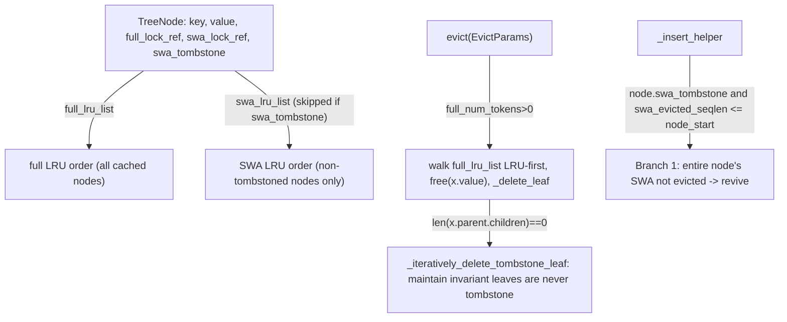

# sgl_jax.srt.mem_cache.swa_radix_cache — SWARadixCache dual-LRU tree with SWA tombstoning

## Overview

[`SWARadixCache`](../catalog/python/sgl_jax/srt/mem_cache/swa_radix_cache.md#SWARadixCache.evict)
is a single radix tree that tracks **two independent LRU lists** (`full_lru_list`/`swa_lru_list`)
over the same nodes, because full-attention layers retain every cached position while
sliding-window-attention (SWA) layers only need the recent window. A node can be **SWA-tombstoned**
(`swa_tombstone`) — its SWA-side KV freed while it remains alive in the full-attention tree — since
SWA and full-attention have independently exhaustible budgets over the same logical prefix.
[`_insert_helper`](../catalog/python/sgl_jax/srt/mem_cache/swa_radix_cache.md#SWARadixCache._insert_helper)
can even *revive* a tombstoned node's SWA data when a later insert re-establishes it as part of the
active SWA window.

## Diagram

## Design rationale (why it's built this way)

**Two separate LRU lists track the same tree, because full-attention and SWA eviction candidates
differ.** `full_lru_list` orders every cached node by full-attention recency;
`swa_lru_list` orders only non-tombstoned nodes — [`_insert_helper`](../catalog/python/sgl_jax/srt/mem_cache/swa_radix_cache.md#SWARadixCache._insert_helper)'s
comment states the update order explicitly: "Update the last access time from root to leaf, so that
swa will tombstone the node closer to root first" — i.e. SWA eviction prefers to tombstone nodes
nearer the root (older context, likely outside any sliding window) before leaf nodes representing
recent generation.

**A tombstoned node's SWA data can be *revived* rather than always requiring re-insertion from
scratch.** `_insert_helper`'s "Branch 1: entire node's SWA not per-request evicted → revive" handles
the case where `swa_evicted_seqlen <= node_start` — the incoming request's SWA eviction boundary
doesn't actually cover this node's range, so its previously-tombstoned SWA slots are still valid and
can be un-tombstoned rather than discarded and recomputed; this avoids wasted KV recomputation when
a node was tombstoned prematurely relative to what a later request actually needs evicted.

**Eviction asserts `swa_lock_ref == 0` on any node it tombstones**, per `_insert_helper`'s assertion
`assert node.swa_lock_ref == 0, "tombstone swa_lock_ref should always be 0"` — a locked node (one an
in-flight request still references) must never be silently tombstoned out from under that request;
the invariant is checked, not assumed.

**`evict` maintains the invariant that leaf nodes are never tombstoned**, via
[`_iteratively_delete_tombstone_leaf`](../catalog/python/sgl_jax/srt/mem_cache/swa_radix_cache.md#SWARadixCache._iteratively_delete_tombstone_leaf)
called after every leaf deletion — the eviction loop's comment says this explicitly: "Iteratively
delete tombstone leaves to maintain invariant that leaf nodes are not tombstone." A tombstoned leaf
would represent dead-end SWA state with no full-attention children beneath it to justify keeping
the tree node at all, so such nodes are pruned immediately rather than left to accumulate.

**`RadixKey` bundles `dp_rank` into the key itself so eviction can filter by DP rank without a
separate index.** [`RadixKey`](../catalog/python/sgl_jax/srt/mem_cache/radix_cache.md#RadixKey)'s
docstring: "Composite key... combines token IDs and an optional extra key" for "cache namespace
isolation (e.g., for different LoRA adapters)" — [`evict`](../catalog/python/sgl_jax/srt/mem_cache/swa_radix_cache.md#SWARadixCache.evict)
reads `x.key.dp_rank` directly off each candidate node to skip nodes belonging to a different DP
rank than the one being evicted for.

## Entry points

- [`SWARadixCache.cache_unfinished_req`](../catalog/python/sgl_jax/srt/mem_cache/swa_radix_cache.md#SWARadixCache.cache_unfinished_req) —
  reached mid-generation to insert newly-computed KV and re-match the request's device indices.
- [`SWARadixCache.cache_finished_req`](../catalog/python/sgl_jax/srt/mem_cache/swa_radix_cache.md#SWARadixCache.cache_finished_req) —
  reached on request completion; frees the unaligned tail and inserts the page-aligned prefix
  (unless `is_insert=False`, "the retract path").
- [`SWARadixCache.evict`](../catalog/python/sgl_jax/srt/mem_cache/swa_radix_cache.md#SWARadixCache.evict) —
  reached under memory pressure with independent full/SWA/dp_rank-scoped eviction targets.
- [`SWARadixCache.inc_lock_ref`](../catalog/python/sgl_jax/srt/mem_cache/swa_radix_cache.md#SWARadixCache.inc_lock_ref)/[`dec_lock_ref`](../catalog/python/sgl_jax/srt/mem_cache/swa_radix_cache.md#SWARadixCache.dec_lock_ref) —
  reached to protect/release a node from eviction while a request references it.

## Mechanism (step-by-step)

1. **[`evict`](../catalog/python/sgl_jax/srt/mem_cache/swa_radix_cache.md#SWARadixCache.evict)
   walks `full_lru_list` from the least-recently-used leaf**, skipping locked nodes
   (`full_lock_ref == 0` asserted) and nodes outside the requested `dp_rank`, freeing each node's KV
   indices via the allocator and tallying `full_num_evicted`/`swa_num_evicted` (the latter computed
   via `_swa_eff_len` since a node's SWA-effective length may differ from its full length).
2. **After deleting a leaf,**
   [`_iteratively_delete_tombstone_leaf`](../catalog/python/sgl_jax/srt/mem_cache/swa_radix_cache.md#SWARadixCache._iteratively_delete_tombstone_leaf)
   walks upward, deleting any newly-exposed tombstoned leaf (a parent that becomes a leaf itself
   after its last child is removed), restoring the "leaves are never tombstone" invariant.
3. **On insert,**
   [`_insert_helper`](../catalog/python/sgl_jax/srt/mem_cache/swa_radix_cache.md#SWARadixCache._insert_helper)
   walks from root toward the matching prefix, refreshing both LRU lists' recency for every node
   traversed (skipping the SWA list for already-tombstoned nodes), splitting nodes at partial
   prefix matches via
   [`_split_node`](../catalog/python/sgl_jax/srt/mem_cache/swa_radix_cache.md#SWARadixCache._split_node).
4. **When [`_insert_helper`](../catalog/python/sgl_jax/srt/mem_cache/swa_radix_cache.md#SWARadixCache._insert_helper)
   reaches a tombstoned node whose SWA data is still valid** (`swa_evicted_seqlen
   <= node_start`), it revives the node rather than treating it as absent, restoring it to the SWA
   LRU list.

## Key data structures

- **`TreeNode`** —
  [`key`](../catalog/python/sgl_jax/srt/mem_cache/swa_radix_cache.md#TreeNode.key) (a
  [`RadixKey`](../catalog/python/sgl_jax/srt/mem_cache/radix_cache.md#RadixKey)),
  [`value`](../catalog/python/sgl_jax/srt/mem_cache/swa_radix_cache.md#TreeNode.value) (KV indices),
  `full_lock_ref`/`swa_lock_ref` (independent reference counts), `swa_tombstone` (whether SWA data
  has been evicted while the node survives in the full tree).
- **[`RadixKey`](../catalog/python/sgl_jax/srt/mem_cache/radix_cache.md#RadixKey)** — `token_ids`
  plus `extra_key` (namespace isolation) and
  [`dp_rank`](../catalog/python/sgl_jax/srt/mem_cache/radix_cache.md#RadixKey.dp_rank).

## Dynamics (design intent)

Because `full_lru_list` and `swa_lru_list` are updated together on every access (root-to-leaf) but
diverge specifically at tombstoned nodes, the tree naturally tracks "this position is still needed
for full-attention correctness but has fallen out of the SWA window" as a first-class state rather
than requiring a separate data structure — eviction of SWA-only budget can proceed node-by-node
without touching full-attention-referenced data.

## Edge cases

- [`cache_finished_req`](../catalog/python/sgl_jax/srt/mem_cache/swa_radix_cache.md#SWARadixCache.cache_finished_req)'s
  `is_insert=False` branch frees `kv_indices[old_prefix_len:page_aligned_len]` directly instead of
  inserting — used for the "retract" path where a request's progress should be discarded rather than
  cached.
- `_insert_helper`'s tombstone-revival branch requires `swa_evicted_seqlen % self.page_size == 0`
  ("swa_evicted_seqlen must be page aligned") — an unaligned eviction-length argument fails an
  assertion rather than silently misaligning the revival boundary.

## Open questions

- The remaining tombstone-revival branches beyond "Branch 1" (partial overlap cases) are not fully
  detailed within this packet's cited subgraph.

## See also
- [python-sgl_jax-srt-mem_cache-radix_cache](python-sgl_jax-srt-mem_cache-radix_cache.md) —
  `RadixCache`, the non-hybrid single-LRU-list sibling of this cache.
- [python-sgl_jax-srt-mem_cache-allocator](python-sgl_jax-srt-mem_cache-allocator.md) —
  `SWATokenToKVPoolAllocator`, whose dual full/SWA `free` this cache's eviction drives.
- [python-sgl_jax-srt-mem_cache-base_prefix_cache](python-sgl_jax-srt-mem_cache-base_prefix_cache.md) —
  `BasePrefixCache`/`EvictParams`, the interface this class implements.

## Sources
- `raw/code/sglang-jax/python/sgl_jax/srt/mem_cache/swa_radix_cache.py`
- `raw/code/sglang-jax/python/sgl_jax/srt/mem_cache/radix_cache.py`
