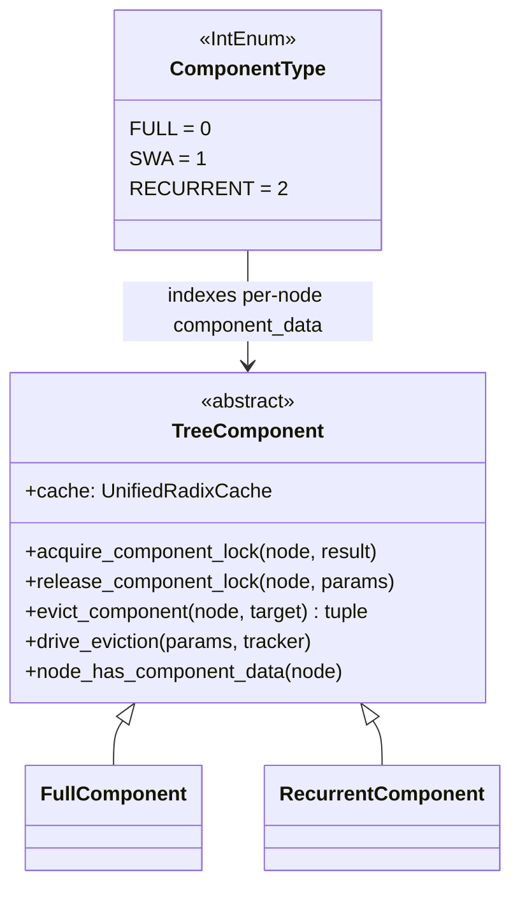

# sgl_jax.srt.mem_cache.unified_cache_components.tree_component — TreeComponent plugin abstraction (FULL/SWA/RECURRENT)

## Overview

[`TreeComponent`](../catalog/python/sgl_jax/srt/mem_cache/unified_cache_components/tree_component.md#TreeComponent.cache)
is the plugin abstraction behind `UnifiedRadixCache`: each cache dimension a hybrid model needs
(full attention, sliding-window attention, recurrent state) is a separate `TreeComponent`
implementation ([`FullComponent`](../catalog/python/sgl_jax/srt/mem_cache/unified_cache_components/full_component.md#FullComponent.acquire_component_lock),
`RecurrentComponent`) hung off the same tree node via
[`ComponentType`](../catalog/python/sgl_jax/srt/mem_cache/unified_cache_components/tree_component.md#ComponentType)
— "Integer enum so that per-node list/tuple storage can be indexed directly" (its own docstring) —
rather than being three separately-maintained cache trees. This is the extensibility layer that
lets `UnifiedRadixCache` (unlike the two-list `SWARadixCache`) support an open-ended set of
per-layer-type caching semantics.

## Diagram

## Design rationale (why it's built this way)

**`ComponentType` is an `IntEnum`, not a plain `Enum`, specifically so it can index directly into
per-node list/tuple storage.** The class docstring states this explicitly: "Integer enum so that
per-node list/tuple storage can be indexed directly" — every `UnifiedTreeNode` stores its
per-component data (locks, values, evictable sizes) in a tuple indexed by `ComponentType.FULL`/`SWA`/`RECURRENT`,
avoiding a dict lookup per component access on what is a hot path (every insert/match/evict touches
every active component).

**`BASE_COMPONENT_TYPE = ComponentType.FULL`** is a fixed constant, not configurable — full
attention is treated as the canonical/base dimension every node must have, with SWA and recurrent
state as optional additional components layered on top. `UnifiedRadixCache._match_prefix_helper`'s
`full_only` mode explicitly falls back to validating against only `self.components[BASE_COMPONENT_TYPE]`,
confirming FULL's status as the always-present baseline.

**Each component implements its own lock/evict/drive-eviction logic (`acquire_component_lock`,
`evict_component`, `drive_eviction`) rather than the tree having one central eviction routine that
special-cases each type.** [`FullComponent.drive_eviction`](../catalog/python/sgl_jax/srt/mem_cache/unified_cache_components/full_component.md#FullComponent.drive_eviction)
and [`RecurrentComponent.drive_eviction`](../catalog/python/sgl_jax/srt/mem_cache/unified_cache_components/recurrent_component.md#RecurrentComponent.drive_eviction)
both call the shared
[`_evict_device_leaf`](../catalog/python/sgl_jax/srt/mem_cache/unified_radix_cache.md#UnifiedRadixCache._evict_device_leaf)
helper but decide independently whether/how much to evict for their own component — this is what
makes the architecture genuinely pluggable: adding a new cache dimension means writing a new
`TreeComponent` subclass, not modifying a central eviction dispatcher's type-switch.

**`default_radix_cache_factory` gates `UnifiedRadixCache` behind an explicit opt-in flag
(`enable_unified_radix_tree`), not automatic selection whenever hybrid-recurrent is detected.** The
factory's condition is `ctx.is_hybrid_recurrent and ctx.server_args.enable_unified_radix_tree and
not ctx.disable_radix_cache` — a hybrid-recurrent model can still run without the unified
multi-component tree if the flag is off, implying the unified architecture is a newer, separately
toggleable path rather than the only way to support recurrent hybrid caching.

## Entry points

- [`TreeComponent.node_has_component_data`](../catalog/python/sgl_jax/srt/mem_cache/unified_cache_components/tree_component.md#TreeComponent.node_has_component_data) —
  the query used throughout eviction/insert to check whether a given node actually carries this
  component's data before acting on it.
- [`FullComponent.acquire_component_lock`](../catalog/python/sgl_jax/srt/mem_cache/unified_cache_components/full_component.md#FullComponent.acquire_component_lock) /
  [`RecurrentComponent.acquire_component_lock`](../catalog/python/sgl_jax/srt/mem_cache/unified_cache_components/recurrent_component.md#RecurrentComponent.acquire_component_lock) —
  reached from `UnifiedRadixCache.inc_lock_ref` to protect this component's data on a node from
  eviction.
- [`default_radix_cache_factory`](../catalog/python/sgl_jax/srt/mem_cache/registry.md#default_radix_cache_factory) —
  the sole construction site deciding whether `UnifiedRadixCache` (and thus this component system)
  is used at all for a given run.

## Mechanism (step-by-step)

1. **[`default_radix_cache_factory`](../catalog/python/sgl_jax/srt/mem_cache/registry.md#default_radix_cache_factory)
   selects `UnifiedRadixCache`** only when hybrid-recurrent, `enable_unified_radix_tree` is set, and
   radix caching isn't disabled; otherwise it falls through to `SWARadixCache`, `ChunkCache`, or
   `SWAChunkCache` depending on the model's hybrid/chunked-prefill configuration.
2. **Every `UnifiedTreeNode` carries a tuple of per-`ComponentType` data**, with
   [`BASE_COMPONENT_TYPE`](../catalog/python/sgl_jax/srt/mem_cache/unified_cache_components/tree_component.md#BASE_COMPONENT_TYPE)
   (FULL) always populated and SWA/RECURRENT populated only if the model actually has those layer
   types.
3. **On insert,**
   [`RecurrentComponent.commit_insert_component_data`](../catalog/python/sgl_jax/srt/mem_cache/unified_cache_components/recurrent_component.md#RecurrentComponent.commit_insert_component_data)
   and the analogous full-component logic each independently commit their own component's data for
   the newly-inserted node.
4. **On eviction,**
   [`UnifiedRadixCache.evict`](../catalog/python/sgl_jax/srt/mem_cache/unified_radix_cache.md#UnifiedRadixCache.evict)
   delegates to each active component's `drive_eviction`, which internally calls the shared
   [`_evict_device_leaf`](../catalog/python/sgl_jax/srt/mem_cache/unified_radix_cache.md#UnifiedRadixCache._evict_device_leaf)
   ("free all component device data, tombstone the [node]") per its own eviction target from
   `tracker: dict[ComponentType, int]`.

## Key data structures

- **[`ComponentType`](../catalog/python/sgl_jax/srt/mem_cache/unified_cache_components/tree_component.md#ComponentType)** —
  `FULL=0`, `SWA=1`, `RECURRENT=2`; also exposes `is_full`/`is_swa`/`is_recurrent` convenience
  properties.
- **`ComponentData`** — per-node, per-component
  [`value`](../catalog/python/sgl_jax/srt/mem_cache/unified_cache_components/tree_component.md#ComponentData.value)
  (the component's own KV/state indices, `None` if this node lacks that component's data).
- **[`TreeComponent.cache`](../catalog/python/sgl_jax/srt/mem_cache/unified_cache_components/tree_component.md#TreeComponent.cache)** —
  a back-reference to the owning `UnifiedRadixCache`, letting each component call back into shared
  tree operations.

## Dynamics (design intent)

Because eviction tracking is keyed by `dict[ComponentType, int]` (a per-component target count)
rather than a single scalar, `UnifiedRadixCache.evict` can pursue independent eviction budgets for
full-attention KV, SWA KV, and recurrent state simultaneously in one tree walk — each component
decides for itself, via `drive_eviction`, how much of *its* budget a given node satisfies.

## Edge cases

- [`UnifiedRadixCache._match_prefix_helper`](../catalog/python/sgl_jax/srt/mem_cache/unified_radix_cache.md#UnifiedRadixCache._match_prefix_helper)'s
  `full_only=True` path builds validators from only the base component, explicitly noting "Stage 1
  has no host tier: device-only matching is the only mode, so the best match and the best device
  match coincide" — a simplifying assumption that may not hold once a host cache tier is added.
- A node whose walk encounters `child.evicted and not child.backuped` ends the prefix-match walk
  immediately ("Dead node... ends the walk") — an evicted-and-not-backed-up node is treated as a
  hard stop, not skipped-over.

## Open questions

- The full mechanics of `component_data`'s "backup" tier (`backuped` flag, referenced in
  `_match_prefix_helper`) beyond what's needed to explain the device-only match-validator path are
  not detailed within this packet's cited subgraph.

## See also
- [python-sgl_jax-srt-mem_cache-unified_radix_cache](python-sgl_jax-srt-mem_cache-unified_radix_cache.md) —
  `UnifiedRadixCache`, the tree that hosts these components.
- [python-sgl_jax-srt-mem_cache-swa_radix_cache](python-sgl_jax-srt-mem_cache-swa_radix_cache.md) —
  the older, non-componentized dual-LRU-list hybrid cache this architecture generalizes beyond.

## Sources
- `raw/code/sglang-jax/python/sgl_jax/srt/mem_cache/unified_cache_components/tree_component.py`
- `raw/code/sglang-jax/python/sgl_jax/srt/mem_cache/unified_cache_components/full_component.py`
- `raw/code/sglang-jax/python/sgl_jax/srt/mem_cache/unified_cache_components/recurrent_component.py`
- `raw/code/sglang-jax/python/sgl_jax/srt/mem_cache/unified_radix_cache.py`
- `raw/code/sglang-jax/python/sgl_jax/srt/mem_cache/registry.py`
