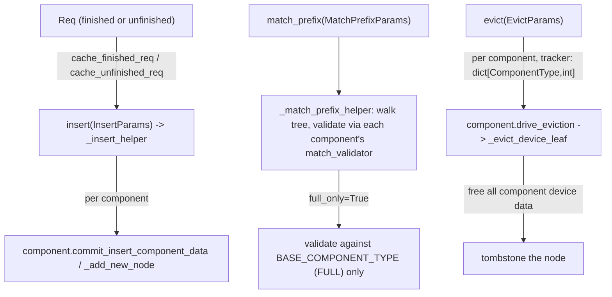

# sgl_jax.srt.mem_cache.unified_radix_cache — UnifiedRadixCache multi-component tree operations

## Overview

[`UnifiedRadixCache`](../catalog/python/sgl_jax/srt/mem_cache/unified_radix_cache.md#UnifiedRadixCache.cache_finished_req)
is the radix tree implementation that hosts the pluggable
[`TreeComponent`](python-sgl_jax-srt-mem_cache-unified_cache_components-tree_component.md) system —
each [`UnifiedTreeNode`](../catalog/python/sgl_jax/srt/mem_cache/unified_radix_cache.md#UnifiedTreeNode)
carries per-component data (`component_data`) rather than a single flat KV-index array, and every
tree operation (insert, match, evict) loops over
[`_components_tuple`](../catalog/python/sgl_jax/srt/mem_cache/unified_radix_cache.md#UnifiedRadixCache.cache_unfinished_req)
to apply each active component's own logic to the shared tree structure.

## Diagram

## Design rationale (why it's built this way)

**`_insert_helper` walks the tree once and lets every active component commit its own data at each
node, rather than running one insert pass per component.**
[`UnifiedRadixCache._insert_helper`](../catalog/python/sgl_jax/srt/mem_cache/unified_radix_cache.md#UnifiedRadixCache._insert_helper)
iterates
[`_components_tuple`](../catalog/python/sgl_jax/srt/mem_cache/unified_radix_cache.md#UnifiedRadixCache.cache_unfinished_req)
within a single walk from root toward the match point — since all components share the same tree
topology (they differ only in *what data* hangs off each node, not in *where* nodes split), a
single shared traversal amortizes the tree-walk cost across every component instead of re-walking
per component.

**`_evict_device_leaf`'s docstring frames eviction as "free all component device data, tombstone
the [node]"** — eviction at the device layer is defined per-node across *all* components at once,
not per-component independently freeing the same node at different times. This keeps a node's
lifecycle atomic: either it's evicted (all its device-resident component data freed, node
tombstoned) or it isn't, avoiding a state where some components' data survives while others'
doesn't for the same tree position.

**`match_prefix`'s `full_only` mode exists because a request's own re-match must succeed against
just the base FULL component, not be blocked by auxiliary components it may not need re-validated.**
This mirrors the rationale captured on
[`MatchPrefixParams.full_only`](python-sgl_jax-srt-mem_cache-base_prefix_cache.md) in the base
interface — `_match_prefix_helper` builds its validator tuple from only
`self.components[BASE_COMPONENT_TYPE]` in that mode rather than every component, since a component
like RECURRENT may have per-request state living outside the tree during active generation that
shouldn't gate the request's own prefix continuation.

## Entry points

- [`UnifiedRadixCache.cache_unfinished_req`](../catalog/python/sgl_jax/srt/mem_cache/unified_radix_cache.md#UnifiedRadixCache.cache_unfinished_req) —
  "Cache incomplete requests"; reached mid-generation.
- [`UnifiedRadixCache.cache_finished_req`](../catalog/python/sgl_jax/srt/mem_cache/unified_radix_cache.md#UnifiedRadixCache.cache_finished_req) —
  "Cache completed requests. `is_insert=False` skips the radix [insert]"; reached on request
  completion or retraction.
- [`UnifiedRadixCache.match_prefix`](../catalog/python/sgl_jax/srt/mem_cache/unified_radix_cache.md#UnifiedRadixCache.match_prefix) —
  reached to find the longest multi-component-valid cached prefix for a new request.
- [`UnifiedRadixCache.insert`](../catalog/python/sgl_jax/srt/mem_cache/unified_radix_cache.md#UnifiedRadixCache.insert) —
  the shared insertion primitive both cache-request methods call, dispatching to
  [`_insert_helper`](../catalog/python/sgl_jax/srt/mem_cache/unified_radix_cache.md#UnifiedRadixCache._insert_helper).

## Mechanism (step-by-step)

1. **[`cache_unfinished_req`](../catalog/python/sgl_jax/srt/mem_cache/unified_radix_cache.md#UnifiedRadixCache.cache_unfinished_req)
   reads the request's fill IDs and committed KV indices**, builds an
   [`InsertParams`](python-sgl_jax-srt-mem_cache-base_prefix_cache.md), and calls
   [`insert`](../catalog/python/sgl_jax/srt/mem_cache/unified_radix_cache.md#UnifiedRadixCache.insert),
   then [`match_prefix`](../catalog/python/sgl_jax/srt/mem_cache/unified_radix_cache.md#UnifiedRadixCache.match_prefix)
   to re-derive the request's device indices post-insert.
2. **[`_insert_helper`](../catalog/python/sgl_jax/srt/mem_cache/unified_radix_cache.md#UnifiedRadixCache._insert_helper)
   walks from the given node toward the key's match point**, splitting nodes via
   [`_split_node`](../catalog/python/sgl_jax/srt/mem_cache/unified_radix_cache.md#UnifiedRadixCache._split_node)
   at partial matches and creating new nodes via
   [`_add_new_node`](../catalog/python/sgl_jax/srt/mem_cache/unified_radix_cache.md#UnifiedRadixCache._add_new_node)
   for the unmatched remainder, with every active component's data attached at each step.
3. **[`match_prefix`](../catalog/python/sgl_jax/srt/mem_cache/unified_radix_cache.md#UnifiedRadixCache.match_prefix)
   delegates to [`_match_prefix_helper`](../catalog/python/sgl_jax/srt/mem_cache/unified_radix_cache.md#UnifiedRadixCache._match_prefix_helper)**,
   which walks child-by-child, validating each candidate node against every component's match
   validator (or only the base component's, if `full_only`) before accepting it as the new best
   match.
4. **On eviction, each component's `drive_eviction` calls**
   [`_evict_device_leaf`](../catalog/python/sgl_jax/srt/mem_cache/unified_radix_cache.md#UnifiedRadixCache._evict_device_leaf),
   which checks
   [`node_has_component_data`](python-sgl_jax-srt-mem_cache-unified_cache_components-tree_component.md)
   per component before freeing that component's device data, then tombstones the whole node.

## Key data structures

- **[`UnifiedTreeNode`](../catalog/python/sgl_jax/srt/mem_cache/unified_radix_cache.md#UnifiedTreeNode)** —
  [`key`](../catalog/python/sgl_jax/srt/mem_cache/unified_radix_cache.md#UnifiedTreeNode.key) (a
  [`RadixKey`](../catalog/python/sgl_jax/srt/mem_cache/radix_cache.md#RadixKey)), `children`,
  `component_data` (per-`ComponentType` tuple), `evicted`/`backuped` flags.
- **`_components_tuple`** — the ordered set of active
  [`TreeComponent`](python-sgl_jax-srt-mem_cache-unified_cache_components-tree_component.md)
  instances (FULL always present; SWA/RECURRENT present only for hybrid models needing them),
  iterated by every tree operation.

## Dynamics (design intent)

Because the tree walk (finding the split/insertion point) is shared across all components while
per-component data attachment happens per step within that single walk, adding a new cache
dimension to a hybrid model (e.g. a future fourth component type) requires only a new
`TreeComponent` subclass — the tree-walking logic in `_insert_helper`/`_match_prefix_helper` does
not need modification, since it already iterates `_components_tuple` generically.

## Edge cases

- [`UnifiedRadixCache.match_prefix`](../catalog/python/sgl_jax/srt/mem_cache/unified_radix_cache.md#UnifiedRadixCache.match_prefix)
  reads `dp_rank`/`page_size` off the params/self to build the
  [`RadixKey`](../catalog/python/sgl_jax/srt/mem_cache/radix_cache.md#RadixKey) used for matching —
  the same composite-key convention (`token_ids`, `extra_key`, `dp_rank`) as the simpler `RadixCache`
  applies here too.
- [`UnifiedRadixCache._print_helper`](../catalog/python/sgl_jax/srt/mem_cache/unified_radix_cache.md#UnifiedRadixCache._print_helper)
  is a debug-printing tree walker that reads `component_data`/`token_ids`/`value` per node — its
  presence indicates the multi-component tree structure is complex enough to warrant a dedicated
  debug-dump utility, unlike the simpler single-list `RadixCache`.

## Open questions

- The exact `EvictLayer` enum values beyond `DEVICE` (referenced as the default `target` for
  `evict_component`) and what a non-device eviction target does are not detailed within this
  packet's cited subgraph.

## See also
- [python-sgl_jax-srt-mem_cache-unified_cache_components-tree_component](python-sgl_jax-srt-mem_cache-unified_cache_components-tree_component.md) —
  the `TreeComponent` plugin abstraction this tree hosts.
- [python-sgl_jax-srt-mem_cache-swa_radix_cache](python-sgl_jax-srt-mem_cache-swa_radix_cache.md) —
  the earlier, non-componentized dual-LRU-list hybrid cache.
- [python-sgl_jax-srt-mem_cache-base_prefix_cache](python-sgl_jax-srt-mem_cache-base_prefix_cache.md) —
  `BasePrefixCache`/`InsertParams`/`MatchPrefixParams`/`EvictParams`, the interface this class
  implements.

## Sources
- `raw/code/sglang-jax/python/sgl_jax/srt/mem_cache/unified_radix_cache.py`
- `raw/code/sglang-jax/python/sgl_jax/srt/mem_cache/unified_cache_components/full_component.py`
- `raw/code/sglang-jax/python/sgl_jax/srt/mem_cache/unified_cache_components/recurrent_component.py`
