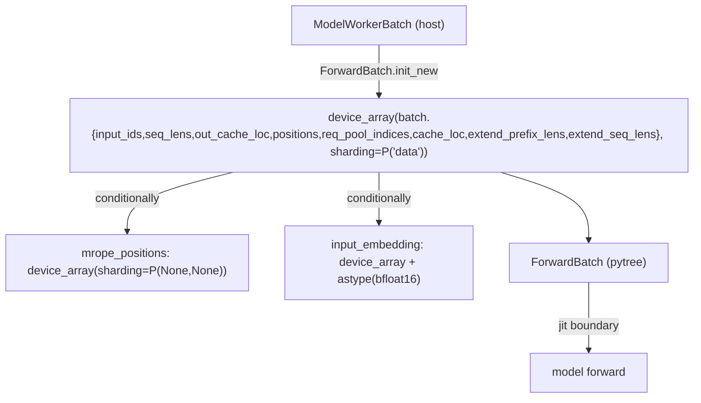

# sgl_jax.srt.model_executor.forward_batch_info — ForwardMode enum, ForwardBatch pytree device-array staging

## Overview

[`ForwardMode`](../catalog/python/sgl_jax/srt/model_executor/forward_batch_info.md#ForwardMode) is
the `IntEnum` distinguishing every forward-pass shape the model executor handles (`EXTEND`,
`DECODE`, `MIXED`, `IDLE`, `TARGET_VERIFY`, `DRAFT_EXTEND`, `DUMMY_FIRST`), and
[`ForwardBatch.init_new`](../catalog/python/sgl_jax/srt/model_executor/forward_batch_info.md#ForwardBatch.init_new)
is the sole conversion point from the host-side
`ModelWorkerBatch`
into device arrays with explicit sharding — every array-valued batch field is placed via
`device_array(..., sharding=NamedSharding(mesh, ...))` in one batched call, rather than field by
field. `ForwardBatch` is itself a registered pytree so it can be passed directly into the `jit`-ted
model forward function.

## Diagram

## Design rationale (why it's built this way)

**`ForwardMode.is_extend()` covers four distinct enum values (`EXTEND`, `MIXED`, `DRAFT_EXTEND`,
`TARGET_VERIFY`), not just the literal `EXTEND` case.**
[`ForwardMode.is_extend`](../catalog/python/sgl_jax/srt/model_executor/forward_batch_info.md#ForwardMode.is_extend)
returns true for all four because they share the same structural property that matters to callers
(processing multiple new positions per sequence, as opposed to `DECODE`'s one-per-sequence) — code
paths like the logits processor's pruning logic branch on this semantic grouping rather than
re-enumerating every mode that happens to behave like "extend" at each call site.

**All core batch arrays are placed onto devices in a single batched `device_array` call with one
shared sharding, rather than one call per array.**
[`ForwardBatch.init_new`](../catalog/python/sgl_jax/srt/model_executor/forward_batch_info.md#ForwardBatch.init_new)
groups `input_ids`, `seq_lens`, `out_cache_loc`, `positions`, `req_pool_indices`, `cache_loc`,
`extend_prefix_lens`, `extend_seq_lens` into one `device_array((...), sharding=...)` call, all
sharded along the `"data"` axis — batching the host-to-device transfer call reduces per-call
dispatch overhead versus eight separate calls, and confirms every one of these arrays shares the
same batch-dimension sharding.

**`mrope_positions` and `input_embedding` use a *different* sharding (`PartitionSpec(None, None)`)
than the batch-dimension-sharded core arrays, and are staged conditionally.**
[`init_new`](../catalog/python/sgl_jax/srt/model_executor/forward_batch_info.md#ForwardBatch.init_new)
only calls `device_array` for `mrope_positions`/`input_embedding` `if batch.mrope_positions is not
None`/`if batch.input_embedding is not None` — since these fields are unreplicated (`None, None`
partition spec, i.e. fully replicated or 2D-unsharded) and only present for multimodal-position
(`mrope`) or embedding-input requests, staging them unconditionally would waste a device-array call
and impose the wrong sharding assumption for the common (text-token, non-mrope) case.

**`input_embedding` is explicitly cast to `bfloat16` immediately after staging**, not left in
whatever dtype the host array arrived in — this ensures the embedding matmul downstream always
operates in a fixed, TPU-favorable precision regardless of what dtype the caller supplied it in.

## Entry points

- [`ForwardBatch.init_new`](../catalog/python/sgl_jax/srt/model_executor/forward_batch_info.md#ForwardBatch.init_new) —
  the sole construction path from a host-side `ModelWorkerBatch`; called from
  [`ModelWorker.forward_batch_generation`](../catalog/python/sgl_jax/srt/managers/tp_worker.md#ModelWorker.forward_batch_generation),
  [`EagleDraftWorker.draft_forward`](../catalog/python/sgl_jax/srt/speculative/eagle_draft_worker.md#EagleDraftWorker.draft_forward),
  [`MultiLayerDraftWorker.draft_extend_for_prefill`](../catalog/python/sgl_jax/srt/speculative/multi_layer_draft_worker.md#MultiLayerDraftWorker.draft_extend_for_prefill),
  and [`spec_prefill`](../catalog/python/sgl_jax/srt/speculative/draft_extend_fused.md#spec_prefill).
- [`CompilationManager._make_dummy_batch`](../catalog/python/sgl_jax/srt/model_executor/compilation_manager.md#CompilationManager._make_dummy_batch) —
  reached to construct synthetic `ModelWorkerBatch`es (per `ForwardMode`) for AOT/warmup
  compilation of every mode the executor will encounter at runtime.

## Mechanism (step-by-step)

1. **[`ForwardBatch.init_new`](../catalog/python/sgl_jax/srt/model_executor/forward_batch_info.md#ForwardBatch.init_new)
   stages the eight core batch-dimension arrays** in one `device_array` call sharded along
   `"data"`.
2. **`mrope_positions` and `input_embedding` are conditionally staged inside**
   [`ForwardBatch.init_new`](../catalog/python/sgl_jax/srt/model_executor/forward_batch_info.md#ForwardBatch.init_new)
   **with a different (unsharded/replicated) `PartitionSpec`**, only when the batch actually
   carries them.
3. **`input_embedding`, if present, is cast to `bfloat16`** immediately after staging inside the
   same [`init_new`](../catalog/python/sgl_jax/srt/model_executor/forward_batch_info.md#ForwardBatch.init_new)
   call.
4. **The resulting arrays plus `attn_backend`/`spec_info`/etc. are assembled into a `ForwardBatch`
   pytree**, which crosses into the `jit`-compiled model forward as a single argument via
   [`tree_flatten`](../catalog/python/sgl_jax/srt/model_executor/forward_batch_info.md#ForwardBatch.tree_flatten)/[`tree_unflatten`](../catalog/python/sgl_jax/srt/model_executor/forward_batch_info.md#ForwardBatch.tree_unflatten).

## Key data structures

- **[`ForwardMode`](../catalog/python/sgl_jax/srt/model_executor/forward_batch_info.md#ForwardMode)** —
  `EXTEND`/`DECODE`/`MIXED`/`IDLE`/`TARGET_VERIFY`/`DRAFT_EXTEND`/`DUMMY_FIRST`, each with a
  docstring comment explaining its role (e.g. `IDLE`: "some workers will be IDLE if no sequence are
  allocated" for data-parallel attention).
- **`ForwardBatch`** — pytree children include `input_ids`, `req_pool_indices`, `seq_lens`,
  `out_cache_loc`, `positions`,
  [`attn_backend`](../catalog/python/sgl_jax/srt/model_executor/forward_batch_info.md#ForwardBatch.init_new),
  `cache_loc`, `extend_prefix_lens`/`extend_seq_lens`, LoRA fields, `spec_info`,
  `expert_location_metadata`, `attention_mask`, `input_embedding`, `mrope_positions`, and
  deepstack/recurrent fields; aux-data includes `forward_mode`, `batch_size`, `spec_algorithm`,
  `capture_hidden_mode`, `deterministic`.

## Dynamics (design intent)

Because `input_embedding`/`mrope_positions` are staged conditionally rather than always allocated,
a text-only, non-mrope batch (the common case) pays no device-array or sharding-setup cost for
fields it doesn't use — the per-step device-staging cost scales with which optional features a
given batch actually exercises.

## Edge cases

- [`ForwardBatch.tree_unflatten`](../catalog/python/sgl_jax/srt/model_executor/forward_batch_info.md#ForwardBatch.tree_unflatten)
  reconstructs `deterministic` via `aux_data.get("deterministic", True)` — a default-`True` fallback
  for pytree instances flattened before this field existed, rather than a hard `KeyError`.
- `ForwardMode.is_prefill()` is defined as exactly `is_extend()` — the two names are synonyms in
  this codebase, not independently meaningful predicates.

## Open questions

- The full field-by-field mapping between `ForwardBatch.tree_flatten`'s children tuple and
  `tree_unflatten`'s reconstruction beyond what's shown in this packet (e.g. `attention_mask`'s
  exact semantics) is not further detailed within this packet's cited subgraph.

## See also
- [python-sgl_jax-srt-managers-scheduler](python-sgl_jax-srt-managers-scheduler.md) — `Scheduler`,
  whose `run_batch` builds the `ModelWorkerBatch` this module converts to device arrays.
- [python-sgl_jax-srt-layers-logits_processor](python-sgl_jax-srt-layers-logits_processor.md) —
  consumes `ForwardMode` to decide hidden-state pruning behavior.
- [python-sgl_jax-srt-model_executor-model_runner](python-sgl_jax-srt-model_executor-model_runner.md) —
  `ModelRunner`, whose mesh this module's sharding specs are built against.

## Sources
- `raw/code/sglang-jax/python/sgl_jax/srt/model_executor/forward_batch_info.py`
- `raw/code/sglang-jax/python/sgl_jax/srt/model_executor/compilation_manager.py`
