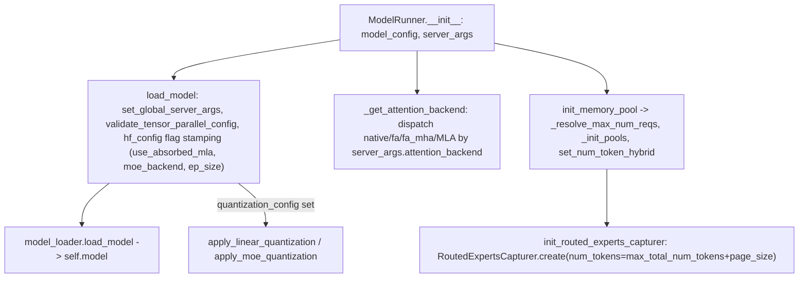

# sgl_jax.srt.model_executor.model_runner — ModelRunner startup sequence, attention-backend selection, routed-experts capture

## Overview

[`ModelRunner`](../catalog/python/sgl_jax/srt/model_executor/model_runner.md#ModelRunner.model_config)
owns the loaded model, KV-cache pools, attention backend, and every per-run auxiliary system
(LoRA manager, quantization, expert-location metadata, routed-experts capture). Its
[`load_model`](../catalog/python/sgl_jax/srt/model_executor/model_runner.md#ModelRunner.load_model)/[`_get_attention_backend`](../catalog/python/sgl_jax/srt/model_executor/model_runner.md#ModelRunner._get_attention_backend)/[`init_memory_pool`](../catalog/python/sgl_jax/srt/model_executor/model_runner_kv_cache_mixin.md#ModelRunnerKVCacheMixin.init_memory_pool)
sequence is the startup path that turns a
[`ModelConfig`](../catalog/python/sgl_jax/srt/configs/model_config.md#ModelConfig)+[`ServerArgs`](../catalog/python/sgl_jax/srt/server_args.md#ServerArgs)
pair into a runnable device-resident model, and its
[`init_routed_experts_capturer`](../catalog/python/sgl_jax/srt/model_executor/model_runner.md#ModelRunner.init_routed_experts_capturer)
wires up an optional MoE-routing observability/debug system sized directly from the runner's own
computed `max_total_num_tokens`.

## Diagram

## Design rationale (why it's built this way)

**`load_model` stamps several MoE/attention-precision flags directly onto `hf_config` before
loading, rather than passing them as separate arguments through the model constructor.**
[`ModelRunner.load_model`](../catalog/python/sgl_jax/srt/model_executor/model_runner.md#ModelRunner.load_model)
sets `self.model_config.hf_config.ep_size`, `.moe_backend`, `.use_jax_allreduce_metadata`, and
`.use_absorbed_mla` (documented inline: "Pick MLA forward path at server start. Only `fa` selects
absorbed... Read by DeepseekV3DecoderLayer... harmless on non-MLA models that ignore the
attribute") directly on the HF config object — since the model construction code reads
`hf_config` fields generically across many architectures, mutating it once here lets every
downstream model class (MLA and non-MLA alike) pick up the setting without a separate constructor
parameter threaded through every architecture's `__init__`.

**Block-wise quantization is validated against the backend (`jax.default_backend() != "tpu"`)
*before* attempting to apply it, raising a clear error rather than letting a CPU/GPU run silently
attempt an unsupported kernel path.** This mirrors the same early-validation philosophy seen in
`ModelConfig`'s own resolution logic — catching an incompatible config at the point it's set,
rather than at first kernel-dispatch failure deep in the forward pass.

**`init_routed_experts_capturer` sizes its capture buffer from `max_total_num_tokens + page_size`,
not from a fixed constant.** The `+page_size` term reflects that the capturer needs headroom for
one extra page beyond the nominal budget — the capture buffer's dimension is derived from the same
memory-pool sizing computed earlier in the same `ModelRunner` instance
([`max_total_num_tokens`](../catalog/python/sgl_jax/srt/model_executor/model_runner_kv_cache_mixin.md#ModelRunnerKVCacheMixin._resolve_max_num_reqs)),
keeping the two systems' capacity assumptions synchronized by construction rather than by separate
configuration.

**Attention backend selection happens through one method,
[`_get_attention_backend`](../catalog/python/sgl_jax/srt/model_executor/model_runner.md#ModelRunner._get_attention_backend),
that reads `server_args.attention_backend` as a string and dispatches to a concrete backend class**
(`NativeAttention`, `MLAAttentionBackend`, `FlashAttention`) with a CPU fallback (warns and forces
`"native"` if `device == "cpu"` and backend is `fa`/`fa_mha`) — centralizing this choice in one
method means adding a new attention backend requires touching exactly one dispatch point, not every
call site that might need an attention implementation.

## Entry points

- [`ModelRunner.load_model`](../catalog/python/sgl_jax/srt/model_executor/model_runner.md#ModelRunner.load_model) —
  reached once at server startup; the sole path that populates
  [`model`](../catalog/python/sgl_jax/srt/model_executor/model_runner.md#ModelRunner.model).
- [`ModelRunner._get_attention_backend`](../catalog/python/sgl_jax/srt/model_executor/model_runner.md#ModelRunner._get_attention_backend) —
  reached during runner construction to select the concrete attention implementation for the
  configured model/hardware combination.
- [`ModelRunnerKVCacheMixin.init_memory_pool`](../catalog/python/sgl_jax/srt/model_executor/model_runner_kv_cache_mixin.md#ModelRunnerKVCacheMixin.init_memory_pool) —
  "Initialize memory pool for KV cache (+ recurrent state if hybrid)"; reached after model load to
  size and construct the KV pools.
- [`ModelRunner.init_routed_experts_capturer`](../catalog/python/sgl_jax/srt/model_executor/model_runner.md#ModelRunner.init_routed_experts_capturer) —
  reached after memory-pool sizing to wire up the optional MoE routing observability system.

## Mechanism (step-by-step)

1. **`ModelRunner.__init__` stores**
   [`model_config`](../catalog/python/sgl_jax/srt/model_executor/model_runner.md#ModelRunner.model_config)
   and
   [`server_args`](../catalog/python/sgl_jax/srt/model_executor/model_runner.md#ModelRunner.server_args)
   directly as attributes.
2. **[`load_model`](../catalog/python/sgl_jax/srt/model_executor/model_runner.md#ModelRunner.load_model)
   validates tensor-parallel config, stamps MoE/MLA/allreduce flags onto `hf_config`**, then calls
   [`model_loader.load_model`](../catalog/python/sgl_jax/srt/model_loader/loader.md#JAXModelLoader.load_model)
   to populate
   [`model`](../catalog/python/sgl_jax/srt/model_executor/model_runner.md#ModelRunner.model),
   applying quantization afterward if `quantization_config` is set.
3. **[`init_memory_pool`](../catalog/python/sgl_jax/srt/model_executor/model_runner_kv_cache_mixin.md#ModelRunnerKVCacheMixin.init_memory_pool)
   resolves the max request count**
   ([`_resolve_max_num_reqs`](../catalog/python/sgl_jax/srt/model_executor/model_runner_kv_cache_mixin.md#ModelRunnerKVCacheMixin._resolve_max_num_reqs))
   and calls
   [`_init_pools`](../catalog/python/sgl_jax/srt/model_executor/model_runner_kv_cache_mixin.md#ModelRunnerKVCacheMixin._init_pools)
   to construct the `ReqToTokenPool`/KV pool/allocator, then
   [`set_num_token_hybrid`](../catalog/python/sgl_jax/srt/model_executor/model_runner.md#ModelRunner.set_num_token_hybrid)
   for hybrid models.
4. **[`init_routed_experts_capturer`](../catalog/python/sgl_jax/srt/model_executor/model_runner.md#ModelRunner.init_routed_experts_capturer)
   builds a `RoutedExpertsCapturer`** sized from `max_total_num_tokens + page_size`, wiring in
   server-args-controlled debug/distribution-recording toggles, and registers it globally via
   `set_global_experts_capturer`.

## Key data structures

- **[`ModelRunner`](../catalog/python/sgl_jax/srt/model_executor/model_runner.md#ModelRunner.model_config)** —
  [`model_config`](../catalog/python/sgl_jax/srt/model_executor/model_runner.md#ModelRunner.model_config)/[`server_args`](../catalog/python/sgl_jax/srt/model_executor/model_runner.md#ModelRunner.server_args)/[`model`](../catalog/python/sgl_jax/srt/model_executor/model_runner.md#ModelRunner.model)/[`model_loader`](../catalog/python/sgl_jax/srt/model_executor/model_runner.md#ModelRunner.model_loader)/[`sampler`](../catalog/python/sgl_jax/srt/model_executor/model_runner.md#ModelRunner.sampler)/[`lora_manager`](../catalog/python/sgl_jax/srt/model_executor/model_runner.md#ModelRunner.lora_manager).

## Dynamics (design intent)

Because MoE/MLA/allreduce flags are stamped onto the shared `hf_config` object once during
`load_model` rather than threaded per-architecture, adding support for a new architecture that
needs to read one of these flags requires only reading `hf_config.<attr>` inside that
architecture's own module — no changes to `ModelRunner.load_model` itself.

## Edge cases

- [`ModelRunner._get_attention_backend`](../catalog/python/sgl_jax/srt/model_executor/model_runner.md#ModelRunner._get_attention_backend)
  silently downgrades `fa`/`fa_mha` to `native` on CPU with a warning log, rather than raising —
  a CPU-only development/test run gets a (slower) working backend instead of failing outright.
- [`load_model`](../catalog/python/sgl_jax/srt/model_executor/model_runner.md#ModelRunner.load_model)'s
  draft-worker special case overwrites `num_hidden_layers` from `num_nextn_predict_layers` "to
  avoid create redundant layer kv cache" when draft and target share safetensor files — a narrow
  MTP-specific accommodation (also noted on the `ModelConfig` page).

## Open questions

- The full set of fields `RoutedExpertsCapturer.create` reads beyond those shown in this packet
  (e.g. the exact balance-debug output format) is not detailed within this packet's cited subgraph.

## See also
- [python-sgl_jax-srt-configs-model_config](python-sgl_jax-srt-configs-model_config.md) —
  `ModelConfig`, the config object `ModelRunner` wraps and mutates during load.
- [python-sgl_jax-srt-mem_cache-memory_pool](python-sgl_jax-srt-mem_cache-memory_pool.md) — the KV
  pools `init_memory_pool`/`_init_pools` construct.
- [python-sgl_jax-srt-model_executor-forward_batch_info](python-sgl_jax-srt-model_executor-forward_batch_info.md) —
  `ForwardBatch.init_new`, which consumes this runner's `mesh` for device-array sharding.

## Sources
- `raw/code/sglang-jax/python/sgl_jax/srt/model_executor/model_runner.py`
- `raw/code/sglang-jax/python/sgl_jax/srt/model_executor/model_runner_kv_cache_mixin.py`
