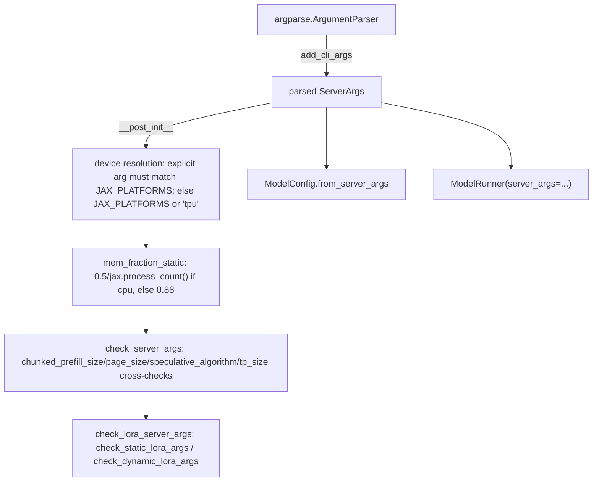

# sgl_jax.srt.server_args — ServerArgs CLI dataclass, device/mem_fraction_static resolution, LoRA validation

## Overview

[`ServerArgs`](../catalog/python/sgl_jax/srt/server_args.md#ServerArgs) is the top-level CLI
dataclass carrying every perf-relevant knob — `chunked_prefill_size`, `page_size`,
`schedule_policy`, `max_running_requests`, `mem_fraction_static`, `speculative_algorithm`,
`disaggregation_mode`, `tp_size`/`dp_size`/`ep_size`. Its
[`__post_init__`](../catalog/python/sgl_jax/srt/server_args.md#ServerArgs.__post_init__) resolves
several fields whose defaults depend on runtime context (the `JAX_PLATFORMS` environment variable,
`jax.process_count()`) rather than being static dataclass defaults, and
[`check_server_args`](../catalog/python/sgl_jax/srt/server_args.md#ServerArgs.check_server_args)/[`check_lora_server_args`](../catalog/python/sgl_jax/srt/server_args.md#ServerArgs.check_lora_server_args)
perform cross-field validation after construction.

## Diagram

## Design rationale (why it's built this way)

**`device` resolution asserts consistency with `JAX_PLATFORMS` rather than silently overriding
either source.** `__post_init__` reads `platform_env = os.environ.get("JAX_PLATFORMS", self.device)`
and, if `self.device` was explicitly set, asserts `self.device == platform_env` — if a user sets
both `--device` and the `JAX_PLATFORMS` env var to conflicting values, the mismatch is caught
immediately with a clear assertion rather than one silently winning over the other and producing
confusing downstream behavior (e.g. a CPU-configured `mem_fraction_static` on a TPU run).

**`mem_fraction_static`'s CPU default is scaled by `jax.process_count()`, but the TPU default is
not.** `__post_init__` sets `self.mem_fraction_static = 0.5 / jax.process_count()` for `device ==
"cpu"`, versus a flat `0.88` otherwise — a CPU "device" here typically means a single host running
possibly multiple JAX processes sharing the same physical memory (e.g. for testing), so the static
memory fraction must be divided among processes to avoid OOM; a real TPU deployment has per-chip
HBM regardless of host process count, so no such division applies.

**Device defaults to `"tpu"` only as the last resort**, after checking both the explicit CLI arg
and `JAX_PLATFORMS` — `platform_env` falls through `self.device` (explicit) → `JAX_PLATFORMS` env →
`"tpu"` literal. This ordering means an environment already configured via `JAX_PLATFORMS` (e.g. by
an orchestration script) is respected without requiring every launch command to redundantly pass
`--device` explicitly.

## Entry points

- [`ServerArgs.add_cli_args`](../catalog/python/sgl_jax/srt/server_args.md#ServerArgs.add_cli_args) —
  registers every CLI flag on an `argparse.ArgumentParser`; the parse-time entry point.
- [`ServerArgs.__post_init__`](../catalog/python/sgl_jax/srt/server_args.md#ServerArgs.__post_init__) —
  runs automatically after dataclass construction (parsed CLI args or programmatic construction) to
  resolve context-dependent defaults.
- [`ServerArgs.check_server_args`](../catalog/python/sgl_jax/srt/server_args.md#ServerArgs.check_server_args) —
  reached after construction to validate cross-field constraints
  (`chunked_prefill_size`/`page_size`/`speculative_algorithm`/`tp_size`).
- [`ServerArgs.check_lora_server_args`](../catalog/python/sgl_jax/srt/server_args.md#ServerArgs.check_lora_server_args) —
  "Validate and normalize LoRA-related server arguments"; reached when LoRA is configured.

## Mechanism (step-by-step)

1. **[`add_cli_args`](../catalog/python/sgl_jax/srt/server_args.md#ServerArgs.add_cli_args)
   registers every flag** (model/tokenizer, HTTP server, quantization/dtype, memory/scheduling,
   runtime device/parallelism), reading defaults directly off the `ServerArgs` dataclass field
   defaults so the CLI help text and the programmatic defaults never drift apart.
2. **After parsing,
   [`ServerArgs.__post_init__`](../catalog/python/sgl_jax/srt/server_args.md#ServerArgs.__post_init__)
   fills in derived defaults**: `tokenizer_path` from `model_path` if unset, `device` from the
   CLI/env-var/`"tpu"`-fallback chain, `served_model_name` from `model_path`, `random_seed` to `42`
   if unset, and `mem_fraction_static` from the device-dependent rule.
3. **[`check_server_args`](../catalog/python/sgl_jax/srt/server_args.md#ServerArgs.check_server_args)
   calls [`check_lora_server_args`](../catalog/python/sgl_jax/srt/server_args.md#ServerArgs.check_lora_server_args)**
   among its cross-field validations, which in turn dispatches to
   [`check_static_lora_args`](../catalog/python/sgl_jax/srt/server_args.md#ServerArgs.check_static_lora_args)/[`check_dynamic_lora_args`](../catalog/python/sgl_jax/srt/server_args.md#ServerArgs.check_dynamic_lora_args)
   depending on `enable_static_lora`.
4. **Downstream,**
   [`ModelConfig.from_server_args`](../catalog/python/sgl_jax/srt/configs/model_config.md#ModelConfig.from_server_args)
   and [`ModelRunner.__init__`](../catalog/python/sgl_jax/srt/model_executor/model_runner.md#ModelRunner.__init__)
   consume the fully-resolved `ServerArgs` instance directly.

## Key data structures

- **[`ServerArgs`](../catalog/python/sgl_jax/srt/server_args.md#ServerArgs)** — perf-relevant
  fields include `mem_fraction_static`, `max_running_requests`, `max_prefill_tokens`,
  [`chunked_prefill_size`](../catalog/python/sgl_jax/srt/server_args.md#ServerArgs.chunked_prefill_size),
  `schedule_policy`, [`page_size`](../catalog/python/sgl_jax/srt/server_args.md#ServerArgs.page_size),
  `swa_full_tokens_ratio`, `recurrent_state_memory_ratio`, `disable_hybrid_swa_memory`,
  [`tp_size`](../catalog/python/sgl_jax/srt/server_args.md#ServerArgs.tp_size),
  [`dp_size`](../catalog/python/sgl_jax/srt/server_args.md#ServerArgs.dp_size),
  [`ep_size`](../catalog/python/sgl_jax/srt/server_args.md#ServerArgs.ep_size),
  [`speculative_algorithm`](../catalog/python/sgl_jax/srt/server_args.md#ServerArgs.speculative_algorithm),
  [`disaggregation_mode`](../catalog/python/sgl_jax/srt/server_args.md#ServerArgs.disaggregation_mode).
- **[`LoRARef`](../catalog/python/sgl_jax/srt/lora/lora_registry.md#LoRARef)** — "Reference record
  for a LoRA model," constructed/validated by the LoRA-args checking path.

## Dynamics (design intent)

Because `__post_init__` runs automatically on every `ServerArgs` construction (not just the
CLI-parsed path), programmatically constructed `ServerArgs` instances (e.g. in tests or embedded
usage) get the same device/mem-fraction resolution as CLI-launched servers — there's no separate
"finalize" step callers must remember to invoke.

## Edge cases

- The `device`/`JAX_PLATFORMS` consistency assertion is only checked `if self.device` (i.e. only
  when the CLI explicitly set a device) — an unset `--device` with a set `JAX_PLATFORMS` env var
  takes the env var's value without any consistency check (there being nothing to check against).
- [`check_dynamic_lora_args`](../catalog/python/sgl_jax/srt/server_args.md#ServerArgs.check_dynamic_lora_args)
  is a `@staticmethod`-like free function taking no `self` in its cited signature, distinct from
  [`check_lora_server_args`](../catalog/python/sgl_jax/srt/server_args.md#ServerArgs.check_lora_server_args)
  which is an instance method — the dynamic-LoRA check path validates global/class-level LoRA
  registry state rather than this specific `ServerArgs` instance's fields.

## Open questions

- The complete precedence/interaction between `max_running_requests`, `max_total_tokens`, and
  `mem_fraction_static` when multiple are set is not resolved within this packet's cited subgraph.

## See also
- [python-sgl_jax-srt-configs-model_config](python-sgl_jax-srt-configs-model_config.md) —
  `ModelConfig.from_server_args`, the primary downstream consumer of a resolved `ServerArgs`.
- [python-sgl_jax-srt-model_executor-model_runner](python-sgl_jax-srt-model_executor-model_runner.md) —
  [`ModelRunner.__init__`](../catalog/python/sgl_jax/srt/model_executor/model_runner.md#ModelRunner.__init__),
  which stores `server_args` and reads its scheduling/quantization/attention-backend fields
  throughout startup.

## Sources
- `raw/code/sglang-jax/python/sgl_jax/srt/server_args.py`
