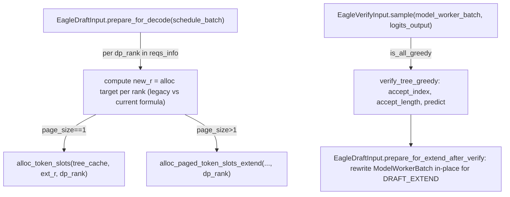

# sgl_jax.srt.speculative.eagle_util — EagleDraftInput/EagleVerifyInput, per-DP-rank KV allocation, greedy tree verify

## Overview

[`EagleDraftInput`](../catalog/python/sgl_jax/srt/speculative/eagle_util.md#EagleDraftInput.prepare_for_decode)
carries EAGLE speculative-decoding state across rounds —
[`prepare_for_decode`](../catalog/python/sgl_jax/srt/speculative/eagle_util.md#EagleDraftInput.prepare_for_decode)
allocates KV slots **per DP rank** (not globally) for the draft tokens each rank's requests will
need, and
[`prepare_for_extend_after_verify`](../catalog/python/sgl_jax/srt/speculative/eagle_util.md#EagleDraftInput.prepare_for_extend_after_verify)
rewires a `ModelWorkerBatch` in place to run the draft-extend step after the target model verifies
a batch of draft tokens. [`EagleVerifyInput.sample`](../catalog/python/sgl_jax/srt/speculative/eagle_util.md#EagleVerifyInput.sample)
is the greedy/non-greedy tree-verification entry point that determines which draft tokens the
target model actually accepts.

## Diagram

## Design rationale (why it's built this way)

**KV-slot allocation for decode is done per-DP-rank, and the code comment explicitly documents a
past bug this fixes: "was dp_rank=0 for all, so rank>0 reqs allocated from rank 0's pool."**
[`EagleDraftInput.prepare_for_decode`](../catalog/python/sgl_jax/srt/speculative/eagle_util.md#EagleDraftInput.prepare_for_decode)'s
comment states "spec_info / allocate_lens are global (flat across DP ranks). Allocate per-rank
(allocator + swa_mapping are per-dp_rank at dp>1); concat back to global-flat" and cites issue
"#1053 P1-5b" — under DP, each rank has its own token-pool allocator instance, so allocating
everything against `dp_rank=0` regardless of a request's actual rank would silently exhaust rank
0's pool while other ranks' pools sat unused, corrupting the per-rank KV bookkeeping.

**Two different formulas compute the "new" allocation length depending on `legacy_non_overlap`
mode.** The legacy path computes `new_r = seq_r + self.ALLOC_LEN_PER_DECODE - 1` from
`info.seq_lens`, while the current (overlap-scheduling) path computes `new_r = np.maximum(old_r,
committed_r + 2 * self.ALLOC_LEN_PER_DECODE)` from per-request `kv_allocated_len`/`kv_committed_len` —
the overlap scheduler needs `2 *` the allocation headroom (not `1x`) because with async/overlapped
scheduling, more decode steps' worth of speculative tokens can be in flight simultaneously before
the allocator is caught up, so a single step's worth of headroom (as in the legacy formula) would
be insufficient.

**`sample`'s docstring explicitly warns it mutates its input in place: "WARNING: This API in-place
modifies the states of logits_output."** [`EagleVerifyInput.sample`](../catalog/python/sgl_jax/srt/speculative/eagle_util.md#EagleVerifyInput.sample)
overwrites `logits_output.next_token_logits` to contain only the accepted tokens' logits after
verification — documenting this loudly as a warning rather than silently mutating is necessary
because callers might otherwise assume `logits_output` is unchanged after calling `sample` and
reuse stale full-length logits.

**`prepare_for_extend_after_verify`'s hidden-state gather index arithmetic is explicitly commented
as per-rank-local, not global.** "Per-rank-local cumsum: `_select_hidden_states` is a `shard_map`
rank-local gather, so indices must be offsets into each rank's own hidden shard" — since the
attention/hidden-state computation is itself sharded per DP rank via `shard_map`, the
`logits_indices` cumsum must be computed reshaped to `(dp, per_dp)` and cumsum'd along the
per-rank axis, not as one flat global cumsum, or the gather would read the wrong rank's shard.

## Entry points

- [`EagleDraftInput.prepare_for_decode`](../catalog/python/sgl_jax/srt/speculative/eagle_util.md#EagleDraftInput.prepare_for_decode) —
  reached once per decode step to allocate KV slots for the next round's draft tokens.
- [`EagleVerifyInput.sample`](../catalog/python/sgl_jax/srt/speculative/eagle_util.md#EagleVerifyInput.sample) —
  reached after the target model's forward pass over a batch of draft tokens, to determine
  acceptance.
- [`EagleDraftInput.prepare_for_extend_after_verify`](../catalog/python/sgl_jax/srt/speculative/eagle_util.md#EagleDraftInput.prepare_for_extend_after_verify) —
  reached after verification to reconfigure the batch for the subsequent draft-extend forward pass.
- [`BaseSpecWorker.verify`](../catalog/python/sgl_jax/srt/speculative/base_worker.md#BaseSpecWorker.verify) /
  [`forward_batch_speculative_generation`](../catalog/python/sgl_jax/srt/speculative/base_worker.md#BaseSpecWorker.forward_batch_speculative_generation) —
  the outer speculative-decoding loop driving these per-round calls.

## Mechanism (step-by-step)

1. **[`prepare_for_decode`](../catalog/python/sgl_jax/srt/speculative/eagle_util.md#EagleDraftInput.prepare_for_decode)
   iterates `schedule_batch.reqs_info` per DP rank**, computing each rank's new allocation length
   (legacy or current formula), then allocates KV slots for the extension via `alloc_token_slots`
   (page_size 1) or `alloc_paged_token_slots_extend` (paged), scoped to that `dp_rank`.
2. **[`EagleVerifyInput.sample`](../catalog/python/sgl_jax/srt/speculative/eagle_util.md#EagleVerifyInput.sample)
   checks `is_all_greedy`** and, if true, calls `verify_tree_greedy` with the draft tree structure
   (`retrive_index`/`retrive_next_token`/`retrive_next_sibling`) and target-model logits to compute
   `accept_index`/`accept_length`/`predict`.
3. **[`prepare_for_extend_after_verify`](../catalog/python/sgl_jax/srt/speculative/eagle_util.md#EagleDraftInput.prepare_for_extend_after_verify)
   rewrites `model_worker_batch` in place**: extends `seq_lens` by `speculative_num_draft_tokens -
   1` at the selected indices, sets `extend_seq_lens` to `step_plus_1` (derived from
   `accept_lens.shape[0]`), recomputes `logits_indices` via the per-rank-local cumsum, and sets
   `forward_mode = ForwardMode.DRAFT_EXTEND`.
4. **The attention backend's forward metadata is recomputed** via
   [`FlashAttention.get_eagle_forward_metadata`](../catalog/python/sgl_jax/srt/layers/attention/flashattention_backend.md#FlashAttention.get_eagle_forward_metadata)
   before the draft-extend forward pass runs.

## Key data structures

- **[`EagleDraftInput`](../catalog/python/sgl_jax/srt/speculative/eagle_util.md#EagleDraftInput.prepare_for_decode)** —
  [`allocate_lens`](../catalog/python/sgl_jax/srt/speculative/eagle_util.md#EagleDraftInput.allocate_lens)
  (global flat-across-DP-ranks allocation lengths), plus per-round `hidden_states`, `positions`,
  `accept_length`.
- **`EagleVerifyInput`** — `retrive_index`/`retrive_next_token`/`retrive_next_sibling` (the draft
  tree structure), `draft_token`/`draft_token_num`/`spec_steps`.

## Dynamics (design intent)

Because `prepare_for_decode` allocates against each request's actual `dp_rank`-scoped allocator
(fixed from the prior all-rank-0 bug), decode-time KV allocation correctly load-balances across
per-rank pools under data parallelism — a burst of requests concentrated on one rank no longer
risks starving that rank's pool while other ranks' capacity sits idle.

## Edge cases

- [`prepare_for_decode`](../catalog/python/sgl_jax/srt/speculative/eagle_util.md#EagleDraftInput.prepare_for_decode)
  skips any `dp_rank` whose `info.seq_lens is None or len(info.seq_lens) == 0` — an idle rank
  (common under DP with an uneven request distribution) contributes no allocation work for that
  step.
- [`EagleVerifyInput.sample`](../catalog/python/sgl_jax/srt/speculative/eagle_util.md#EagleVerifyInput.sample)
  deep-copies and re-filters `sampling_info` when `bs != len(sampling_info)` — a batch-size
  mismatch between the retrieved indices and the sampling info (e.g. after some requests were
  filtered out) is handled by an explicit re-filter rather than assuming shapes always align.

## Open questions

- The non-greedy (`is_all_greedy=False`) verification branch's exact tree-sampling algorithm is not
  shown within this packet's cited subgraph.

## See also
- [python-sgl_jax-srt-layers-logits_processor](python-sgl_jax-srt-layers-logits_processor.md) —
  `LogitsMetadata`/`CaptureHiddenMode`, consumed by `prepare_for_extend_after_verify`.
- [python-sgl_jax-srt-model_executor-forward_batch_info](python-sgl_jax-srt-model_executor-forward_batch_info.md) —
  `ForwardMode.DRAFT_EXTEND`, the mode this module sets after verification.
- [python-sgl_jax-srt-mem_cache-allocator](python-sgl_jax-srt-mem_cache-allocator.md) — the
  per-DP-rank token allocator this module's `prepare_for_decode` allocates against.

## Sources
- `raw/code/sglang-jax/python/sgl_jax/srt/speculative/eagle_util.py`
- `raw/code/sglang-jax/python/sgl_jax/srt/speculative/base_worker.py`
