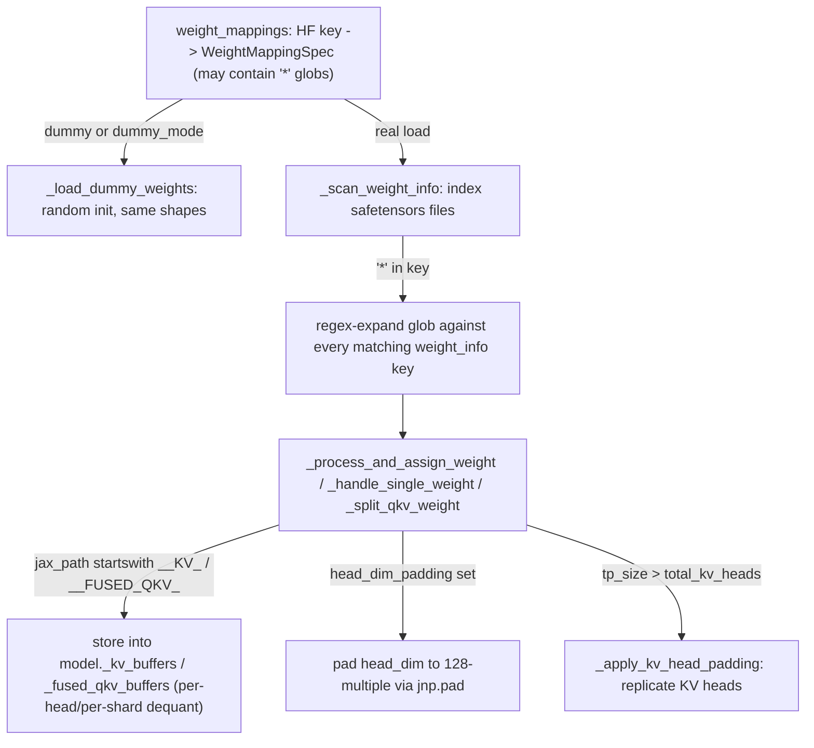

# sgl_jax.srt.utils.weight_utils — WeightLoader safetensors mapping, head-dim padding to 128, glob-pattern expansion

## Overview

[`WeightLoader.load_weights_from_safetensors`](../catalog/python/sgl_jax/srt/utils/weight_utils.md#WeightLoader.load_weights_from_safetensors)
("Load weights using JAX lazy evaluation and parallel I/O") converts a declarative
`weight_mappings` spec (HF checkpoint key → JAX param path, possibly with glob patterns) into
actual sharded JAX arrays assigned into the model's `nnx.State`. Along the way it pads attention
head dimensions up to 128-element alignment
([`_split_qkv_weight`](../catalog/python/sgl_jax/srt/utils/weight_utils.md#WeightLoader._split_qkv_weight)),
replicates KV heads when tensor-parallel size exceeds the checkpoint's KV-head count
([`_apply_kv_head_padding`](../catalog/python/sgl_jax/srt/utils/weight_utils.md#WeightLoader._apply_kv_head_padding)),
and special-cases a handful of architecture-specific fused-buffer storage conventions
([`_handle_single_weight`](../catalog/python/sgl_jax/srt/utils/weight_utils.md#WeightLoader._handle_single_weight)).

## Diagram

## Design rationale (why it's built this way)

**A `*` glob in a mapping key is expanded via regex against every actual key found in the
checkpoint's weight index, not resolved by a fixed enumeration.**
[`load_weights_from_safetensors`](../catalog/python/sgl_jax/srt/utils/weight_utils.md#WeightLoader.load_weights_from_safetensors)
converts `"*"` to a regex capture group (`re.escape(key).replace(r"\*", r"(.*?)")`) and searches
every `weight_info` key for a match, substituting the captured groups back into the mapping's
target path — this lets one mapping entry (e.g. for per-layer weights) cover an arbitrary,
checkpoint-determined number of layers/experts without the caller needing to know that count ahead
of time.

**Every attention head dimension is padded up to a 128-element multiple wherever
`mapping.head_dim_padding` is set**, computed as `(v_head_dim + 127) // 128 * 128 - v_head_dim` —
this is the standard TPU lane-alignment padding pattern (128 = TPU vector lane width), applied
consistently across Q/K/V bias, weight, and even per-channel quantization scale tensors so every
downstream attention kernel can assume 128-aligned head dimensions regardless of the checkpoint's
native head size.

**Fused KV/QKV buffer storage is routed by target-path string prefix (`__KV_`, `__FUSED_QKV_`)
into dedicated model attributes rather than the generic `nnx.State` assignment path.**
[`_handle_single_weight`](../catalog/python/sgl_jax/srt/utils/weight_utils.md#WeightLoader._handle_single_weight)'s
comments explain these are architecture-specific accommodations: `__KV_` targets are "used by
MiMo-V2-Flash per-head dequant" and `__FUSED_QKV_` targets are "used by MiMo-V2-Pro per-shard
dequant" — these architectures need weights staged into a custom buffer structure (indexed by layer
and component) that the generic path-based `nnx.State` assignment can't express, so the loader
special-cases the sentinel path prefix rather than generalizing the state-assignment mechanism for
a two-architecture need.

**The fused-QKV buffer path explicitly converts to CPU numpy (`np.asarray`) rather than keeping the
JAX array**, per the comment "(CPU numpy)" — since this buffer is consumed by a per-shard dequant
step that presumably runs outside the normal JAX-array data flow (e.g. as host-side setup before
sharding), keeping it off-device avoids an unnecessary device array for data that will be
re-processed on host anyway.

## Entry points

- [`WeightLoader.load_weights_from_safetensors`](../catalog/python/sgl_jax/srt/utils/weight_utils.md#WeightLoader.load_weights_from_safetensors) —
  the sole entry point for populating model parameters from a checkpoint; called once at model
  load time.
- [`WeightLoader._load_dummy_weights`](../catalog/python/sgl_jax/srt/utils/weight_utils.md#WeightLoader._load_dummy_weights) —
  reached instead of the real load when `dummy` or `self.dummy_mode`, for testing/benchmarking
  without a real checkpoint.

## Mechanism (step-by-step)

1. **[`load_weights_from_safetensors`](../catalog/python/sgl_jax/srt/utils/weight_utils.md#WeightLoader.load_weights_from_safetensors)
   scans the checkpoint's weight index** via `_scan_weight_info`, then partitions the supplied
   `weight_mappings` into `regular_mappings` and `moe_mappings` (keys prefixed
   `__MOE_EXPERTS__` route separately).
2. **Glob-pattern keys are expanded against every matching checkpoint key inside**
   [`load_weights_from_safetensors`](../catalog/python/sgl_jax/srt/utils/weight_utils.md#WeightLoader.load_weights_from_safetensors)
   **via regex substitution**, producing one concrete mapping per matched key/expert/layer.
3. **Each concrete mapping is dispatched to
   [`_handle_single_weight`](../catalog/python/sgl_jax/srt/utils/weight_utils.md#WeightLoader._handle_single_weight)**
   (single target path) or
   [`_split_qkv_weight`](../catalog/python/sgl_jax/srt/utils/weight_utils.md#WeightLoader._split_qkv_weight)
   (fused QKV checkpoint tensor split into separate Q/K/V JAX params), applying head-dim padding and
   KV-head replication as configured.
4. **[`_handle_single_weight`](../catalog/python/sgl_jax/srt/utils/weight_utils.md#WeightLoader._handle_single_weight)
   checks target-path sentinel prefixes first** (`__KV_`, `__FUSED_QKV_`), routing to custom buffer
   storage and returning early; otherwise it applies `lm_head` output-multiplier-scale handling and
   the generic padding/sharding/assignment path.

## Key data structures

- **`WeightMapping`** —
  [`target_path`](../catalog/python/sgl_jax/srt/utils/weight_utils.md#WeightMapping.target_path)
  (str or list, may itself contain `*`),
  [`sharding`](../catalog/python/sgl_jax/srt/utils/weight_utils.md#WeightMapping.sharding),
  `head_dim_padding` flag.
- **`WeightLoader`** — [`mesh`](../catalog/python/sgl_jax/srt/utils/weight_utils.md#WeightLoader.mesh),
  [`model_config`](../catalog/python/sgl_jax/srt/utils/weight_utils.md#WeightLoader.model_config),
  [`num_heads`](../catalog/python/sgl_jax/srt/utils/weight_utils.md#WeightLoader.num_heads)/[`num_kv_heads`](../catalog/python/sgl_jax/srt/utils/weight_utils.md#WeightLoader.num_kv_heads)/[`head_dim`](../catalog/python/sgl_jax/srt/utils/weight_utils.md#WeightLoader.head_dim)/[`head_dim_original`](../catalog/python/sgl_jax/srt/utils/weight_utils.md#WeightLoader.head_dim_original)/[`head_dim_pad`](../catalog/python/sgl_jax/srt/utils/weight_utils.md#WeightLoader.head_dim_pad).

## Dynamics (design intent)

Because the glob-expansion step operates against the checkpoint's actual key index rather than a
compile-time-known layer/expert count, the same mapping specification works unmodified across
checkpoints with different numbers of layers or experts — the loader adapts to whatever the
checkpoint actually contains rather than requiring per-checkpoint-shape mapping tables.

## Edge cases

- [`_apply_kv_head_padding`](../catalog/python/sgl_jax/srt/utils/weight_utils.md#WeightLoader._apply_kv_head_padding)
  is explicitly documented "Apply KV head padding/replication when tp_size > total_kv_heads" — this
  only activates in the specific regime where tensor-parallel degree exceeds the checkpoint's
  native KV-head count (common for GQA models under high TP), not universally.
- [`_handle_single_weight`](../catalog/python/sgl_jax/srt/utils/weight_utils.md#WeightLoader._handle_single_weight)'s
  `lm_head` output-multiplier-scale application is conditional on
  `hasattr(self.model_config.hf_config, "output_multiplier_scale")` — models whose HF config lacks
  this attribute skip the scaling entirely, "matching PyTorch implementation" only where the
  attribute is present.

## Open questions

- The exact set of architectures beyond MiMo-V2-Flash/MiMo-V2-Pro that rely on the `__KV_`/
  `__FUSED_QKV_` sentinel-path buffer mechanism is not enumerated within this packet's cited
  subgraph.

## See also
- [python-sgl_jax-srt-configs-model_config](python-sgl_jax-srt-configs-model_config.md) —
  `ModelConfig`, whose `hf_config`/`hf_text_config` this loader reads for head counts and dims.
- [python-sgl_jax-srt-model_executor-model_runner](python-sgl_jax-srt-model_executor-model_runner.md) —
  `ModelRunner.load_model`, which invokes the model loader that ultimately calls this module.

## Sources
- `raw/code/sglang-jax/python/sgl_jax/srt/utils/weight_utils.py`
- `raw/code/sglang-jax/python/sgl_jax/srt/configs/model_config.py`
