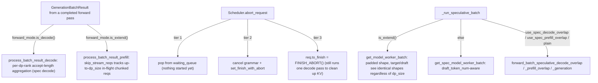

# sglang-jax root — per-DP-rank batch-result processing, three-tier request abort, speculative-batch dispatch

## Overview

This packet groups the scheduler-side logic that runs *after* a batch has already been dispatched
for a forward pass: converting the raw model output into per-request results
([`process_batch_result_decode`](../catalog/python/sgl_jax/srt/managers/scheduler_output_processor_mixin.md#SchedulerOutputProcessorMixin.process_batch_result_decode)/[`process_batch_result_prefill`](../catalog/python/sgl_jax/srt/managers/scheduler_output_processor_mixin.md#SchedulerOutputProcessorMixin.process_batch_result_prefill)),
cancelling in-flight or queued requests
([`Scheduler.abort_request`](../catalog/python/sgl_jax/srt/managers/scheduler.md#Scheduler.abort_request)),
and choosing among the several speculative-decoding execution paths
([`Scheduler._run_speculative_batch`](../catalog/python/sgl_jax/srt/managers/scheduler.md#Scheduler._run_speculative_batch)).
Every one of these paths must account for data-parallel (DP) execution, where a `ScheduleBatch`'s
requests are partitioned per-rank rather than held in one flat list — a recurring theme across all
three functions in this packet.

## Diagram

## Design rationale (why it's built this way)

**`process_batch_result_prefill` tracks a *set* of skippable requests, sized to `dp_size`, not a
single request variable — because the pre-DP single-request design was an actual bug.** Its comment
states plainly: "On dp>1 each dp rank can have its own chunked-in-flight req, so this must hold up
to `dp_size` reqs, not just one. A single-Req variable (the pre-DP design) silently leaked unchunked
reqs into stream_output with `input_token_logprobs_val` still None, crashing the consumer." This
documents a real regression class: DP execution multiplies the number of simultaneously-in-flight
chunked requests from at most one (single-rank) to up to `dp_size`, and any state meant to track "the
current chunked request" singular must become a per-rank collection or it silently drops requests
under DP.

**Request abort has three distinct tiers depending on how far a request has progressed, not one
uniform cancellation path.** [`abort_request`](../catalog/python/sgl_jax/srt/managers/scheduler.md#Scheduler.abort_request)'s
own inline comments name them: "Abort method 1: directly pop from the queue" (for requests that
"have not started anything"), a grammar-queue-specific cancellation (calling `req.grammar.cancel()`
before marking finished), and "Abort method 3: set `to_finish`" for already-running requests — the
comment for tier 3 explains "The request will still run one decode forward pass. Then we reuse all
existing code to clean up the KV cache allocation" — a request already holding KV-cache resources
can't be torn down mid-flight without corrupting shared batch state, so it's allowed to complete one
more step and then unwound through the normal completion path rather than a special-cased abrupt
teardown.

**Speculative-batch dispatch picks between padded-uniform-shape and draft-token-count-aware batch
construction based on forward mode, with an explicit correctness note for DP.**
[`_run_speculative_batch`](../catalog/python/sgl_jax/srt/managers/scheduler.md#Scheduler._run_speculative_batch)'s
comment on the extend branch states: "Spec extend always uses the padded mwb so target and draft see
identical shapes regardless of dp_size / multi-layer (#1090 + #1053 P1-5b assert dp>1 spec extend
must go here)" — since the target and draft models must trace/compile against the *same* shapes to
share a JIT cache and avoid shape-mismatch errors, the extend path can't use a draft-token-count-
specific batch shape the way the decode path does.

## Entry points

- [`SchedulerOutputProcessorMixin.process_batch_result_decode`](../catalog/python/sgl_jax/srt/managers/scheduler_output_processor_mixin.md#SchedulerOutputProcessorMixin.process_batch_result_decode) —
  reached once per completed decode-mode batch to extract next tokens and (if speculative decoding
  is active) per-request accept lengths.
- [`SchedulerOutputProcessorMixin.process_batch_result_prefill`](../catalog/python/sgl_jax/srt/managers/scheduler_output_processor_mixin.md#SchedulerOutputProcessorMixin.process_batch_result_prefill) —
  reached once per completed prefill/extend-mode batch to extract tokens and logprobs, handling
  both overlap and non-overlap scheduling.
- [`Scheduler.abort_request`](../catalog/python/sgl_jax/srt/managers/scheduler.md#Scheduler.abort_request) —
  reached on an incoming client abort/cancel request, at any stage of a request's lifecycle.
- [`Scheduler._run_speculative_batch`](../catalog/python/sgl_jax/srt/managers/scheduler.md#Scheduler._run_speculative_batch) —
  reached from `run_batch` whenever speculative decoding is active, to dispatch to the correct
  overlap/non-overlap execution path.
- [`Scheduler.get_internal_state`](../catalog/python/sgl_jax/srt/managers/scheduler.md#Scheduler.get_internal_state) —
  reached for a debug/introspection RPC, returning server args plus live throughput/memory-usage
  metrics.

## Mechanism (step-by-step)

1. **[`process_batch_result_decode`](../catalog/python/sgl_jax/srt/managers/scheduler_output_processor_mixin.md#SchedulerOutputProcessorMixin.process_batch_result_decode)
   checks `is_spec_decode`**, and if true, resolves per-request accepted-token counts via
   `resolve_spec_decode_token_ids`, then iterates `batch.reqs_info` per DP rank (`base = dp_rank *
   per_dp_bs`) to attribute each accepted-length value back to its owning request, skipping
   finished/retracted requests under overlap scheduling.
2. **[`process_batch_result_prefill`](../catalog/python/sgl_jax/srt/managers/scheduler_output_processor_mixin.md#SchedulerOutputProcessorMixin.process_batch_result_prefill)
   builds the `skip_stream_reqs` set sized for `dp_size`**, resolves next-token IDs (via the
   speculative-prefill or overlap-resolution path as applicable), and moves logprob tensors to host
   memory when requested.
3. **[`abort_request`](../catalog/python/sgl_jax/srt/managers/scheduler.md#Scheduler.abort_request)
   walks the waiting queue, grammar queue, and running/current batch in that order**, applying the
   appropriate tier's cancellation to every matching request ID, then separately aborts any PD
   disaggregation queue entries.
4. **[`_run_speculative_batch`](../catalog/python/sgl_jax/srt/managers/scheduler.md#Scheduler._run_speculative_batch)
   builds the model-worker batch** (padded-uniform for extend, draft-token-count-aware otherwise),
   determines which overlap mode applies via `can_use_spec_decode_overlap`/`can_use_spec_prefill_overlap`,
   and dispatches to the matching `forward_batch_speculative_*` method on the draft worker.

## Key data structures

- **`GenerationBatchResult`** — carries `logits_output`, `next_token_ids`,
  `extend_input_len_per_req`, `extend_logprob_start_len_per_req`, `cache_miss_count`, consumed by
  both `process_batch_result_decode` and `process_batch_result_prefill`.
- **[`ForwardMode`](../catalog/python/sgl_jax/srt/model_executor/forward_batch_info.md#ForwardMode)** —
  the enum `_run_speculative_batch` branches on (`is_extend()` vs. decode) to choose batch
  construction.

## Dynamics (design intent)

Because `process_batch_result_decode`'s per-request accept-length attribution loop explicitly
computes `base = dp_rank * per_dp_bs` before indexing into the flat `accept_lens` array, the
per-rank partitioning of `batch.reqs_info` and the flat layout of speculative-decoding output
arrays are kept consistent by construction — the offset arithmetic, not an implicit assumption, is
what correctly maps a flat result array back to the right per-rank request.

## Edge cases

- [`abort_request`](../catalog/python/sgl_jax/srt/managers/scheduler.md#Scheduler.abort_request)'s
  tier-1 (waiting-queue) deletions are explicitly done "in reverse order to avoid index issues when
  deleting" — a forward-order deletion from a list by index would shift subsequent indices and
  delete the wrong entries.
- [`process_batch_result_decode`](../catalog/python/sgl_jax/srt/managers/scheduler_output_processor_mixin.md#SchedulerOutputProcessorMixin.process_batch_result_decode)
  marks "TODO: Speculative decoding support for DP" immediately after incrementing
  `num_generated_tokens` only in the non-spec-decode branch — the interaction between DP and
  speculative decoding's token-count accounting is flagged as still evolving.

## Open questions

- The precise conditions distinguishing `use_spec_decode_overlap` from `use_spec_prefill_overlap`
  from the plain (non-overlap) path in
  [`_run_speculative_batch`](../catalog/python/sgl_jax/srt/managers/scheduler.md#Scheduler._run_speculative_batch)
  beyond what's shown (which reads `can_use_spec_decode_overlap`/`can_use_spec_prefill_overlap`
  helper results) are not detailed within this packet's cited subgraph.

## See also
- [python-sgl_jax-srt-managers-scheduler](python-sgl_jax-srt-managers-scheduler.md) — `Scheduler`,
  the class hosting all of these methods.
- [python-sgl_jax-srt-speculative-eagle_util](python-sgl_jax-srt-speculative-eagle_util.md) —
  `EagleVerifyInput`/`EagleDraftInput`, consumed by the speculative-decode result-resolution path.

## Sources
- `raw/code/sglang-jax/python/sgl_jax/srt/managers/scheduler_output_processor_mixin.py`
- `raw/code/sglang-jax/python/sgl_jax/srt/managers/scheduler.py`
