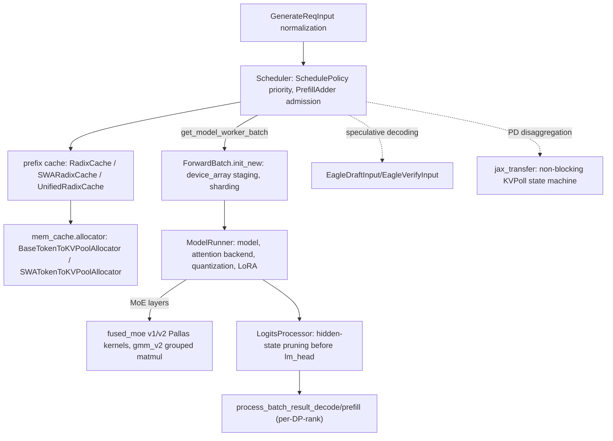

# sglang-jax — what it is and how it fits together

## In one paragraph

sglang-jax is a JAX/TPU port of the SGLang continuous-batching LLM inference server. A
[`Scheduler`](concepts/python-sgl_jax-srt-managers-scheduler.md) drives an event loop that admits
requests from a waiting queue (prioritized by a cache-aware or FCFS
[`SchedulePolicy`](concepts/python-sgl_jax-srt-managers-schedule_policy.md)), packs them into
padded-shape batches to bound JAX recompilation, runs one forward pass through a
[`ModelRunner`](concepts/python-sgl_jax-srt-model_executor-model_runner.md)-owned model, and routes
the output back through
[per-DP-rank result processing](concepts/root.md). Every subsystem — KV caching, MoE kernels,
speculative decoding, prefill/decode disaggregation — is built around the same underlying
constraint: JAX traces/compiles per distinct shape, so the entire system is organized to keep the
*number of distinct shapes* small while still serving variable-length, variable-batch-size traffic
efficiently, and to make data-parallelism (DP) a first-class axis threaded consistently through
scheduling, caching, and kernel dispatch.

## Core architecture

## Main concepts

**Continuous-batching scheduler with precompile padding buckets.** The
[`Scheduler`](concepts/python-sgl_jax-srt-managers-scheduler.md) admits requests into prefill
batches and dispatches forward passes, but the load-bearing detail is that `run_batch` rounds every
batch up to a small set of static token/batch-size/cache-location buckets
(`get_precompile_paddings`) before building the `ModelWorkerBatch` — trading padding compute for a
bounded number of distinct compiled programs, since JAX would otherwise recompile for every
distinct actual shape a serving workload produces.

**Cache-aware scheduling with a queue-size safety valve.**
[`SchedulePolicy`](concepts/python-sgl_jax-srt-managers-schedule_policy.md)'s Longest-Prefix-Match
policy reorders the waiting queue to maximize radix-cache hit rate, but automatically downgrades to
cheap FCFS ordering once the queue exceeds 128 requests — the O(queue-size) cost of prefix-matching
every request becomes the bottleneck exactly when the queue is large, so the policy explicitly
bounds how much scheduling overhead it will pay.

**Three generations of prefix-cache tree, from simple to pluggable.**
[`RadixCache`](concepts/python-sgl_jax-srt-mem_cache-radix_cache.md) is the baseline (page-aligned
KV insertion, EAGLE bigram-key handling).
[`SWARadixCache`](concepts/python-sgl_jax-srt-mem_cache-swa_radix_cache.md) adds a second,
independent LRU list and a *tombstone* mechanism so sliding-window-attention data can be evicted
while full-attention data for the same node survives.
[`UnifiedRadixCache`](concepts/python-sgl_jax-srt-mem_cache-unified_radix_cache.md) generalizes
this into a
[`TreeComponent` plugin architecture](concepts/python-sgl_jax-srt-mem_cache-unified_cache_components-tree_component.md)
(FULL/SWA/RECURRENT as an `IntEnum`-indexed per-node data tuple), so a new cache dimension is a new
component class, not a rewrite of the tree-walking code.

**KV-cache allocation is per-DP-rank, with a documented history of a real cross-rank bug.**
[`BaseTokenToKVPoolAllocator`/`SWATokenToKVPoolAllocator`](concepts/python-sgl_jax-srt-mem_cache-allocator.md)
scope every `alloc`/`free` call by `dp_rank`, and
[`EagleDraftInput.prepare_for_decode`](concepts/python-sgl_jax-srt-speculative-eagle_util.md)'s
comment explicitly cites a prior bug (#1053 P1-5b) where allocation defaulted to rank 0 for every
request — a recurring theme across this codebase's DP-aware paths is comments documenting *why*
per-rank scoping matters, because getting it wrong silently corrupts another rank's pool.

**Pytree-registered device-state structs cross every `jit` boundary explicitly.**
[`ForwardBatch`](concepts/python-sgl_jax-srt-model_executor-forward_batch_info.md),
[`LogitsMetadata`](concepts/python-sgl_jax-srt-layers-logits_processor.md), and the
[`KVCache` pool family](concepts/python-sgl_jax-srt-mem_cache-memory_pool.md) are all registered
JAX pytrees, splitting static aux-data (mesh, dtype, forward mode) from traced array children —
this is what lets these rich Python objects pass directly into `jit`-compiled model/kernel calls
without manual unpacking at every call site.

**Two generations of fused expert-parallel MoE Pallas kernels, both fusing routing/all-to-all/FFN
into one kernel body.**
[v1](concepts/python-sgl_jax-srt-kernels-fused_moe-v1-kernel.md) pipelines per-expert compute
against all-to-all scatter/gather DMAs, letting `bts` (per-expert token tile) exceed the outer
token tile to keep decode-time GEMMs MXU-efficient even with tiny per-device token counts.
[v2](concepts/python-sgl_jax-srt-kernels-fused_moe-v2-kernel.md) adds a *compact* active-expert
loop (skipping experts with zero routed tokens in a tile) and an explicit measured trade-off between
running the shared expert in-kernel (fp8) vs. externally (bf16, near-equal speed at the measured
scale). Separately,
[`gmm_v2`](concepts/python-sgl_jax-srt-kernels-gmm-megablox_gmm_kernel-gmm_v2.md) is a grouped-matmul
kernel with dynamic per-group tile offsets and TPU-hardware-gated quantization dtype selection.

**Speculative decoding (EAGLE) rewrites the batch in place between draft and verify rounds.**
[`EagleDraftInput`/`EagleVerifyInput`](concepts/python-sgl_jax-srt-speculative-eagle_util.md) drive
greedy tree-verification and then mutate a `ModelWorkerBatch`'s `seq_lens`/`positions`/`forward_mode`
in place to reconfigure it for the draft-extend step — with a per-rank-local index-arithmetic
subtlety (`shard_map` rank-local gathers require offsets local to each rank's own hidden-state
shard, not a global flat cumsum).

**PD disaggregation transfer is a non-blocking state machine, not a blocking RPC.**
[`jax_transfer.conn`](concepts/python-sgl_jax-srt-disaggregation-jax_transfer-conn.md)'s
`JaxTransferKVSender`/`Receiver` implement a `KVPoll` state machine
(`WAITING_FOR_INPUT`→`TRANSFERRING`→`SUCCESS`/`FAILED`) where every scheduler-facing call returns
immediately, delegating blocking data movement to a background pull worker or async ZMQ ack
callback — so cross-host KV transfer latency never stalls the scheduler's event loop.

**`ModelConfig`/`ServerArgs` resolve context-dependent defaults at construction, not at use time.**
[`ModelConfig`](concepts/python-sgl_jax-srt-configs-model_config.md) derives per-token KV-cache cost
accounting for kernel-specific packing (MLA absorbed-path bf16 packing), and
[`ServerArgs.__post_init__`](concepts/python-sgl_jax-srt-server_args.md) resolves `device` and
`mem_fraction_static` from the `JAX_PLATFORMS` environment variable and `jax.process_count()` —
pushing this resolution to construction time means every downstream consumer sees a fully-resolved
config, never a `None` needing further interpretation.

## How a request flows

A client request is normalized by
[`GenerateReqInput`](concepts/python-sgl_jax-srt-managers-io_struct.md) (single-vs-batch detection,
parallel-sampling expansion) and enters the `Scheduler`'s waiting queue. The
[`SchedulePolicy`](concepts/python-sgl_jax-srt-managers-schedule_policy.md) prioritizes it, a
`PrefillAdder` admits it into a padded-shape batch, and
[`ForwardBatch.init_new`](concepts/python-sgl_jax-srt-model_executor-forward_batch_info.md) stages
its arrays onto TPU devices with explicit sharding before the
[`ModelRunner`](concepts/python-sgl_jax-srt-model_executor-model_runner.md)'s model computes
hidden states (using MoE/attention kernels as configured) and the
[`LogitsProcessor`](concepts/python-sgl_jax-srt-layers-logits_processor.md) prunes to the positions
that actually need sampling. The result flows back through
[per-DP-rank output processing](concepts/root.md), with prefix-cache insertion
([`RadixCache`](concepts/python-sgl_jax-srt-mem_cache-radix_cache.md) or a hybrid variant) happening
alongside KV-index bookkeeping in the
[allocator](concepts/python-sgl_jax-srt-mem_cache-allocator.md).

## Map of the wiki

- **"How does the scheduler decide what to run next, and how does it avoid recompiling for every
  shape?"** → [python-sgl_jax-srt-managers-scheduler](concepts/python-sgl_jax-srt-managers-scheduler.md),
  [python-sgl_jax-srt-managers-schedule_policy](concepts/python-sgl_jax-srt-managers-schedule_policy.md).
- **"How does prefix caching work, and what's different about hybrid (SWA/recurrent) models?"** →
  [python-sgl_jax-srt-mem_cache-radix_cache](concepts/python-sgl_jax-srt-mem_cache-radix_cache.md),
  [python-sgl_jax-srt-mem_cache-swa_radix_cache](concepts/python-sgl_jax-srt-mem_cache-swa_radix_cache.md),
  [python-sgl_jax-srt-mem_cache-unified_radix_cache](concepts/python-sgl_jax-srt-mem_cache-unified_radix_cache.md).
- **"How does MoE actually execute on TPU?"** →
  [python-sgl_jax-srt-kernels-fused_moe-v1-kernel](concepts/python-sgl_jax-srt-kernels-fused_moe-v1-kernel.md),
  [python-sgl_jax-srt-kernels-fused_moe-v2-kernel](concepts/python-sgl_jax-srt-kernels-fused_moe-v2-kernel.md),
  [python-sgl_jax-srt-kernels-gmm-megablox_gmm_kernel-gmm_v2](concepts/python-sgl_jax-srt-kernels-gmm-megablox_gmm_kernel-gmm_v2.md).
- **"How does speculative decoding (EAGLE) work, and how does DP interact with it?"** →
  [python-sgl_jax-srt-speculative-eagle_util](concepts/python-sgl_jax-srt-speculative-eagle_util.md),
  [root](concepts/root.md).
- **"How does prefill/decode disaggregation move KV across hosts?"** →
  [python-sgl_jax-srt-disaggregation-jax_transfer-conn](concepts/python-sgl_jax-srt-disaggregation-jax_transfer-conn.md).
- For exhaustive per-symbol lookup (signatures, call sites), see `catalog/`; for the full concept
  list with one-line summaries, see `../index.md`.
