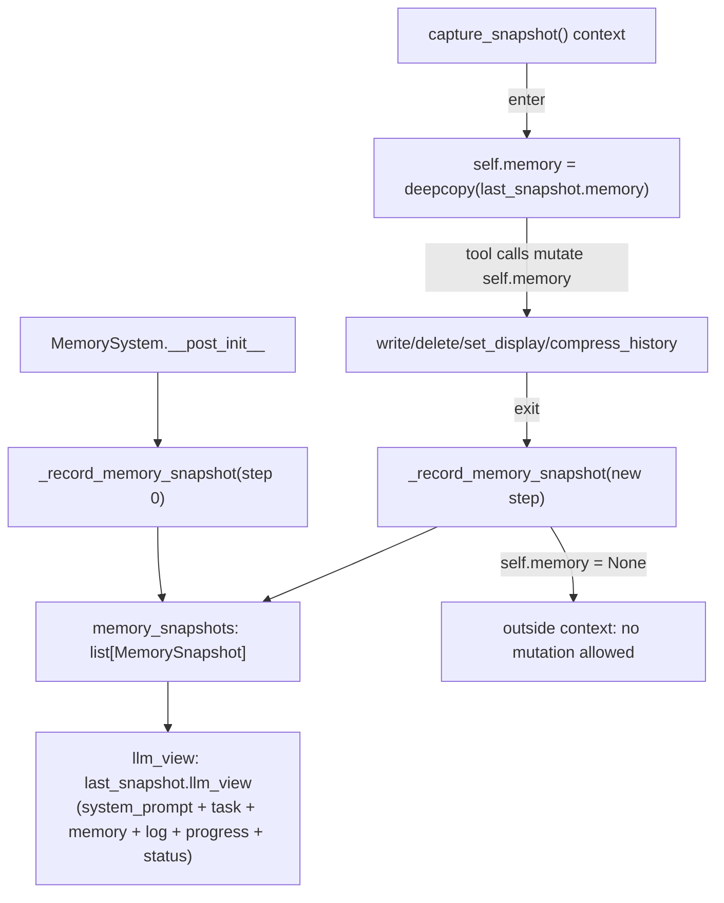

# simply.agent.memory — snapshot-based, tool-mutated agent memory

## Overview

[`MemorySystem`](../catalog/simply/agent/memory.md#MemorySystem) is the agent's entire long-term
state: a URI-addressed store of [`MemoryFile`](../catalog/simply/agent/memory.md#MemoryFile)s
(`kb://` predefined knowledge, `pad://` scratchpad files, `log://` append-only event history), whose
history is captured as an immutable sequence of
`MemorySnapshot`s — one per agent step — rather
than a single mutable state. All mutation happens inside a
[`capture_snapshot`](../catalog/simply/agent/memory.md#MemorySystem) context manager that
deep-copies the previous snapshot, lets tool calls mutate the copy freely, then re-snapshots on exit.
The module also defines the agent-facing memory tools
([`memory_fold`](../catalog/simply/agent/memory.md#memory_fold)/`unfold`/
[`memory_write`](../catalog/simply/agent/memory.md#memory_write)/`delete`/
[`memory_compress_history`](../catalog/simply/agent/memory.md#memory_compress_history)/
[`record_progress`](../catalog/simply/agent/memory.md#record_progress)) as thin wrappers over
`MemorySystem` methods, built on [simply-agent-tools](simply-agent-tools.md)'s `Action`/`Tool` pattern.

## Diagram

## Design rationale (why it's built this way)

**Mutation is only legal inside `capture_snapshot`, enforced by an explicit `assert self.memory is
not None` at the top of every mutating method.** Every mutator
([`write`](../catalog/simply/agent/memory.md#MemorySystem.write),
[`delete`](../catalog/simply/agent/memory.md#MemorySystem.delete),
[`set_display`](../catalog/simply/agent/memory.md#MemorySystem.set_display),
[`compress_history`](../catalog/simply/agent/memory.md#MemorySystem.compress_history),
[`record_progress`](../catalog/simply/agent/memory.md#MemorySystem.record_progress),
[`record_llm_output`](../catalog/simply/agent/memory.md#MemorySystem.record_llm_output)) begins
`assert self.memory is not None,` [`CONTEXT_ERROR_MSG`](../catalog/simply/agent/memory.md#CONTEXT_ERROR_MSG)
— `self.memory` is `None` at every point outside the context (per the class's own documented
lifecycle), so any tool executor accidentally called outside a step boundary fails loudly rather than
silently mutating stale state.

**A step's memory is a full deep copy of the prior snapshot's memory, not a diff or a mutable
reference — this trades memory/CPU for making every snapshot in `memory_snapshots` a genuinely
independent, immutable point-in-time record.** [`capture_snapshot`](../catalog/simply/agent/memory.md#MemorySystem)
does `self.memory = copy.deepcopy(self.last_snapshot.memory)` on entry — this is what lets
[`get_events_for_step`](../catalog/simply/agent/memory.md#MemorySystem) index directly into
`memory_snapshots[step]` and trust that snapshot's contents were exactly what existed at that step,
unaffected by any later mutation.

**The event log is compressed by *replacing a range* with one summary entry at the position of the
last replaced entry, not by deleting and appending — this preserves chronological log order.**
[`compress_history`](../catalog/simply/agent/memory.md#MemorySystem.compress_history) computes
`summary_step_idx = idx_replaced[-1]` (the last matching log entry's position in `log_order`),
overwrites that slot in-place with the new summary file's URI, then deletes the *other* replaced
entries in reverse index order (to avoid index shifting during deletion) — and only inserts the new
summary file into `mem_files` *after* deleting the old ones, with an explicit comment explaining why:
compressing the same range twice could otherwise generate a colliding URI and the insert-after-delete
order avoids deleting the freshly-written summary.

**Display mode resolution layers file-level settings with step-relative heuristics, all centralized
in one method reused by both the LLM view and a separate visualizer.**
[`get_display_mode`](../catalog/simply/agent/memory.md#MemorySystem.get_display_mode)'s own docstring
says this explicitly: "We put the logic here so it is reusable by `visualizer.py`." `pad://` files
are always [`FULL`](../catalog/simply/agent/memory.md#DisplayMode.FULL); `log://` files default to
full display within `n_full_display_recent_steps` of the current step, with an additional carve-out
to hide older `mem_*` tool-call entries unless `display_memory_tool_calls` is set — everything else
falls through to the file's own stored `display` field.

**LLM-visible content is XML-tagged with a custom CDATA-escaping scheme, not raw JSON, presumably for
token efficiency and readability inside a chat transcript.**
[`MemoryFile.to_llm`](../catalog/simply/agent/memory.md#MemoryFile.to_llm) wraps content in
`<memory uri="..." display="..." length="..." update_step="...">` with the summary always shown
(XML-escaped via [`escape_xml`](../catalog/simply/agent/memory.md#MemoryFile)) and full content
wrapped in a `<![CDATA[...]]>` block via a custom
[`escape_cdata`](../catalog/simply/agent/memory.md#MemoryFile) lambda that replaces a literal `]]>`
sequence with an escaped variant — CDATA sections cannot contain `]]>` themselves, so any content
containing that exact substring needs this workaround to remain valid.

> [!inferred] [`SystemStatus`](../catalog/simply/agent/memory.md#SystemStatus)'s comment clarifies a
> subtle off-by-one: the status shown at prompt step `t` reports token usage measured *through* step
> `t-1`'s conversation history, but is itself labeled `status_step=t` — the token count is always one
> step "behind" the step label it's attached to, since it's computed before that step's own content
> exists.

## Entry points

- [`MemorySystem.capture_snapshot`](../catalog/simply/agent/memory.md#MemorySystem) — the sole
  legal mutation window; every agent step wraps its tool-call handling in this context.
- [`get_memory_tools`](../catalog/simply/agent/memory.md#get_memory_tools) — returns the six
  [`Tool`](../catalog/simply/agent/tools.md#Tool) instances the agent loop registers, each a
  `functools.partial`-bound executor closing over one `MemorySystem` instance.
- [`MemorySystem.llm_view`](../catalog/simply/agent/memory.md#MemorySystem) — the property the agent
  loop reads each step to build the next LLM prompt.

## Mechanism (step-by-step)

1. **Construction seeds the scratchpad files and predefined knowledge, then takes an initial
   snapshot.** [`MemorySystem.__post_init__`](../catalog/simply/agent/memory.md#MemorySystem.__post_init__)
   creates four empty `pad://` files (`plan.md`, `todo.md`, `scratch.md`, `journey.md`), validates
   every `predefined_knowledge` entry starts with `kb://` and auto-generates a summary for any that
   lack one, then calls
   [`_record_memory_snapshot`](../catalog/simply/agent/memory.md#MemorySystem._record_memory_snapshot)
   for step 0.
2. **Each agent step enters `capture_snapshot`, records the LLM output and tool calls, lets tools
   mutate freely, then exits.**
   [`record_llm_output`](../catalog/simply/agent/memory.md#MemorySystem.record_llm_output)/
   [`record_tool_call`](../catalog/simply/agent/memory.md#MemorySystem.record_llm_output) append new
   `log://` files; tool executors like
   [`memory_write`](../catalog/simply/agent/memory.md#memory_write) call through to
   [`MemorySystem.write`](../catalog/simply/agent/memory.md#MemorySystem.write).
3. **On exit, `_record_memory_snapshot` renders the LLM view and computes system status from the
   step's final memory state.** [`_memory_to_llm_view`](../catalog/simply/agent/memory.md#MemorySystem._memory_to_llm_view)
   concatenates the system prompt, task, memory-system description, `kb://`/`pad://` file blocks (via
   [`_user_files_to_llm_view`](../catalog/simply/agent/memory.md#MemorySystem._user_files_to_llm_view)),
   and the event log (via
   [`_log_to_llm_view`](../catalog/simply/agent/memory.md#MemorySystem._log_to_llm_view)), then the
   progress log and system status are appended as fenced JSON blocks.
4. **[`compress_history`](../catalog/simply/agent/memory.md#MemorySystem.compress_history) finds
   every log entry in the step range, replaces the last one's slot with a
   summary, and deletes the rest** — see Design rationale above for the precise ordering.
5. **Every mutator returns a plain string result** (`'OK'` or an `'Error: ...'` message), matching
   [`Tool.executor`](../catalog/simply/agent/tools.md#Tool.executor)'s `(action, str)` executor
   contract from [simply-agent-tools](simply-agent-tools.md) — errors are reported to the LLM as tool
   output text, not raised as exceptions.

## Key data structures

- **`MemorySnapshot`** — `memory: Memory`,
  `system_status: SystemStatus`, `llm_view: str`; immutable, one per step, appended to
  [`memory_snapshots`](../catalog/simply/agent/memory.md#MemorySystem.memory_snapshots).
- **[`Memory`](../catalog/simply/agent/memory.md#Memory)** — `files: dict[str, MemoryFile]` (keyed
  by URI) plus `log_order: list[str]` (the append-ordered sequence of `log://` URIs, independently
  tracked from the dict itself since dict insertion order alone wouldn't survive compression's
  in-place slot replacement).
- **[`MemoryFile`](../catalog/simply/agent/memory.md#MemoryFile)** — `uri`, `display: DisplayMode`,
  `content`, `summary`, `update_step`, `metadata` (a free-form dict carrying `event_type`/
  `event_step`/`tool_name`/`replaced_uris` depending on the file's origin).

## Dynamics (design intent)

Because `capture_snapshot` raises `RuntimeError` if re-entered while `self.memory is not None`, the
class enforces exactly one mutation window open at a time — nested or concurrent snapshot captures
are a programming error, not a supported pattern.

## Edge cases

- [`MemoryFile.__post_init__`](../catalog/simply/agent/memory.md#MemoryFile) validates the URI
  against [`REGEX_MEMORY_URI`](../catalog/simply/agent/memory.md#MemoryFile) at construction time —
  an invalid URI can never enter the system as a `MemoryFile`, even bypassing the tool layer.
- [`MemorySystem.write`](../catalog/simply/agent/memory.md#MemorySystem.write) explicitly rejects
  `log://` writes ("Use `compress_context`... instead") — log files can only be created via
  [`record_llm_output`](../catalog/simply/agent/memory.md#MemorySystem.record_llm_output)/
  `record_tool_call`/`compress_history`, never directly by the LLM through the write tool.

## Open questions

- Whether `MemorySystem.compress_history`'s method name in this packet's subgraph
  (`replacable`, a locally-defined closure) is meant to be `replaceable` (a likely typo) doesn't
  affect behavior but is worth noting for anyone grepping the codebase.

## See also
- [simply-agent-tools](simply-agent-tools.md) — `Action`/`Tool`, the base pattern every memory tool
  is built from.
- [simply-agent-tui](simply-agent-tui.md) — `SystemStatus`, rendered by the TUI's status displays.
