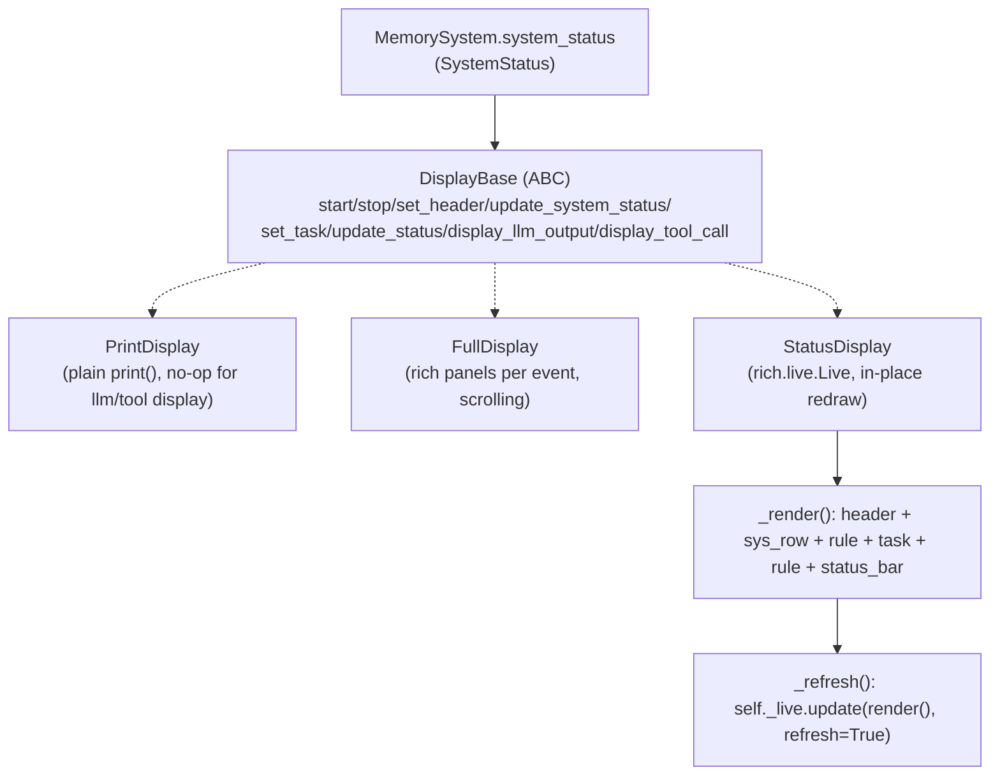

# simply.agent.tui — three interchangeable agent display backends behind one ABC

## Overview

[`DisplayBase`](../catalog/simply/agent/tui.md#DisplayBase.update_system_status) is a small abstract
interface (`start`/`stop`/`set_header`/`update_system_status`/`set_task`/`update_status`/
`display_llm_output`/`display_tool_call`) with three implementations: `PrintDisplay` (plain
`print()`-based one-liners, the safe default so "the agent never needs to guard TUI calls" per the
module docstring), `FullDisplay` (rich-formatted panels printed line-by-line, showing full LLM output
and tool calls), and [`StatusDisplay`](../catalog/simply/agent/tui.md#StatusDisplay.update_system_status)
(a `rich.live.Live`-based in-place-redrawing compact panel, htop-style). All three consume the same
[`SystemStatus`](../catalog/simply/agent/memory.md#SystemStatus) type from
[simply-agent-memory](simply-agent-memory.md), so swapping display backends requires no change to
the agent loop that drives them.

## Diagram

## Design rationale (why it's built this way)

**`PrintDisplay` exists specifically so calling code never needs a conditional — every `DisplayBase`
method is unconditionally safe to call, and the "no display" case degrades to plain log lines rather
than requiring `if display is not None` guards everywhere.** The module docstring states this
explicitly: `PrintDisplay` is "used as the default so the agent never needs to guard TUI calls" — its
[`display_llm_output`](../catalog/simply/agent/tui.md#DisplayBase.update_system_status)/
`display_tool_call` are literal no-ops (`pass`), while
[`update_system_status`](../catalog/simply/agent/tui.md#PrintDisplay.update_system_status) still
prints a one-line summary, so a headless/non-interactive run gets minimal but non-empty progress
output.

**`StatusDisplay` accumulates all displayable state as plain instance attributes and re-renders the
*entire* panel from scratch on every update, rather than incrementally patching one region.** Every
setter (`set_header`, [`update_system_status`](../catalog/simply/agent/tui.md#StatusDisplay.update_system_status),
`set_task`, `update_status`) stores its argument into a private field
(`self._header`/`self._status_step`/`self._token_usage`/`self._elapsed`/`self._task`/
`self._status_message`) and then calls
[`_refresh`](../catalog/simply/agent/tui.md#StatusDisplay._refresh), which rebuilds the whole
`rich.panel.Panel` via [`_render`](../catalog/simply/agent/tui.md#StatusDisplay._render) — this is
simpler than tracking which sub-region changed, at the cost of a full re-render per update; `rich`'s
own `Live` diffing is relied upon to keep the actual terminal writes minimal.

**Task text is truncated to fit the *current* terminal height, computed fresh on every render rather
than cached.** [`_truncated_task`](../catalog/simply/agent/tui.md#StatusDisplay._truncated_task)
calls `shutil.get_terminal_size().lines` every time it runs, subtracting a fixed `overhead` estimate
(`13 + len(self._header)`, itself an approximation of the other panel sections' line counts,
documented inline) — this means resizing the terminal mid-run changes how much of a long task
description is visible on the very next refresh, with no explicit resize-event handling needed.

**Token and elapsed-time formatting are free functions, not methods, shared identically across all
three display classes.** [`_format_tokens`](../catalog/simply/agent/tui.md#_format_tokens) (`'12.3k /
200k'`-style) and [`_format_elapsed`](../catalog/simply/agent/tui.md#_format_elapsed) (`'1h 23m
45s'`-style, only including `hours`/`minutes` segments when nonzero or a larger unit is present) are
module-level functions called identically from `PrintDisplay.update_system_status`,
`FullDisplay.update_system_status`, and
[`StatusDisplay.update_system_status`](../catalog/simply/agent/tui.md#StatusDisplay.update_system_status)
— the formatting logic is factored out precisely because every display backend needs the identical
human-readable rendering of the same `SystemStatus` fields.

> [!inferred] `FullDisplay` (not itself the subject of a citation in this packet beyond its shared
> `update_system_status` role) appears to sit between `PrintDisplay`'s minimalism and
> `StatusDisplay`'s live-updating compactness — a "verbose scrollback" mode useful when a developer
> wants to see every LLM output and tool call inline rather than only the current status.

## Entry points

- [`DisplayBase.update_system_status`](../catalog/simply/agent/tui.md#DisplayBase.update_system_status)
  (abstract) — called once per agent step by the agent loop with the step's
  [`SystemStatus`](../catalog/simply/agent/memory.md#SystemStatus); every concrete display renders it
  differently.
- [`StatusDisplay.start`](../catalog/simply/agent/tui.md#StatusDisplay.start)/`stop` — bracket the
  `rich.live.Live` context; `start` performs an initial render before entering live-update mode.
- [`StatusDisplay._render`](../catalog/simply/agent/tui.md#StatusDisplay._render) — the single method
  that assembles the whole panel; every setter's `_refresh` call ultimately invokes it.

## Mechanism (step-by-step)

1. **A display backend is selected once at agent startup** (not itself visible in this packet's
   subgraph — presumably a CLI flag choosing `PrintDisplay`/`FullDisplay`/`StatusDisplay`, the last of
   which is initialized via [`StatusDisplay.start`](../catalog/simply/agent/tui.md#StatusDisplay.start)).
2. **The agent loop calls the same
   [`DisplayBase.update_system_status`](../catalog/simply/agent/tui.md#DisplayBase.update_system_status)
   method regardless of backend.** Each step: `
   update_system_status(status)`, optionally `set_task`/`update_status`/`display_llm_output`/
   `display_tool_call`.
3. **`StatusDisplay` accumulates state, then rebuilds and pushes a new render.** Every setter mutates
   one private field then calls [`_refresh`](../catalog/simply/agent/tui.md#StatusDisplay._refresh),
   which (if `self._live` is active) calls [`_render`](../catalog/simply/agent/tui.md#StatusDisplay._render)
   and hands the result to `self._live.update(..., refresh=True)`.
4. **[`_render`](../catalog/simply/agent/tui.md#StatusDisplay._render) assembles a
   `rich.table.Table.grid` with a fixed section order:** header lines, a
   single-line system-status row (`Step / Tokens / Elapsed`), a rule, the (possibly truncated) task
   text, another rule, then the status bar message (or an em-dash placeholder if empty) — wrapped in
   one bordered `rich.panel.Panel`.

## Key data structures

- **`DisplayBase`** — the abstract contract; every concrete class implements all eight methods (five
  are true no-ops in `PrintDisplay`/`StatusDisplay` for the two "display_*" methods since those two
  backends don't show full LLM/tool content).
- **[`StatusDisplay`](../catalog/simply/agent/tui.md#StatusDisplay.update_system_status)'s private
  fields** ([`_header`](../catalog/simply/agent/tui.md#StatusDisplay._header),
  [`_status_step`](../catalog/simply/agent/tui.md#StatusDisplay._status_step),
  [`_token_usage`](../catalog/simply/agent/tui.md#StatusDisplay._token_usage),
  [`_elapsed`](../catalog/simply/agent/tui.md#StatusDisplay._elapsed),
  [`_task`](../catalog/simply/agent/tui.md#StatusDisplay._task),
  [`_status_message`](../catalog/simply/agent/tui.md#StatusDisplay._status_message)) — the entire
  render state, all plain Python attributes (no framework-level state container).

## Dynamics (design intent)

Because every setter calls `_refresh` unconditionally, and `_refresh` no-ops if `self._live is None`
(i.e. before `start()` or after `stop()`), calling any `StatusDisplay` setter outside the
started/stopped window is safe but silently has no visible effect — there's no error for updating
state before the display is started.

## Edge cases

- [`_truncated_task`](../catalog/simply/agent/tui.md#StatusDisplay._truncated_task) floors
  `max_task_lines` at `2` (`max(term_height - overhead, 2)`) — on an extremely short terminal, at
  least two lines of task text are always attempted regardless of how negative the overhead
  computation would otherwise make the budget.
- [`_format_elapsed`](../catalog/simply/agent/tui.md#_format_elapsed) always shows minutes if hours
  are present, even if minutes is zero (`if minutes or hours`) — e.g. `'1h 0m 5s'`, not `'1h 5s'` —
  so the unit hierarchy never has a gap.

## Open questions

- Whether `FullDisplay` is actually wired to any CLI selection path, or is a developer-only debugging
  aid, isn't visible in this packet's subgraph.

## See also
- [simply-agent-memory](simply-agent-memory.md) — `SystemStatus`, the type every display renders.
