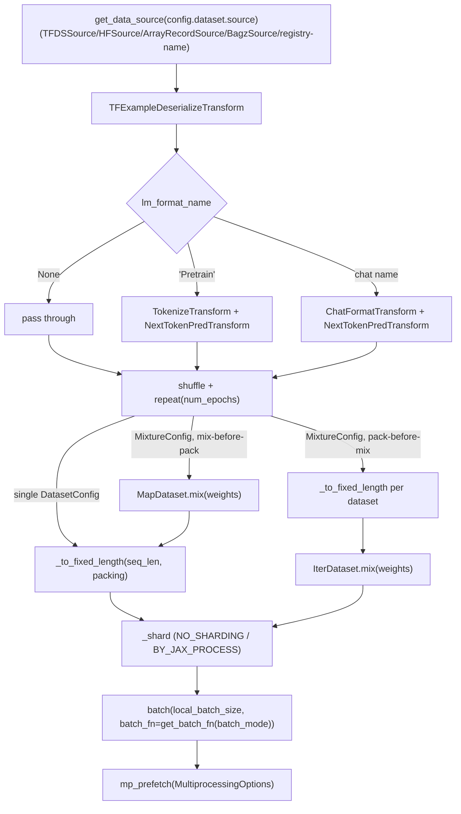

# simply.data_lib — the Grain-native tokenize/format/pack/mix data pipeline

## Overview

[`create_iter_dataset`](../catalog/simply/data_lib.md#create_iter_dataset) is the single entry point
that turns a config's `dataset` field (a [`DatasetConfig`](../catalog/simply/data_lib.md#DatasetConfig),
a `MixtureConfig`, or a registry-lookup string) into a ready-to-iterate `grain.IterDataset`. The
pipeline is a fixed sequence of stages — raw source → deserialize → tokenize/format → (optionally)
mix → pack to fixed length → shard → batch → prefetch — with each stage's *behavior* (not its
presence) controlled by a small vocabulary of config strings:
[`lm_format_name`](../catalog/simply/data_lib.md#DatasetConfig) selects the tokenization/formatting
transform, `packing` selects how variable-length tokenized examples become fixed-`seq_len` training
sequences. [`DataSourceRegistry`](../catalog/simply/data_lib.md#DataSourceRegistry) and
[`DatasetConfigRegistry`](../catalog/simply/config_lib.md) let both raw sources and whole dataset
configs be referenced by string name from an experiment config, mirroring every other registry in
the codebase (see [simply-utils-registry](simply-utils-registry.md)).

## Diagram

## Design rationale (why it's built this way)

**`lm_format_name` and `packing` are independent axes, not a single combined mode string.** A
[`DatasetConfig`](../catalog/simply/data_lib.md#DatasetConfig) sets both fields separately — per its
own docstring, `None`/`'Pretrain'`/a chat-format name selects *how tokens are produced*, while
`'concat_split'`/`'first_fit'`/`'pad_or_truncate'`/`'none'` independently selects *how tokenized
examples become fixed-length sequences* — this is why chat/SFT data typically pairs a chat format
name with `'first_fit'` packing (preserving conversation boundaries) while pretraining pairs
`'Pretrain'` with `'concat_split'` (maximizing token-utilization throughput by concatenating across
document boundaries), without needing a combinatorial set of named "modes."

**Validation mode silently forces `packing='pad_or_truncate'` regardless of the config's own
setting, with a logged warning rather than a silent override.**
[`create_iter_dataset`](../catalog/simply/data_lib.md#create_iter_dataset)'s inner `_pack` helper
checks `if not training and packing != PACKING_PAD_OR_TRUNCATE: logging.warning(...)` before using
`PACKING_PAD_OR_TRUNCATE` unconditionally for validation — concat-split or first-fit packing would
produce a variable, data-dependent number of evaluation sequences per epoch (since packing merges/
splits examples), which would make "number of validation steps" ill-defined; pad-or-truncate
guarantees exactly one fixed-length sequence per source example, giving a deterministic eval set
size.

**Mixture packing order (`pack_before_mix` vs. the default mix-then-pack) determines whether packed
sequences can span multiple source datasets — and the two paths use genuinely different Grain APIs
(`MapDataset.mix` vs. `IterDataset.mix`), not just a flag threaded through one path.** When
`pack_before_mix=True`, each sub-dataset is individually converted to fixed length via
`_to_fixed_length` *before* `grain.IterDataset.mix(datasets, weights=weights)` combines them — every
packed sequence is guaranteed to come from exactly one source dataset. When `False` (default), the
still-variable-length `MapDataset`s are mixed first via `grain.MapDataset.mix`, and *then* packed as
one combined stream — so a single packed training sequence may interleave examples from different
source datasets, maximizing throughput at the cost of that per-sequence purity guarantee.

**When datasets with different `packing` settings are mixed without `pack_before_mix`, the mixture as
a whole must adopt one packing method — resolved by an explicit priority rule, not a config error.**
`create_iter_dataset`'s comment spells out the rule: "If ALL datasets use `'none'`, use `'none'`... If
any uses `'first_fit'`, use that (preserves example boundaries)... Otherwise use `'concat_split'`
(best throughput)" — `first_fit` (boundary-preserving) takes priority over `concat_split`
(throughput-optimizing) whenever both are present in one mixture, favoring correctness (no
mid-example splitting) over raw throughput when the two goals conflict.

**Sharding across JAX processes divides `batch_size` before batching, and validates evenness
explicitly rather than silently flooring/padding.**
[`create_iter_dataset`](../catalog/simply/data_lib.md#create_iter_dataset)'s `_finalize` computes
`local_batch_size = batch_size // jax.process_count()` only when `shard_data_method ==
'BY_JAX_PROCESS'`, raising `ValueError` up front if `batch_size % jax.process_count() != 0` — an
uneven per-host batch split fails fast at pipeline-construction time rather than producing a subtly
wrong global batch size at run time.

**Multiprocessing prefetch degrades gracefully to zero workers, per the project's own documented
convention.** The repo's CLAUDE.md documents this as a "Key Learning": "Grain mp_prefetch: Handles 0
workers gracefully (no-op)" — `prefetch_num_workers=0` in a config disables the multi-process
prefetch pool entirely rather than erroring, useful for debugging/single-process runs where spawning
worker processes is undesirable.

> [!inferred] `_get_tokenizer`/`_get_lm_format` (both `@functools.cache`d, per their names in this
> packet's subgraph adjacency) suggest tokenizer and LM-format instances are resolved once per unique
> name and reused across every dataset built from that name within a process — avoiding repeated
> vocab-file loads for, e.g., a `MixtureConfig` whose sub-datasets share the same tokenizer.

## Entry points

- [`create_iter_dataset`](../catalog/simply/data_lib.md#create_iter_dataset) — the single function
  every training/eval loop calls to get a ready `grain.IterDataset`; `training=False` switches to the
  validation-mode path.
- [`DataSourceRegistry`](../catalog/simply/data_lib.md#DataSourceRegistry) — where raw sources
  (TFDS, HuggingFace, ArrayRecord, Bagz, or bespoke JSON-file sources like
  [`SimpleQANumSource`](../catalog/simply/data_lib.md#SimpleQANumSource)/`GSM8KSource`) are
  registered by name for `DatasetConfig.source` string shorthand.
- [`_create_map_dataset`](../catalog/simply/data_lib.md#_create_map_dataset) — the per-`DatasetConfig`
  pipeline stage (source → deserialize → tokenize/format → shuffle → repeat), reused both for single
  datasets and for each sub-dataset of a `MixtureConfig`.
- [`_to_fixed_length`](../catalog/simply/data_lib.md#_to_fixed_length) — the packing-method dispatcher
  converting a stream of variable-length tokenized examples into fixed-`seq_len` sequences.

## Mechanism (step-by-step)

1. **Resolve the [`DatasetConfig`](../catalog/simply/data_lib.md#DatasetConfig)** — training vs.
   validation selects `config.dataset` vs.
   `config.validation_dataset` (falling back to `config.dataset` if unset), along with the
   corresponding batch size, shuffle flag, and epoch count; any string shorthand is resolved via
   `DatasetConfigRegistry.get_instance`.
2. **`_create_map_dataset` builds the per-example pipeline.** Resolve the effective tokenizer name
   (`ds_config.tokenizer_name` overriding the experiment's default `vocab_name`); fetch the raw source
   via [`get_data_source`](../catalog/simply/data_lib.md#get_data_source); apply
   `TFExampleDeserializeTransform` (a no-op for already-dict sources); dispatch on `lm_format_name`
   into raw/`TokenizeTransform`+`NextTokenPredTransform`/`ChatFormatTransform`+`NextTokenPredTransform`;
   shuffle (seeded, with a `seed_offset` for mixture sub-datasets to avoid correlated shuffling across
   them) and repeat.
3. **Single-dataset or mixture branches diverge at the packing/mixing step**, dispatched through
   [`_to_fixed_length`](../catalog/simply/data_lib.md#_to_fixed_length), per the two Grain-API
   paths described in the design-rationale section above.
4. **Within [`create_iter_dataset`](../catalog/simply/data_lib.md#create_iter_dataset), `_shard`
   applies process-level data sharding** (`NO_SHARDING` or `BY_JAX_PROCESS`, the latter
   slicing the `MapDataset` by `[jax.process_index()::jax.process_count()]`).
5. **The [`_pack`](../catalog/simply/data_lib.md#create_iter_dataset._pack)-ed stream is then
   finalized: `_finalize` batches (with a `batch_fn` chosen by `batch_mode` — `BATCH_STACKED` vs.
   `BATCH_UNSTACKED`, the latter used by RL per [simply-config_lib](simply-config_lib.md)'s
   `RLExperimentConfig.batch_mode` default) and wraps in `mp_prefetch`.**

## Key data structures

- **[`DatasetConfig`](../catalog/simply/data_lib.md#DatasetConfig)** — `source`, `lm_format_name`,
  `packing`, `data_key`, `tokenizer_name`, `add_eos`/`add_bos`, `trainable_roles`.
- **`MixtureConfig`** — `datasets: Sequence[(DatasetConfig | str, weight)]`, `pack_before_mix`; raises
  in `__post_init__` if empty or any weight is non-positive.
- **Source types** — [`TFDSSource`](../catalog/simply/data_lib.md), `HFSource`,
  `ArrayRecordSource`, `BagzSource` (generic backends), plus repo-specific registered sources like
  [`SimpleQANumSource`](../catalog/simply/data_lib.md#SimpleQANumSource)/`GSM8KSource`/`AIME24Source`/
  `MATH500Source` (evaluation/RL benchmark datasets).
- **Packing constants** — [`PACKING_NONE`](../catalog/simply/data_lib.md#PACKING_NONE)/
  `PACKING_FIRST_FIT`/`PACKING_CONCAT_SPLIT`/`PACKING_PAD_OR_TRUNCATE`.

## Dynamics (design intent)

Because `_create_map_dataset` is reused identically for both the single-`DatasetConfig` path and each
sub-dataset of a `MixtureConfig`, any new tokenization/formatting logic added there automatically
applies uniformly whether or not the caller is mixing datasets — there's no separate "mixture-mode"
tokenization code path to keep in sync.

## Edge cases

- `MixtureConfig.__post_init__` raises `ValueError` for a zero-length `datasets` sequence or any
  non-positive weight — malformed mixtures fail at config-construction time, not lazily when the
  pipeline first pulls data.
- The `BY_JAX_PROCESS` sharding path raises immediately if `batch_size` doesn't evenly divide
  `jax.process_count()`, rather than silently using an uneven per-host batch.

## Open questions

- Whether `TFExampleDeserializeTransform`'s "handles both bytes and dicts" dual-mode behavior has any
  performance cost when applied as a no-op to already-dict sources isn't discussed in this packet's
  grounding.

## See also
- [simply-utils-registry](simply-utils-registry.md) — `RootRegistry`, the base for
  `DataSourceRegistry`/`DatasetConfigRegistry`.
- [simply-utils-lm_format](simply-utils-lm_format.md) — `LMFormat.format_tokens`, the function
  `ChatFormatTransform` delegates to for chat-format tokenization + loss masking.
- [simply-utils-tokenization](simply-utils-tokenization.md) — `TokenizerRegistry`, resolved via
  `_get_tokenizer`.
- [simply-config_lib](simply-config_lib.md) — `BaseExperimentConfig.dataset`/`batch_mode`, the
  config fields this module reads.
