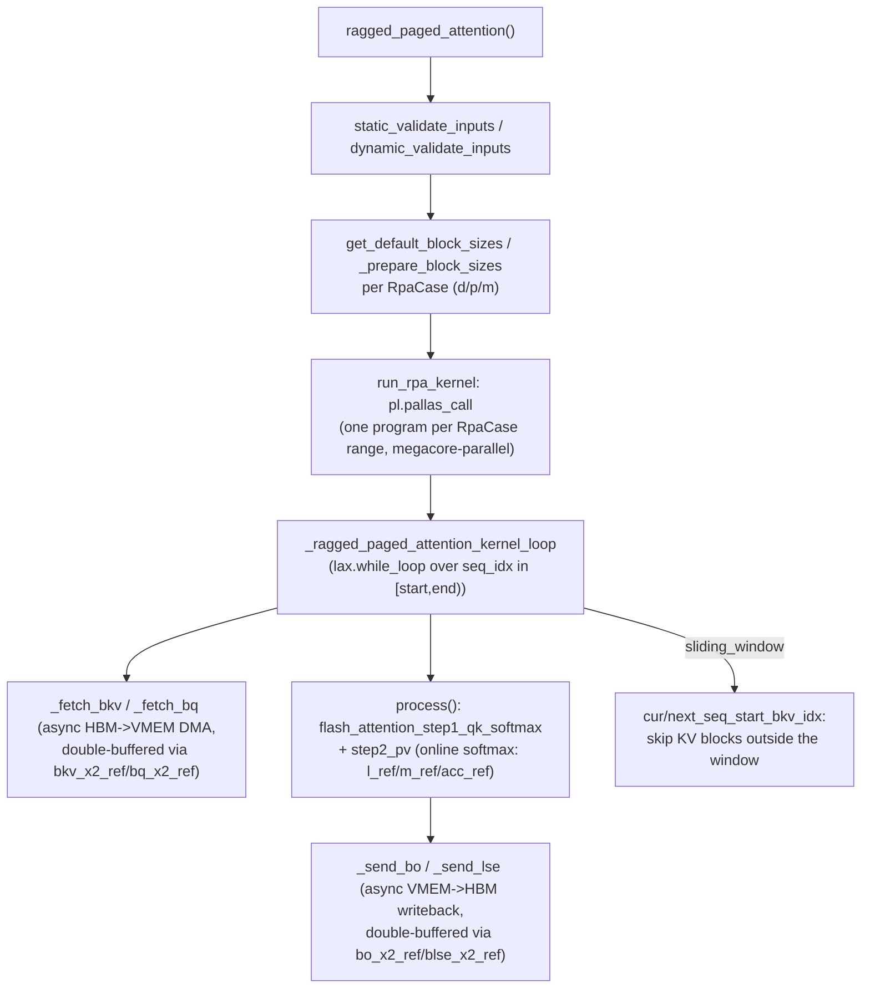

# simply.kernels.ragged_paged_attention — the Pallas double-buffered flash-attention-over-pages kernel

<!-- connect:up:begin -->
> **Cross-repo concept:** part of [flash-attention](../../../concepts/flash-attention.md), [pallas-kernel](../../../concepts/pallas-kernel.md) across this wiki's repos.
<!-- connect:up:end -->
## Overview

This module is a hand-written Mosaic/Pallas TPU kernel implementing ragged (variable-length,
concatenated-batch), paged-KV-cache attention with mixed prefill and decode in one kernel invocation
— vendored and adapted from
[vLLM's tpu-inference kernel](../catalog/simply/kernels/ragged_paged_attention.md#ragged_paged_attention)
(the file's own header documents this provenance and the local deltas: KV-cache-update toggle,
logsumexp residual output, empty-sequence skipping, 2-D page indices, round-robin context sharding,
megacore support). The kernel dispatches each sequence into one of three cases —
[`RpaCase.DECODE`](../catalog/simply/kernels/ragged_paged_attention.md#RpaCase.DECODE)/
[`PREFILL`](../catalog/simply/kernels/ragged_paged_attention.md#RpaCase.PREFILL)/
[`MIXED`](../catalog/simply/kernels/ragged_paged_attention.md#RpaCase.MIXED) — each with independently
tunable block sizes, and executes a **double-buffered async-copy pipeline**
([`_ragged_paged_attention_kernel_loop`](../catalog/simply/kernels/ragged_paged_attention.md#_ragged_paged_attention_kernel_loop))
that prefetches the next KV/Q blocks from HBM while computing flash-attention over the current ones,
writing results back to HBM asynchronously too. A pure-JAX
[`ref_ragged_paged_attention`](../catalog/simply/kernels/ragged_paged_attention.md#ref_ragged_paged_attention)
implements the identical numerics as a readable per-sequence Python loop, serving both as the CPU
fallback (Pallas is TPU-only) and as the correctness oracle the Pallas kernel is tested against.

## Diagram

## Design rationale (why it's built this way)

**Sequences are statically partitioned into DECODE/PREFILL/MIXED ranges via a `distribution` triple,
so each range can use block sizes tuned for its own access pattern.**
[`RpaCase.get_range`](../catalog/simply/kernels/ragged_paged_attention.md#RpaCase) reads
`distribution = (i, j, k)` to slice `[0:i)` (decode-only, `q_len == 1`), `[i:j)` (static prefill,
`q_len > 1` but not mixed with decode), `[j:k)` (mixed) — a decode-only sequence needs a small query
block (one token) but must scan a potentially very long KV history, whereas a prefill sequence has a
long, known-shape query block; [`get_default_block_sizes`](../catalog/simply/kernels/ragged_paged_attention.md#get_default_block_sizes)
and the top-level `d_block_sizes`/`p_block_sizes`/`m_block_sizes` parameters let each case be tuned
(or autotuned, via [`utils.ragged_paged_attention.autotune_block_sizes`](../catalog/simply/utils/ragged_paged_attention.md#autotune_block_sizes))
independently rather than forcing one block-size compromise across all three access patterns.

**Every HBM↔VMEM transfer is double-buffered (`_x2` suffix) so the DMA for the *next* block can be
in flight while the *current* block is being computed on.**
[`bkv_x2_ref`](../catalog/simply/kernels/ragged_paged_attention.md#_ragged_paged_attention_kernel_loop)/
`bq_x2_ref`/`bo_x2_ref`/`blse_x2_ref` are all shape `[2, ...]`, and
[`_fetch_bkv`](../catalog/simply/kernels/ragged_paged_attention.md#_ragged_paged_attention_kernel_loop._fetch_bkv)/
[`_fetch_bq`](../catalog/simply/kernels/ragged_paged_attention.md#_ragged_paged_attention_kernel_loop._fetch_bq)/
[`_send_bo`](../catalog/simply/kernels/ragged_paged_attention.md#_ragged_paged_attention_kernel_loop._send_bo)/
[`_send_lse`](../catalog/simply/kernels/ragged_paged_attention.md#_ragged_paged_attention_kernel_loop._send_lse)
each take a `bkv_sem_idx`/`bo_sem_idx` selecting which of the two buffer slots to target and a
`wait: bool` controlling whether the call blocks — the driving loop starts the *next* iteration's
fetch before waiting on the *current* iteration's data, the standard software-pipelined-DMA pattern
for hiding HBM latency behind compute on TPU.

**Sliding-window attention skips whole KV blocks that fall entirely outside the window, computed
once per sequence rather than re-checked per block.** `cur_seq_start_bkv_idx`/
`next_seq_start_bkv_idx` (in
[`_ragged_paged_attention_kernel_loop`](../catalog/simply/kernels/ragged_paged_attention.md#_ragged_paged_attention_kernel_loop))
are derived via
[`_global_pos_to_local_bkv_idx`](../catalog/simply/kernels/ragged_paged_attention.md#_ragged_paged_attention_kernel_loop._global_pos_to_local_bkv_idx)`(max(kv_q_gap
- sliding_window, 0))` — the first local-KV-block index that could still fall inside the window — so
the fetch/compute loop's starting point is shifted forward by whole blocks for windowed attention,
rather than fetching the full KV history and masking it out post-hoc; this is a genuine compute/DMA
saving, not just a masking convenience.

**Sharding awareness is expressed as one function, `compute_local_kv_len`, threaded through every
place a "how much KV do I actually have on this shard" question arises — not duplicated per call
site.** [`compute_local_kv_len`](../catalog/simply/kernels/ragged_paged_attention.md#compute_local_kv_len)
implements round-robin-across-shards page ownership (`full_pages_on_shard =
ceil_div(num_full_pages - shard_id, num_shards)`, plus a tail-token adjustment for the shard owning
the partial last page) — the same formula appears both inside the kernel (for skip-ahead / windowing
math) and in `utils.ragged_paged_attention.DecodeState`'s
[`_sharded_rpa_fn`](../catalog/simply/utils/ragged_paged_attention.md#DecodeState._sharded_rpa_fn)
wrapper (see [simply-utils-ragged_paged_attention](simply-utils-ragged_paged_attention.md))
computing per-shard masking for the cross-shard LSE merge — both sides of the shard boundary must
agree on exactly which tokens are "local" to a shard, and this shared function is what guarantees
that.

**Megacore (multi-core-per-chip) parallelism partitions *sequences*, not attention heads or KV
blocks, across cores.** [`_ragged_paged_attention_kernel`](../catalog/simply/kernels/ragged_paged_attention.md#_ragged_paged_attention_kernel)
computes `seqs_per_core = cdiv(num_seqs, num_cores)` and each core's `core_start`/`core_end` — a
simple range split, since sequences within one `RpaCase` range are independent of each other (no
cross-sequence data dependency), making sequence-level partitioning the natural and simplest axis for
extra cores, at the (acknowledged, per the top-level function's own comment) risk of megacore hurting
small workloads due to synchronization overhead when there isn't enough sequence-level parallelism to
amortize it.

**Empty sequences (zero query length or zero local KV length) are skipped by advancing directly to
the next valid sequence index, computed via a small `while_loop`, rather than being processed and
masked to no-ops.** [`_find_first_valid_seq`](../catalog/simply/kernels/ragged_paged_attention.md#_find_first_valid_seq)
scans forward from `start_idx` while `cu_q_lens[idx] == cu_q_lens[idx+1]` (empty query) or
`compute_local_kv_len(...) == 0` (no local KV on this shard) — this is one of the deltas the file
header documents relative to the upstream vLLM kernel ("Skipped sequences with empty queries or empty
KVs"), presumably added because Simply's continuous-batching padding scheme
([simply-utils-ragged_paged_attention](simply-utils-ragged_paged_attention.md)'s pad slots) produces
genuinely empty sequences routinely, unlike vLLM's own batching.

> [!inferred] [`ref_ragged_paged_attention`](../catalog/simply/kernels/ragged_paged_attention.md#ref_ragged_paged_attention)'s
> `q_scale`/`k_scale`/`v_scale` parameters (applied via clip-then-cast for `q_scale`, plain
> multiplication for `k_scale`/`v_scale`) suggest this kernel is designed to accept quantized (e.g.
> int8) Q/K/V inputs with associated per-tensor dequantization scales, not just full-precision
> float/bfloat16 — consistent with `keys`/`values`'s docstring noting "(quantized)" in the top-level
> [`ragged_paged_attention`](../catalog/simply/kernels/ragged_paged_attention.md#ragged_paged_attention)
> signature.

## Entry points

- [`ragged_paged_attention`](../catalog/simply/kernels/ragged_paged_attention.md#ragged_paged_attention) —
  the public entry point; validates inputs, resolves block sizes per case, and dispatches into
  [`run_rpa_kernel`](../catalog/simply/kernels/ragged_paged_attention.md#ragged_paged_attention.run_rpa_kernel)'s
  `pl.pallas_call`. Called from
  [`utils.ragged_paged_attention.DecodeState.update_decode_state_and_compute_attn`](../catalog/simply/utils/ragged_paged_attention.md#DecodeState.update_decode_state_and_compute_attn)
  under a `shard_map`.
- [`ref_ragged_paged_attention`](../catalog/simply/kernels/ragged_paged_attention.md#ref_ragged_paged_attention) —
  the CPU-safe, pure-JAX reference; used automatically when running on non-TPU platforms and as the
  ground truth in tests.
- [`get_default_block_sizes`](../catalog/simply/kernels/ragged_paged_attention.md#get_default_block_sizes) —
  the block-size heuristic callers fall back to when not supplying explicit
  `d_block_sizes`/`p_block_sizes`/`m_block_sizes`.

## Mechanism (step-by-step)

1. **Inputs are validated twice: statically (shape/dtype/config consistency) and dynamically (value
   ranges), before any kernel launch.**
   [`static_validate_inputs`](../catalog/simply/kernels/ragged_paged_attention.md#static_validate_inputs)/
   [`dynamic_validate_inputs`](../catalog/simply/kernels/ragged_paged_attention.md#dynamic_validate_inputs)
   run first in both
   [`ragged_paged_attention`](../catalog/simply/kernels/ragged_paged_attention.md#ragged_paged_attention)
   and [`ref_ragged_paged_attention`](../catalog/simply/kernels/ragged_paged_attention.md#ref_ragged_paged_attention).
2. **Q/K/V are reshaped into the kernel's TPU-friendly packed layout.**
   [`prepare_inputs`](../catalog/simply/kernels/ragged_paged_attention.md#prepare_inputs) and
   [`merge_kv`](../catalog/simply/kernels/ragged_paged_attention.md#merge_kv) interleave K and V into
   one combined `num_kv_heads * 2` axis and pack multiple sub-32-bit dtype elements per 32-bit lane
   (`get_dtype_packing`), matching the paged KV cache's own on-disk layout (see
   [`get_kv_cache_shape`](../catalog/simply/kernels/ragged_paged_attention.md#get_kv_cache_shape)).
3. **[`run_rpa_kernel`](../catalog/simply/kernels/ragged_paged_attention.md#ragged_paged_attention.run_rpa_kernel)
   launches one `pl.pallas_call` per `RpaCase` range, parallel across megacore
   cores when available.** Each program handles a contiguous sub-range of sequences within its case;
   `dimension_semantics=("parallel",)` when `num_cores > 1` tells Mosaic the per-core ranges are
   independent.
4. **`_ragged_paged_attention_kernel_loop` runs a `while_loop` over `seq_idx`, overlapping fetch,
   compute, and writeback across consecutive sequences.** Per iteration: start the next sequence's
   KV/Q prefetch (into the *other* double-buffer slot), wait on and consume the current sequence's
   already-prefetched data via
   [`process`](../catalog/simply/kernels/ragged_paged_attention.md#_ragged_paged_attention_kernel_loop.process)
   (running [`flash_attention_step1_qk_softmax`](../catalog/simply/kernels/ragged_paged_attention.md#_ragged_paged_attention_kernel_loop)
   then `step2_pv`, maintaining online-softmax running max/sum/accumulator in `m_ref`/`l_ref`/
   `acc_ref`), then start the async writeback of this sequence's output/logsumexp.
5. **Sliding-window sequences skip leading KV blocks whose tokens are provably outside the window**,
   computed once via
   [`_global_pos_to_local_bkv_idx`](../catalog/simply/kernels/ragged_paged_attention.md#_ragged_paged_attention_kernel_loop._global_pos_to_local_bkv_idx)
   rather than fetched-then-masked.
6. **[`ref_ragged_paged_attention`](../catalog/simply/kernels/ragged_paged_attention.md#ref_ragged_paged_attention)
   computes the identical math in eager JAX, one sequence at a time,
   with an explicit causal+window mask and `jax.nn.softmax`/`logsumexp`** — used for CPU execution and
   as the numerical oracle the Pallas kernel's outputs are checked against in tests.

## Key data structures

- **[`RpaCase`](../catalog/simply/kernels/ragged_paged_attention.md#RpaCase)** (`Enum`) —
  [`DECODE`](../catalog/simply/kernels/ragged_paged_attention.md#RpaCase.DECODE)/
  [`PREFILL`](../catalog/simply/kernels/ragged_paged_attention.md#RpaCase.PREFILL)/
  [`MIXED`](../catalog/simply/kernels/ragged_paged_attention.md#RpaCase.MIXED), each owning a
  [`symbol`](../catalog/simply/kernels/ragged_paged_attention.md#RpaCase.symbol) (`"d"`/`"p"`/`"m"`,
  used in kernel naming/debugging) and a `get_range(distribution)` slicer.
- **Double-buffered scratch refs** (`bkv_x2_ref`, `bq_x2_ref`, `bo_x2_ref`, `blse_x2_ref`) — VMEM
  scratch, shape-prefixed with a `2` for the two pipeline slots; sized via
  [`get_vmem_estimate_bytes`](../catalog/simply/kernels/ragged_paged_attention.md#get_vmem_estimate_bytes)/
  [`get_smem_estimate_bytes`](../catalog/simply/kernels/ragged_paged_attention.md#get_smem_estimate_bytes).
- **Online-softmax accumulators** (`l_ref`, `m_ref`, `acc_ref`) — the running sum, running max, and
  weighted-value accumulator standard to flash-attention-style kernels.

## Dynamics (design intent)

Because block-size selection and megacore usage are resolved once per `ragged_paged_attention` call
(not re-tuned per sequence), the same compiled kernel program serves every sequence within a given
`RpaCase` range for that call — sequences differing only in length/KV content reuse one compiled
executable, which is central to why the batcher (see
[simply-serving-page_batcher](simply-serving-page_batcher.md)) can call this kernel every decode step
without triggering per-request recompilation.

## Edge cases

- [`ragged_paged_attention`](../catalog/simply/kernels/ragged_paged_attention.md#ragged_paged_attention)'s
  docstring is explicit that sequences with empty queries or empty KVs are *skipped*, and "the
  corresponding attention outputs are undefined" for those — callers must not rely on any particular
  value for a skipped sequence's output slot.
- `skip_kv_mask=True` is only valid when `use_causal_mask=False` *and* every dynamic `kv_len` is a
  multiple of `bkv_csz` — an optimization flag with a real correctness precondition, not a free
  performance toggle.

## Open questions

- The precise numerical conditions (beyond "VREG spilling is fixed", per a `TODO` comment near
  `vmem_limit_bytes`) under which `get_vmem_estimate_bytes` would replace the current
  `DEFAULT_VMEM_LIMIT_BYTES` constant aren't resolved within this packet's grounding.

## See also
- [simply-utils-ragged_paged_attention](simply-utils-ragged_paged_attention.md) — `DecodeState`/
  `SamplingState`, the caller-side state machine that invokes this kernel every decode step.
