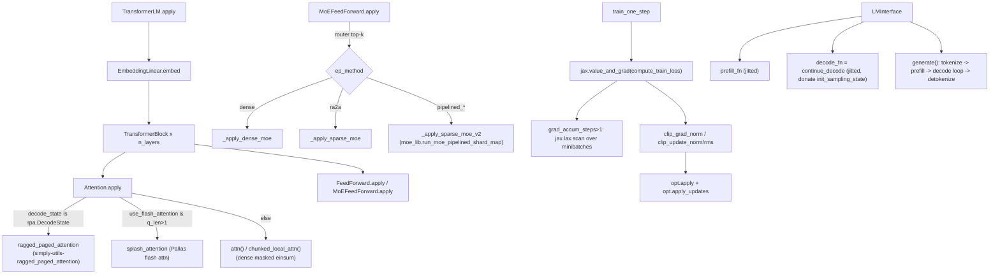

# simply.model_lib — the transformer model, training loop, and LMInterface

## Overview

This is Simply's central model file: the transformer architecture
([`Attention`](../catalog/simply/model_lib.md#Attention.apply),
`FeedForward`/
[`MoEFeedForward`](../catalog/simply/model_lib.md#MoEFeedForward.apply),
[`TransformerBlock`](../catalog/simply/model_lib.md#TransformerBlock.apply),
`TransformerLM`), all built from
[simply-utils-module](simply-utils-module.md)'s `SimplyModule`/`EinsumLinear` primitives; the training
loop ([`train_one_step`](../catalog/simply/model_lib.md#run_experiment),
[`run_experiment`](../catalog/simply/model_lib.md#run_experiment)); and the inference-time driver
[`LMInterface`](../catalog/simply/model_lib.md#LMInterface.input_processor), which owns three jitted
entry points (`prefill_fn`, `decode_fn`, `pad_state_to_fn`) and exposes
[`generate`](../catalog/simply/model_lib.md#LMInterface.generate)/
[`score`](../catalog/simply/model_lib.md#LMInterface.score_tokens) as the public API. Its most
TPU-perf-relevant structural feature is that **`Attention` has three interchangeable compute
backends** — the [ragged-paged-attention](simply-utils-ragged_paged_attention.md) decode path, a
Splash/flash-attention path for long-context training, and a naive dense-mask path — selected purely
by which arguments are non-`None`, and **`MoEFeedForward` has four interchangeable expert-dispatch
strategies** built on [simply-utils-moe_lib](simply-utils-moe_lib.md).

## Diagram

## Design rationale (why it's built this way)

**`Attention.apply` picks its compute backend by inspecting the *shape* of `decode_state`, not an
explicit mode flag.** [`Attention.apply`](../catalog/simply/model_lib.md#Attention.apply) checks
`isinstance(decode_state, rpa.DecodeState)` to route into
[`update_decode_state_and_compute_attn`](../catalog/simply/utils/ragged_paged_attention.md#DecodeState.update_decode_state_and_compute_attn)
(continuous-batching decode); otherwise it falls through to the dict-based `decode_state` used by
[`updated_decode_state`](../catalog/simply/model_lib.md) (a plain KV-buffer append, used by
non-paged training/eval decode), and *within* that branch, `use_flash_attention and q_seq_len > 1`
selects Splash attention over the dense masked path — so the same `Attention` module class serves
paged-serving decode, buffered-KV eval decode, and long-context flash-attended training, with the
data shape of what's passed in doing the dispatching rather than three separate module types.

**Flash attention has explicit pre/post-processing hooks (`_preprocess_flash_qkv`/
`_postprocess_flash_output`) specifically so subclasses can reorder queries for load-balanced causal
attention without touching the core Splash-kernel wiring.** Both methods are documented as override
points ("Subclasses can override to modify Q ordering... and provide a matching mask"); the base
implementation is a no-op pass-through (`CausalMask` optionally `&`-combined with a `LocalMask` for
windowed attention) — this is the seam a load-balancing scheme (e.g. interleaving query blocks so
each shard/core gets a similar amount of causal-masked work) would hook into, without needing to fork
the whole `Attention.apply` method.

**MoE routing computes `topk`/`softmax` in one of two orders depending on `k`, specifically to avoid
a zero-gradient pathology at `k=1`.**
[`MoEFeedForward.apply`](../catalog/simply/model_lib.md#MoEFeedForward.apply)'s comment is explicit:
"Apply `softmax => topk` when k == 1 to avoid zero gradient on the router logits" — for `k=1`,
`softmax` is applied to the *full* router-logit vector first, then `top_k` selects the winner (so the
gradient w.r.t. every logit, including the losing ones, is nonzero via the softmax's normalization
term); for `k>1`, the reverse order (`top_k` then `softmax` restricted to the selected subset) gives a
properly renormalized probability distribution over just the chosen experts.

**Four MoE dispatch strategies share one entry point (`ep_method`), letting a config swap between
"simple but only for small models" and "complex but scalable" without touching model code.**
[`_apply_dense_moe`](../catalog/simply/model_lib.md#MoEFeedForward._apply_dense_moe) (`ep_method='dense'`,
compute every expert on every token — no communication, quadratic in `num_experts` FLOPs but no
routing complexity), [`_apply_sparse_moe`](../catalog/simply/model_lib.md#MoEFeedForward._apply_sparse_moe)
(`ep_method='ra2a'`, worst-case-sized ragged-all-to-all buffers, no pipelining), and
[`_apply_sparse_moe_v2`](../catalog/simply/model_lib.md#MoEFeedForward._apply_sparse_moe_v2)
(`ep_method` starting with `'pipelined'`, delegating to
`moe_lib.run_moe_pipelined_shard_map`,
see [simply-utils-moe_lib](simply-utils-moe_lib.md)) are all selected by one string field — the
progression from dense→sparse→pipelined-sparse is a pure performance-scaling knob, not an
architecture change, since all three compute the mathematically identical top-k mixture.

**Gradient accumulation reshapes the batch into a `(grad_accum_steps, microbatch, ...)` grid and
drives it with `jax.lax.scan`, not a Python loop, so accumulation happens inside one compiled
program.** [`train_one_step`](../catalog/simply/model_lib.md#run_experiment)'s `grad_accum_steps > 1`
branch rearranges the batch via `einops.rearrange(x, '(g m) ... -> g m ...')`, then
`jax.lax.scan(grad_accum_step_fn, init=(zero_loss, zero_grad), xs=batch)` accumulates loss and
gradient per microbatch, weighted by each microbatch's own `loss_weight` (so padding/masking is
correctly proportional even when microbatches have different numbers of valid tokens) — this is a
single compiled step, not `grad_accum_steps` separate dispatches, keeping the whole accumulation
inside one XLA program for compute/communication overlap opportunities.

**Gradient/update clipping is norm-based *or* RMS-based, at three independent points in the
pipeline (raw grad, post-optimizer update, both globally and per-tensor).**
[`train_one_step`](../catalog/simply/model_lib.md#run_experiment) applies
[`clip_tree_fn`](../catalog/simply/model_lib.md) (parameterized by either
[`tree_norm`](../catalog/simply/model_lib.md) or [`tree_rms`](../catalog/simply/model_lib.md)) to the
raw gradient (`clip_grad_norm`) and, separately, to the optimizer's output update
(`clip_update_norm`/`clip_update_rms`, with an additional `clip_local_update_rms` variant operating
per-tensor rather than globally) — three independent, optionally-enabled clipping points rather than
one fixed clipping policy, letting a config combine e.g. global gradient-norm clipping with
per-tensor update-RMS clipping (a AdaFactor/Adam-style trick) simultaneously.

> [!inferred] [`LMInterface.__init__`](../catalog/simply/model_lib.md#LMInterface.input_processor)
> jits `prefill_fn` with `static_argnames=['return_logits']` and `decode_fn` (=
> [`continue_decode`](../catalog/simply/model_lib.md)) with `donate_argnames='init_sampling_state'`
> and `static_argnames=('top_k', 'scoring_top_k')` — the donation lets XLA reuse the (potentially
> large) sampling-state buffers in place across decode calls, mirroring the same
> `donate_argnames`/`donate_argnums` pattern used throughout
> [simply-serving-page_batcher](simply-serving-page_batcher.md)'s compiled functions.

## Entry points

- [`TransformerLM.apply`](../catalog/simply/model_lib.md#TransformerLM.apply) — the whole model's
  forward pass; called both by the training loss functions and by `LMInterface`'s `prefill_fn`/
  `decode_fn`.
- [`Attention.apply`](../catalog/simply/model_lib.md#Attention.apply) — one call per layer per
  forward pass; the three-way backend dispatch described above happens here.
- [`MoEFeedForward.apply`](../catalog/simply/model_lib.md#MoEFeedForward.apply) — one call per MoE
  layer per forward pass; routes to one of four dispatch implementations.
- [`train_one_step`](../catalog/simply/model_lib.md#run_experiment) — one call per optimizer step;
  the single function tying loss computation, gradient accumulation, clipping, and the optimizer
  update together.
- [`run_experiment`](../catalog/simply/model_lib.md#run_experiment) — the top-level training-loop
  driver (config → model/optimizer construction → step loop → checkpointing/eval), registered under
  [`TrainLoopRegistry`](../catalog/simply/model_lib.md).
- [`LMInterface.generate`](../catalog/simply/model_lib.md#LMInterface.generate)/
  [`score`](../catalog/simply/model_lib.md#LMInterface.score_tokens) — the inference-time public API;
  `generate` tokenizes, prefills, decodes, and detokenizes; `score`/`score_tokens` compute
  log-likelihoods without sampling.

## Mechanism (step-by-step)

1. **`TransformerBlock.apply`** normalizes, calls [`Attention.apply`](../catalog/simply/model_lib.md#Attention.apply)
   (via its own [`attn`](../catalog/simply/model_lib.md#TransformerBlock.attn) sub-module) and
   [`FeedForward`/`MoEFeedForward.apply`](../catalog/simply/model_lib.md#TransformerBlock.ffn), with
   residual connections around each — the standard pre-norm transformer block structure.
2. **[`Attention.apply`](../catalog/simply/model_lib.md#Attention.apply) projects Q/K/V,
   scales/rotates them (`_scale_qk`: optional QK-norm, position
   encoding, and either per-dim-scale or plain `1/sqrt(head_dim)` scaling), then dispatches to one of
   three attention computations** based on `decode_state`'s type and `use_flash_attention`/`q_seq_len`,
   as described above.
3. **[`MoEFeedForward.apply`](../catalog/simply/model_lib.md#MoEFeedForward.apply) routes tokens via
   a top-k softmax over a float32 router**, computes
   auxiliary load-balancing (`lbl_loss`) and router-entropy/z-loss metrics/losses (gated by
   `lbl_loss_weight`/`router_z_loss_weight`), then dispatches the actual expert computation to one of
   `_apply_dense_moe`/`_apply_sparse_moe`/`_apply_sparse_moe_v2` per `ep_method`.
4. **[`run_experiment`](../catalog/simply/model_lib.md#run_experiment)'s per-step `train_one_step`
   computes loss+grad (with optional teacher-model distillation via
   `compute_distill_loss`), optionally accumulates over microbatches via `lax.scan`, clips grad and/or
   update, applies the optimizer, and optionally applies weight decay directly to the update before
   the final parameter subtraction.**
5. **`run_experiment` is the outer training loop**: builds the model/optimizer/sharding from config,
   constructs the initial or restored state (via
   [`get_init_state`](../catalog/simply/model_lib.md)/
   [`checkpoint_lib.load_checkpoint_from_path`](../catalog/simply/utils/checkpoint_lib.md#load_checkpoint_from_path)),
   and loops [`train_one_step_fn`](../catalog/simply/model_lib.md) over the data iterator, logging
   metrics via [`experiment_helper`](../catalog/simply/utils/experiment_helper.md#ExperimentHelper.add_metric)
   and periodically checkpointing/evaluating.
6. **[`LMInterface.generate`](../catalog/simply/model_lib.md#LMInterface.generate) tokenizes via its
   `input_processor`, runs one jitted prefill call, then
   drives `continue_decode` (a `jax.lax.while_loop` similar in spirit to
   `ragged_paged_attention.SamplingState.continue_decode`
   but over `model_lib`'s own, non-paged `SamplingState`), then detokenizes** — this is the buffered-
   KV-cache (non-paged) sibling of the paged continuous-batching path used by
   [simply-serving-page_batcher](simply-serving-page_batcher.md); `LMInterface` backs
   [simply-serving-vanilla_server](simply-serving-vanilla_server.md) instead.

## Key data structures

- **[`Attention`](../catalog/simply/model_lib.md#Attention.apply)** — the full transformer attention
  layer config: QKV/output projections (via `EinsumLinear`), `n_heads`/`n_kv_heads` (grouped-query
  attention support), `window_size`, `use_flash_attention`, `total_num_pages`/`page_size` (paged
  serving), `position_encoding`.
- **[`MoEFeedForward`](../catalog/simply/model_lib.md#MoEFeedForward.apply)** (subclasses
  `FeedForward`) — `num_experts`, `num_experts_per_token`, `ep_method`, `ep_capacity_factor`,
  `ep_pipeline_stages`, plus the auxiliary-loss weights `lbl_loss_weight`/`router_z_loss_weight`.
- **[`SamplingParams`](../catalog/simply/model_lib.md#SamplingParams)** /
  [`SamplingOutput`](../catalog/simply/model_lib.md#SamplingOutput)** — the `LMInterface.generate`
  configuration and result types.
- **`PyTree`/`Array`** ([`model_lib.PyTree`](../catalog/simply/model_lib.md#PyTree),
  [`model_lib.Array`](../catalog/simply/model_lib.md#Array)) — re-exported aliases of
  [`common.PyTree`](../catalog/simply/utils/common.md#PyTree.PyTree)/`Array`, used throughout this
  file's signatures.

## Dynamics (design intent)

Because `Attention.apply`'s backend choice is driven by the caller-supplied `decode_state`'s runtime
type/shape rather than a static config field read once, the *same* compiled `TransformerLM.apply`
function (traced once per distinct input shape/type combination) can serve prefill (dense or flash
path), buffered-KV decode, and paged decode across different call sites without the model definition
itself branching on a "serving mode" enum.

## Edge cases

- [`MoEFeedForward.setup`](../catalog/simply/model_lib.md) raises `ValueError` if
  `ffn_use_bias` is set — MoE FFN layers structurally cannot have biases in this implementation.
- [`Attention._preprocess_flash_qkv`](../catalog/simply/model_lib.md)'s own docstring warns the
  Splash masks it builds are "static... and their behavior are global," explicitly noting a
  limitation: "we cannot mask first/last k tokens for each sequence under packed mode" — a real
  constraint on using flash attention with packed (multi-document) sequences.

## Open questions

- The exact conditions under which `ep_capacity_factor` (dropping) vs. the dropless `ra2a`/pipelined
  paths are chosen in practice, beyond the `ep_method`/`ep_capacity_factor` combination check in
  `apply`, isn't elaborated within this packet's grounding.

## See also
- [simply-utils-module](simply-utils-module.md) — `SimplyModule`/`EinsumLinear`, the base every layer
  in this file is built from.
- [simply-utils-ragged_paged_attention](simply-utils-ragged_paged_attention.md) — the paged decode
  backend `Attention.apply` dispatches to.
- [simply-utils-moe_lib](simply-utils-moe_lib.md) — the pipelined expert-parallel dispatch backend
  `_apply_sparse_moe_v2` delegates to.
- [simply-utils-optimizers](simply-utils-optimizers.md) — `Optimizer.apply`/`apply_updates`, called
  from `train_one_step`.
