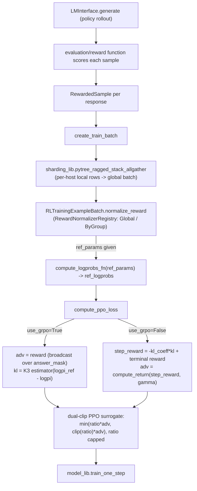

# simply.rl_lib — GRPO/PPO loss, reward normalization, and the sample-then-train RL loop

## Overview

This module implements Simply's RL training loop: sample rollouts from the current policy (via
[`model_lib.LMInterface.generate`](../catalog/simply/model_lib.md#LMInterface.generate)), score them
against a task-specific reward function, normalize rewards per-group
([`RewardNormalizer`](../catalog/simply/rl_lib.md)), assemble a globally-consistent training batch
across hosts ([`create_train_batch`](../catalog/simply/rl_lib.md#create_train_batch)), and train
against a unified GRPO/PPO objective
([`compute_ppo_loss`](../catalog/simply/rl_lib.md#compute_ppo_loss)) — all orchestrated by
[`run_experiment`](../catalog/simply/rl_lib.md#run_experiment), registered under
[`model_lib.TrainLoopRegistry`](../catalog/simply/model_lib.md) as `'rl'` (selected via
`BaseExperimentConfig.train_loop_name`, see [simply-config_lib](simply-config_lib.md)). The defining
mechanism is that **GRPO and PPO are the same loss function with one boolean flag
(`use_grpo`)**, differing only in how the advantage and KL term are derived, not in the surrounding
clipped-surrogate machinery.

## Diagram

## Design rationale (why it's built this way)

**GRPO and PPO share one function, `compute_ppo_loss`, because the only real difference is what
"advantage" and "KL" mean — the clipped-surrogate mechanics are identical either way.**
[`compute_ppo_loss`](../catalog/simply/rl_lib.md#compute_ppo_loss)'s `use_grpo` branch changes just
two things: the advantage computation (`adv = reward` broadcast across the whole answer span for
GRPO with `gamma=1`, vs. a proper discounted-return `compute_return` over a step-reward signal that
includes a per-token KL penalty for PPO) and the KL estimator (the K3 estimator
`expm1(logr) - logr` from [John Schulman's KL-approximation blog post](../catalog/simply/rl_lib.md),
cited directly in a comment, for GRPO; a plain log-ratio difference for PPO) — everything downstream
(ratio computation, clipping, the `min(surr1, surr2)` surrogate) is one code path for both.

**The advantage is *always* detached from the gradient (`jax.lax.stop_gradient`), even though it's
computed from the same forward pass's log-probabilities.** [`compute_ppo_loss`](../catalog/simply/rl_lib.md#compute_ppo_loss)
wraps the final `adv` in `jax.lax.stop_gradient` before it's used in the surrogate objective — the
policy gradient theorem requires the advantage to be treated as a constant multiplier on the
log-probability-ratio term, not something the gradient should also flow through, even in the
GRPO branch where `adv` is derived directly from `reward` (itself already a non-differentiable
scalar from the environment) — the `stop_gradient` here is belt-and-suspenders correctness rather
than strictly necessary in every branch.

**Dual-clip PPO caps the *ratio* itself (not just the clipped surrogate) when the advantage would
otherwise reward an extreme importance ratio.** [`compute_ppo_loss`](../catalog/simply/rl_lib.md#compute_ppo_loss)'s
`policy_ratio_cap` branch (citing arXiv:1912.09729 directly in a comment) applies
`ratio = jnp.minimum(ratio, policy_ratio_cap)` *before* the standard `clip(ratio, 1-eps_low,
1+eps_high)` surrogate computation, with an explicit assertion `policy_ratio_cap > 1.0 +
ppo_clip_eps_high` — this is the "dual-clip" fix to a known PPO pathology where a large negative
advantage combined with an extreme ratio can produce an unboundedly large positive loss gradient
signal; capping the ratio itself (not just the surrogate) bounds this pathological case.

**`create_train_batch` builds the global training batch via a ragged stack-allgather rather than a
regular `jax.lax.all_gather`, because different hosts may contribute different numbers of valid
samples.** [`create_train_batch`](../catalog/simply/rl_lib.md#create_train_batch) collects
`local_train_rows` (only samples where `is_valid_for_training`), then calls
`sharding_lib.pytree_ragged_stack_allgather`
(see [simply-utils-sharding](simply-utils-sharding.md)) with `num_per_process=num_valid_samples` — the
number of valid, trainable rollouts per host is data-dependent (a rollout can be filtered out for
being truncated, throttled, or otherwise invalid), so the gather must handle ragged per-host counts
rather than assuming a fixed uniform split.

**Reference-model log-probabilities are computed only if `ref_params` is supplied, and the resulting
`ref_logprobs` are themselves subsequently all-gathered across hosts — a second, separate
all-gather from the one that built the training batch itself.**
[`create_train_batch`](../catalog/simply/rl_lib.md#create_train_batch)'s tail computes `ref_logprobs =
compute_logprobs_fn(params=ref_params, batch={...})` on the *already-global* batch, then
`multihost_utils.process_allgather(ref_logprobs, tiled=True)` — meaning every host redundantly runs
the reference-model forward pass over the *entire* global batch (not just its own shard) and the
result is gathered again, rather than computing ref-logprobs per-shard and gathering once; the
function's own `TODO` comment flags a related robustness concern about relying on every process
having an identical pytree structure for this to work correctly.

**Reward normalization is pluggable via the same registry pattern as everything else, with two
built-in strategies reflecting genuinely different statistical assumptions.**
[`RewardNormalizer.Global`](../catalog/simply/rl_lib.md) normalizes by the whole batch's mean/std;
[`RewardNormalizer.ByGroup`](../catalog/simply/rl_lib.md) normalizes each *group* of samples sharing
the same `example_id` independently (the GRPO-standard per-prompt baseline) — `ByGroup`'s own `TODO`
comment ("Explore more efficient ways to implement this instead of this for loop") acknowledges its
group-boundary-scanning implementation is not the most efficient, but is correctness-first (a plain
Python `while` loop over contiguous same-`example_id` runs).

> [!inferred] [`compute_logprobs`](../catalog/simply/rl_lib.md)'s optional `microbatch_size`
> parameter reshapes the batch into `(num_microbatches, microbatch_size, ...)` and drives it via
> `jax.lax.scan` rather than one large forward pass — this is the same microbatching-via-scan pattern
> `model_lib.train_one_step`'s gradient accumulation
> uses, presumably needed because computing reference/policy log-probabilities over a large RL batch
> (potentially many long generated sequences) can exceed available memory in one shot.

## Entry points

- [`run_experiment`](../catalog/simply/rl_lib.md#run_experiment) — the RL training loop's top-level
  driver, registered as `'rl'` under
  [`model_lib.TrainLoopRegistry`](../catalog/simply/model_lib.md); selected via
  `BaseExperimentConfig.train_loop_name` or directly via
  [`RLExperimentConfig.train_loop_name`](../catalog/simply/config_lib.md)'s default.
- [`compute_ppo_loss`](../catalog/simply/rl_lib.md#compute_ppo_loss) — the loss function
  `model_lib.train_one_step` calls (via
  `custom_loss_fn` or the RL train loop's own wiring) once per training step.
- [`create_train_batch`](../catalog/simply/rl_lib.md#create_train_batch) — called once per RL
  iteration to turn locally-sampled, locally-rewarded rollouts into one global training batch.

## Mechanism (step-by-step)

1. **Rollouts are sampled from the current policy** via
   [`LMInterface.generate`](../catalog/simply/model_lib.md#LMInterface.generate) (outside this
   packet's own subgraph but the direct upstream caller), producing per-prompt
   [`RewardedSample`](../catalog/simply/rl_lib.md) instances once scored by the task's evaluation
   function.
2. **`create_train_batch` builds one `RLTrainingExampleBatch` per response**, padding every field to
   `max_seq_len` via
   [`RLTrainingExampleBatch.pad_sequences`](../catalog/simply/rl_lib.md#RLTrainingExampleBatch.pad_sequences),
   tagging
   each with an `in_batch_example_id` (offset by 1, reserving 0 for padding) so
   `RewardNormalizer.ByGroup` can identify same-prompt groups, and filtering to only
   `is_valid_for_training` rows before the cross-host gather.
3. **[`create_train_batch`](../catalog/simply/rl_lib.md#create_train_batch)'s ragged stack-allgather
   combines every host's valid local rows into one global batch**, then
   `RLTrainingExampleBatch.normalize_reward` applies the configured
   `RewardNormalizer`, and (if a reference model is configured)
   `ref_logprobs` are computed and gathered.
4. **[`compute_ppo_loss`](../catalog/simply/rl_lib.md#compute_ppo_loss) runs one forward pass over
   the batch**, computes `logpi` (current policy)
   against `logpi_old` (the sampling-time policy's logprobs, stored in the batch) and `logpi_ref`
   (reference-model logprobs, or `logpi_old` if no reference is configured), derives the
   advantage/KL per the GRPO-vs-PPO branch, computes the dual-clipped surrogate loss, and returns the
   loss plus a rich metrics dict (entropy, KL divergence, policy-ratio mean/max/min, log-prob-diff
   stats).
5. **After [`run_experiment`](../catalog/simply/rl_lib.md#run_experiment) obtains the loss,
   `model_lib.train_one_step`** (see [simply-model_lib](simply-model_lib.md)) then applies gradient
   clipping and the optimizer update exactly as it does for any other loss function — `rl_lib`
   contributes only the loss function and batch-construction logic, not a separate training-step
   implementation.

## Key data structures

- **[`RLTrainingExampleBatch`](../catalog/simply/rl_lib.md)** (registered JAX pytree dataclass) —
  `input_tokens`/`target_tokens`/`logprobs`/`target_mask`/`answer_mask` (per-token fields),
  `in_batch_example_id`/`reward`/`is_correct`/`is_valid_for_training` (per-example fields),
  optional `ref_logprobs`, `extra_inputs`.
- **[`RewardedSample`](../catalog/simply/rl_lib.md)** — the pre-batching record of one sampled
  response plus its evaluation outcome (`correct`, `reward`, `reward_result`).
- **[`RewardNormalizer.Base`](../catalog/simply/rl_lib.md)** (`abc.ABC`) — the
  `normalize(rewards, example_ids, masks)` contract; `Global` and `ByGroup` are the two registered
  implementations.

## Dynamics (design intent)

Because `compute_ppo_loss`'s GRPO/PPO branches only change the advantage/KL derivation, adding a
third RL algorithm variant to this codebase (e.g. a different advantage estimator) would most
naturally extend the same function with another flag/branch rather than forking the whole loss —
that's the precedent this module's own structure sets.

## Edge cases

- [`create_train_batch`](../catalog/simply/rl_lib.md#create_train_batch)'s own `TODO` comment flags a
  real fragility: it assumes every process has the *same* pytree structure for
  `RLTrainingExampleBatch` (e.g. same `extra_inputs` keys/shapes) before the allgather — a process
  with zero valid examples, or with different `extra_inputs` shapes (e.g. image vs. no-image inputs),
  could break this assumption.
- [`compute_return`](../catalog/simply/rl_lib.md)'s `gamma == 1.0` special case uses a
  `flip`+`cumsum`+`flip` closed form instead of the general `jax.lax.scan`-based recurrence — a
  deliberate fast path for the common undiscounted-return case.

## Open questions

- Whether `use_policy_logp_as_sampler_logp` (substituting the current policy's own logprobs for the
  sampling-time logprobs, per its inline comment "to avoid logp diff that may be caused by sharding
  diff") introduces any bias in an off-policy or multi-step training setting isn't discussed beyond
  the comment's stated on-policy-only rationale.

## See also
- [simply-model_lib](simply-model_lib.md) — `train_one_step`/`TrainLoopRegistry`, the training-step
  and registry infrastructure this module plugs into.
- [simply-utils-sharding](simply-utils-sharding.md) — `pytree_ragged_stack_allgather`, the multi-host
  gather primitive `create_train_batch` depends on.
- [simply-utils-registry](simply-utils-registry.md) — `RootRegistry`, the base for
  `RewardNormalizerRegistry`.
