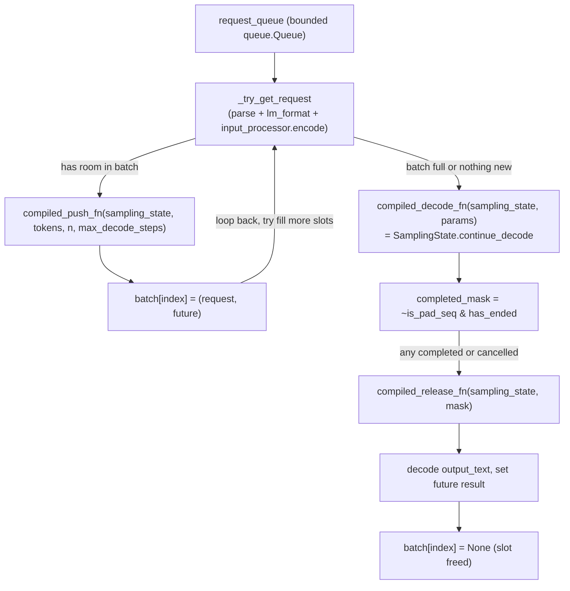

# simply.serving.page_batcher — continuous-batching gRPC serving over paged attention

## Overview

[`Batcher`](../catalog/simply/serving/page_batcher.md#Batcher.input_processor) is Simply's
continuous-batching inference server: instead of waiting for a fixed batch to fill before running one
decode step for everyone ([simply-serving-vanilla_server](simply-serving-vanilla_server.md)'s
approach), it maintains one persistent
[`rpa.SamplingState`](../catalog/simply/utils/ragged_paged_attention.md#SamplingState) (see
[simply-utils-ragged_paged_attention](simply-utils-ragged_paged_attention.md)) sized for the whole
server's page budget, and every loop iteration either **pushes** a newly-arrived request into a free
slot or **decodes** one step for every currently-active sequence — slots free up and get refilled
continuously as individual sequences finish, never blocking on the whole batch. Every hot-path
function (`decode_fn`, `SamplingState.push`, `SamplingState.release`) is pre-compiled once via
`jax.jit(...).lower(...).compile()` against abstract shapes, so the serving loop's steady-state cost
is just dispatching already-compiled XLA executables.

## Diagram

## Design rationale (why it's built this way)

**Every JIT-compiled hot-path function is compiled once, eagerly, against *abstract* shapes derived
from an uncompiled "eval" pass — not lazily on first real call.**
[`Batcher.abstract_model_state`](../catalog/simply/serving/page_batcher.md#Batcher.config) and
[`abstract_sampling_state`](../catalog/simply/serving/page_batcher.md#Batcher.compiled_decode_fn) both
call `core_common.eval_abstract_output`
(itself just `jax.jit(fn).lower(*args).compile().out_info`) to get `jax.ShapeDtypeStruct` trees
without ever running real data through the model;
[`compiled_decode_fn`](../catalog/simply/serving/page_batcher.md#Batcher.compiled_decode_fn)/
[`compiled_push_fn`](../catalog/simply/serving/page_batcher.md#Batcher.compiled_push_fn)/
[`compiled_release_fn`](../catalog/simply/serving/page_batcher.md#Batcher.compiled_release_fn) are
all `functools.cached_property`s that `.lower(abstract_state, ...).compile()` against those abstract
structs — so the (potentially expensive) XLA compilation happens once, up front, the first time each
cached property is accessed, not on every request.

**`decode_fn`'s early-stop condition (`until_fn`) is itself config-gated, trading latency for
throughput.** [`Batcher.decode_fn`](../catalog/simply/serving/page_batcher.md#Batcher.decode_fn)
builds `until_fn = lambda state: jnp.any(~state.is_pad_seq & state.has_ended)` only if
`response_asap` is set; otherwise `until_fn = lambda state: jnp.array(False)` (never stop early) —
`response_asap` presumably returns a completed sequence's response as soon as *any* one finishes
mid-multi-step-decode rather than waiting for the full `intermediate_steps` batch to run, at the cost
of the compiled `continue_decode` call needing to re-check the stop condition every inner step.

**The batcher loop is explicitly two-phase per iteration — fill first, decode only when nothing more
can be filled — implemented as an early `continue` rather than a nested loop.** In
[`Batcher.loop`](../catalog/simply/serving/page_batcher.md#Batcher.loop), after a successful
[`compiled_push_fn`](../catalog/simply/serving/page_batcher.md#Batcher.compiled_push_fn) call, the
loop does `continue` ("Try to fill more slots before decoding") — so decode only runs once no new
request was available in this iteration *and* the batch has at least one active sequence (`if not
any(batch): continue` skips decode-with-empty-batch too).

**All host-synchronization operations happen through `sharding.sum_across_hosts`, so a multi-host
deployment's per-host queue/cancellation state stays consistent without an explicit RPC layer between
hosts.** `stop_event.is_set()`, the queued input's length `n`, and the cancellation mask are all
reduced via [`sharding.sum_across_hosts`](../catalog/simply/utils/sharding.md#sum_across_hosts) before
being acted on — every host proposes its own local view (e.g. "I have `input_len` new tokens queued"),
and the sum (broadcast back to every host identically) becomes the shared ground truth every host acts
on identically, which is what keeps the *same* compiled/jitted decode step running in lockstep across
all hosts of a multi-host TPU pod.

**`_maybe_pause` treats "some host wants to pause" as "every host must pause," using the same
sum-across-hosts reduction.** `_maybe_pause`
checks `if not sharding.sum_across_hosts(pause_event.is_set()): return` — if *any* host's local
`pause_event` is set, the sum is nonzero on every host, so every host enters the pause/resume
handshake (`paused_event.set()` then `resume_event.wait()`) together, avoiding a scenario where one
host pauses its local loop while others keep running the shared jitted computation (which would
deadlock, since JIT'd multi-host collectives require every host to participate).

> [!inferred] [`Batcher.max_seq_len`](../catalog/simply/serving/page_batcher.md#Batcher.config)
> defaults to `65537` (`2^16 + 1`) — an off-by-one past a power of two, plausibly to accommodate an
> inclusive boundary (e.g. `2^16` real tokens plus one BOS/sentinel position) in the underlying paged
> KV-cache layout.

## Entry points

- [`Batcher.loop`](../catalog/simply/serving/page_batcher.md#Batcher.loop) — the whole server's
  steady-state; run on a dedicated thread via
  [`Batcher.thread`](../catalog/simply/serving/page_batcher.md#Batcher.loop).
- [`Batcher.enqueue`](../catalog/simply/serving/page_batcher.md#Batcher.config) — called from the
  gRPC service handler for each incoming request; blocks up to `max_queue_timeout` if the queue is
  full.
- **`Batcher.update_params_from_checkpoint_path`** — updates
  [`Batcher.state`](../catalog/simply/serving/page_batcher.md#Batcher.state); called at server startup
  (and potentially for hot-reload) to load model weights via
  [checkpoint_lib](simply-utils-checkpoint_lib.md).

## Mechanism (step-by-step)

1. **`_try_get_request` pulls one request off the queue and encodes it, swallowing per-request
   errors.** [`_try_get_request`](../catalog/simply/serving/page_batcher.md#Batcher._try_get_request)
   applies [`lm_format.format`](../catalog/simply/utils/lm_format.md#LMFormat.format) if the input is
   a message sequence, then [`input_processor.encode`](../catalog/simply/utils/sampling_lib.md#InputProcessorInterface.encode)
   — any exception here resolves the request's future immediately with an
   `INVALID_ARGUMENT` gRPC status rather than crashing the loop.
2. **A successful request is pushed into the persistent sampling state, occupying whichever slot the
   compiled push function chooses.** [`compiled_push_fn`](../catalog/simply/serving/page_batcher.md#Batcher.compiled_push_fn)
   is `jax.jit(rpa.SamplingState.push, donate_argnames='self')` — `donate_argnames` lets XLA reuse the
   input `SamplingState`'s buffers in place rather than allocating a fresh copy each push.
3. **Once no more requests fit (or none are pending), one decode step runs for the whole active
   batch.** [`compiled_decode_fn`](../catalog/simply/serving/page_batcher.md#Batcher.compiled_decode_fn)
   wraps `SamplingState.continue_decode`, itself driving up to `intermediate_steps` inner decode steps
   per call (see [simply-utils-ragged_paged_attention](simply-utils-ragged_paged_attention.md)).
4. **Completed or cancelled sequences are identified, released from the sampling state, and their
   futures resolved.** `completed_mask = ~is_pad_seq & has_ended`; cancellation is checked
   host-locally (only on the primary task, via `experiment_helper.is_primary_task()`) then reduced
   across hosts; [`compiled_release_fn`](../catalog/simply/serving/page_batcher.md#Batcher.compiled_release_fn)
   frees those slots' pages, and — only on the primary task — each completed sequence's decoded text
   (optionally parsed via the `lm_format`'s own `parse` method, if present) resolves its future.
5. **Freed batch slots are nulled and immediately eligible for
   [`compiled_push_fn`](../catalog/simply/serving/page_batcher.md#Batcher.compiled_push_fn)'s next
   iteration.**

## Key data structures

- **[`Batcher`](../catalog/simply/serving/page_batcher.md#Batcher.config)** (frozen dataclass) —
  `config`, `lm_format`, `state` (a plain mutable dict despite the class being frozen — `state` itself
  is a dict object whose *contents* are mutated, the dataclass field binding never reassigned),
  plus serving knobs (`max_queue_size`, `max_seq_len`, `page_size`, `temperature`, `top_k`, `top_p`,
  `intermediate_steps`, `response_asap`).
- **`batch: list[(request, future) | None]`** — the in-memory correspondence between
  `SamplingState` slot indices and the pending gRPC futures awaiting a response.

## Dynamics (design intent)

Because `state` is a plain dict field mutated via key assignment (`self.state['sampling_state'] =
...`) rather than `dataclasses.replace`, the `Batcher` instance itself never needs to be rebuilt across
the serving loop's entire lifetime — its `cached_property`s (`model`, `input_processor`,
`compiled_decode_fn`, etc.) all stay valid for the life of the process, and only the mutable `state`
dict's contents change per iteration.

## Edge cases

- [`Batcher.sampling_state`](../catalog/simply/serving/page_batcher.md#Batcher.sampling_state) raises
  `ValueError` if accessed before `state['sampling_state']` is set — the loop must call
  [`init_sampling_state`](../catalog/simply/serving/page_batcher.md#Batcher.init_sampling_state) (or
  restore it) before any push/decode/release path can run.
- The compiled functions are built with `donate_argnames`, meaning the `sampling_state`/`self` object
  passed in is invalidated by XLA after the call — the loop must always use the *returned* new
  `SamplingState`, never the pre-call reference, which the code enforces by immediate reassignment
  (`self.state['sampling_state'] = self.compiled_push_fn(...)`).

## Open questions

- Whether the pause/resume handshake (`pause_event`/`paused_event`/`resume_event`) is driven by an
  external orchestrator (e.g. for checkpoint hot-reload without dropping in-flight requests) isn't
  visible from this packet's subgraph alone.

## See also
- [simply-utils-ragged_paged_attention](simply-utils-ragged_paged_attention.md) — `SamplingState`,
  the persistent continuous-batching state this module drives.
- [simply-serving-vanilla_server](simply-serving-vanilla_server.md) — the simpler,
  fixed-batch-wait-then-decode-to-completion alternative server.
- [simply-utils-sharding](simply-utils-sharding.md) — `sum_across_hosts`, the multi-host
  synchronization primitive underlying every loop-control decision.
