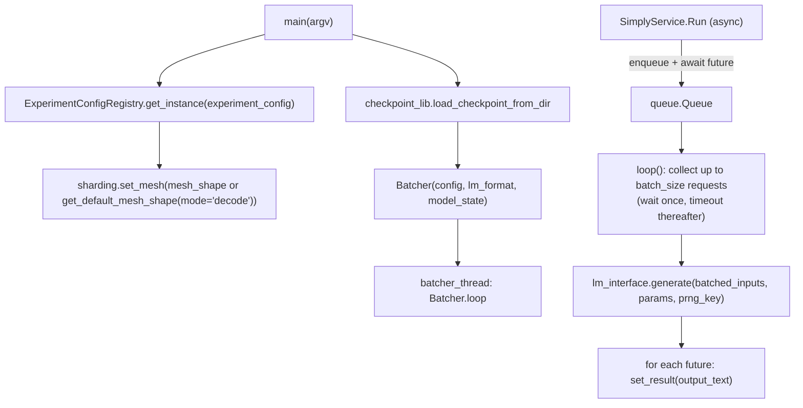

# simply.serving.vanilla_server — fixed-batch gRPC serving via LMInterface.generate

## Overview

This is Simply's simpler serving path: unlike
[simply-serving-page_batcher](simply-serving-page_batcher.md)'s continuous-batching persistent
`SamplingState`, `vanilla_server.py`'s [`Batcher`](../catalog/simply/serving/vanilla_server.md#Batcher.input_processor)
collects up to `batch_size` requests from a queue (waiting up to `max_queue_timeout` once at least one
request has arrived), then calls
[`model_lib.LMInterface.generate`](../catalog/simply/model_lib.md#LMInterface.generate) once for the
*whole* batch and blocks until every sequence in that batch is fully decoded before accepting the
next batch — a classic static-batch inference loop, traded for implementation simplicity over the
page batcher's per-sequence continuous scheduling. [`main`](../catalog/simply/serving/vanilla_server.md#main)
additionally owns the whole gRPC server lifecycle (health service, reflection, checkpoint loading)
that [simply-serving-page_batcher](simply-serving-page_batcher.md) leaves to a separate caller.

## Diagram

## Design rationale (why it's built this way)

**The batch-fill loop waits indefinitely for the *first* request, then only briefly for subsequent
ones — an asymmetric timeout policy.** [`Batcher.loop`](../catalog/simply/serving/vanilla_server.md#Batcher.loop)'s
inner `while len(batch) < self.batch_size` calls `self.queue.get(timeout=self.max_queue_timeout if
batch else None)` — `timeout=None` (block forever) when `batch` is still empty, but a real timeout
once at least one request is queued; this lets the server idle with zero CPU spin when there's no
traffic, while still batching multiple near-simultaneous requests together rather than processing
them one at a time.

**Generation is delegated entirely to `LMInterface.generate`, so this module has zero direct
knowledge of the decode loop, KV-cache management, or paging.**
[`Batcher.lm_interface`](../catalog/simply/serving/vanilla_server.md#Batcher.lm_interface) is a
`functools.cached_property` wrapping [`model_lib.LMInterface`](../catalog/simply/model_lib.md#LMInterface)
with a `default_sampling_params` built once from flags — the entire batching-and-serving concern this
module owns is purely about *when* to call `generate` and how to route results back to gRPC futures,
not *how* generation itself works (that's [model_lib.py](../catalog/simply/model_lib.md#LMInterface)'s
job, not this packet's own).

**`main`'s config mutation for decode mode (`use_scan=False`, `use_remat=False`,
`decoding_sharding_config`) is applied via `dataclasses.replace` on the loaded experiment config, not
by writing a separate decode-specific config file.** `main` reads
`decoding_sharding_config = getattr(config, 'decoding_sharding_config', None)` and falls back to
`config.sharding_config.to_decoding_sharding()` if absent, then
`dataclasses.replace(config, use_scan=False, use_remat=False, sharding_config=decoding_sharding_config,
**config_replace_kwargs)` — the same `BaseExperimentConfig` type serves both training and serving,
with serving-specific overrides (no gradient checkpointing, no layer-scan, a decode-tuned sharding
layout) applied as a config transformation at server-startup time rather than requiring a
structurally distinct serving config type.

**Every CLI flag that has a corresponding config field is applied conditionally (`if flag.value:`),
so an unset flag never overrides the experiment config's own default.** `main`'s
`config_replace_kwargs` dict is built up entry-by-entry, each guarded by `if <flag>.value:` (or
`is not None` for `_CKPT_FORMAT`) — this is what lets the same server binary be launched with either
a bare `--experiment_config` (using every config default) or with any subset of overrides
(`--batch_size`, `--vocab_name`, `--activation_dtype`, ...) without needing per-flag "was this
explicitly set" tracking beyond the flag's own default-vs-provided value.

> [!inferred] `main`'s `_init_fn` closure (building abstract params for
> [`checkpoint_lib.load_checkpoint_from_dir`](../catalog/simply/utils/checkpoint_lib.md#load_checkpoint_from_dir))
> duplicates the bf16-casting logic also seen in
> [simply-serving-page_batcher](simply-serving-page_batcher.md)'s `abstract_model_state` — both
> servers independently cast float32 params to bf16 when `activation_dtype == 'bfloat16'` before
> deriving the abstract shape structure used to restore a checkpoint, suggesting this
> cast-then-derive-abstract-shape pattern is a repeated (not shared-helper) convention across the two
> serving entry points.

## Entry points

- [`main`](../catalog/simply/serving/vanilla_server.md#main) — the process entry point: resolves
  config, sets up the mesh, loads the checkpoint, starts the batcher thread, and runs the async gRPC
  server loop until `stop_event` is set.
- [`Batcher.loop`](../catalog/simply/serving/vanilla_server.md#Batcher.loop) — runs on its own
  thread; the batch-collect-then-generate cycle.
- **`SimplyService.Run`** — the async gRPC handler, registered alongside
  [`Batcher.loop`](../catalog/simply/serving/vanilla_server.md#Batcher.loop); converts the wire
  `struct_pb2.Value` to Python, enqueues it with a future, awaits the future, and
  converts the result back.

## Mechanism (step-by-step)

1. **[`main`](../catalog/simply/serving/vanilla_server.md#main) resolves the experiment config and
   mesh, applying any CLI overrides.**
   `config_lib.ExperimentConfigRegistry.get_instance(_EXPERIMENT_CONFIG.value)`, then either an
   explicit `--mesh_shape` or `config_lib.get_default_mesh_shape(config, mode='decode')`.
2. **The model's abstract parameter structure is derived, then a real checkpoint is loaded against
   it.** `_init_fn` builds the param pytree via `service.batcher.model.init(...)` (optionally cast to
   bf16), [`core_common.eval_abstract_output`](../catalog/simply/utils/common.md#eval_abstract_output)
   turns that into an abstract `ShapeDtypeStruct` tree, and
   [`checkpoint_lib.load_checkpoint_from_dir`](../catalog/simply/utils/checkpoint_lib.md#load_checkpoint_from_dir)
   restores real weights matching that structure.
3. **The batcher thread starts, and the gRPC server begins listening.**
   `service.batcher_thread.start()` runs [`Batcher.loop`](../catalog/simply/serving/vanilla_server.md#Batcher.loop)
   in the background; `grpc.aio.server()` registers the health service, the `SimplyService`, and
   reflection, then starts listening.
4. **Each incoming request is enqueued with a future and awaited asynchronously by the gRPC
   handler, to be drained by [`Batcher.loop`](../catalog/simply/serving/vanilla_server.md#Batcher.loop)**,
   decoupling the synchronous batching thread from the async gRPC event loop.
5. **The batcher loop fills a batch (formatting chat messages via `lm_format` if needed, chunking via
   [`sampling_lib.input_as_chunks`](../catalog/simply/utils/sampling_lib.md#input_as_chunks)), calls
   `generate` once for the whole batch, then resolves every future in the batch with its
   corresponding output text** before looping back to collect the next batch from scratch.

## Key data structures

- **[`Batcher`](../catalog/simply/serving/vanilla_server.md#Batcher.input_processor)** (frozen
  dataclass) — `config`, `lm_format`, `model_state` (mutable dict), `batch_size`, `max_queue_size`,
  `max_queue_timeout`.
- **`SimplyServiceResponse`**
  (`NamedTuple`) — `code: grpc.StatusCode`, `details: str`, `result: Any`; the uniform wire-adjacent
  response shape both serving modules use.

## Dynamics (design intent)

Because `generate` is called once per *full* batch and the loop blocks until that call returns, every
request in a batch shares the same worst-case latency (the longest sequence in the batch determines
when the whole batch's futures resolve) — a structural latency/throughput trade this module accepts
in exchange for its much simpler control flow versus
[simply-serving-page_batcher](simply-serving-page_batcher.md)'s per-sequence continuous release.

## Edge cases

- [`Batcher.loop`](../catalog/simply/serving/vanilla_server.md#Batcher.loop) asserts
  `len(sampling_outputs) == len(batched_inputs)` after calling `generate` — a mismatch here (e.g. a
  bug in generate's batch handling) fails loudly rather than silently misrouting responses.
- The `zip(..., strict=True)` when pairing `batch` with `sampling_outputs[:len(batch)]` additionally
  guards against a silent length mismatch during the final response-routing loop.

## Open questions

- Whether this vanilla server path is still actively used in production or retained mainly as a
  simpler reference/fallback relative to the page batcher isn't discussed in this packet's grounding.

## See also
- [simply-serving-page_batcher](simply-serving-page_batcher.md) — the continuous-batching
  alternative built on `ragged_paged_attention.SamplingState`.
- [simply-utils-checkpoint_lib](simply-utils-checkpoint_lib.md) — `load_checkpoint_from_dir`, used at
  startup.
