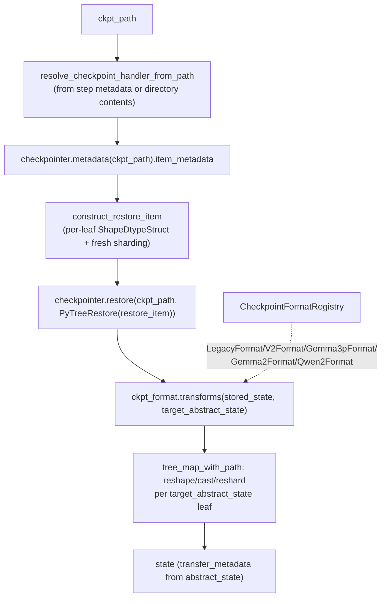

# simply.utils.checkpoint_lib — Orbax checkpointing with pluggable foreign-format transforms

## Overview

This module wraps Orbax checkpointing with two Simply-specific concerns: **shape/dtype-directed
restore construction** ([`construct_restore_item`](../catalog/simply/utils/checkpoint_lib.md#construct_restore_item)
computes fresh sharding for every restored leaf via
[sharding](simply-utils-sharding.md)'s minimum-redundancy partitioner, and optionally downcasts
floating dtypes), and a **registered format-conversion layer**
([`CheckpointFormat`](../catalog/simply/utils/checkpoint_lib.md#CheckpointFormat) subclasses —
[`LegacyFormat`](../catalog/simply/utils/checkpoint_lib.md#LegacyFormat),
[`V2Format`](../catalog/simply/utils/checkpoint_lib.md#V2Format),
[`Gemma3pFormat`](../catalog/simply/utils/checkpoint_lib.md#Gemma3pFormat.transforms)/
[`Gemma2Format`](../catalog/simply/utils/checkpoint_lib.md#Gemma3pFormat.transforms)/
[`Qwen2Format`](../catalog/simply/utils/checkpoint_lib.md#Qwen2Format.transforms)) that each know how
to rename/reshape/transpose a foreign checkpoint's flat key-value pairs into Simply's own parameter
tree layout. [`load_checkpoint_from_path`](../catalog/simply/utils/checkpoint_lib.md#load_checkpoint_from_path)
is the single function every restore path funnels through, regardless of which format the on-disk
checkpoint uses.

## Diagram

## Design rationale (why it's built this way)

**Every format's `transforms` operates on a flattened, slash-joined key representation, so
per-format logic is regex-driven string rewriting rather than tree-walking code.** Every
`transforms` override starts with `ocp.tree.to_flat_dict(stored_state, sep='/')`, then loops the
flat items matching `re.fullmatch` patterns against expected foreign key shapes (e.g.
[`Qwen2Format.transforms`](../catalog/simply/utils/checkpoint_lib.md#Qwen2Format.transforms) matches
`r'model.layers.(\d+).self_attn.([qkv]_proj).weight'`) — this makes each format's mapping legible as
a flat list of "foreign pattern → Simply path (+ optional array transform)" rules rather than nested
conditional tree traversal.

**Format subclasses compose by inheritance where the underlying checkpoint layouts are related, not
by shared helper functions.** [`Gemma2Format`](../catalog/simply/utils/checkpoint_lib.md#Gemma3pFormat.transforms)
and [`Gemma2TransposeFormat`](../catalog/simply/utils/checkpoint_lib.md#Gemma3pFormat.transforms)
both subclass [`Gemma3pFormat`](../catalog/simply/utils/checkpoint_lib.md#Gemma3pFormat.transforms)
overriding only `prefix_mapping` (mapping optimizer-state prefixes like `opt_state/1/0/mu/transformer`
to Simply's `m`); [`Gemma3pLegacyFormat`](../catalog/simply/utils/checkpoint_lib.md#Gemma3pFormat.transforms)
overrides only `transpose_ffn_weights=False` — the inheritance hierarchy mirrors the actual family
relationship between these checkpoint formats (same key structure, different weight orientation or
prefix conventions).

**`Qwen2Format` gathers MoE expert weights from many separately-keyed foreign entries into one
stacked Simply parameter, only on the first-seen expert index.** [`Qwen2Format._gather_experts`](../catalog/simply/utils/checkpoint_lib.md#Qwen2Format.transforms)
collects every `model.layers.{i}.mlp.experts.(\d+).up_proj.weight` match, sorts by expert index, and
stacks — but `transforms`'s loop only *invokes* this gather when `m.group(2) == '0'` (i.e., only once
per layer, when the first expert is encountered), writing the gathered, stacked result under one key;
every other expert index's flat entry is silently skipped in that branch since it was already
consumed by the gather.

**Head-splitting for QKV projections re-derives sharding via `partition_with_minimum_redundancy` at
transform time, not by copying the target's own sharding.**
[`Qwen2Format._split_head`](../catalog/simply/utils/checkpoint_lib.md#Qwen2Format.transforms) reshapes
a combined `[heads*head_dim, ...]` weight into `[heads, head_dim, ...]`, computing a *fresh*
partition annotation for the new shape via
`sharding_lib.partition_with_minimum_redundancy`
rather than reusing whatever sharding the target abstract state expects at that path — the reshape
happens under an intermediate sharding constraint before the final `with_sharding_constraint` to the
newly-computed partition, presumably to avoid an invalid intermediate resharding of a still
differently-shaped array.

**The final "regularization" pass (matching restored values to the target abstract state) tolerates
missing paths by falling back to the abstract placeholder, rather than failing the whole restore.**
[`load_checkpoint_from_path`](../catalog/simply/utils/checkpoint_lib.md#load_checkpoint_from_path)'s
inner `_get_regularized_value` catches `KeyError` from
[`pytree.tree_value`](../catalog/simply/utils/pytree.md#tree_value) and logs a warning, returning the
*abstract* value unchanged — a checkpoint missing some parameter (e.g. a newly-added layer) restores
successfully with that parameter left at its abstract (uninitialized) placeholder rather than aborting
the whole load; conversely, a shape mismatch on a *present* path does raise `ValueError` immediately,
since that's a genuine incompatibility rather than an absence.

**Unused checkpoint entries are marked with `ocp.PLACEHOLDER` before the actual restore, to avoid
Orbax attempting to read+transform data that's provably never consumed.**
`common.find_unused_argpaths` traces
`transform_state_fn` against the whole `restore_item` tree via `jax.make_jaxpr`, and every argpath
whose corresponding jaxpr invar never reaches an outvar/eqn gets replaced with `ocp.PLACEHOLDER` in
the restore item — this is a genuine dead-argument-elimination pass applied to the checkpoint
restore graph, skipping I/O for parameters the transform pipeline will discard anyway (e.g. legacy
keys the new format doesn't map anywhere).

> [!inferred] [`resolve_checkpoint_handler_from_path`](../catalog/simply/utils/checkpoint_lib.md#resolve_checkpoint_handler_from_json)'s
> fallback path (inferring handlers from directory contents when Orbax step metadata lacks
> `item_handlers`) exists specifically for "old ORBAX checkpoints" per its own comment — a
> backward-compatibility shim for checkpoints written before Orbax itself recorded handler metadata.

## Entry points

- [`load_checkpoint_from_path`](../catalog/simply/utils/checkpoint_lib.md#load_checkpoint_from_path) —
  the one function every restore path (training resume, serving startup, evaluation) ultimately
  calls.
- [`load_checkpoint_from_dir`](../catalog/simply/utils/checkpoint_lib.md#load_checkpoint_from_dir)/
  [`load_checkpoint_from_manager`](../catalog/simply/utils/checkpoint_lib.md#load_checkpoint_from_manager) —
  convenience wrappers resolving a step-specific path from a directory or manager first.
- [`save_checkpoint`](../catalog/simply/utils/checkpoint_lib.md#save_checkpoint) — writes state,
  metadata (including the checkpoint format tag via
  [`pytree.dump`](../catalog/simply/utils/pytree.md#dump)), and optional auxiliary `data`.
- [`CheckpointFormatRegistry`](../catalog/simply/utils/checkpoint_lib.md#CheckpointFormatRegistry) —
  where a new foreign-format converter becomes selectable by name (`--ckpt_format=Qwen2Format`, etc.).

## Mechanism (step-by-step)

1. **The checkpoint handler is resolved from step metadata, falling back to directory inspection.**
   [`resolve_checkpoint_handler_from_path`](../catalog/simply/utils/checkpoint_lib.md#resolve_checkpoint_handler_from_json)
   tries `ocp.metadata.get_step_metadata` first.
2. **`construct_restore_item` builds per-leaf `ShapeDtypeStruct`s with freshly computed sharding.**
   For each leaf in the checkpoint's own metadata tree,
   [`sharding_lib.batch_partition_with_minimum_redundancy`](../catalog/simply/utils/sharding.md#batch_partition_with_minimum_redundancy)
   picks a partition, and `_restore_leaf_dtype` optionally downcasts (only shrinking, via itemsize
   comparison — never upcasting) to `ckpt_format.restore_dtype`.
3. **The checkpoint format is resolved: explicit override, or read from the checkpoint's own stored
   metadata, or `LegacyFormat` as the ultimate fallback.**
   [`load_checkpoint_from_path`](../catalog/simply/utils/checkpoint_lib.md#load_checkpoint_from_path)
   checks `ckpt_format` truthiness, then (if empty) tries reading the
   [`CHECKPOINT_FORMAT_KEY`](../catalog/simply/utils/checkpoint_lib.md#CheckpointFormat) from the
   checkpoint's own JSON metadata item (written by
   [`save_checkpoint`](../catalog/simply/utils/checkpoint_lib.md#save_checkpoint) at save time).
4. **Dead-path elimination runs before the actual Orbax restore, over the same
   [`get_abstract_params`](../catalog/simply/utils/checkpoint_lib.md#get_abstract_params)-shaped
   tree.** `common.find_unused_argpaths` identifies
   which restore-item leaves `transform_state_fn` never actually reads, and those get replaced with
   `ocp.PLACEHOLDER`.
5. **The real Orbax restore runs, then `transform_state_fn` reconciles it against the target
   abstract state.** `ckpt_format.`[`transforms`](../catalog/simply/utils/checkpoint_lib.md#CheckpointFormat.transforms)
   rewrites keys/shapes into Simply's layout; `_get_regularized_value` then walks the *target*
   abstract state (not the restored state) via `tree_map_with_path`, pulling matching values by path
   or falling back to the abstract placeholder on `KeyError`.
6. **[`transfer_metadata`](../catalog/simply/utils/common.md#transfer_metadata) copies metadata from
   the abstract state onto the final restored state**, re-attaching
   `AnnotatedArray` sharding/dim annotations that plain restored arrays wouldn't otherwise carry.

## Key data structures

- **[`CheckpointFormat`](../catalog/simply/utils/checkpoint_lib.md#CheckpointFormat)** (registered,
  frozen dataclass, `abc.ABC`) — `restore_dtype`, plus an overridable
  [`transforms`](../catalog/simply/utils/checkpoint_lib.md#CheckpointFormat.transforms) method
  defaulting to identity.
- **[`CHECKPOINT_FORMAT_KEY`](../catalog/simply/utils/checkpoint_lib.md#CheckpointFormat)** —
  the metadata dict key `save_checkpoint` writes and `load_checkpoint_from_path` reads to recover
  which format a checkpoint was saved in, when not explicitly overridden by the caller.

## Dynamics (design intent)

Because `find_unused_argpaths` traces `transform_state_fn` via `jax.make_jaxpr` *before* the real
restore happens, the dead-path elimination is purely a static-shape analysis over the abstract
`restore_item` — it never touches real data, so it adds negligible overhead relative to the actual
(often very large) checkpoint I/O it's skipping.

## Edge cases

- [`get_checkpoint_path`](../catalog/simply/utils/checkpoint_lib.md#load_checkpoint_from_dir) raises
  if `ckpt_step >= 0` is given for a directory that already looks like a single checkpoint
  (`_CHECKPOINT_METADATA`/`_METADATA` present) — passing an explicit step for a non-manager-style
  checkpoint directory is treated as a caller error, not silently ignored.
- [`construct_restore_item`](../catalog/simply/utils/checkpoint_lib.md#construct_restore_item)
  raises on any leaf type other than `ocp.metadata.ArrayMetadata`, `jax.Array`, or
  `jax.ShapeDtypeStruct` — a checkpoint metadata tree with unexpected leaf types fails fast rather
  than attempting a best-effort conversion.

## Open questions

- Whether `Qwen3` MoE checkpoints (referenced by a test name,
  `test_restore_qwen3_moe_format`, in this packet's subgraph) use `Qwen2Format` unchanged or a
  distinct format class isn't resolved by the citable symbols in this packet alone.

## See also
- [simply-utils-sharding](simply-utils-sharding.md) — `partition_with_minimum_redundancy`, used to
  shard every restored leaf.
- [simply-utils-pytree](simply-utils-pytree.md) — `tree_value`/`set_tree_value`/`dump`/`load`, used
  throughout the restore and format-metadata round-trip.
- [simply-utils-common](simply-utils-common.md) — `AnnotatedArray`/`transfer_metadata`, used to
  re-annotate restored arrays.
