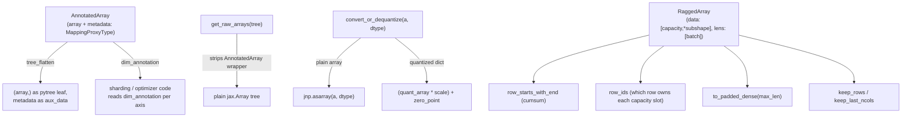

# simply.utils.common — AnnotatedArray, PyTree, and RaggedArray, the base types everything builds on

## Overview

This module's own docstring states its constraint: "As a base utility library, it should not depend
on any other utils libraries" — every other `simply.utils.*` module sits above it. It defines the
three load-bearing types of the whole codebase: `AnnotatedArray`
(a registered JAX pytree node wrapping an array with immutable metadata, most importantly a
`dim_annotation` string), [`PyTree`](../catalog/simply/utils/common.md#PyTree.PyTree) (the recursive
type alias — `BasicType | Sequence[PyTree] | Mapping[str, PyTree]` — used as the parameter/state type
everywhere), and `RaggedArray` (a dense
`[capacity, *subshape]` buffer plus per-row `lens`, the representation backing the ragged-attention
KV cache and page batcher). A handful of free functions
([`get_raw_arrays`](../catalog/simply/utils/common.md#get_raw_arrays),
`convert_or_dequantize`,
[`transfer_metadata`](../catalog/simply/utils/common.md#transfer_metadata)) round out the module as
the small set of operations every other layer needs to cross the `AnnotatedArray` boundary.

## Diagram

## Design rationale (why it's built this way)

**`AnnotatedArray` is a registered pytree node whose flatten/unflatten puts the array in the leaves
and the metadata in the (static) aux_data — so JAX transformations never trace through metadata.**
`AnnotatedArray.tree_flatten` returns `((self.array,),
self.metadata)`; `tree_unflatten` rebuilds from
that pair — this means `jax.jit`/`grad`/`vmap` see exactly one traced leaf per `AnnotatedArray` (the
array itself) while `dim_annotation` and any other metadata stay outside tracing entirely, available
to Python-level code (sharding decisions, quantization dispatch) even inside a traced function body.
Every such leaf is itself carried inside the module's [`PyTree`](../catalog/simply/utils/common.md#PyTree.PyTree)
of parameters, so tracing sees a `PyTree` of `AnnotatedArray` leaves, not a `PyTree` of bare arrays.

**Metadata is stored as `types.MappingProxyType`, enforcing immutability structurally rather than by
convention.** `AnnotatedArray.create` is
the only constructor path that wraps `**kwargs` in `types.MappingProxyType(kwargs)` — since
`AnnotatedArray` is also `frozen=True`, an `AnnotatedArray` instance's array and metadata are both
unmutatable in place; any change (e.g. via `transfer_metadata`) must construct a new instance.

**`transfer_metadata` exists so gradient/optimizer-update pytrees (plain arrays) can be re-annotated
with the metadata their corresponding parameter had, without the optimizer code ever handling
`AnnotatedArray` directly.** [`transfer_metadata`](../catalog/simply/utils/common.md#transfer_metadata)
walks `base_tree` (the annotated params) and `target_tree` (the plain-array update) together; where
`base` is an `AnnotatedArray`, it wraps `target`'s array in a fresh `AnnotatedArray.create(...,
**base.metadata)` — this is exactly the pattern `Optimizer.apply_updates` (in
[simply-utils-optimizers](simply-utils-optimizers.md)) uses to re-attach sharding annotations to
freshly computed `new_params` after a plain-array gradient step.

**`RaggedArray`'s `row_ids`/`intra_offset` derive every row's slot ownership from `lens` alone via
`jnp.repeat`/`jnp.arange` — no explicit per-row offset array is stored.**
[`RaggedArray.row_ids`](../catalog/simply/utils/common.md#RaggedArray.row_ids) is `jnp.repeat(
jnp.arange(batch_size), lens, total_repeat_length=capacity)` — the trailing padded region (beyond
`total_length`) is filled with `batch_size - 1` (the last valid row id) as a side effect of how
`jnp.repeat`'s `total_repeat_length` truncation/padding works, documented directly in the function's
own comment with a worked example (`a1,a2,a3,b1,c1,c2` → row ids `0,0,0,1,2,2,|2,2,2,...`).

**`concat` computes fresh scatter target indices for both operands rather than doing a straightforward
append, because rows need to interleave by row index, not concatenate by storage order.**
[`RaggedArray.concat`](../catalog/simply/utils/common.md#RaggedArray.concat) computes `z_starts`
(cumulative offsets in the *combined* per-row length `z_lens = self.lens + other.lens`), then scatters
`self.data`/`other.data` into an `empty` buffer at `z_starts[row_ids] + intra_offset` (self) and
`z_starts[row_ids] + self.lens[row_ids] + other.intra_offset` (other, shifted past self's portion of
each row) — every row's two source-array contributions land adjacent in the combined buffer, not
simply self-then-other in storage order.

> [!inferred] `neg_inf`'s comment ("Gemma uses -0.7 *
> dtype_max") documents that Simply intentionally uses `-0.5 * dtype_max` instead as its masking
> sentinel — a deliberate deviation from the reference Gemma implementation's masking constant,
> presumably to leave more numerical headroom before hitting `dtype_max` exactly during softmax
> intermediate computation.

## Entry points

- [`get_raw_arrays`](../catalog/simply/utils/common.md#get_raw_arrays) — called at the top of every
  `apply`/forward pass to strip `AnnotatedArray` wrappers (built by `AnnotatedArray.create`, the only
  sanctioned constructor, called from every layer's `init`; see
  [simply-utils-module](simply-utils-module.md)) before any actual computation.
- `RaggedArray.create`-adjacent constructors
  ([`from_numpy_list`](../catalog/simply/utils/common.md#RaggedArray.from_numpy_list)) — the entry
  point for building a `RaggedArray` from host-side per-row data (e.g. a batch of variable-length
  token sequences).
- [`transfer_metadata`](../catalog/simply/utils/common.md#transfer_metadata) — called wherever a
  possibly-quantized parameter needs to become a concrete compute-dtype array (`convert_or_dequantize`)
  and then have its sharding/quantization metadata re-attached post-hoc.

## Mechanism (step-by-step)

1. **A parameter is created and annotated once, at `init` time, becoming a leaf of the module's
   [`PyTree`](../catalog/simply/utils/common.md#PyTree.PyTree) of parameters.** `EinsumLinear.init`
   (see [simply-utils-module](simply-utils-module.md)) calls `AnnotatedArray.create(raw_array,
   dim_annotation=...)`.
2. **Every forward pass strips the annotation before computing, and reapplies sharding/dequantization
   separately.** [`get_raw_arrays`](../catalog/simply/utils/common.md#get_raw_arrays) uses
   `jax.tree.map` with `is_leaf=lambda x: isinstance(x, AnnotatedArray)` so the unwrap doesn't
   recurse *into* the array itself; `convert_or_dequantize`
   then separately handles the quantized-vs-plain distinction.
3. **Optimizer updates re-attach metadata post-hoc.** After computing a plain-array update tree, an
   optimizer calls [`transfer_metadata`](../catalog/simply/utils/common.md#transfer_metadata)`(old_params,
   new_params)` to restore each leaf's `dim_annotation` (and any other metadata) on the new tree.
4. **A `RaggedArray`'s derived views (`row_starts`, `row_ids`, `intra_offset`) are all
   `functools.cached_property`s computed from just `data` and `lens`.** Once constructed, none of
   these views are recomputed unless a *new* `RaggedArray` instance is built (every mutating-looking
   method — [`extend_capacity_to`](../catalog/simply/utils/common.md#RaggedArray.extend_capacity_to),
   [`set_padding_value`](../catalog/simply/utils/common.md#RaggedArray.set_padding_value),
   [`keep_rows`](../catalog/simply/utils/common.md#RaggedArray.keep_rows) — returns a fresh
   `RaggedArray`, since the dataclass is frozen).
5. **`to_padded_dense` reads out a `RaggedArray` as a conventional `[batch, max_len, *subshape]`
   tensor via a gather + mask, not a scan.**
   [`to_padded_dense`](../catalog/simply/utils/common.md#RaggedArray.to_padded_dense) computes
   `flat_indices = row_starts[:,None] + col_idx`, clamps out-of-bounds indices to `0` (safe for the
   gather), performs the gather, then overwrites masked-out positions with `padding_value` — a single
   vectorized gather rather than a per-row loop.

## Key data structures

- **`AnnotatedArray`** — `array: Array`,
  `metadata: MappingProxyType[str, Any]`; `dim_annotation`/`shape`/`dtype` are cached-property
  accessors over those two fields.
- **[`PyTree`](../catalog/simply/utils/common.md#PyTree.PyTree)** — the recursive type alias
  (`BasicType | Sequence[PyTree] | Mapping[str, PyTree]`) used as the universal parameter/state/config
  type across the codebase; `BasicType`
  includes `AnnotatedArray` itself, so a `PyTree` can mix annotated and bare leaves.
- **`RaggedArray`** — `data: [capacity, *subshape]`,
  `lens: i32[batch_size]`; every other property (`row_starts`, `row_ids`, `intra_offset`,
  `total_length`) is derived.

## Dynamics (design intent)

`RaggedArray.is_valid` is documented as a caller-guaranteed invariant, not an enforced one
("User should guarantee this is always true") — the class trusts that `total_length <= capacity`
holds by construction rather than checking it on every operation, favoring throughput (no runtime
assertion inside JIT-compiled hot paths) over defensive validation.

## Edge cases

- `RaggedArray.__post_init__` only checks that
  `lens` is 1-D — it does *not* check `total_length <= capacity` there (consistent with `is_valid`
  being a caller responsibility, not a construction-time check).
- `convert_array_with_abstract` special-cases
  same-mesh vs. cross-mesh transfers: same-mesh just casts dtype under a sharding constraint;
  cross-mesh explicitly enters the *source* mesh's context to cast before `device_put`-ing into the
  target sharding — the comment notes this avoids "an expensive host roundtrip" and ensures
  `jnp.astype` compiles with the correct device ordering.

## Open questions

- Whether `quantize_array`'s asymmetric-quantization branch (`zero_point` computed as `(max+min)/2`)
  is ever actually exercised by a caller (vs. the symmetric branch) isn't visible from this packet's
  subgraph alone.

## See also
- [simply-utils-module](simply-utils-module.md) — `EinsumLinear`, the primary producer/consumer of
  `AnnotatedArray`.
- [simply-utils-sharding](simply-utils-sharding.md) — `with_sharding_constraint`, applied immediately
  after `AnnotatedArray.create`.
- [simply-utils-optimizers](simply-utils-optimizers.md) — `transfer_metadata`'s primary caller.
