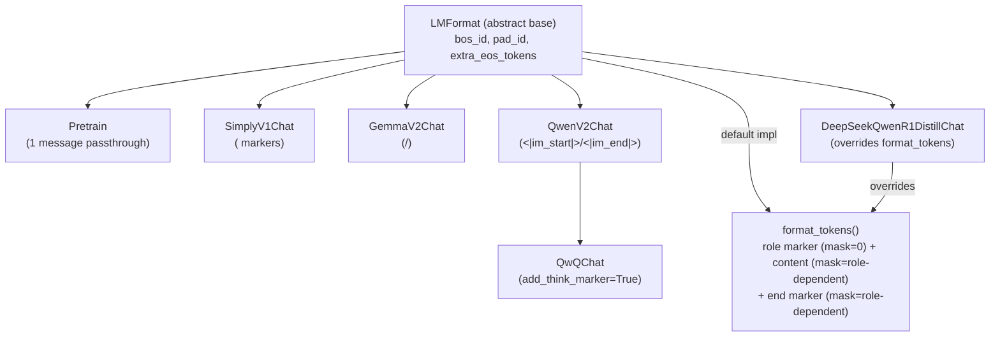

# simply.utils.lm_format — per-model chat templates with a shared token/loss-mask contract

## Overview

[`LMFormat`](../catalog/simply/utils/lm_format.md#LMFormat.format) is the single source of truth for
turning a list of `{role, content}` chat messages into either a formatted string
([`format`](../catalog/simply/utils/lm_format.md#LMFormat.format), for inference) or a token
sequence with a per-token loss mask
([`format_tokens`](../catalog/simply/utils/lm_format.md#LMFormat.format), for training) — every
model family Simply supports (Gemma, Qwen, DeepSeek-R1-distill, and plain pretraining) is a
registered [`LMFormat`](../catalog/simply/utils/lm_format.md#LMFormatRegistry) subclass differing
only in its marker strings and, for one model
([`DeepSeekQwenR1DistillChat`](../catalog/simply/utils/lm_format.md#DeepSeekQwenR1DistillChat)), its
tokenization/masking logic. The per-project CLAUDE.md is explicit that this is deliberate: "`
LMFormat.format_tokens()` is the single source of truth for chat formatting + tokenization" — nothing
downstream re-implements chat templating independently.

## Diagram

## Design rationale (why it's built this way)

**Every chat format is a frozen dataclass whose fields *are* the template — no format string, no
Jinja.** [`SimplyV1Chat`](../catalog/simply/utils/lm_format.md#SimplyV1Chat),
[`GemmaV2Chat`](../catalog/simply/utils/lm_format.md#GemmaV2Chat), and
[`QwenV2Chat`](../catalog/simply/utils/lm_format.md#QwenV2Chat) each declare
`user_marker`/`assistant_marker`/`system_marker`/`end_of_message_marker` as plain string class
fields with model-specific defaults (`'<reserved_1>'`, `'<start_of_turn>user\n'`,
`'<|im_start|>user\n'` respectively), and their [`format`](../catalog/simply/utils/lm_format.md#QwenV2Chat.format)
methods are near-identical string-concatenation loops differing only in which marker attribute they
read — the entire model-specific behavior is data (field defaults), the control flow is shared by
convention (each subclass reimplements essentially the same loop rather than sharing one).

**`format_tokens`'s default implementation reads marker names dynamically via `getattr`, which is
what lets one shared implementation serve most formats without per-subclass overrides.**
[`LMFormat.format_tokens`](../catalog/simply/utils/lm_format.md#LMFormat.format)'s default body does
`role_marker = getattr(self, f'{role}_marker', '')` — so it needs no knowledge of which concrete
subclass it's running on; it just looks up `f'{message["role"]}_marker'` by name. This is why
[`Pretrain`](../catalog/simply/utils/lm_format.md#Pretrain),
[`SimplyV1Chat`](../catalog/simply/utils/lm_format.md#SimplyV1Chat),
[`GemmaV2Chat`](../catalog/simply/utils/lm_format.md#GemmaV2Chat), and
[`QwenV2Chat`](../catalog/simply/utils/lm_format.md#QwenV2Chat) all inherit `format_tokens` unchanged
while only [`DeepSeekQwenR1DistillChat`](../catalog/simply/utils/lm_format.md#DeepSeekQwenR1DistillChat)
overrides it.

**The loss mask is trainable-by-default, opt-out via an explicit allowlist, not opt-in per role.**
`format_tokens`'s `is_trainable = trainable_roles is None or role in trainable_roles` means passing
`trainable_roles=None` (the common case) trains on every role's tokens; a caller must explicitly
enumerate which roles to include in the loss to narrow it — e.g. training only on `assistant` turns
requires `trainable_roles=('assistant',)`, not the reverse.

**`DeepSeekQwenR1DistillChat` overrides `format_tokens` entirely rather than just its markers,
because its masking rule is role-order-dependent, not per-message.** Its docstring states it "only
supports user/assistant roles... and only adds `end_of_message_marker` after assistant turns" — the
shared default implementation always appends an end marker per message regardless of role, so this
model's asymmetric convention (no end marker after user turns) requires a bespoke loop rather than
parameterizing the shared one. [`DeepSeekQwenR1DistillChat.format`](../catalog/simply/utils/lm_format.md#DeepSeekQwenR1DistillChat.format)
also appends a literal `'<think>\n'` after the final assistant marker — priming the model into its
reasoning-trace format at inference time.

> [!inferred] [`QwQChat`](../catalog/simply/utils/lm_format.md#QwQChat) is defined as a one-line
> subclass of [`QwenV2Chat`](../catalog/simply/utils/lm_format.md#QwenV2Chat) that only flips
> `add_think_marker` to `True` — QwQ and Qwen3-with-thinking apparently share every marker string
> with base Qwen2 chat format, differing only in whether a `<think>` marker is appended before
> generation begins.

## Entry points

- [`LMFormat.format`](../catalog/simply/utils/lm_format.md#LMFormat.format) (abstract) — the
  inference-time entry point; every concrete subclass must implement it.
- [`LMFormat.format_tokens`](../catalog/simply/utils/lm_format.md#LMFormat.format) — the
  training-time entry point, called from `data_lib`'s `ChatFormatTransform`
  (outside this packet's subgraph) per the project's own documentation.
- [`LMFormatRegistry`](../catalog/simply/utils/lm_format.md#LMFormatRegistry) — where a format
  becomes selectable by name from a `DatasetConfig.lm_format_name` string.

## Mechanism (step-by-step)

1. **A format is resolved by name from config.** `LMFormatRegistry.get_instance(name)` (in
   `data_lib.py`, outside this packet) returns the configured
   [`LMFormat`](../catalog/simply/utils/lm_format.md#LMFormat.format) subclass instance.
2. **For inference, `format` concatenates markers and content in a single pass.** Every concrete
   [`format`](../catalog/simply/utils/lm_format.md#QwenV2Chat.format) method iterates messages,
   selects the role marker via an `if/elif/else` chain (raising `ValueError` on an unrecognized
   role), appends `message['content']`, then the end-of-message marker, and finally appends the
   assistant marker once more at the end to prime generation.
3. **For training, `format_tokens` builds parallel token and mask lists per message.** For each
   message: the role marker's tokens get mask `0.0` (never trainable — it's a fixed instruction, not
   generated content); the content's tokens get `mask_value` (1.0 unless the role was excluded via
   `trainable_roles`); the
   [`end_of_message_marker`](../catalog/simply/utils/lm_format.md#SimplyV1Chat.end_of_message_marker)'s
   tokens get the *same* `mask_value` as the content
   "so model learns to stop" (per the method's own docstring) — the model is trained to predict its
   own turn-ending token.
4. **[`DeepSeekQwenR1DistillChat`](../catalog/simply/utils/lm_format.md#DeepSeekQwenR1DistillChat)`.format_tokens`
   deviates only in end-marker placement.** It restricts
   `role_marker` resolution to `user`/`assistant` (raising on anything else), and only appends
   `end_of_message_marker` tokens when `role == 'assistant'` — user turns get no end-of-message token
   at all in this format's convention.

## Key data structures

- **[`LMFormat`](../catalog/simply/utils/lm_format.md#LMFormat.format)** (frozen `abc.ABC` dataclass)
  — `bos_id`, `pad_id`,
  `extra_eos_tokens` (a tuple of
  strings the sampler should also treat as stop sequences beyond the vocab's own EOS), and optional
  `begin_of_thought_marker`/`end_of_thought_marker`.
- **Per-subclass marker fields** — the entire model-specific templating surface; changing a model's
  chat format is changing these field defaults, not the shared logic.

## Dynamics (design intent)

Because `format_tokens`'s default relies on `getattr(self, f'{role}_marker', '')` returning `''` for
any role without a matching marker field (rather than raising), a message with an unrecognized role
under the *default* implementation silently gets no role marker at all (as opposed to
`format`, which raises `ValueError` explicitly for unknown roles) — the two methods' error-handling
strictness for unknown roles genuinely differs.

## Edge cases

- [`Pretrain.format`](../catalog/simply/utils/lm_format.md#Pretrain.format) requires *exactly* one
  message and raises `ValueError` otherwise — pretraining format has no concept of multi-turn
  conversation at all.
- [`SimplyV1Chat`](../catalog/simply/utils/lm_format.md#SimplyV1Chat) hardcodes `bos_id: int = 0` and
  `pad_id: int = 0` with a comment explaining this matches how the model was originally trained
  ("Training used 0 (instead of vocab.bos_id) as the bos_id") — a deliberate historical mismatch
  between the tokenizer's own BOS id and what this format actually uses.

## Open questions

- Whether `begin_of_thought_marker`/`end_of_thought_marker` (declared on the base `LMFormat` but only
  populated on `QwenV2Chat`) are consumed anywhere in generation/parsing logic isn't visible in this
  packet's subgraph.

## See also
- [simply-utils-registry](simply-utils-registry.md) — `RootRegistry`, the base `LMFormatRegistry`
  inherits from.
- [simply-utils-tokenization](simply-utils-tokenization.md) — `SimplyVocab.encode`, called
  per-marker/content chunk inside `format_tokens`.
