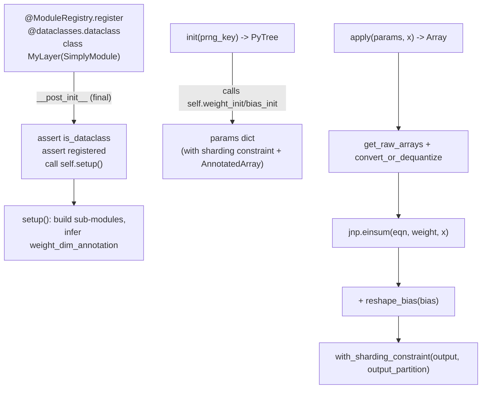

# simply.utils.module — SimplyModule, an ultra-minimal Flax-nn.Module replacement

## Overview

[`SimplyModule`](../catalog/simply/utils/module.md#SimplyModule.apply) is, by its own docstring, "an
ultra-simplified version of `flax.nn.Module`": every model layer is an ordinary registered
`dataclasses.dataclass` implementing three methods —
`setup` (build sub-modules from config
attributes), [`init`](../catalog/simply/utils/module.md#SimplyModule.init) (produce a parameter
pytree from a PRNG key), and [`apply`](../catalog/simply/utils/module.md#SimplyModule.apply) (run
the forward pass given params and inputs) — with no hidden state, no `nn.compact`, no variable
collections. `EinsumLinear` is the one concrete
layer defined here: a fully general linear/einsum layer parameterized entirely by an einsum equation
string plus a `weight_dim_annotation` (independent/input/output per axis) that downstream sharding
and quantization code reads to decide how to shard, initialize, and reshape each weight axis.
`EmbeddingLinear` builds a tied
embedding-lookup/vocab-projection layer as a thin wrapper around one `EinsumLinear`.

## Diagram

## Design rationale (why it's built this way)

**`SimplyModule.__post_init__` is `@final` and enforces two structural invariants — dataclass-ness
and registration — before ever calling `setup`.** [`SimplyModule.__post_init__`](../catalog/simply/utils/module.md#SimplyModule.apply)
raises if `not dataclasses.is_dataclass(self)` or if the class isn't found in
`ModuleRegistry` — every layer *must* be both a
dataclass (so config fields double as constructor args) and
`@ModuleRegistry.`[`register`](../catalog/simply/utils/registry.md#RootRegistry.register)ed (so
`pytree.dump`/`load` can serialize/reconstruct it by
name) — this is checked once per instantiation rather than left as an unenforced convention.

**`__getattr__` raises `AttributeError` explicitly, standing in for `flax`'s `UnboundVariableError`
niceties.** `SimplyModule.__getattr__` is
overridden purely to produce a clearer error message ("Attribute {name} not found in
{self.__class__.__name__}") than Python's default — a small usability nod given how much of Flax's
own machinery exists to give helpful errors when a sub-module wasn't set up correctly.

**`EinsumLinear`'s `weight_dim_annotation` can be inferred from the einsum equation itself, so most
layers never need to write it out by hand.** `EinsumLinear.setup`'s
inference loop classifies each weight-term character as `'.'` (appears in both input and output —
independent/batch dim), `'i'` (input-only — contracted), or `'o'` (output-only — expanded) purely
from set membership against `input_term`/`output_term` — this three-letter vocabulary
(`.`/`i`/`o`) is exactly what
[`sharding.batch_partition_with_minimum_redundancy`](../catalog/simply/utils/sharding.md#with_sharding_constraint)-style
code and Muon's `merge_repeated_dims`
(in [simply-utils-optimizers](simply-utils-optimizers.md)) read to decide how a weight tensor's axes
relate to model-parallel sharding.

**Bias reshaping (`_reshape_bias`) exists because einsum has no implicit broadcasting rule for a
lower-rank bias against a `...`-containing output term.**
`_reshape_bias` inserts `1`s into the bias's einops
rearrange target for every output dimension not present in `bias_term`, including a dynamically-sized
run of `1`s standing in for the swallowed `...` — this is what lets `bias_term='v'` correctly
broadcast a `[vocab_size]` bias against an output of shape `[..., vocab_size]` regardless of how many
leading batch dims `...` actually represents at call time.

**Weights are always converted through `convert_or_dequantize` before every einsum, so a quantized
checkpoint and a full-precision one are indistinguishable to `apply`.**
[`EinsumLinear.apply`](../catalog/simply/utils/module.md#EinsumLinear.apply) calls
[`common.convert_or_dequantize`](../catalog/simply/utils/common.md#convert_or_dequantize) on both
weight and bias unconditionally — the function itself branches on whether the stored value is a
plain array or a quantized dict, so `apply`'s own code has no quantization awareness at all.

> [!inferred] `EmbeddingLinear`'s comment
> ("we interpret embedding matrix as `.oi`... squeezed the `o`... ended up with `.i` only") documents
> a subtlety: the embedding table is conceptually a stack of `vocab_size` independent
> `dim`-to-`1`(-squeezed) linear projections, which is why its `weight_dim_annotation='.i'` treats
> the vocab axis as independent (`.`) rather than output (`o`), even though a lookup table doesn't
> look like a projection at first glance.

## Entry points

- [`SimplyModule.init`](../catalog/simply/utils/module.md#SimplyModule.init) — builds the parameter
  pytree; called once per model at initialization.
- [`SimplyModule.apply`](../catalog/simply/utils/module.md#SimplyModule.apply) (abstract) — the
  forward pass; every concrete layer must implement it.
- [`EinsumLinear.init`](../catalog/simply/utils/module.md#EinsumLinear.init)/
  [`apply`](../catalog/simply/utils/module.md#EinsumLinear.apply) — the concrete implementations most
  model layers ([`Attention`](../catalog/simply/model_lib.md#Attention.apply),
  [`FeedForward`](../catalog/simply/model_lib.md#FeedForward.apply),
  [`TransformerBlock`](../catalog/simply/model_lib.md#TransformerBlock.apply)) are built from.
- **`ModuleRegistry`** — the
  [`RootRegistry`](../catalog/simply/utils/registry.md#RootRegistry) subclass every `SimplyModule`
  must register into.

## Mechanism (step-by-step)

1. **Instantiation triggers validation and setup, before the layer's
   [`SimplyModule.apply`](../catalog/simply/utils/module.md#SimplyModule.apply) is ever called.**
   `MyLayer(**config_fields)` runs the dataclass
   `__init__`, then `__post_init__` validates dataclass-ness and registration before calling
   `self.setup()`.
2. **`setup` (on `EinsumLinear`, ahead of
   [`EinsumLinear.init`](../catalog/simply/utils/module.md#EinsumLinear.init)) parses the einsum
   equation and derives shapes.**
   `_parse_einsum_eqn` splits `eqn` into
   weight/input/output terms; `EinsumLinear.setup`
   validates `weight_shape` matches the weight term's length, infers or validates
   `weight_dim_annotation`, and if `bias_term` is given, derives `bias_shape`/`bias_dim_annotation`/
   `bias_partition` from the weight's own annotation and shape.
3. **`init` builds params via the configured initializers, sharded immediately.**
   [`EinsumLinear.init`](../catalog/simply/utils/module.md#EinsumLinear.init) splits the PRNG key,
   calls `self.weight_init(key_w, shape=..., dtype=..., dim_annotation=...)`, immediately applies
   `sharding_lib.with_sharding_constraint`, then wraps the result in `AnnotatedArray.create(...,
   dim_annotation=...)` — the annotation travels with the array from the moment it's created.
4. **`apply` dequantizes, computes, biases, and reshards.**
   [`EinsumLinear.apply`](../catalog/simply/utils/module.md#EinsumLinear.apply) strips
   `AnnotatedArray` wrappers (`get_raw_arrays`), casts the activation to `activation_dtype`,
   dequantizes the weight, runs `jnp.einsum(eqn, weight, x)`, optionally adds the reshaped bias, and
   applies `with_sharding_constraint` to the *output* before returning.
5. **`EmbeddingLinear` delegates entirely to one internal `EinsumLinear`, built via
   [`EinsumLinear.init`](../catalog/simply/utils/module.md#EinsumLinear.init).**
   `EmbeddingLinear.setup` constructs
   `self.einsum_linear` with `eqn='vd,...d->...v'`; both
   `embed` (lookup, with optional
   `sqrt(dim)`-scaling) and `apply`
   (vocab-logit projection) reuse this one sub-layer's parameters, optionally tied
   (`use_tied_embedding`) or separate (a distinct `embed_name` parameter).

## Key data structures

- **`SimplyModule`** — the abstract base; concrete layers are dataclasses whose fields are
  hyperparameters, not learned state (learned state lives entirely in the `params` pytree returned by
  `init` and threaded explicitly through `apply`).
- **`EinsumLinear`** — `eqn`, `weight_shape`,
  `bias_term`, `weight_dim_annotation`, plus dtype/partition/naming fields; the single generalized
  linear-layer primitive most of `model_lib.py`'s layers compose from.

## Dynamics (design intent)

Because `SimplyModule` carries no runtime state beyond its dataclass fields, the same module
instance is reused across `init` and every subsequent `apply` call — there is no `nn.Module`-style
"bound" vs. "unbound" module distinction to reason about; params always flow as an explicit function
argument.

## Edge cases

- `_parse_einsum_eqn` requires exactly one `,` and
  one `->` in `eqn`, and forbids `...` in the *weight* term specifically (input/output terms may use
  it) — a three-operand einsum or a `...`-containing weight both raise `ValueError` immediately.
- `EmbeddingLinear.embed`'s
  `embedding_scale_by_sqrt_dim` only applies when truthy — passing `None` explicitly disables scaling
  entirely, distinct from passing `1.0` (scale by exactly `sqrt(dim)`).

## Open questions

- Whether `use_lookup=False` (one-hot + einsum instead of `jnp.take`) is a TPU-specific optimization
  (avoiding a gather) or purely a correctness fallback for some backend isn't discussed in this
  packet's grounding.

## See also
- [simply-utils-registry](simply-utils-registry.md) — `RootRegistry`, the base `ModuleRegistry`
  inherits from.
- [simply-utils-common](simply-utils-common.md) — `AnnotatedArray`/`convert_or_dequantize`, used by
  every `init`/`apply`.
- [simply-utils-sharding](simply-utils-sharding.md) — `with_sharding_constraint`, applied to both
  parameters and outputs.
