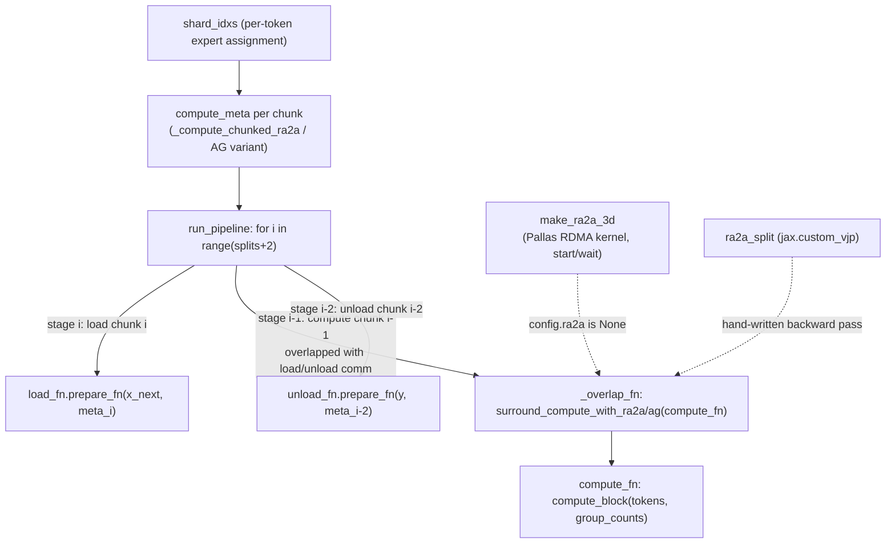

# simply.utils.moe_lib — expert-parallel MoE dispatch with pipelined communication/compute overlap

<!-- connect:up:begin -->
> **Cross-repo concept:** part of [expert-parallelism](../../../concepts/expert-parallelism.md), [pipeline-parallelism](../../../concepts/pipeline-parallelism.md) across this wiki's repos.
<!-- connect:up:end -->
## Overview

This module implements the token-routing and communication machinery for expert-parallel Mixture-of-
Experts on TPU: given per-token expert assignments (`shard_idxs`), it must move each token to the
device shard holding its assigned expert, run that expert's compute, and move the result back — and
it does this via **two interchangeable strategies**, ragged-all-to-all
([`_create_pipelined_ra2a_moe`](../catalog/simply/utils/moe_lib.md#_create_pipelined_ra2a_moe)) or
all-gather-then-local-compute-then-reduce-scatter
([`_create_pipelined_ag_moe`](../catalog/simply/utils/moe_lib.md#_create_pipelined_ag_moe)) — both
returning a uniform [`_MoEMethods`](../catalog/simply/utils/moe_lib.md#_MoEMethods) quad
(`compute_meta`/`load_fn`/`compute_fn`/`unload_fn`) that
[`run_moe_pipelined_shard_map`](../catalog/simply/utils/moe_lib.md#run_moe_pipelined_shard_map)
drives through a **software-pipelined loop**
([`_overlap_fn`](../catalog/simply/utils/moe_lib.md#_overlap_fn)) that overlaps one chunk's
communication with the *previous* chunk's compute, hiding cross-device data movement behind FLOPs.
This is squarely a TPU-performance-critical module: it includes a hand-written Pallas/Mosaic kernel
for ragged-all-to-all ([`make_ra2a_3d`](../catalog/simply/utils/moe_lib.md#make_ra2a_3d), using
raw RDMA copies and semaphores) alongside the option to use XLA's own `jax.lax.ragged_all_to_all`.

## Diagram

## Design rationale (why it's built this way)

**Two structurally different MoE dispatch strategies share one interface (`_MoEMethods`), so the
pipelining and overlap machinery is written once and works with either.**
[`_create_pipelined_ra2a_moe`](../catalog/simply/utils/moe_lib.md#_create_pipelined_ra2a_moe) and
[`_create_pipelined_ag_moe`](../catalog/simply/utils/moe_lib.md#_create_pipelined_ag_moe) both return
a [`_MoEMethods`](../catalog/simply/utils/moe_lib.md#_MoEMethods) namedtuple-like dataclass
(`compute_meta`, `load_fn`, `compute_fn`, `unload_fn`) despite having entirely different
communication primitives underneath (ragged-all-to-all vs. all-gather + reduce-scatter) — every
caller in [`run_moe_pipelined_shard_map`](../catalog/simply/utils/moe_lib.md#run_moe_pipelined_shard_map)
and [`_overlap_fn`](../catalog/simply/utils/moe_lib.md#_overlap_fn) is written against this one shape,
letting `config.ep_method` switch strategies without touching the pipeline driver.

**The pipeline runs `splits + 2` iterations, not `splits`, because each logical chunk passes through
three stages that must each land in a different iteration to enable overlap.**
[`run_moe_pipelined_shard_map`](../catalog/simply/utils/moe_lib.md#run_moe_pipelined_shard_map)'s
`make_pipeline` loop computes, for iteration `i`: `meta1` (load stage) active for `0 <= i < splits`;
`(y1, meta2)` (compute stage) active for `1 <= i < splits+1`, reading chunk `i-1`'s loaded data; `(y2,
meta3)` (unload stage) active for `2 <= i < splits+2`, reading chunk `i-2`'s computed data — the
classic three-stage software-pipeline pattern (fill → steady-state → drain), where
[`_overlap_fn`](../catalog/simply/utils/moe_lib.md#_overlap_fn)'s single call per iteration issues the
*next* chunk's load-communication and the *previous* chunk's unload-communication concurrently with
the *current* chunk's compute.

**Communication and compute are overlapped by having the collective wrapper (`surround_compute_with_ra2a`/
`surround_compute_with_ag`) call both the collective ops *and* `compute_fn` inside the same traced
function, relying on XLA's scheduler to interleave them.**
[`surround_compute_with_ra2a`](../catalog/simply/utils/moe_lib.md#surround_compute_with_ra2a)'s inner
`fn` calls `ra2a(*payload, axis_name=axis_name)` for each non-`None` payload, then calls
`compute_fn(*args)` — both are ordinary JAX operations traced into the same computation, and it is
XLA's own instruction scheduler (aided by `jax.lax.optimization_barrier` calls gating exactly where
reordering is/isn't allowed, when `use_barriers`/`use_pipelined_ra2a_barriers` is set) that actually
achieves the wall-clock overlap — this module's job is only to arrange the *data dependencies* so
overlap is *possible*, not to force it.

**A hand-rolled `jax.custom_vjp` (`ra2a_split`) exists because the ragged-all-to-all's backward pass
is itself a ragged-all-to-all with inverted offsets, not something autodiff can derive through the
custom Pallas kernel.** [`surround_compute_with_ra2a`](../catalog/simply/utils/moe_lib.md#surround_compute_with_ra2a)'s
`_ra2a_split`/`ra2a_split_fwd`/`ra2a_split_bwd` (visible in
[`ra2a_split_fwd`](../catalog/simply/utils/moe_lib.md#surround_compute_with_ra2a.ra2a_split_fwd)/
[`ra2a_split_bwd`](../catalog/simply/utils/moe_lib.md#surround_compute_with_ra2a.ra2a_split_bwd))
explicitly swaps `send_sizes`/`recv_sizes` and computes inverted offsets via
`jax.lax.all_to_all` on the offset arrays themselves before re-issuing the same low-level start/wait
RDMA primitives for gradients — the forward pass's `output_offsets` become the backward pass's
`input_offsets` and vice versa, the standard adjoint-of-a-permutation-like-operator relationship.

**`unique_gather` has its own custom VJP distinguishing gather, padded-gather, and scatter modes by
comparing the input/output leading-dimension sizes at the *backward* pass, not by an explicit mode
flag.** [`unique_gather_bwd`](../catalog/simply/utils/moe_lib.md#unique_gather) checks `g.shape[0] ==
x_shape[0]` (plain gather → gradient is another gather via `inv_idx`), `g.shape[0] != x_shape[0] and
inv_idx is not None` (padded gather — explicitly `raise NotImplementedError`), or neither (a scatter —
gradient accumulates via `.at[idx].set(g, mode="drop")`) — the same primitive
[`unique_gather`](../catalog/simply/utils/moe_lib.md#unique_gather) is reused for both the
token-to-expert permutation and its inverse, with the VJP shape-comparison trick standing in for what
would otherwise be two separate gather/scatter primitives.

**A dropless fallback automatically switches strategies mid-computation if the RA2A buffer would
overflow, decided via `jax.lax.cond` over a value only known after tracing the metadata
computation.** [`run_moe_pipelined_shard_map`](../catalog/simply/utils/moe_lib.md#run_moe_pipelined_shard_map)'s
`config.dropless_fallback` branch computes `no_dropping = all(not meta.buffer_overflow for meta in
ra2a_metas)` from the *already-computed* RA2A metadata (each chunk's
[`MoEMetaRA2A.buffer_overflow`](../catalog/simply/utils/moe_lib.md#MoEMetaRA2A)), then
`jax.lax.cond(no_dropping, ra2a_pipeline, ag_pipeline, ...)` — both full pipeline implementations are
compiled (both branches of a `lax.cond` are traced), but only one actually executes at runtime,
guaranteeing the RA2A strategy's fixed buffer size never silently drops tokens; it falls back to the
(more expensive but drop-safe) all-gather strategy instead.

> [!inferred] [`PipelinedMoEConfig.safety_factor`](../catalog/simply/utils/moe_lib.md#PipelinedMoEConfig.safety_factor)
> (default `1.25`) sizes communication buffers larger than the expected average load specifically to
> tolerate load imbalance across experts — real expert routing is rarely perfectly uniform, so a
> buffer sized at exactly `batch_size * experts_per_tok / num_shards` would frequently overflow;
> [`PipelinedMoEConfig.pad_buffers_to_multiple`](../catalog/simply/utils/moe_lib.md#PipelinedMoEConfig.pad_buffers_to_multiple)
> (defaulting to [`SPARSECORE_PAD_SIZE`](../catalog/simply/utils/moe_lib.md#SENTINEL_VALUE) `= 1024`
> via `__post_init__`) additionally rounds that buffer up to a hardware-friendly size.

## Entry points

- [`run_moe_pipelined_shard_map`](../catalog/simply/utils/moe_lib.md#run_moe_pipelined_shard_map) —
  the top-level entry point a model's MoE layer calls (under `shard_map`, given the doc comment
  "assuming expert axis is manual"), taking token-to-expert assignments and a `compute_block`
  (the actual per-expert FFN computation).
- [`_create_pipelined_ra2a_moe`](../catalog/simply/utils/moe_lib.md#_create_pipelined_ra2a_moe)/
  [`_create_pipelined_ag_moe`](../catalog/simply/utils/moe_lib.md#_create_pipelined_ag_moe) — build
  the strategy-specific `_MoEMethods`; selected by `config.ep_method`.
- [`make_ra2a_3d`](../catalog/simply/utils/moe_lib.md#make_ra2a_3d) — the custom Pallas ragged-
  all-to-all kernel, used when `config.ra2a` is not XLA's own primitive.

## Mechanism (step-by-step)

1. **Per-chunk metadata is computed once, up front, from the chunk's token→expert assignment.**
   [`_compute_chunked_ra2a`](../catalog/simply/utils/moe_lib.md#_compute_chunked_ra2a) all-gathers
   every shard's per-expert token counts, derives cumulative send/recv offsets, computes a buffer
   size from `safety_factor`, and produces
   [`_RA2AMeta`](../catalog/simply/utils/moe_lib.md#_RA2AMeta) preamble/epilogue (forward/inverse
   communication plans) plus a [`LocalPermuteMetadata`](../catalog/simply/utils/moe_lib.md#LocalPermuteMetadata.isort_idx)
   (the local sort needed to group received tokens by expert).
2. **`load_fn` prepares tokens for transfer, and — after communication — finalizes them into
   expert-contiguous order.** `prepare_fn` gathers each token's `experts_per_tok` duplicates locally
   (via [`unique_gather`](../catalog/simply/utils/moe_lib.md#unique_gather) or a plain fancy-index,
   per `config.gathers`) before shipping; `finalize_fn` (called after the actual RA2A/AG communicate
   step, driven externally by `surround_compute_with_ra2a`/`ag`) re-gathers the received tokens into
   expert-sorted order using
   [`local_permute.sort_idx`](../catalog/simply/utils/moe_lib.md#LocalPermuteMetadata.isort_idx).
3. **[`compute_fn`](../catalog/simply/utils/moe_lib.md#_create_pipelined_ra2a_moe.compute_fn) runs
   the actual expert FFN(s) on the now-expert-grouped tokens.** It calls the
   caller-supplied `compute_block(tokens, local_group_counts, *extra_args)` — the group counts tell
   the compute block how many contiguous tokens belong to each locally-held expert (a grouped-matmul
   shape).
4. **`unload_fn` reverses the process**: un-permute locally, communicate results back to origin
   shards, then (in `finalize_fn`) mask out any uninitialized buffer slack, re-gather each token's
   `experts_per_tok` computed results back together, weight by
   [`meta.scales`](../catalog/simply/utils/moe_lib.md#MoEMetaAG.scales) (the router's mixture
   weights), and sum across the `experts_per_tok` axis — this is the actual "mixture" reduction.
5. **[`run_moe_pipelined_shard_map`](../catalog/simply/utils/moe_lib.md#run_moe_pipelined_shard_map)'s
   pipeline loop threads three chunks' worth of state through
   [`_overlap_fn`](../catalog/simply/utils/moe_lib.md#_overlap_fn) per iteration**, with the
   surrounding collective/compute wrapper chosen by
   `config.ep_method`, and (for RA2A) with an automatic runtime fallback to the AG strategy if any
   chunk's buffer would overflow.

## Key data structures

- **[`_MoEMethods`](../catalog/simply/utils/moe_lib.md#_MoEMethods)** — the uniform strategy
  interface: `compute_meta`, `load_fn`, `compute_fn`, `unload_fn`.
- **[`MoEMetaRA2A`](../catalog/simply/utils/moe_lib.md#MoEMetaRA2A)** /
  [`MoEMetaAG`](../catalog/simply/utils/moe_lib.md#MoEMetaAG)** — per-chunk routing metadata for
  each strategy;
  [`MoEInfo`](../catalog/simply/utils/moe_lib.md#MoEInfo) (`batch_size`, `experts_per_tok`,
  `num_experts`, `buffer_size`) is common to both.
- **[`PipelinedMoEConfig`](../catalog/simply/utils/moe_lib.md#PipelinedMoEConfig)** — the whole
  performance-tuning surface: `gathers` (`"builtin"`/`"custom"`/`"custom_sc"`), `safety_factor`,
  `ra2a` (a pluggable collective callable),
  [`pad_buffers_to_multiple`](../catalog/simply/utils/moe_lib.md#PipelinedMoEConfig.pad_buffers_to_multiple),
  `use_scheduling_groups`, `use_pipelined_ra2a_barriers`, `ep_method`, `fine_grained_ra2a`,
  `dropless_fallback`.

## Dynamics (design intent)

Because `run_moe_pipelined_shard_map` traces *both* `ra2a_pipeline` and `ag_pipeline` when
`dropless_fallback` is enabled (both are arguments to `jax.lax.cond`), compile time and program size
roughly double relative to a single-strategy call — a deliberate trade favoring runtime correctness
(never silently dropping overflowed tokens) over compile time/binary size.

## Edge cases

- [`unique_gather_bwd`](../catalog/simply/utils/moe_lib.md#unique_gather) explicitly
  `raise NotImplementedError("Gather with padding not yet implemented")` for the padded-gather
  gradient case — a real limitation, not a design choice, that any caller combining padding with a
  gather needing gradients would hit.
- [`_create_pipelined_ra2a_moe`](../catalog/simply/utils/moe_lib.md#_create_pipelined_ra2a_moe)
  asserts `config.gathers in ("builtin", "custom")` (excluding `"custom_sc"`, which
  `_create_pipelined_ag_moe` does accept) — the SparseCore-specific gather variant is only wired up
  for the all-gather strategy in this packet's subgraph.

## Open questions

- The exact conditions under which `config.fine_grained_ra2a` (requiring `jax.lax.ragged_all_to_all`
  specifically, per an explicit `NotImplementedError` guard in
  [`_create_pipelined_ra2a_moe`](../catalog/simply/utils/moe_lib.md#_create_pipelined_ra2a_moe))
  is preferable to the default chunked RA2A path isn't explained within this packet's grounding.

## See also
- [simply-utils-common](simply-utils-common.md) — the base pytree/array types this module's dataclasses
  build on (via `jax.tree_util.register_dataclass`).
