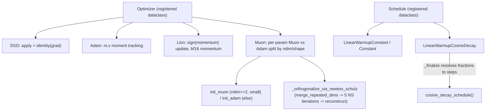

# simply.utils.optimizers — Optimizer/Schedule registries, plus a from-scratch Muon

## Overview

This module defines the `Optimizer` base contract
(`init`/`apply`/`apply_updates`, each a registered dataclass) with four concrete implementations —
`SGD`, `Adam`,
`Lion`, and
[`Muon`](../catalog/simply/utils/optimizers.md#Muon._orthogonalize_via_newton_schulz) (a from-scratch
Newton-Schulz-orthogonalized optimizer, arXiv:2502.16982) — plus an independent
[`Schedule`](../catalog/simply/utils/optimizers.md#Schedule) hierarchy
([`LinearWarmupConstant`](../catalog/simply/utils/optimizers.md#LinearWarmupConstant)/
[`LinearWarmupCosineDecay`](../catalog/simply/utils/optimizers.md#LinearWarmupCosineDecay)) for
learning-rate scheduling, and a small `EarlyStop`
hierarchy. Every optimizer follows [simply-utils-module](simply-utils-module.md)'s registered-dataclass
pattern rather than Flax/Optax's transform-composition style — state is a plain dict built by `init`
and threaded explicitly through `apply`.

## Diagram

## Design rationale (why it's built this way)

**Every optimizer's `apply` returns `(update, state)`, not `(new_params, state)` — parameter update
is a separate, shared step.** `Optimizer.apply`
(abstract) always returns just the update tensor tree plus new state;
`Optimizer.apply_updates` (concrete, shared by every
subclass) does the actual `new_params = params - update` and re-attaches metadata via
`common.transfer_metadata` — factoring the "subtract from params" step out of every optimizer means
none of `SGD`/`Adam`/`Lion`/`Muon` need to know about `AnnotatedArray` metadata at all.

**Muon decides per-parameter, by `ndim`/shape, whether to use its own orthogonalized update or fall
back to Adam — this is a structural per-leaf branch, not a global config flag.**
`Muon.init`'s `init_muon`/`init_adam` closures both
check `p.ndim < 2 or max(p.shape) > self.dim_threshold`: `init_muon` returns `None` (opts a param
*out* of Muon tracking) exactly when `init_adam` returns a real zeros tensor (opts it *in* to Adam
tracking) — the two closures are complements of the same predicate, so every parameter ends up with
exactly one of `mu`/`adam_m`+`adam_v` populated, never both, never neither.
[`_param_update`](../catalog/simply/utils/optimizers.md#Muon._param_update) then dispatches per-leaf
by checking `mu.array is not None` first.

**Muon's Newton-Schulz iteration always orthogonalizes a *2-D* matrix, so higher-rank parameter
tensors are first merged down to 2-D and reconstructed afterward.**
[`merge_repeated_dims`](../catalog/simply/utils/optimizers.md#Muon.merge_repeated_dims) uses the
parameter's own `dim_annotation` (from [simply-utils-module](simply-utils-module.md)'s einsum
convention) to find which axis label repeats, then `einops.rearrange`s every same-labeled axis into
one merged axis — this only supports merging *one* repeated-label group at a time (`raise ValueError`
if more than one label repeats), and returns a `recipe` dict that
`reconstruct_from_merged` uses to invert the
rearrange exactly.

**The Newton-Schulz coefficients (`muon_a`, `muon_b`, `muon_c`) and iteration count are configurable
fields, not hardcoded constants, and the final scale factor depends on the matrix's own larger
dimension.** [`Muon._orthogonalize_via_newton_schulz`](../catalog/simply/utils/optimizers.md#Muon._orthogonalize_via_newton_schulz)
transposes to guarantee more columns than rows before iterating (for numerical/compute efficiency),
runs `ns_steps` (default 5) iterations of the quintic Newton-Schulz update `x_{t+1} = a*x + b*(xx^T)x +
c*(xx^T)^2 x`, then scales the result by `0.2 * sqrt(max(rows, cols))` before undoing the transpose —
this final scale is what calibrates the orthogonalized update's magnitude to be comparable to a
standard gradient step.

**Schedules resolve fraction-based hyperparameters to absolute step counts lazily, via `_finalize`,
only once `num_train_steps` is known.** [`LinearWarmupCosineDecay.__call__`](../catalog/simply/utils/optimizers.md#LinearWarmupCosineDecay.__call__)
calls `self._finalize(num_train_steps)` only when `num_train_steps` is passed in — otherwise the raw
(possibly fraction-only) `self` is used directly — and `_finalize` uses the shared
[`replace_fraction`](../catalog/simply/utils/optimizers.md#replace_fraction) helper to convert each
`*_fraction` field to its corresponding `*_steps` field, raising if both are already set. This lets a
config specify `warmup_fraction=0.1` without knowing the total step count at config-authoring time —
the actual step count only needs to be known at schedule-*call* time (i.e. once training config is
fully resolved).

> [!inferred] `create_lr_schedule` branches on whether `config.lr_schedule_name` is truthy to decide
> between a "v0" (legacy, dict-based `lr_schedule_config`) path and the newer path of calling
> `config.lr` (a `Schedule` instance) directly with `functools.partial(..., num_train_steps=...)` —
> this dual-path structure exists purely for backward compatibility with older experiment configs
> that predate the `Schedule` registry pattern.

## Entry points

- [`Optimizer.apply`](../catalog/simply/utils/optimizers.md#Muon.apply) (abstract, per subclass) —
  called once per training step with the current state and gradient tree.
- **`Optimizer.apply_updates`** — the shared
  params-minus-update step every subclass reuses unmodified, downstream of
  [`Muon._param_update`](../catalog/simply/utils/optimizers.md#Muon._param_update).
- **`create_lr_schedule`**/
  `create_lr_schedule_v0` — resolve a config's learning-rate spec into the callable
  [`LinearWarmupCosineDecay.__call__`](../catalog/simply/utils/optimizers.md#LinearWarmupCosineDecay.__call__)-shaped
  `(steps) -> Array` schedule function; called once at training-loop setup.
- [`OptimizerRegistry`](../catalog/simply/utils/optimizers.md#OptimizerRegistry)/
  [`ScheduleRegistry`](../catalog/simply/utils/optimizers.md#ScheduleRegistry) — the two
  [`RootRegistry`](../catalog/simply/utils/registry.md#RootRegistry.register) subclasses this module
  populates.

## Mechanism (step-by-step)

1. **`init` builds per-optimizer state trees mirroring the parameter tree's structure, later consumed
   by [`Muon._param_update`](../catalog/simply/utils/optimizers.md#Muon._param_update) (for `Muon`'s
   own Adam-fallback leaves).** `Adam.init` builds `m`/`v` as
   `jax.tree_util.tree_map(zeros_like, params)`, each immediately sharding-constrained to match its
   corresponding parameter's own sharding via
   [`sharding.get_array_sharding`](../catalog/simply/utils/sharding.md#with_sharding_constraint);
   `get_init_steps` initializes a
   sharding-constrained scalar step counter shared by every optimizer.
2. **[`Muon.apply`](../catalog/simply/utils/optimizers.md#Muon.apply)-style `apply` computes the
   bias-corrected update from the gradient and current moments.**
   `Adam.apply` updates `m`/`v` with the standard
   exponential moving averages, then computes `update = (m / (1-beta1^(t+1))) / (sqrt(v /
   (1-beta2^(t+1))) + eps)` per leaf.
3. **Muon's `apply` computes three parallel moment updates, then dispatches the final update per-leaf
   by which moment is populated.** `_mu`/`_adam_m`/`_adam_v` are applied via
   `jax.tree_util.tree_map` across the whole (possibly `None`-sparse) state trees;
   [`_param_update`](../catalog/simply/utils/optimizers.md#Muon._param_update) is mapped last, with
   `is_leaf=lambda x: isinstance(x, AnnotatedArray)` so it sees whole `AnnotatedArray` leaves rather
   than being applied inside them.
4. **Schedules compute a warmup factor and, for cosine decay, a separate decay factor, then combine
   multiplicatively.** [`cosine_decay_schedule`](../catalog/simply/utils/optimizers.md#cosine_decay_schedule)
   computes `warmup_val = start_value + (val - start_value) * warmup_factor`, then `actual_val =
   warmup_val * ((1-end_decay) * decay_factor + end_decay)` — `end_decay` sets a floor below which the
   value never decays further (`end_decay=0` decays fully to `start_value`, `end_decay=1` disables
   decay entirely).

## Key data structures

- **`state` dict** (per optimizer) — always contains `'params'` and `'steps'`; `Adam` adds `'m'`/`'v'`,
  `Lion` adds `'m'`, `Muon` adds `'adam_m'`/`'adam_v'`/`'mu'` (each a pytree parallel to `params`,
  some leaves `None`).
- **[`Muon`](../catalog/simply/utils/optimizers.md#Muon._orthogonalize_via_newton_schulz) fields** —
  `muon_a`/`muon_b`/`muon_c` (Newton-Schulz quintic coefficients), `ns_steps`, `beta` (momentum),
  `dim_threshold` (the ndim/shape cutoff separating Muon-tracked from Adam-tracked parameters).
- **[`Schedule`](../catalog/simply/utils/optimizers.md#Schedule)** subclasses — plain frozen
  dataclasses whose fields are either absolute step counts or `*_fraction` alternatives, reconciled
  by [`replace_fraction`](../catalog/simply/utils/optimizers.md#replace_fraction).

## Dynamics (design intent)

Because every optimizer state dict is a plain Python dict mutated by rebinding keys (`state['m'] =
...`), not a frozen structure, callers must treat `apply`'s returned `state` as the sole authoritative
state to carry forward — the input `state` dict is mutated in place as a side effect in several
optimizers (`Adam.apply`, `Muon.apply` reassign into the same dict object passed in), so aliasing the
pre-call state elsewhere and expecting it to remain unchanged would be incorrect.

## Edge cases

- [`Muon.merge_repeated_dims`](../catalog/simply/utils/optimizers.md#Muon.merge_repeated_dims)
  raises `ValueError` if more than one dimension label repeats in a parameter's `dim_annotation` —
  Muon cannot orthogonalize a tensor with two independent pairs of repeated axes (e.g. a
  batched-matrix-of-matrices layout) without further changes.
- [`LinearWarmupCosineDecay._finalize`](../catalog/simply/utils/optimizers.md#LinearWarmupCosineDecay._finalize)
  raises if both `decay_steps` and `steps_after_decay` are explicitly set — these are two mutually
  exclusive ways of specifying the same underlying quantity, and the schedule refuses to silently
  pick one.

## Open questions

- Whether Muon's `dim_threshold` default (10000) was tuned empirically for a specific model
  size/embedding dimension, or is a generic heuristic, isn't discussed in this packet's grounding.

## See also
- [simply-utils-registry](simply-utils-registry.md) — `RootRegistry`, the base every
  `Optimizer`/`Schedule`/`EarlyStop` inherits from.
- [simply-utils-common](simply-utils-common.md) — `transfer_metadata`, used by `apply_updates`.
- [simply-utils-sharding](simply-utils-sharding.md) — `with_sharding_constraint`/`get_array_sharding`,
  used throughout every optimizer's `init`.
