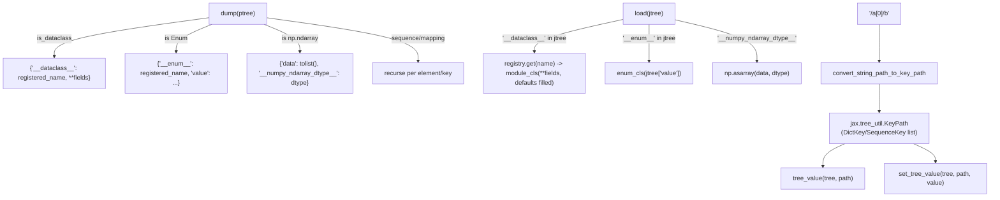

# simply.utils.pytree — generic pytree path access and registry-aware JSON (de)serialization

## Overview

This module gives Simply two independent capabilities over arbitrary Python trees of dicts/lists/
dataclasses: **path-based access** ([`tree_value`](../catalog/simply/utils/pytree.md#tree_value)/
[`set_tree_value`](../catalog/simply/utils/pytree.md#set_tree_value), using `jax.tree_util.KeyPath`
as the addressing scheme, with a string-path parser
`convert_string_path_to_key_path`
for human-friendly paths like `'/blocks[0]/attn/w'`), and **JSON round-tripping**
([`dump`](../catalog/simply/utils/pytree.md#dump)/[`load`](../catalog/simply/utils/pytree.md#load)),
which is registry-aware: any dataclass or enum tagged with `__registered_name__` (via
`registry.RootRegistry.register`) is
serialized with that name and reconstructed by looking the name back up in the registry — this is
the mechanism that lets a full experiment config (a nested tree of registered dataclasses) be saved
as plain JSON and rebuilt exactly, without a schema or explicit `to_dict`/`from_dict` per class.

## Diagram

## Design rationale (why it's built this way)

**Registration name, not the Python class object, is what gets serialized — this is what makes the
JSON format stable across refactors that rename a module but not a class's registered name.**
[`dump`](../catalog/simply/utils/pytree.md#dump) writes `res['__dataclass__'] =
getattr(ptree, '__registered_name__')` (the fullname set by
`registry.RootRegistry.register`, e.g.
`'ExperimentConfig:lm_test'`), and [`load`](../catalog/simply/utils/pytree.md#load) reverses this via
`registry.RootRegistry.get(jtree['__dataclass__'])` — the registry (see
[simply-utils-registry](simply-utils-registry.md)) is the single indirection layer both directions
depend on.

**`load`'s dataclass reconstruction explicitly fills in missing fields from their declared defaults,
rather than requiring the JSON to be complete.** [`load`](../catalog/simply/utils/pytree.md#load)'s
dataclass branch iterates `dataclasses.fields(module_cls)`, and for any field absent from `jtree`,
pulls `k.default` or calls `k.default_factory()` — raising only if neither exists. This is the
project's own documented "Registry serialization" convention (per the repo's CLAUDE.md): old saved
configs missing a field that was added later still load, picking up the new field's default.

**`RaggedArray`/`AnnotatedArray`-style custom pytree nodes are conspicuously absent from `dump`'s
branch list** — `dump` handles dataclasses, enums, `np.ndarray`, sequences, and mappings, in that
priority order (`dataclasses.is_dataclass` checked before `isinstance(..., enum.Enum)`, itself before
the numpy/sequence/mapping fallbacks) — meaning any `jax.Array` leaf reaching `dump` falls through
every branch and returns as-is (the final `return ptree`), which only makes sense for JSON output if
the caller has already stripped/converted arrays to plain Python/numpy beforehand — consistent with
`experiment_helper.save_config_info` calling `dump(config, only_dump_basic=True)` on configuration
trees, not live model parameters.

**`only_dump_basic` is a vestigial parameter — `dump` now always behaves as if it were `True` and
just logs a warning if a caller passes `False`.** [`dump`](../catalog/simply/utils/pytree.md#dump)'s
body does `logging.log_first_n(logging.WARNING, 'only_dump_basic can not be set false anymore.', 1)`
when `not only_dump_basic` — the parameter is kept for call-site backward compatibility but no
longer changes behavior, a signal that a richer (non-basic) dump mode existed once and was removed.

> [!inferred] `convert_string_path_to_key_path`'s
> parser treats a leading `/` as an optional separator and `[N]` as a sequence index — meaning
> `'blocks[0]/attn/w'` and `'/blocks[0]/attn/w'` parse identically — a convenience for paths that may
> or may not come pre-rooted.

## Entry points

- [`dump`](../catalog/simply/utils/pytree.md#dump)/[`load`](../catalog/simply/utils/pytree.md#load) —
  the JSON round-trip pair; called from
  [`experiment_helper.ExperimentHelper.save_config_info`](../catalog/simply/utils/experiment_helper.md#ExperimentHelper.save_config_info)
  and `main.load_experiment_config` respectively.
- [`tree_value`](../catalog/simply/utils/pytree.md#tree_value)/
  [`set_tree_value`](../catalog/simply/utils/pytree.md#set_tree_value) — generic path-addressed
  get/set, used wherever code needs to reach into an arbitrary nested config/param tree by a
  human-authored path string.
- [`save_pytree_to`](../catalog/simply/utils/pytree.md#save_pytree_to)/
  [`load_pytree_from`](../catalog/simply/utils/pytree.md#load_pytree_from) — thin file-I/O wrappers
  around `dump`/`load` for a given `epath.PathLike`.
- [`concatenate_pytrees`](../catalog/simply/utils/pytree.md#concatenate_pytrees) — used by
  `sharding.MultihostData.load_async` to merge per-process local data shards back into one tree.

## Mechanism (step-by-step)

1. **A string path is parsed into a structured `KeyPath` once, ahead of
   [`tree_value`](../catalog/simply/utils/pytree.md#tree_value)/`set_tree_value` consuming it.**
   `convert_string_path_to_key_path`
   walks the string left to right, alternating between `[`-delimited integer indices
   (`jax.tree_util.SequenceKey`) and `/`-or-`[`-delimited dict keys (`jax.tree_util.DictKey`).
2. **`tree_value` walks the path against a live tree, raising `KeyError` on any missing/out-of-range
   step.** Each `DictKey`/`SequenceKey` in the path indexes one level deeper;
   [`tree_value`](../catalog/simply/utils/pytree.md#tree_value) has no tolerance for a partially
   missing path — the whole lookup fails at the first absent key.
3. **`set_tree_value` builds missing intermediate structure on the fly.** Walking the path, if an
   intermediate mapping key is absent or a sequence index is out of range,
   [`set_tree_value`](../catalog/simply/utils/pytree.md#set_tree_value) calls
   [`construct_tree_with_path_value`](../catalog/simply/utils/pytree.md#construct_tree_with_path_value)
   to build the remaining nested structure from scratch (right-to-left, wrapping `value` in
   dict/list levels as needed) — set never fails on a missing path the way get does.
4. **[`dump`](../catalog/simply/utils/pytree.md#dump) recurses top-down, checking dataclass, then
   enum, then ndarray, then sequence, then
   mapping, in that fixed order.** Each branch produces a JSON-safe structure; the dataclass and enum
   branches additionally require `__registered_name__` to be truthy to tag the type for `load` to
   recover — an *unregistered* dataclass/enum dumps its fields/value without the type tag and cannot
   be reconstructed to the same class by `load`.
5. **[`load`](../catalog/simply/utils/pytree.md#load) inverts each tag independently**, defaulting
   any field the JSON is missing from the
   reconstructed class's own `dataclasses.fields` metadata.

## Key data structures

- **`jax.tree_util.KeyPath`** — the addressing scheme this whole module standardizes string paths
  down to; every path-based function converts through it.
- **The JSON tag vocabulary** — `'__dataclass__'`, `'__enum__'`, `'__numpy_ndarray_dtype__'` — the
  three markers `dump`/`load` use to preserve type information that plain JSON cannot represent
  natively.

## Dynamics (design intent)

Because `load`'s dataclass reconstruction always re-derives missing fields from the *current* code's
defaults (not the defaults in effect when the JSON was dumped), loading an old config against a newer
version of the codebase silently picks up whatever new default the field currently has — this is a
deliberate forward-compatibility choice, but it means a loaded config is not always bit-identical to
the one originally dumped if defaults have changed upstream.

## Edge cases

- [`to_flat_dict`](../catalog/simply/utils/pytree.md#to_flat_dict) contains a bare `print(f'{tree=}')`
  debug statement left in the function body — every call to `to_flat_dict` prints its (potentially
  large) input tree to stdout as a side effect.
- [`trim_none`](../catalog/simply/utils/pytree.md#trim_none)'s sequence-trimming rule only drops a
  list if *every* element is `None` after recursive trimming — a list with even one non-`None` leaf
  is preserved in full (with `None` holes intact), not compacted.

## Open questions

- Whether the leftover `print` in [`to_flat_dict`](../catalog/simply/utils/pytree.md#to_flat_dict) is
  intentional debug scaffolding or dead code isn't resolved by this packet's grounding alone.

## See also
- [simply-utils-registry](simply-utils-registry.md) — `RootRegistry`, the name↔class indirection
  `dump`/`load` rely on.
- [simply-utils-experiment_helper](simply-utils-experiment_helper.md) — `save_config_info`, a
  primary caller of `dump`.
