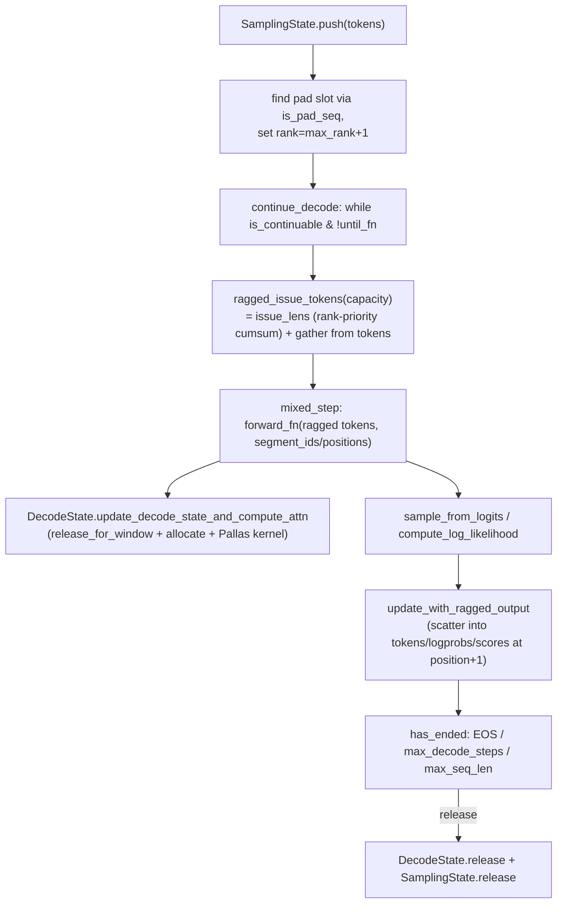

# simply.utils.ragged_paged_attention — paged KV cache + priority-ranked continuous-batching decode

<!-- connect:up:begin -->
> **Cross-repo concept:** part of [continuous-batching](../../../concepts/continuous-batching.md), [kv-cache](../../../concepts/kv-cache.md) across this wiki's repos.
<!-- connect:up:end -->
## Overview

This module is the state machine behind [simply-serving-page_batcher](simply-serving-page_batcher.md)'s
continuous batching: [`DecodeState`](../catalog/simply/utils/ragged_paged_attention.md#DecodeState.kv_lens)
manages a paged KV cache (fixed-size page pool, per-sequence page-index tables, an available-pages
free list) and calls the Pallas
[`ragged_paged_attention`](../catalog/simply/kernels/ragged_paged_attention.md#ragged_paged_attention)
kernel (see [simply-kernels-ragged_paged_attention](simply-kernels-ragged_paged_attention.md));
[`SamplingState`](../catalog/simply/utils/ragged_paged_attention.md#SamplingState.tokens) wraps one
`DecodeState` per attention layer plus per-sequence generation bookkeeping (`tokens`, `position`,
`rank`) and drives the actual multi-step decode loop via
[`mixed_step`](../catalog/simply/utils/ragged_paged_attention.md#SamplingState.mixed_step)/
[`continue_decode`](../catalog/simply/utils/ragged_paged_attention.md#SamplingState.continue_decode).
The defining mechanism is **priority-ranked token issuance**: every step, a fixed token budget
(`max_num_issue_tokens`) is distributed across all active sequences by rank (older-arrived sequences
first), computed once as a batched cumulative-sum problem rather than a per-sequence loop — this is
what lets prefill (many tokens for a newly-pushed sequence) and decode (one token per already-running
sequence) share a single mixed-step kernel call.

## Diagram

## Design rationale (why it's built this way)

**Pages are allocated at `num_shards` granularity so no `shard_map` is needed for page management
itself.** [`DecodeState.allocate`](../catalog/simply/utils/ragged_paged_attention.md#DecodeState.allocate)'s
docstring states this directly: "Pages are managed at num_shards granularity. Each shard gets
ceil(num_pages / num_shards) pages, making allocations uniform across shards" — every shard's page
count and page-index bookkeeping stays perfectly symmetric, so the allocate/release logic runs once
(not once per shard inside a `shard_map`), and only the actual attention *compute*
([`update_decode_state_and_compute_attn`](../catalog/simply/utils/ragged_paged_attention.md#DecodeState.update_decode_state_and_compute_attn))
needs a `shard_map` boundary.

**A per-sequence `rank` (assigned once, at push time, as `max_rank + 1`) is the sole priority signal
governing how the shared token-issue budget is split every step — older-queued sequences always win
ties.** `SamplingState.push` sets
`rank = self.max_rank + 1`for a newly inserted sequence;
[`issue_lens`](../catalog/simply/utils/ragged_paged_attention.md#SamplingState.issue_lens) sorts
`desired_issue_lens` by rank via
`rank_indices` before doing a
cumulative-sum-based greedy allocation up to `capacity` — this is what "do not issue when
oversubscribed" (the method's own comment) actually means: sequences are served in strict priority
(arrival) order, and only the tokens that fit in the remaining budget for a lower-priority sequence
get issued that step, deferring the rest to the next step.

**`rank_indices` also prioritizes single-token decode steps over multi-token prefill chunks within the
same priority tier.** `rank_indices`
computes `inner_rank`: padding slots get the maximum rank (last), sequences with
`desired_issue_lens == 1` (ordinary decode) keep their raw `rank`, but sequences needing more than one
token issued (prefill) get `batch_size + rank` — i.e. every decode-step sequence outranks every
prefill-in-progress sequence regardless of arrival order, favoring latency for already-running
generations over throughput for new prefills.

**`is_continuable`'s capacity check uses the *lowest-ranked* (oldest/highest-priority) sequence's
current length as the baseline for "can we make room," not an average or worst case.**
`SamplingState.is_continuable`
reads `seq0_len = self.position[self.rank_indices[0]]` (the top-priority sequence's position) and
checks `max_total_num_tokens - num_used_tokens + seq0_len >= max_seq_len - 1` — guaranteeing there's
always enough token-buffer budget to let the *highest-priority* sequence run to its max length, even
if that means lower-priority sequences get squeezed; [`issue_lens`](../catalog/simply/utils/ragged_paged_attention.md#SamplingState.issue_lens)'s
own comment flags this isn't fully bulletproof yet ("This is not guaranteed anymore, need to fix").

**`update_decode_state_and_compute_attn`'s `page_manage_cache` lets multiple attention layers sharing
the same page-pool shape skip redundant page allocation math.** The method's
[`page_manage_key`](../catalog/simply/utils/ragged_paged_attention.md#DecodeState.page_manage_key)
property (`(total_num_pages, page_size, window_size)`) is used as a cache key: the *first* layer with
a given key actually calls
[`release_for_window`](../catalog/simply/utils/ragged_paged_attention.md#DecodeState.release_for_window)`().`[`allocate`](../catalog/simply/utils/ragged_paged_attention.md#DecodeState.allocate)`(q.lens)`
and stores the resulting page bookkeeping in `page_manage_cache`; every subsequent layer with the
*same* key reuses that cached bookkeeping directly — since page allocation only depends on
`(total_num_pages, page_size, window_size, q.lens)`, not per-layer KV content, layers with identical
cache geometry (e.g. every non-sliding-window layer) don't need to redo the allocation trace.

**Cross-shard attention accumulation is done with a numerically-stable log-sum-exp weighted merge, not
a naive concatenation.** In the `seq_partition_size > 1` branch of
[`update_decode_state_and_compute_attn`](../catalog/simply/utils/ragged_paged_attention.md#DecodeState.update_decode_state_and_compute_attn),
each shard computes its own local attention output *and* log-sum-exp (`lse`) over only the KV it
locally holds; `max_lse` is `pmax`-reduced across shards, each shard's contribution is reweighted by
`exp(lse - max_lse)`, and both the weighted output and weight are `psum_scatter`-reduced — the
standard flash-attention-style online-softmax merge, needed because each shard only ever sees a
*partition* of the full KV sequence when sequences are sharded across the `seq_partition` axis.

> [!inferred] [`autotune_block_sizes`](../catalog/simply/utils/ragged_paged_attention.md#autotune_block_sizes)'s
> heuristic (balancing a fixed DMA-issuing overhead estimate against page-block padding overhead via
> `sqrt(dma_overhead / padding_overhead)`) is explicitly empirical per its own comments ("32 is a good
> emperical trade-off," "This is an emperical estimation of the DMA issuing/waiting overhead") — these
> constants (`0.5 MiB` overhead-equivalent bytes, `num_queries_per_block` capped at 32) are tuned
> against specific TPU generations' HBM↔VMEM bandwidth/latency ratio and may need revisiting on new
> hardware.

## Entry points

- [`DecodeState.update_decode_state_and_compute_attn`](../catalog/simply/utils/ragged_paged_attention.md#DecodeState.update_decode_state_and_compute_attn) —
  called once per attention layer per forward pass; the sole bridge between the model's attention
  layer and the paged-KV-cache/Pallas-kernel machinery.
- [`SamplingState.continue_decode`](../catalog/simply/utils/ragged_paged_attention.md#SamplingState.continue_decode) —
  the multi-step decode driver, a `jax.lax.while_loop` over
  [`mixed_step`](../catalog/simply/utils/ragged_paged_attention.md#SamplingState.mixed_step); called
  once per batcher loop iteration (see [simply-serving-page_batcher](simply-serving-page_batcher.md)).
- **`SamplingState.push`/`release`** — the two
  batch-membership mutations; `push` occupies a free slot, `release` frees a completed/cancelled one,
  mirroring
  [`DecodeState.allocate`](../catalog/simply/utils/ragged_paged_attention.md#DecodeState.allocate)/
  [`DecodeState.release_for_window`](../catalog/simply/utils/ragged_paged_attention.md#DecodeState.release_for_window)
  on the KV-cache side.

## Mechanism (step-by-step)

1. **A new request occupies the first available pad slot, tagged with the next rank, ahead of
   [`issue_lens`](../catalog/simply/utils/ragged_paged_attention.md#SamplingState.issue_lens) using
   that rank next step.**
   `SamplingState.push` finds
   `index = flatnonzero(is_pad_seq, size=1, ...)`, writes the input tokens there, and sets
   `rank[index] = max_rank + 1`.
2. **Each decode step, `issue_lens` splits the shared token budget across active sequences by rank
   priority via a single batched cumulative sum.**
   [`issue_lens`](../catalog/simply/utils/ragged_paged_attention.md#SamplingState.issue_lens) sorts
   `desired_issue_lens` by `rank_indices`,
   cumulative-sums (clipped to `capacity`), applies a second clip protecting the top-priority
   sequence's `max_total_num_tokens` budget, then differences consecutive cumulative sums to recover
   per-sequence issue counts, un-sorting back to original order via
   `rank_inv_indices`.
3. **`ragged_issue_tokens` gathers exactly those tokens from the per-sequence token buffers into one
   flat ragged batch.** Uses [`RaggedArray`](../catalog/simply/utils/common.md#RaggedArray)'s
   `row_ids`/`intra_offset` machinery (see [simply-utils-common](simply-utils-common.md)) to compute
   flat gather indices from `self.position[row_ids] + intra_offset`.
4. **`mixed_step` runs one forward pass over the ragged batch, samples, scores, and scatters results
   back.** `forward_fn` is called with `segment_ids`/`segment_positions` derived from the ragged
   layout; [`sampling_lib.sample_from_logits`](../catalog/simply/utils/sampling_lib.md#sample_from_logits)
   picks the next token (or, if the position is still within the known prompt, the actual next input
   token — teacher-forcing during prefill via the `jnp.where(segment_positions + 1 >=
   input_lens[...], output_tokens, next_tokens)` swap);
   [`sampling_lib.compute_log_likelihood`](../catalog/simply/utils/sampling_lib.md#compute_log_likelihood)
   scores the chosen token under a (possibly different) scoring distribution.
5. **`update_decode_state_and_compute_attn` (called from inside `forward_fn`, per attention layer)
   manages pages, runs the Pallas kernel (or the CPU reference implementation), and writes back the
   updated KV cache.** On CPU, it always uses
   [`rpa_kernel.ref_ragged_paged_attention`](../catalog/simply/kernels/ragged_paged_attention.md#ref_ragged_paged_attention)
   (Pallas is TPU-only); on TPU, block sizes are autotuned (or explicit) and the kernel runs under a
   `shard_map`, with the sequence-sharded path additionally doing the online-softmax cross-shard merge
   described above.
6. **[`continue_decode`](../catalog/simply/utils/ragged_paged_attention.md#SamplingState.continue_decode)'s
   while-loop condition combines three independent stop signals.**
   `is_continuable & ~until_fn(state) & (step < intermediate_steps)` — capacity-based continuability,
   a caller-supplied early-stop predicate (e.g. page_batcher's `response_asap`), and a hard step-count
   ceiling per call (so one `continue_decode` invocation never runs unboundedly, letting the batcher
   loop reassess new incoming requests periodically).

## Key data structures

- **[`DecodeState`](../catalog/simply/utils/ragged_paged_attention.md#DecodeState.kv_lens)** —
  [`pages`](../catalog/simply/utils/ragged_paged_attention.md#DecodeState.pages) (the physical KV
  page pool), [`page_indices`](../catalog/simply/utils/ragged_paged_attention.md#DecodeState.page_indices)
  (per-sequence page ownership table),
  [`available_page_indices`](../catalog/simply/utils/ragged_paged_attention.md#DecodeState.available_page_indices)/
  [`num_available_pages`](../catalog/simply/utils/ragged_paged_attention.md#DecodeState.num_available_pages)
  (the free list), [`kv_lens`](../catalog/simply/utils/ragged_paged_attention.md#DecodeState.kv_lens),
  `window_size` (sliding-window attention support), and sharding fields
  ([`head_partition`](../catalog/simply/utils/ragged_paged_attention.md#DecodeState.head_partition)/
  [`seq_partition`](../catalog/simply/utils/ragged_paged_attention.md#DecodeState.seq_partition)).
- **[`SamplingState`](../catalog/simply/utils/ragged_paged_attention.md#SamplingState.tokens)** —
  [`tokens`](../catalog/simply/utils/ragged_paged_attention.md#SamplingState.tokens)/`token_logprobs`/
  `token_scores` (per-sequence output buffers),
  [`position`](../catalog/simply/utils/ragged_paged_attention.md#SamplingState.position),
  [`input_lens`](../catalog/simply/utils/ragged_paged_attention.md#SamplingState.input_lens),
  `max_decode_steps`, `rank`, `eos_ids`, `max_total_num_tokens` (the shared token-issue budget).
- **`_StepState`** — the `(step, state)` pair `continue_decode`'s `while_loop` carries.

## Dynamics (design intent)

Because `rank` is only ever set once (at push) and never reassigned except by
`release`'s
`rank_inv_indices` renormalization (compacting ranks after a slot frees up), priority ordering across
the whole batch's lifetime is a strict FIFO by arrival — there is no aging/starvation-prevention
mechanism for a hypothetically very-low-priority sequence beyond the fact that ranks compact toward
zero as higher-priority sequences complete and free their slots.

## Edge cases

- [`DecodeState.__post_init__`](../catalog/simply/utils/ragged_paged_attention.md#DecodeState.kv_lens)
  silently resets `window_size` to `None` (with a log message) if given a non-positive value — a
  misconfigured `window_size <= 0` doesn't error, it just disables sliding-window behavior.
- [`SamplingState.issue_lens`](../catalog/simply/utils/ragged_paged_attention.md#SamplingState.issue_lens)'s
  own inline comment ("This is not guaranteed anymore, need to fix") flags that the capacity
  constraint protecting the top-priority sequence's completion is not airtight in all cases — worth
  checking before relying on it for correctness-critical latency guarantees.

## Open questions

- The precise conditions under which the sharded (`seq_partition_size > 1`) cross-shard online-softmax
  merge path is exercised in production (vs. the simpler non-sharded path) aren't specified beyond
  the config threading visible in this packet's subgraph.

## See also
- [simply-kernels-ragged_paged_attention](simply-kernels-ragged_paged_attention.md) — the Pallas
  kernel this module calls under `shard_map`.
- [simply-utils-common](simply-utils-common.md) — `RaggedArray`, the core data structure underlying
  `ragged_issue_tokens`/`update_with_ragged_output`.
- [simply-serving-page_batcher](simply-serving-page_batcher.md) — the caller driving `push`/
  `continue_decode`/`release` in a loop.
