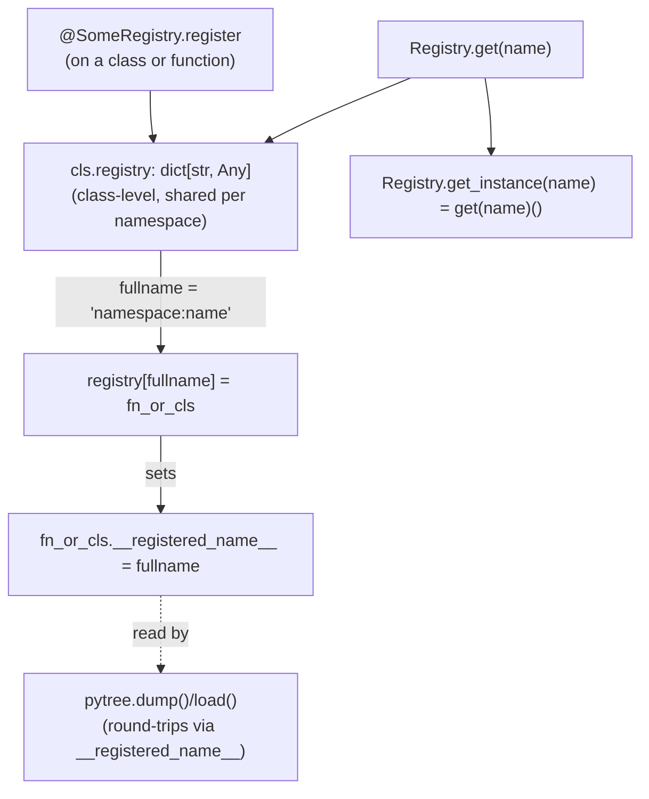

# simply.utils.registry — the name-to-object registry every extensible piece uses

## Overview

[`RootRegistry`](../catalog/simply/utils/registry.md#RootRegistry) is the single mechanism Simply
uses for every extensible component: models, optimizers, schedules, tokenizers, LM chat formats,
data sources, evaluations, tools, and experiment configs are all registered by name into one of a
handful of `RootRegistry` subclasses (each just setting a different `namespace`), rather than
Simply having a bespoke plugin system per subsystem. A component becomes selectable purely by
decorating its class or factory function with `@SomeRegistry.`[`register`](../catalog/simply/utils/registry.md#RootRegistry.register)
— which is also what makes Simply's config-driven CLI (`--experiment_config <name>`) and every
other `<x>_name: str` config field work identically across totally different subsystems.

## Diagram

## Design rationale (why it's built this way)

**Every registry is a subclass of one root, not an independent dict, so namespacing is free and
uniform.** [`RootRegistry`](../catalog/simply/utils/registry.md#RootRegistry)'s docstring states
explicitly: "All registry classes must inherit from this class so that they can be tracked at this
root place." Each subclass (`ModuleRegistry`, `OptimizerRegistry`, `TokenizerRegistry`,
`LMFormatRegistry`, `DataSourceRegistry`, `EvaluationRegistry`, `ToolRegistry`, `EnvRegistry`,
`LLMRegistry`, `DistributionRegistry`, `PositionEncodingRegistry`, ...) sets only its own
`namespace: ClassVar[str]`; `_get_namespace_prefix`
and `fullname` turn `name` into
`f'{namespace}:{name}'` uniformly, so a bare string like `'Adam'` cannot collide across namespaces
(`'Optimizer:Adam'` vs. a hypothetical `'Module:Adam'`) even though every registry shares the same
underlying dict-manipulation code.

**Registration mutates the registered object itself, not just the registry dict — this is the seam
`pytree.dump`/`load` depends on.** [`register`](../catalog/simply/utils/registry.md#RootRegistry.register)
does `setattr(fn_or_cls, '__registered_name__', fullname)` after inserting into
`cls.registry` — so any dataclass instance later serialized via `pytree.dump` can recover its own
registered fullname (`getattr(ptree, '__registered_name__')`) without a separate lookup table,
letting a config (a plain nested dataclass tree) round-trip to JSON and back while preserving which
concrete registered subclass each node was.

**Duplicate registration is a hard error, except in Colab.**
[`register`](../catalog/simply/utils/registry.md#RootRegistry.register) raises `ValueError` on a
duplicate `fullname` unless `OVERWRITE_DUPLICATE` is set on the subclass or
[`_is_running_in_colab`](../catalog/simply/utils/registry.md#RootRegistry.register) — Colab's
interactive re-execution of cells re-imports/redefines the same registered class repeatedly, so the
check is relaxed there specifically rather than globally, to avoid Colab users tripping the
duplicate-name guard on ordinary notebook re-runs.

> [!inferred] [`register_value`](../catalog/simply/utils/registry.md#RootRegistry.register) wraps a
> plain value in a zero-arg lambda before registering it — this exists so that
> [`get_instance`](../catalog/simply/utils/registry.md#RootRegistry.get_instance) (`get(name)()`)
> works uniformly whether the registered entry is a class (instantiated by calling it) or a
> precomputed value (returned by calling the wrapping lambda) — one call convention for both cases.

## Entry points

- [`RootRegistry.register`](../catalog/simply/utils/registry.md#RootRegistry.register) — the
  decorator every registrable class/function in the codebase carries; this is where a name enters
  the registry.
- [`RootRegistry.get`](../catalog/simply/utils/registry.md#RootRegistry.get) /
  [`get_instance`](../catalog/simply/utils/registry.md#RootRegistry.get_instance) — the lookup path;
  `get` returns the registered class/function itself, `get_instance` additionally calls it.
- **`FunctionRegistry`** — the one concrete
  subclass defined in this module itself (`namespace = 'Function'`); every other registry
  (`ModuleRegistry`, `OptimizerRegistry`, etc.) is defined in its own subsystem's file but follows
  the same [`register`](../catalog/simply/utils/registry.md#RootRegistry.register)/`get` pattern.

## Mechanism (step-by-step)

1. **A class or function is decorated at import time.** `@SomeRegistry.`[`register`](../catalog/simply/utils/registry.md#RootRegistry.register)
   runs as soon as the module defining it is imported — registration is a side effect of import,
   not of any explicit setup call.
2. **[`register`](../catalog/simply/utils/registry.md#RootRegistry.register) computes the fullname
   and checks for collision.** If `name` isn't explicitly given,
   it defaults to `fn_or_cls.__name__`; `fullname`
   prefixes it with the subclass's namespace; a duplicate `fullname` raises unless
   `OVERWRITE_DUPLICATE` or Colab.
3. **The object is inserted into the class-level `registry` dict and tagged, as the second half of
   what [`register`](../catalog/simply/utils/registry.md#RootRegistry.register) does.**
   `cls.registry[fullname] = fn_or_cls`, then `fn_or_cls.__registered_name__ = fullname` — both
   effects happen on every successful registration.
4. **Lookup resolves the same fullname.** [`get`](../catalog/simply/utils/registry.md#RootRegistry.get)
   re-derives `fullname` from `name` and indexes `cls.registry`, raising `ValueError` by default if
   absent (`raise_error=True`); [`get_instance`](../catalog/simply/utils/registry.md#RootRegistry.get_instance)
   additionally calls the result.
5. **Every downstream subsystem repeats steps 1–4 with its own namespace, reusing the same
   [`register`](../catalog/simply/utils/registry.md#RootRegistry.register)/`get` pattern.** The huge
   fan-out visible
   in this packet's subgraph — dozens of `<Name>Registry` types across `config_lib.py`, `model_lib.py`,
   `data_lib.py`, `rl_lib.py`, `tool_lib.py`, `agent/*.py` — is every one of them independently
   instantiating this same four-step pattern.

## Key data structures

- **`RootRegistry.registry: ClassVar[dict[str, Any]]`** — per-subclass (Python class attributes are
  not shared across subclasses unless explicitly inherited unmodified) dict from fullname to
  registered object; the entire state of a registry.
- **`namespace: ClassVar[str]`** — the string prefix that partitions the shared `fullname` keyspace
  by subsystem.

## Dynamics (design intent)

Because registration happens at import time as a decorator side effect, the full set of registered
names for a given registry is only complete once every module defining entries for it has been
imported — a config referencing a name whose defining module was never imported will fail lookup,
not because the name doesn't exist in the codebase but because its registration side effect never ran.

## Edge cases

- [`unregister`](../catalog/simply/utils/registry.md#RootRegistry.register) is a no-op if the name
  isn't present (checks `if fullname in cls.registry` before deleting) — no error on unregistering
  something absent.
- [`keys`](../catalog/simply/utils/registry.md#RootRegistry.register) strips the namespace prefix
  from every key belonging to `cls`'s namespace — so `SomeRegistry.keys()` returns bare names, while
  `cls.registry` itself stores fully-qualified `namespace:name` keys.

## Open questions

- Since `registry` is a single process-wide dict per subclass, whether concurrent registration from
  multiple threads (e.g. lazy imports during multiprocessing data loading) is safe isn't addressed
  by this packet's grounding.

## See also
- [simply-utils-module](simply-utils-module.md) — `ModuleRegistry`, one of the many
  `RootRegistry` subclasses.
- [simply-utils-optimizers](simply-utils-optimizers.md) — `OptimizerRegistry`/`ScheduleRegistry`.
- [simply-utils-lm_format](simply-utils-lm_format.md) — `LMFormatRegistry`.
- [simply-utils-tokenization](simply-utils-tokenization.md) — `TokenizerRegistry`.
