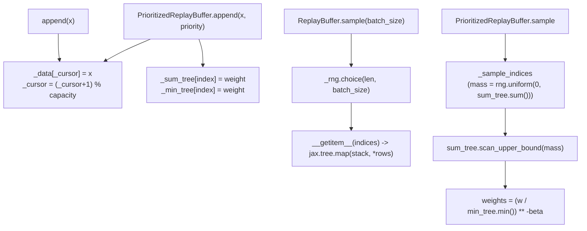

# simply.utils.replay_buffers — ring-buffer and priority-sampled RL replay

## Overview

`ReplayBuffer` is a fixed-capacity ring
buffer of `common.PyTree` transitions with uniform sampling, and
`PrioritizedReplayBuffer`
extends it with importance-sampling weights backed by a
[`SumSegmentTree`](../catalog/simply/utils/segment_trees.md#SumSegmentTree)/[`MinSegmentTree`](../catalog/simply/utils/segment_trees.md#MinSegmentTree)
pair, implementing the Prioritized Experience Replay paper (arXiv:1511.05952). Both classes
implement Python's `Sequence[PyTree]` protocol directly (`__getitem__`/`__len__`/`__iter__`), so a
replay buffer is usable anywhere a sequence of pytrees is expected, while internally batching
`jax.tree.map`-based stacking whenever a caller asks for multiple indices at once.

## Diagram

## Design rationale (why it's built this way)

**The base `ReplayBuffer` is a ring buffer over a Python list, not a preallocated array — capacity
is an eviction policy, not a memory layout.**
[`ReplayBuffer.append`](../catalog/simply/utils/replay_buffers.md#ReplayBuffer.append) grows
`self._data` (a plain list) until it reaches `_capacity`, then starts overwriting at
`self._cursor`, wrapping modulo capacity — so each element can be an arbitrarily-shaped pytree (the
buffer doesn't require uniform per-element shape until `__getitem__`'s `jax.tree.map(stack, ...)` is
actually invoked on a batch).

**Batched reads stack via `jax.tree.map`, so heterogeneous per-episode shapes only need to agree at
sample time, not at insert time.** [`ReplayBuffer.__getitem__`](../catalog/simply/utils/replay_buffers.md#ReplayBuffer.append)
special-cases a scalar index (returns the raw stored element) versus a sequence of indices
(`jax.tree.map(lambda *x: np.stack(x), *batch)`) — meaning `append`/`extend` never validate
shape consistency; a shape mismatch across appended items only surfaces as a `np.stack` error the
first time a multi-index read spans them.

**Prioritized sampling separates "how much mass does each item get" (sum tree) from "what's the
minimum weight in the buffer right now" (min tree), because importance-sampling weights need the
global minimum, not a running estimate.** `PrioritizedReplayBuffer.sample`
normalizes `weights` by `self._min_tree.min()` before raising to `-beta` — the
[`MinSegmentTree`](../catalog/simply/utils/segment_trees.md#MinSegmentTree) exists purely to make
that global minimum queryable in O(log n) rather than O(n), the same reason the
[`SumSegmentTree`](../catalog/simply/utils/segment_trees.md#SumSegmentTree) makes weighted sampling
via `scan_upper_bound` also O(log n).

**Sampling without replacement zeroes out sampled entries in the sum tree mid-loop, then restores
them — a destructive-then-repair pattern rather than a separate "already sampled" set.**
[`PrioritizedReplayBuffer._sample_indices`](../catalog/simply/utils/replay_buffers.md#PrioritizedReplayBuffer._sample_indices)'s
`replace=False` branch sets `self._sum_tree[index] = 0.0` immediately after drawing each index (so
the next draw's `mass` can't land on it again), then after the loop does `self._sum_tree[indices] =
weights` to restore the original priorities — trading a temporary tree mutation for avoiding an
explicit exclusion mask on every draw.

> [!inferred] `PrioritizedReplayBuffer.extend`'s "no priority given" branch weights every new item by
> `self._max_priority ** self.alpha` (the highest priority ever seen) rather than a fixed default —
> this is the paper's standard convention of maximizing new-experience priority so freshly-added
> transitions are sampled at least once before their priority is refined by
> [`update_priorities`](../catalog/simply/utils/replay_buffers.md#PrioritizedReplayBuffer.update_priorities).

## Entry points

- [`ReplayBuffer.append`](../catalog/simply/utils/replay_buffers.md#ReplayBuffer.append)/
  [`extend`](../catalog/simply/utils/replay_buffers.md#ReplayBuffer.extend) — the two ways data
  enters the buffer; `extend` just loops `append` per-row after flattening the leading batch
  dimension via `jax.tree.leaves(batch)[0].shape[0]`.
- **`PrioritizedReplayBuffer.sample`** —
  returns `(data, indices, weights)`; `indices` must be fed back into
  [`update_priorities`](../catalog/simply/utils/replay_buffers.md#PrioritizedReplayBuffer.update_priorities)
  once the caller has computed fresh TD-errors.
- [`ReplayBuffer.iterator`](../catalog/simply/utils/replay_buffers.md#ReplayBuffer.append) — a
  generator over the whole buffer, optionally shuffled and batched, for non-sampling (full-epoch)
  consumption.

## Mechanism (step-by-step)

1. **Insertion writes to the ring position and (for the prioritized variant) both segment trees.**
   [`PrioritizedReplayBuffer.append`](../catalog/simply/utils/replay_buffers.md#PrioritizedReplayBuffer.append)
   computes `weight = priority ** alpha` (or `max_priority ** alpha` if no priority given), calls
   `super().append(x)` to get the ring position, then writes that weight into both
   [`_sum_tree`](../catalog/simply/utils/replay_buffers.md#PrioritizedReplayBuffer._sum_tree) and
   [`_min_tree`](../catalog/simply/utils/replay_buffers.md#PrioritizedReplayBuffer._min_tree) at that
   index.
2. **Uniform sampling draws indices via NumPy's default RNG, with or without replacement.**
   `ReplayBuffer.sample`
   is `self._rng.choice(len(self), batch_size, replace=replace)` then indexes
   [`_data`](../catalog/simply/utils/replay_buffers.md#ReplayBuffer._data) via `self[indices]`.
2. **Prioritized sampling walks the sum tree's cumulative mass.**
   [`_sample_indices`](../catalog/simply/utils/replay_buffers.md#PrioritizedReplayBuffer._sample_indices)
   draws `mass` uniformly in `[0, sum_tree.sum())` (vectorized for the `replace=True` case via a
   single `scan_upper_bound(mass)` call over an array of masses, looped for `replace=False`), and
   `scan_upper_bound` returns which leaf's cumulative range contains that mass — the standard
   segment-tree stratified-sampling trick.
3. **Weights are converted to importance-sampling correction and returned alongside the data, via
   [`_min_tree`](../catalog/simply/utils/replay_buffers.md#PrioritizedReplayBuffer._min_tree).**
   `weights = (weights / self._min_tree.min()) ** (-self.beta)` — this is the standard PER
   correction factor that down-weights over-sampled (high-priority) transitions in the loss.
4. **After training, priorities are refreshed from new TD-errors.**
   [`update_priorities`](../catalog/simply/utils/replay_buffers.md#PrioritizedReplayBuffer.update_priorities)
   recomputes `priorities ** alpha` and writes it back into both trees at the given `indices`,
   also bumping `_max_priority` if any new priority exceeds it.

## Key data structures

- **[`ReplayBuffer._data`](../catalog/simply/utils/replay_buffers.md#ReplayBuffer._data)** — the
  plain Python list backing the ring buffer;
  [`_cursor`](../catalog/simply/utils/replay_buffers.md#ReplayBuffer._cursor)/
  [`_capacity`](../catalog/simply/utils/replay_buffers.md#ReplayBuffer._capacity) track the write
  position and size cap.
- **[`PrioritizedReplayBuffer._sum_tree`/`_min_tree`](../catalog/simply/utils/replay_buffers.md#PrioritizedReplayBuffer._sum_tree)**
  — parallel segment trees, always kept in sync (same indices, same weights) so any priority write
  updates both.
- **[`_max_priority`](../catalog/simply/utils/replay_buffers.md#PrioritizedReplayBuffer._max_priority)**
  — a running max used as the default priority for freshly-inserted, not-yet-scored transitions.

## Dynamics (design intent)

Both trees are always mutated together — there's no code path that updates one without the other —
so the invariant "sum_tree and min_tree agree on every index's current weight" holds by
construction, not by an explicit consistency check.

## Edge cases

- `ReplayBuffer.sample`
  asserts `batch_size <= len(self)` — sampling more than the buffer currently holds fails loudly
  rather than silently repeating elements (unless `replace=True` is explicitly requested).
- `PrioritizedReplayBuffer.extend`'s no-priorities branch uses a single scalar weight
  (`max_priority ** alpha`) broadcast to the whole batch, whereas the with-priorities branch computes
  a per-item `priorities ** alpha` array — the two branches have genuinely different weight shapes,
  not just a default-value substitution.

## Open questions

- Whether `alpha`/`beta` are ever annealed over training (a common PER refinement) isn't
  represented anywhere in this packet — both are fixed at construction.

## See also
- [simply-utils-common](simply-utils-common.md) — `PyTree`, the element type both buffers store.
