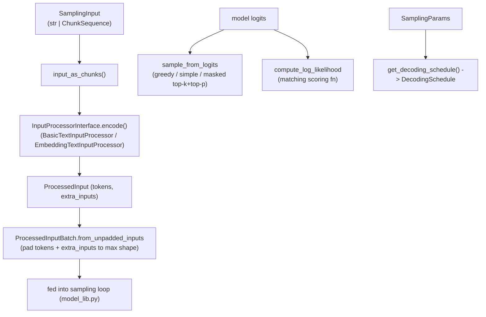

# simply.utils.sampling_lib — chunk-based input processing and temperature/top-k/top-p sampling

## Overview

This module's own docstring lays out the pipeline it implements: raw input as a sequence of
[`Chunk`](../catalog/simply/utils/sampling_lib.md#Chunk) (text or array, Gemini-API-style) →
`ProcessedInput` (tokenized, via an
`InputProcessorInterface`
implementation) → `ProcessedInputBatch`
(padded/batched) → fed into the sampling loop. Separately, this module implements the actual
token-sampling math: `sample_from_logits`
(temperature + top-k + top-p, with a fused-mask fast path) and
`compute_log_likelihood` (the
matching scoring function, so a model's sampled continuation and its own log-probability under the
same sampling distribution stay consistent). [`DecodingSchedule`](../catalog/simply/utils/sampling_lib.md#DecodingSchedule)
separately encapsulates how many prefill tokens to process before switching to chunked decode.

## Diagram

## Design rationale (why it's built this way)

**`sample_from_logits` and `compute_log_likelihood` share the exact same three-way branch structure
(greedy / plain categorical / masked-top-k-top-p), because sampling and scoring must agree on which
distribution was actually sampled from.** Both functions use nested `jax.lax.cond`s keyed on the same
conditions (`temperature == 0 or top_k == 1` → greedy;
`top_k > 0 or top_p < 1` → masked; else plain [`distributions.Categorical`](../catalog/simply/utils/sampling_lib.md)) —
this parallel structure is what guarantees that a token sampled under masked top-k/top-p receives a
log-probability from
`compute_log_likelihood` computed
under the *same* masked distribution, not the unmasked one, which matters for any downstream RL
algorithm computing importance weights or KL terms.

**Top-k and top-p masking are fused into one O(vocab) pass when both are active, rather than composed
naively (top-k then top-p over the full vocab).** `_fused_top_k_top_p_mask`'s
own docstring states the point directly: it "selects the top-k candidates in O(n) via `jax.lax.top_k`,
re-normalizes softmax over only those k candidates, then applies the top-p cumulative probability
threshold" — the softmax and cumulative-sum only ever operate on the `k`-sized slice, not the whole
(potentially 100k+ token) vocabulary, whereas naive top-p (`top_p_mask`) sorts and cumulative-sums the
*entire* vocab via `jnp.argsort`.

**Greedy sampling is checked first and dispatched via its own `lax.cond`, bypassing both top-k and
top-p logic entirely, because `temperature == 0` would otherwise divide by zero.**
`sample_from_logits`'s outermost
`jax.lax.cond(jnp.logical_or(temperature == 0, top_k == 1), greedy_fn, sample_fn, logits)` guards
`logits / temperature` (used inside every other branch) from ever executing with a zero divisor — the
condition is checked *before* any of the nested branches run, since `lax.cond` only evaluates the
selected branch.

**`DecodingSchedule.get_next_length` computes the next chunk boundary via one modular-arithmetic
formula rather than a lookup table or iterative stepping.** Given `cur_position`,
`get_next_length` computes
`step_multiple = (cur_position - prefill_size) // chunk_size + 1`, then `pos = prefill_size +
chunk_size * step_multiple`, clamped to `end_position` — this closed-form derivation of "the next
chunk-aligned position strictly after `cur_position`" avoids needing to track or iterate a chunk
counter across calls.

**Prefill size, when not explicitly configured, is chosen as the smallest power of two ≥
`min_input_length` (bounded below by `min_prefill_size`) — a TPU-shape-friendly heuristic, not an
arbitrary default.** [`SamplingParams.get_decoding_schedule`](../catalog/simply/utils/sampling_lib.md#SamplingParams.get_decoding_schedule)
computes `prefill_size = max(2**ceil(log2(min_input_length)), min_prefill_size)` — rounding the
prefill window up to the next power of two is a common TPU/XLA-compilation-count-reduction trick
(fewer distinct compiled shapes across varying-length prompts), consistent with this module operating
squarely in the performance-sensitive serving/decode path.

> [!inferred] `ProcessedInputBatch.from_unpadded_inputs`'s
> own docstring warns that `extra_inputs` fields get padded to "the maximum size in each dimension for
> the batch" — meaning a batch mixing, e.g., differently-sized embedding chunks
> (`EmbeddingTextInputProcessor`) will trigger recompilation
> whenever the maximum embedding size in a batch changes across calls, since XLA compiles per
> concrete shape.

## Entry points

- **`InputProcessorInterface.encode`**
  (protocol method) — the single tokenization entry point every concrete processor
  ([`BasicTextInputProcessor`](../catalog/simply/utils/sampling_lib.md#BasicTextInputProcessor.encode),
  [`EmbeddingTextInputProcessor`](../catalog/simply/utils/sampling_lib.md#EmbeddingTextInputProcessor.encode))
  implements.
- **`sample_from_logits`** — called once
  per decode step by the sampling loop (in `model_lib.py`) to pick the next token, using the
  temperature/top-k/top-p fields of the same
  [`SamplingParams`](../catalog/simply/utils/sampling_lib.md#SamplingParams.max_seq_len) that
  `get_decoding_schedule` also reads.
- **`compute_log_likelihood`** — called
  wherever a sequence's log-probability under a given sampling configuration
  ([`SamplingParams`](../catalog/simply/utils/sampling_lib.md#SamplingParams.max_seq_len)) is needed
  (e.g. RL reward computation, scoring).
- [`SamplingParams.get_decoding_schedule`](../catalog/simply/utils/sampling_lib.md#SamplingParams.get_decoding_schedule) —
  called once per request to derive the concrete prefill/chunk boundaries for that request's actual
  input lengths.

## Mechanism (step-by-step)

1. **Raw input is normalized to a `ChunkSequence`.**
   [`input_as_chunks`](../catalog/simply/utils/sampling_lib.md#input_as_chunks) wraps a bare string
   into a single [`Chunk`](../catalog/simply/utils/sampling_lib.md#Chunk)`(type=TEXT, ...)`, or passes
   a chunk sequence through unchanged.
2. **An `InputProcessorInterface` implementation encodes chunks into token ids (+ optional extra
   array inputs).** [`BasicTextInputProcessor.encode`](../catalog/simply/utils/sampling_lib.md#BasicTextInputProcessor.encode)
   prepends BOS then concatenates each text chunk's `vocab.encode(...)` tokens, truncating to
   `max_input_len` from the *end* (keeping the most recent tokens) if given.
3. **Multiple `ProcessedInput`s are batched with padding to the max length in the batch, ahead of
   [`SamplingParams.get_decoding_schedule`](../catalog/simply/utils/sampling_lib.md#SamplingParams.get_decoding_schedule)
   deriving chunk boundaries from that same batch.**
   `ProcessedInputBatch.from_unpadded_inputs`
   right-pads token sequences with `pad_id`, and pads `extra_inputs` per-leaf to each dimension's
   batch-wide maximum via a generic `form_batch` closure operating over `jax.tree_util.tree_map`.
4. **`sample_from_logits` (configured via
   [`SamplingParams`](../catalog/simply/utils/sampling_lib.md#SamplingParams.max_seq_len)) dispatches
   through nested `lax.cond`s to pick greedy, plain-categorical, or
   masked sampling**, always computing in `float32` regardless of the input logits' dtype (`logits =
   jnp.astype(logits, jnp.float32)` up front).
5. **`get_decoding_schedule` derives concrete prefill/chunk boundaries from the batch's actual min/max
   input lengths.** [`SamplingParams.get_decoding_schedule`](../catalog/simply/utils/sampling_lib.md#SamplingParams.get_decoding_schedule)
   computes `begin_position` (the smaller of `prefill_size` and `min_input_length - 1`, so the very
   first decode step for a short-in-batch sequence still lands correctly) and
   `end_position_exclusive` (the smaller of `max_seq_len - 1` and
   `max_input_length + max_decode_steps - 1`).

## Key data structures

- **[`Chunk`](../catalog/simply/utils/sampling_lib.md#Chunk)** — `type` (`TEXT`/
  [`ARRAY`](../catalog/simply/utils/sampling_lib.md#Chunk.Type.ARRAY)), `role`, `content`; the atomic
  multimodal input unit.
- **`ProcessedInput`**/
  **`ProcessedInputBatch`** — per-example
  and batched array-ready representations, respectively; `ProcessedInputBatch` additionally offers
  `repeat`
  (for multi-sample-per-prompt decoding) and
  `pad_batch_to` (padding the *batch*
  dimension itself, distinct from padding each sequence's length).
- **[`SamplingParams`](../catalog/simply/utils/sampling_lib.md#SamplingParams.max_seq_len)** — the
  full sampling configuration (`temperature`, `top_k`, `top_p`, `max_decode_steps`, `max_seq_len`,
  `min_prefill_size`, `intermediate_decode_steps`, ...).
- **[`DecodingSchedule`](../catalog/simply/utils/sampling_lib.md#DecodingSchedule)** — `prefill_size`,
  `begin_position`, `end_position`, `chunk_size`; the resolved, concrete decode-chunking plan for one
  batch.

## Dynamics (design intent)

Because every sampling/scoring branch is wrapped in `jax.lax.cond` rather than Python-level `if`,
`temperature`/`top_k`/`top_p` can be *traced* values (e.g. varying per-request under one compiled
serving function) rather than requiring a separate XLA compilation per distinct sampling
configuration.

## Edge cases

- [`BasicTextInputProcessor.__init__`](../catalog/simply/utils/sampling_lib.md#BasicTextInputProcessor.encode)
  asserts every `extra_eos_tokens` string encodes to *exactly one* token — a multi-token "extra EOS"
  string is rejected at construction time, not silently mishandled at decode time.
- [`EmbeddingTextInputProcessor.encode`](../catalog/simply/utils/sampling_lib.md#EmbeddingTextInputProcessor.encode)
  asserts at most one `ARRAY`-type chunk is present per input ("Only one array chunk is allowed") —
  multiple embedding chunks in a single input are not supported by this processor.

## Open questions

- Whether `sort_by` (a field on `SamplingParams` visible in source but not itself cited in this
  packet's subgraph) affects batching/scheduling order isn't resolved by the symbols available here.

## See also
- [simply-utils-common](simply-utils-common.md) — `PyTree`/`Array`, the underlying container types.
- [simply-utils-registry](simply-utils-registry.md) — `RootRegistry`, the base for
  `InputProcessorRegistry`/`SamplingRegistry`.
- [simply-serving-page_batcher](simply-serving-page_batcher.md) / [simply-serving-vanilla_server](simply-serving-vanilla_server.md) —
  both call through `create_input_processor`/`input_as_chunks` from this module.
