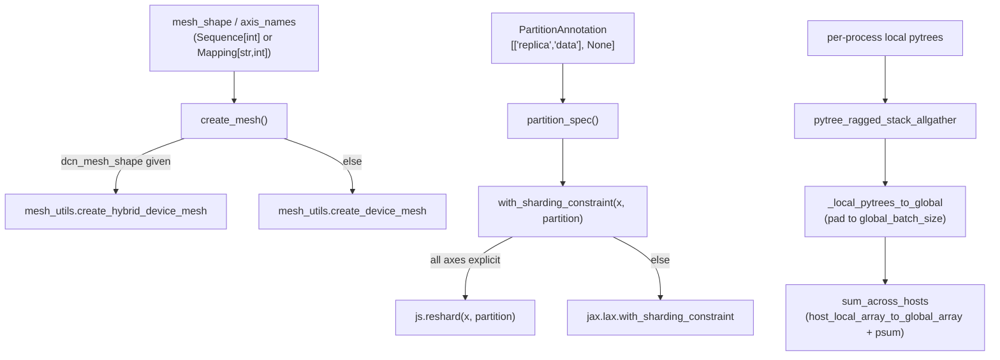

# simply.utils.sharding — mesh construction, partition annotations, and multi-host reductions

## Overview

This module is Simply's whole interface to JAX's device mesh and sharding APIs: it builds a
`jax.sharding.Mesh` from a shape/axis-name spec ([`create_mesh`](../catalog/simply/utils/sharding.md#create_mesh),
supporting hybrid ICI/DCN topologies), converts Simply's own lightweight `PartitionAnnotation`
format (`None | Sequence[None | str | Sequence[str]]`, e.g. `[['replica','data'], None]`) into real
`jax.sharding.PartitionSpec`/`NamedSharding` objects, and provides multi-host reduction/gather
primitives ([`sum_across_hosts`](../catalog/simply/utils/sharding.md#sum_across_hosts),
[`pytree_ragged_stack_allgather`](../catalog/simply/utils/sharding.md#pytree_ragged_stack_allgather))
for combining per-process data (e.g. evaluation metrics, sampled rollouts) into one global result.
Every other module that touches sharding — [simply-utils-module](simply-utils-module.md),
[simply-utils-optimizers](simply-utils-optimizers.md), `model_lib.py` — calls through this one file's
[`with_sharding_constraint`](../catalog/simply/utils/sharding.md#with_sharding_constraint) rather
than JAX's primitives directly.

## Diagram

## Design rationale (why it's built this way)

**`PartitionAnnotation` is Simply's own lightweight sharding DSL, converted to real JAX sharding
objects only at the point of use.** `PartitionAnnotation = common.PartitionAnnotation` (`None |
Sequence[None | str | Sequence[str]]`) lets config code write plain nested lists/`None` for sharding
specs — [`partition_spec`](../catalog/simply/utils/sharding.md#partition_spec) is the single place
that converts this into a real `js.PartitionSpec`, and
[`with_sharding_constraint`](../catalog/simply/utils/sharding.md#with_sharding_constraint) is the
single place that then applies it — every layer's `weight_partition`/`output_partition` config field
is this annotation type, never a raw `PartitionSpec`, keeping model/optimizer code JAX-sharding-API
agnostic.

**`with_sharding_constraint` branches on whether the current abstract mesh has "explicit" axes,
choosing `js.reshard` over `jax.lax.with_sharding_constraint` — these are two different generations of
JAX's sharding API, and the function hides the choice from callers.**
[`with_sharding_constraint`](../catalog/simply/utils/sharding.md#with_sharding_constraint) checks
`js.get_abstract_mesh().are_all_axes_explicit` to decide the constraint mechanism, additionally
validating `len(partition) == len(x.shape)` whenever both are known ("to avoid incorrect implicit
sharding extended annotation" per its own docstring) — a caller never has to know which JAX sharding
API generation the ambient mesh context uses.

**A special sentinel value, `NOT_ANNOTATED`, means "leave this array's sharding exactly as-is" —
distinct from `None`, which means "fully replicated."** [`with_sharding_constraint`](../catalog/simply/utils/sharding.md#with_sharding_constraint)'s
very first check is `if partition is NOT_ANNOTATED: return x` — a genuine no-op bypassing every other
branch — whereas `partition=None` still calls through to `partition_spec(None)` →
`js.PartitionSpec()` (an explicit fully-replicated spec). This distinction is why
`EinsumLinear.output_partition` in [simply-utils-module](simply-utils-module.md) defaults to
[`sharding_lib.NOT_ANNOTATED`](../catalog/simply/utils/sharding.md#NOT_ANNOTATED) rather than `None`
— a layer that doesn't care about its output's sharding shouldn't force replication.

**Cross-host reduction reshapes the physical device grid into a `(processes, local_devices)` mesh
purely to make a `PartitionSpec('processes')`-sharded array, then reduces with an ordinary JIT'd
reduce.** [`reduce_across_hosts`](../catalog/simply/utils/sharding.md#reduce_across_hosts) builds a
throwaway 2-D mesh (`js.Mesh(devices.reshape(process_count, local_device_count), ('processes',
'local_devices'))`), converts each host's local numpy array to a globally-sharded array via
`multihost_utils.host_local_array_to_global_array`, then runs a plain
`jax.jit`-compiled [`_preduce`](../catalog/simply/utils/sharding.md#_preduce) (`reduce_op(x,
axis=0)`) under that mesh — reusing ordinary JAX collectives/sharding machinery for a host-level
reduction rather than a bespoke multi-host RPC.

**[`pytree_ragged_stack_allgather`](../catalog/simply/utils/sharding.md#pytree_ragged_stack_allgather)'s
padding logic computes each process's contribution as a half-open
interval `(start, end]` clipped to `global_batch_size`, so late-arriving or over-quota processes
contribute nothing rather than overflowing.**
`_local_pytrees_to_global` computes
`start = min(global_batch_size, start_indices[process_index])` and `end = min(global_batch_size,
start_indices[process_index+1])` — if a process's whole allocated slice falls beyond
`global_batch_size`, `end <= start` and that process contributes an all-zero placeholder tree instead
of an out-of-bounds pad.

> [!inferred] `_inner_partition_with_minimum_redundancy`'s
> recursive search (with memoization via a shared `cache` dict) is a small combinatorial optimizer:
> for a given tensor shape and mesh axis sizes, it searches for the placement of mesh axes onto
> tensor dimensions that maximizes total sharding "value" (product of used axis sizes) — used by
> [`batch_partition_with_minimum_redundancy`](../catalog/simply/utils/sharding.md#with_sharding_constraint)
> to auto-derive good sharding for a batch of differently-shaped tensors without hand-written
> per-shape partition specs.

## Entry points

- [`with_sharding_constraint`](../catalog/simply/utils/sharding.md#with_sharding_constraint) — the
  single sharding-application choke point called from
  [simply-utils-module](simply-utils-module.md)'s `EinsumLinear.init`/`apply` and
  [simply-utils-optimizers](simply-utils-optimizers.md)'s optimizer state initializers.
- [`create_mesh`](../catalog/simply/utils/sharding.md#create_mesh)/
  [`set_mesh`](../catalog/simply/utils/sharding.md#set_mesh) — called once at experiment startup to
  establish the ambient device mesh every subsequent sharding call implicitly reads via
  `js.get_abstract_mesh()`.
- [`sum_across_hosts`](../catalog/simply/utils/sharding.md#sum_across_hosts)/
  [`max_across_hosts`](../catalog/simply/utils/sharding.md#max_across_hosts) — called from RL/eval
  code (`rl_lib.compute_ppo_loss`, per this packet's subgraph) to combine per-host metrics.
- **`MultihostData.save`/`load`** — the
  checkpoint-adjacent path for saving/restoring arbitrary (non-parameter) multi-host data like
  replay-buffer snapshots, built on the same cross-host primitives as
  [`pytree_ragged_stack_allgather`](../catalog/simply/utils/sharding.md#pytree_ragged_stack_allgather).

## Mechanism (step-by-step)

1. **Mesh construction resolves shapes and fills defaults.** [`create_mesh`](../catalog/simply/utils/sharding.md#create_mesh)
   defaults `axis_names` to [`DEFAULT_AXIS_NAMES`](../catalog/simply/utils/sharding.md#DEFAULT_AXIS_NAMES)
   `('replica','data','model')`, defaults `mesh_shape` to "full replica parallelism"
   (`[len(jax.devices())] + [1]*(n-1)`), and left-pads a shorter `mesh_shape`/converts a `Mapping`
   form before validating length against `axis_names`.
2. **Hybrid (multi-slice/multi-pod) topologies use a different device-mesh constructor.** If
   `dcn_mesh_shape` is given and its sum exceeds 1,
   [`create_mesh`](../catalog/simply/utils/sharding.md#create_mesh) calls
   `mesh_utils.create_hybrid_device_mesh(mesh_shape, dcn_mesh_shape,
   allow_split_physical_axes=True)`; otherwise plain `mesh_utils.create_device_mesh`.
3. **A `PartitionAnnotation` is normalized through `partition_spec`, then applied.**
   [`partition_spec`](../catalog/simply/utils/sharding.md#partition_spec) already handles a
   `js.PartitionSpec` passthrough, `None` → empty spec, and both string and sequence-of-strings per
   axis; [`with_sharding_constraint`](../catalog/simply/utils/sharding.md#with_sharding_constraint)
   then dispatches to `reshard` or `jax.lax.with_sharding_constraint` per the explicit-axes check.
4. **A host-level reduction round-trips through a throwaway `(processes, local_devices)` mesh.**
   [`reduce_across_hosts`](../catalog/simply/utils/sharding.md#reduce_across_hosts) short-circuits to
   a plain `jax.tree.map(np.asarray, in_tree)` when `jax.process_count() == 1` — the whole
   multi-host machinery only engages when there's more than one process.
5. **Ragged multi-host gather pads locally, then globally sums (not gathers) the padded pieces.**
   [`pytree_ragged_stack_allgather`](../catalog/simply/utils/sharding.md#pytree_ragged_stack_allgather)
   relies on each process's contribution occupying a disjoint zero-padded region of the global array
   — summing disjoint-support arrays across hosts is equivalent to an all-gather-and-place, achieved
   with `sum_across_hosts` instead of a literal gather primitive. A final `astype` fixup restores any
   dtype (e.g. bool) that summation implicitly widened.

## Key data structures

- **`PartitionAnnotation`** (aliased from `common.PartitionAnnotation`) — Simply's config-level
  sharding spec vocabulary.
- **[`NOT_ANNOTATED`](../catalog/simply/utils/sharding.md#NOT_ANNOTATED)** — the string sentinel
  meaning "don't touch this array's current sharding," distinct from `None` ("fully replicate").
- **[`DEFAULT_AXIS_NAMES`](../catalog/simply/utils/sharding.md#DEFAULT_AXIS_NAMES)** `= ('replica',
  'data', 'model')` — the fallback 3-axis mesh convention (FSDP-replica × data-parallel × tensor/
  model-parallel) used whenever a caller doesn't specify axis names explicitly.

## Dynamics (design intent)

Several public functions ([`mesh_context`](../catalog/simply/utils/sharding.md#with_sharding_constraint),
`set_default_mesh_shape`, `mesh_sharding`, `get_default_mesh`) are marked
`@deprecated.deprecated(...)` pointing callers at `js.set_mesh`/`js.get_abstract_mesh`/
`named_sharding` directly — the module is mid-migration from an older, Simply-specific mesh-context
API toward JAX's own newer `jax.sharding.set_mesh`/`get_abstract_mesh` primitives, with the
deprecated wrappers kept only for backward compatibility.

## Edge cases

- [`get_array_sharding`](../catalog/simply/utils/sharding.md#with_sharding_constraint) raises
  `ValueError` if given a `Tracer` array under a mesh where `are_all_axes_explicit` is false — sharding
  cannot be introspected from a traced value unless the mesh's axes are all explicit.
- [`with_sharding_constraint`](../catalog/simply/utils/sharding.md#with_sharding_constraint) logs a
  warning and creates a *default* mesh on the fly if no mesh is set and the partition isn't `None` —
  a caller relying on an ambient mesh that was never actually configured gets silently rescued rather
  than erroring, which could mask a genuine setup bug.

## Open questions

- Whether `_inner_partition_with_minimum_redundancy`'s exhaustive per-shape search scales acceptably
  for models with hundreds of distinctly-shaped parameter tensors, or is only intended for a small
  number of shapes per `batch_partition_with_minimum_redundancy` call, isn't discussed in this
  packet's grounding.

## See also
- [simply-utils-common](simply-utils-common.md) — `PartitionAnnotation`, `AnnotatedArray`.
- [simply-utils-module](simply-utils-module.md) — `EinsumLinear`, the primary caller of
  `with_sharding_constraint`.
- [simply-utils-optimizers](simply-utils-optimizers.md) — optimizer state init, also sharding-constrained.
