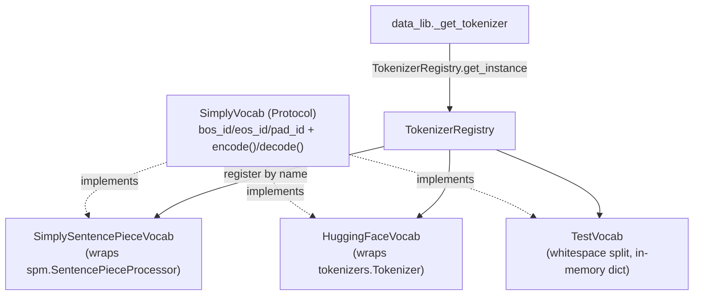

# simply.utils.tokenization — a uniform vocab interface over three tokenizer backends

## Overview

This module defines [`SimplyVocab`](../catalog/simply/utils/tokenization.md#SimplyVocab), a
`Protocol` with just `bos_id`/`eos_id`/`pad_id` and
[`encode`](../catalog/simply/utils/tokenization.md#SimplyVocab.encode)/`decode`, and three concrete
implementations behind it —
[`SimplySentencePieceVocab`](../catalog/simply/utils/tokenization.md#SimplySentencePieceVocab)
(wraps `sentencepiece`), [`HuggingFaceVocab`](../catalog/simply/utils/tokenization.md#HuggingFaceVocab)
(wraps the `tokenizers` library), and
[`TestVocab`](../catalog/simply/utils/tokenization.md#TestVocab) (a trivial whitespace-split vocab
for tests) — registered under [`TokenizerRegistry`](../catalog/simply/utils/tokenization.md#TokenizerRegistry)
so the rest of the codebase (data pipeline, LM formats, sampler, agent) depends only on the
`SimplyVocab` protocol shape, never on which concrete tokenizer library backs a given model.

## Diagram

## Design rationale (why it's built this way)

**`SimplyVocab` is a `Protocol`, not an ABC — structural typing, not inheritance, is the contract.**
[`SimplyVocab`](../catalog/simply/utils/tokenization.md#SimplyVocab) is `Protocol, Generic[common.RawT]`
with `bos_id`/`eos_id`/`pad_id` declared as plain instance attributes (not properties) plus
[`encode`](../catalog/simply/utils/tokenization.md#SimplyVocab.encode)/`decode` method stubs — any
class exposing that shape satisfies it without explicitly subclassing
[`SimplyVocab`](../catalog/simply/utils/tokenization.md#SimplyVocab), which is why
[`TestVocab`](../catalog/simply/utils/tokenization.md#TestVocab),
[`SimplySentencePieceVocab`](../catalog/simply/utils/tokenization.md#SimplySentencePieceVocab), and
[`HuggingFaceVocab`](../catalog/simply/utils/tokenization.md#HuggingFaceVocab) can wrap three
unrelated third-party libraries with zero shared base-class machinery.

**`HuggingFaceVocab` derives `bos_id`/`eos_id`/`pad_id` from `tokenizer_config.json`, not from the
tokenizer object itself.** [`HuggingFaceVocab.bos_id`](../catalog/simply/utils/tokenization.md#HuggingFaceVocab)
(a `functools.cached_property`) calls
[`get_token_id`](../catalog/simply/utils/tokenization.md#HuggingFaceVocab) which reads
`self.tokenizer_config[name]`, handling both the bare-string and `{'content': str}` HF config
conventions, then converts the token string to an id via `self.tokenizer.token_to_id(token)` —
because HF's `tokenizer.json`/`tokenizer_config.json` split the special-token *names* from the
*vocabulary*, recovering an id requires this two-step name→string→id path rather than a direct field
read.

**Every property that touches the filesystem or a heavy library object is a `cached_property`, so
construction itself stays cheap.**
[`HuggingFaceVocab.tokenizer`](../catalog/simply/utils/tokenization.md#HuggingFaceVocab.tokenizer)
and `tokenizer_config` are both `functools.cached_property` — `HuggingFaceVocab.__init__` only stores
`vocab_path`; the actual `tokenizers.Tokenizer.from_buffer(...)` load and JSON parse are deferred
until first use, which matters when many `HuggingFaceVocab` instances are constructed speculatively
(e.g. one per config in a registry sweep) but only a few are ever actually used.

> [!inferred] [`SimplySentencePieceVocab.__init__`](../catalog/simply/utils/tokenization.md#SimplySentencePieceVocab._sp)
> loads the serialized proto via `epath.Path(vocab_path).read_bytes()` rather than sentencepiece's
> own file-path loader — this is almost certainly so `vocab_path` can be any `etils.epath`-supported
> path (e.g. a GCS URI), not just a local filesystem path.

## Entry points

- [`SimplyVocab.encode`](../catalog/simply/utils/tokenization.md#SimplyVocab.encode)/`decode` — the
  two methods every downstream caller (data pipeline, LM format, sampler) actually calls; every
  concrete vocab's identity is otherwise irrelevant to callers.
- [`TokenizerRegistry`](../catalog/simply/utils/tokenization.md#TokenizerRegistry) — where a vocab
  becomes selectable by name from a config (`tokenizer_name: str`), resolved via
  `TokenizerRegistry.get_instance(name)` in `data_lib._get_tokenizer`.

## Mechanism (step-by-step)

1. **A tokenizer is registered under a name in the
   [`TokenizerRegistry`](../catalog/simply/utils/tokenization.md#TokenizerRegistry)** (typically via
   `TokenizerRegistry.register_value`,
   binding a specific `SimplySentencePieceVocab(vocab_path=...)` or `HuggingFaceVocab(vocab_path=...)`
   instance to a config-facing string name).
2. **Callers resolve the vocab by name, not by import.** `data_lib._get_tokenizer` (outside this
   packet's own subgraph but a direct caller) calls
   [`TokenizerRegistry`](../catalog/simply/utils/tokenization.md#TokenizerRegistry)`.get_instance(name)`
   to get a concrete `SimplyVocab`-shaped object.
3. **`encode`/`decode` dispatch to the wrapped library with no shared logic.**
   [`SimplySentencePieceVocab.encode`](../catalog/simply/utils/tokenization.md#SimplySentencePieceVocab.encode)
   calls `self._sp.EncodeAsIds(text)` directly;
   [`HuggingFaceVocab.encode`](../catalog/simply/utils/tokenization.md#HuggingFaceVocab.encode) calls
   `self.tokenizer.encode(text).ids`; [`TestVocab.encode`](../catalog/simply/utils/tokenization.md#TestVocab.encode)
   splits on whitespace and looks up each word in an in-memory dict, mapping unknowns to `unk_id`.
4. **Special-token ids are resolved once and cached per vocab instance**, via plain attributes for
   the SentencePiece/test vocabs and via cached properties for the HuggingFace vocab (since deriving
   them requires a JSON parse + a
   [`HuggingFaceVocab.tokenizer`](../catalog/simply/utils/tokenization.md#HuggingFaceVocab.tokenizer)
   method call, not a free attribute read).

## Key data structures

- **[`SimplyVocab`](../catalog/simply/utils/tokenization.md#SimplyVocab)** (`Protocol,
  Generic[common.RawT]`) — the structural contract; `RawT` is typically `str` (see
  [`TestVocab(SimplyVocab[str])`](../catalog/simply/utils/tokenization.md#TestVocab)).
- **[`TestVocab._vocab_dict`/`_rev_vocab_dict`](../catalog/simply/utils/tokenization.md#TestVocab)**
  — the two in-memory dicts (word→id, id→word) that make it a complete, dependency-free vocab for
  tests.

## Dynamics (design intent)

Because `HuggingFaceVocab`'s special-token ids are `cached_property`s computed from
`tokenizer_config`, changing `tokenizer_config.json` on disk after a `HuggingFaceVocab` instance has
already accessed e.g. `bos_id` has no effect on that instance — the cache is per-instance and never
invalidated.

## Edge cases

- [`HuggingFaceVocab.get_token_id`](../catalog/simply/utils/tokenization.md#HuggingFaceVocab) returns
  `None` if the config value itself is `None` (some HF configs omit a given special token entirely),
  and raises `ValueError` if the resolved token isn't ultimately a string — both are explicit,
  non-silent failure/absence paths.
- [`TestVocab.__init__`](../catalog/simply/utils/tokenization.md#TestVocab) computes `start_id =
  max(unk_id, pad_id, eos_id, bos_id) + 1` before assigning ordinary vocabulary ids — special tokens
  and ordinary words are guaranteed non-overlapping by construction, not by convention.

## Open questions

- Whether `HuggingFaceVocab.decode`'s `skip_special_tokens=False` (always including special tokens
  in decoded output) is relied upon anywhere downstream, or is just the library default left
  unconfigured, isn't settled by this packet's grounding.

## See also
- [simply-utils-registry](simply-utils-registry.md) — `RootRegistry`, the base
  `TokenizerRegistry` inherits from.
- [simply-utils-lm_format](simply-utils-lm_format.md) — `LMFormat.format_tokens`, the main
  consumer of a resolved vocab's `encode`.
