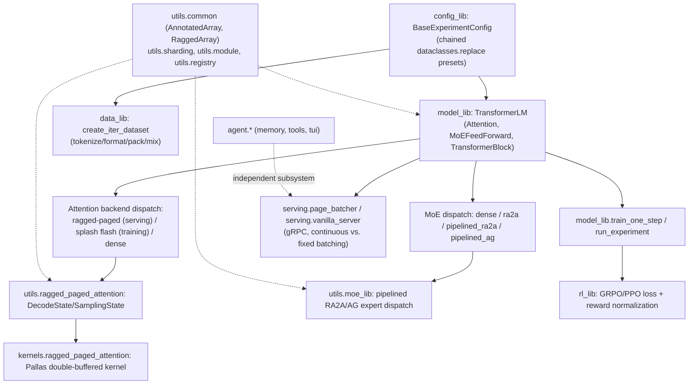

# simply — what it is and how it fits together

## In one paragraph

Simply is a minimal JAX-based research codebase for LLM training, RL post-training, and TPU-optimized
inference. Its central design idea is uniformity through registration: every extensible
piece — model layers, optimizers, schedules, tokenizers, chat formats, data sources, checkpoint
formats, reward normalizers, train loops — is a `RootRegistry`-registered, frozen dataclass, looked up
by string name from one large `BaseExperimentConfig`. Model parameters flow explicitly (no hidden
`nn.Module` state) through a hand-rolled `SimplyModule`/`EinsumLinear` layer system, wrapped in
`AnnotatedArray` for sharding metadata. Two performance-critical subsystems carry the codebase's
TPU-specific complexity: a hand-written Pallas ragged-paged-attention kernel for continuous-batching
inference, and a pipelined ragged-all-to-all/all-gather system for expert-parallel MoE.

## Core architecture

## Main concepts

**The registry pattern is the codebase's one plugin mechanism.** Every extensible component —
`ModuleRegistry`, `OptimizerRegistry`, `TokenizerRegistry`, `LMFormatRegistry`, `DataSourceRegistry`,
`CheckpointFormatRegistry`, `RewardNormalizerRegistry`, `ExperimentConfigRegistry`, and more — is a
`RootRegistry` subclass differing only in its `namespace`; a component becomes selectable by string
name purely by carrying the `@SomeRegistry.register` decorator. See
[simply-utils-registry](concepts/simply-utils-registry.md).

**`SimplyModule`/`EinsumLinear` is an intentionally minimal `flax.nn.Module` replacement.** Every
model layer is a registered dataclass with explicit `setup`/`init`/`apply` methods and no hidden
state; `EinsumLinear` generalizes every linear/projection layer via one einsum-equation-driven
primitive, reading a `dim_annotation` string that sharding and optimizer code (Muon's
orthogonalization) both consult. See [simply-utils-module](concepts/simply-utils-module.md) and
[simply-utils-common](concepts/simply-utils-common.md) (`AnnotatedArray`, the metadata-carrying array
wrapper every parameter is stored as).

**Experiment configs compose by chained `dataclasses.replace`, not inheritance-per-model.** One
`BaseExperimentConfig` with ~150 fields is specialized by dozens of registered zero-argument preset
functions, each overriding only what differs from its base (often another preset, e.g.
`deepseek_qwen2_7b()` built from `deepseek_qwen2_1p5b()`); RL variants merge an architecture preset
into `RLExperimentConfig` via `override_from` plus an `apply_simple_rl` overlay. See
[simply-config_lib](concepts/simply-config_lib.md).

**Attention has three interchangeable compute backends selected by argument shape, not a mode
flag.** The same `Attention.apply` dispatches to paged continuous-batching decode
(`ragged_paged_attention`), Splash/flash attention for long-context training, or a dense masked path
— purely by inspecting `decode_state`'s type and `use_flash_attention`/sequence length. See
[simply-model_lib](concepts/simply-model_lib.md).

**Paged KV-cache serving is a priority-ranked, continuously-refilling batch.** `DecodeState` manages a
page pool and free list; `SamplingState` issues a shared per-step token budget across active
sequences by arrival-rank priority (via a single batched cumulative-sum, not a loop), letting prefill
and decode share one kernel call. The actual attention math runs in a hand-written, double-buffered
Pallas kernel with async HBM↔VMEM DMA pipelining. See
[simply-utils-ragged_paged_attention](concepts/simply-utils-ragged_paged_attention.md) and
[simply-kernels-ragged_paged_attention](concepts/simply-kernels-ragged_paged_attention.md).

**MoE expert-parallel dispatch has four strategies sharing one interface, from simple-dense to
pipelined-sparse.** `MoEFeedForward` routes tokens via top-k-softmax, then dispatches compute through
`ep_method` — dense (all experts on all tokens), plain ragged-all-to-all, or a software-pipelined
ra2a/all-gather scheme that overlaps communication for chunk *N* with compute for chunk *N-1*. See
[simply-utils-moe_lib](concepts/simply-utils-moe_lib.md).

**Training and RL share one step function; RL only supplies the loss and batch assembly.**
`model_lib.train_one_step` (gradient accumulation via `lax.scan`, three independent
norm/RMS clipping points, optimizer application) is reused unchanged by the RL train loop; `rl_lib`
contributes `compute_ppo_loss` (GRPO and PPO are one function differing only in advantage/KL
derivation) and `create_train_batch` (a ragged cross-host allgather of locally-sampled, locally-scored
rollouts). See [simply-model_lib](concepts/simply-model_lib.md) and
[simply-rl_lib](concepts/simply-rl_lib.md).

**The data pipeline composes two independent axes: format and packing.** `lm_format_name` controls
tokenization (`None`/raw, `'Pretrain'`, or a chat format name); `packing` independently controls how
variable-length examples become fixed-length sequences (`concat_split`/`first_fit`/
`pad_or_truncate`/`none`). Mixtures can pack-then-mix or mix-then-pack, with different Grain APIs and
different sequence-purity guarantees for each. See [simply-data_lib](concepts/simply-data_lib.md).

**Two serving backends trade complexity for scheduling granularity.** `page_batcher` (continuous
batching over the paged `SamplingState`) and `vanilla_server` (fixed-batch-wait-then-decode-to-
completion over `model_lib.LMInterface`) both expose the same gRPC service shape but differ
structurally in how they schedule concurrent requests. See
[simply-serving-page_batcher](concepts/simply-serving-page_batcher.md) and
[simply-serving-vanilla_server](concepts/simply-serving-vanilla_server.md).

**The agent subsystem (memory, tools, TUI) is a mostly independent research-agent framework.**
`MemorySystem` captures immutable per-step snapshots of a URI-addressed file store, mutated only
inside a `capture_snapshot` context; `Action`/`Tool` (pydantic-validated) is the tool-call contract;
three interchangeable `DisplayBase` implementations render agent progress. See
[simply-agent-memory](concepts/simply-agent-memory.md),
[simply-agent-tools](concepts/simply-agent-tools.md), and
[simply-agent-tui](concepts/simply-agent-tui.md).

## How a request flows

**Training:** `config_lib` resolves a named preset → `data_lib.create_iter_dataset` builds the batch
iterator → `model_lib.run_experiment`'s loop calls `train_one_step` per batch (loss+grad via
`compute_train_loss` or, for RL, `rl_lib.compute_ppo_loss`) → gradient accumulation/clipping →
`utils.optimizers.Optimizer.apply` → checkpoint/metric side effects via `utils.experiment_helper`.

**Serving:** a config resolves the model + `utils.checkpoint_lib.load_checkpoint_from_path` restores
weights → `serving.page_batcher.Batcher.loop` (or `vanilla_server`) accepts gRPC requests into a
queue → `utils.sampling_lib` tokenizes → `utils.ragged_paged_attention.SamplingState` (or
`model_lib.LMInterface`) drives the decode loop, calling `Attention.apply` → `kernels.ragged_paged_
attention` per layer → sampled tokens detokenized back through `utils.sampling_lib`.

## Map of the wiki

- "How does experiment configuration work?" → [simply-config_lib](concepts/simply-config_lib.md).
- "How is the model architecture built?" → [simply-model_lib](concepts/simply-model_lib.md),
  [simply-utils-module](concepts/simply-utils-module.md).
- "How does TPU-optimized serving/decoding work?" →
  [simply-utils-ragged_paged_attention](concepts/simply-utils-ragged_paged_attention.md),
  [simply-kernels-ragged_paged_attention](concepts/simply-kernels-ragged_paged_attention.md),
  [simply-serving-page_batcher](concepts/simply-serving-page_batcher.md).
- "How does MoE expert-parallelism work?" → [simply-utils-moe_lib](concepts/simply-utils-moe_lib.md).
- "How does the data pipeline work?" → [simply-data_lib](concepts/simply-data_lib.md),
  [simply-utils-lm_format](concepts/simply-utils-lm_format.md),
  [simply-utils-tokenization](concepts/simply-utils-tokenization.md).
- "How does RL training work?" → [simply-rl_lib](concepts/simply-rl_lib.md).
- "How does checkpointing/sharding work?" →
  [simply-utils-checkpoint_lib](concepts/simply-utils-checkpoint_lib.md),
  [simply-utils-sharding](concepts/simply-utils-sharding.md).
- "How does the research agent work?" → [simply-agent-memory](concepts/simply-agent-memory.md),
  [simply-agent-tools](concepts/simply-agent-tools.md), [simply-agent-tui](concepts/simply-agent-tui.md).
- For the exhaustive per-symbol index, see `catalog/`.
