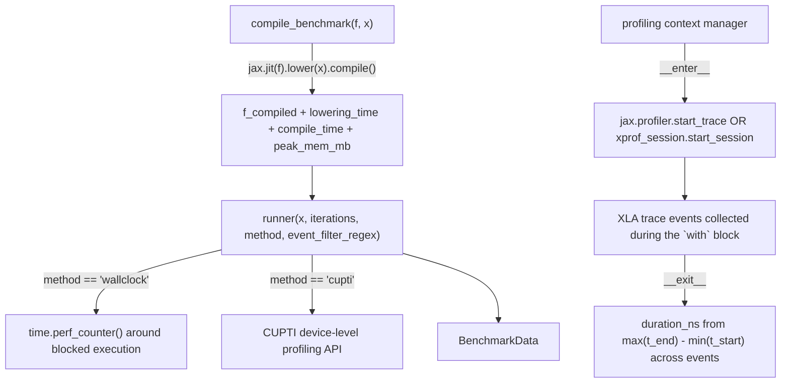

# tokamax._src.benchmarking — compile_benchmark, wallclock vs. profiler-based timing

## Overview

[`compile_benchmark`](../catalog/tokamax/_src/benchmarking.md#compile_benchmark) `jit`-compiles a
function once (measuring lowering time, compile time, and peak memory via
`f_compiled.memory_analysis()`), then returns a
[`runner`](../catalog/tokamax/_src/benchmarking.md#compile_benchmark.runner) closure that executes
the compiled function repeatedly and reports timing as a `BenchmarkData` object. `runner` supports
two timing methods — `'wallclock'` (Python `time.perf_counter()` around blocked execution, portable
but includes Python-side overhead) and `'cupti'` (device-level profiling API) — selected per-backend
via a default table unless explicitly overridden. A profiling context manager
([`XprofProfileSession.__enter__`](../catalog/tokamax/_src/benchmarking.md#XprofProfileSession.__enter__)/
[`XprofProfileSession.__exit__`](../catalog/tokamax/_src/benchmarking.md#XprofProfileSession.__exit__)) wraps either JAX's own profiler or
an xprof session to extract XLA device-code duration from collected trace events.

## Diagram

## Design rationale (why it's built this way)

**Compilation (lowering + compile) is measured and separated from execution timing entirely —
`compile_benchmark` does the compile step once, up front, outside the timed `runner` loop.**
[`compile_benchmark`](../catalog/tokamax/_src/benchmarking.md#compile_benchmark) records
`lowering_time`/`compile_time`/`peak_mem_mb` from the one-time `jax.jit(f).lower(x).compile()` call,
then returns [`runner`](../catalog/tokamax/_src/benchmarking.md#compile_benchmark.runner) as a
separate closure over the already-compiled function — this ensures repeated `runner` calls measure
only steady-state execution time, never accidentally re-including one-time compilation cost.

**Two timing methods trade off portability against measurement purity, with an explicit per-backend
default rather than one universal choice.** The
[`runner`](../catalog/tokamax/_src/benchmarking.md#compile_benchmark.runner) docstring explains
`'wallclock'` "works for any XLA backend, and does not add any device overhead, but does measure
Python overhead," while `'cupti'` measures device execution time directly — since neither method
strictly dominates the other (wallclock is universal but noisier; cupti is precise but
backend/platform-specific), `_DEFAULT_TIMING_METHOD` picks a sensible default per platform while
still letting a caller override explicitly.

**The profiling context manager raises with an actionable, specific error message when no XLA
device code was captured, rather than silently returning an empty/zero duration.** Its `__exit__`
path checks `if not xla_xlines or not all_events` and raises `ValueError` listing the collected XLA
lines and suggesting the fix ("Check that JAX functions inside the context are blocked using
`jax.block_until_ready`", plus a GPU-specific hint about `--config=cuda`) — a benchmark silently
reporting near-zero time because the traced function's execution wasn't actually synchronized would
be a much harder bug to diagnose than an immediate, specific error.

## Entry points

- [`compile_benchmark`](../catalog/tokamax/_src/benchmarking.md#compile_benchmark) — the primary
  entry point, reached once per function-to-benchmark to compile it and obtain a `runner`.
- [`compile_benchmark.runner`](../catalog/tokamax/_src/benchmarking.md#compile_benchmark.runner) —
  reached (potentially many times, with different inputs) to actually execute and time the compiled
  function.
- [`XprofProfileSession.__enter__`](../catalog/tokamax/_src/benchmarking.md#XprofProfileSession.__enter__)/
  [`XprofProfileSession.__exit__`](../catalog/tokamax/_src/benchmarking.md#XprofProfileSession.__exit__) — the profiling context manager's
  entry/exit, reached to bracket a block of code whose XLA device-time should be measured via
  tracing.

## Mechanism (step-by-step)

1. **[`compile_benchmark`](../catalog/tokamax/_src/benchmarking.md#compile_benchmark) calls
   `jax.jit(f).lower(x).compile()`**, timing the lowering and compile phases separately and
   recording peak memory from `memory_analysis()`.
2. **[`runner`](../catalog/tokamax/_src/benchmarking.md#compile_benchmark.runner) determines the
   execution platform** from concrete input devices (or `jax.default_backend()` if no concrete
   inputs), then resolves `method` to a platform-appropriate default if unspecified.
3. **The profiling context manager's [`XprofProfileSession.__enter__`](../catalog/tokamax/_src/benchmarking.md#XprofProfileSession.__enter__)
   starts either a JAX profiler trace or an xprof session** (branching on `_jax_profiler_mode`),
   recording a wallclock start time immediately before tracing begins.
4. **[`XprofProfileSession.__exit__`](../catalog/tokamax/_src/benchmarking.md#XprofProfileSession.__exit__) stops the trace, collects XLA
   events, and computes duration** as `max(event end times) - min(event start times)`, raising if
   no events were captured or if the parsed duration exceeds the wallclock profiling window.

## Key data structures

- **`BenchmarkData`** — the result type both
  [`compile_benchmark`](../catalog/tokamax/_src/benchmarking.md#compile_benchmark) and
  [`runner`](../catalog/tokamax/_src/benchmarking.md#compile_benchmark.runner) return, bundling
  timing/memory measurements.
- **`TimingMethod`** — the `Literal` type alias for `'wallclock'`/`'cupti'` (and any other
  supported methods), selected either explicitly or via `_DEFAULT_TIMING_METHOD`/
  `_FALLBACK_TIMING_METHOD` per platform.

## Dynamics (design intent)

Because `runner` re-derives the execution platform from the concrete input devices on every call
(rather than caching it from `compile_benchmark` time), a caller can benchmark the same compiled
function against inputs placed on a different platform without needing to re-derive the timing
method manually — though this also means each `runner` call pays this small platform-detection
cost.

## Edge cases

- The profiling context manager's `__exit__` raises `RuntimeError` if the profiler-measured
  wallclock time is smaller than the parsed profile duration — this inconsistency (profile
  duration exceeding the window it was supposedly captured within) is treated as a hard error, not
  a silently-accepted anomaly.
- [`runner`](../catalog/tokamax/_src/benchmarking.md#compile_benchmark.runner)'s
  `event_filter_regex` parameter changes what the reported timing *means* (sum over all XLA ops vs.
  a filtered subset) — comparing `BenchmarkData` results across calls with different filters is not
  meaningful without accounting for this.

## Open questions

- What determines `_DEFAULT_TIMING_METHOD`'s exact per-platform mapping (e.g. which platforms
  default to `'cupti'` vs. `'wallclock'`) is not addressed by this packet's cited subgraph.

## See also
- [tokamax-_src-ops-op](tokamax-_src-ops-op.md) — `Op`/`BoundArguments`, whose autotuning-cache
  population presumably consumes `BenchmarkData` produced by this module's `runner`.
