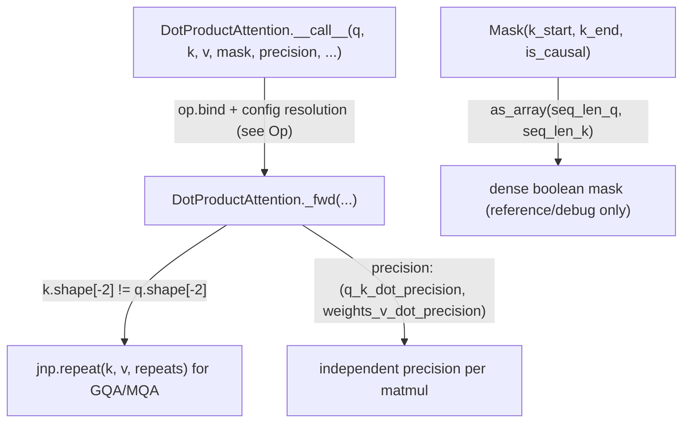

# tokamax._src.ops.attention.base — DotProductAttention Op and the compact range-based Mask

## Overview

[`DotProductAttention`](../catalog/tokamax/_src/ops/attention/base.md#DotProductAttention) is the
base [`Op`](tokamax-_src-ops-op.md) for attention, covering GQA/MQA (K/V head-count broadcasting),
quantized (`QArray`) inputs, per-dot precision control (QK vs. weights×V separately), logit soft-
capping, dropout, paged attention (`paging_info`), custom query/key gather indices, and explicit
input sharding — with [`_fwd`](../catalog/tokamax/_src/ops/attention/base.md#DotProductAttention._fwd)
providing the reference XLA implementation every Pallas backend (Triton, Mosaic GPU, TPU splash
attention) specializes.
[`Mask`](../catalog/tokamax/_src/ops/attention/base.md#Mask) represents an attention mask
compactly as a per-query-row `(k_start, k_end)` enabled-range plus an `is_causal` flag, rather than
a dense boolean matrix.

## Diagram

## Design rationale (why it's built this way)

**`Mask` is represented as a per-row `(k_start, k_end)` enabled range rather than a dense boolean
array, letting local/causal/blockwise masks be expressed and consumed without materializing a full
`[seq_len_q, seq_len_k]` matrix.** The class docstring's examples show local-window and
independent-causal-sequence masks both expressed purely via `k_start`/`k_end` (and `is_causal`) —
since a windowed or causal mask's "enabled" region per query row is contiguous, this compact
per-row-range representation lets kernels (like Pallas splash attention) directly skip whole K
blocks outside the enabled range, which a dense boolean mask representation would obscure.

**`DotProductAttention._fwd` takes precision as a *pair* — one for the Q·K dot, one for the
weights·V dot — rather than a single precision for the whole op.**
[`DotProductAttention._fwd`](../catalog/tokamax/_src/ops/attention/base.md#DotProductAttention._fwd)'s
`precision: tuple[CanonicalPrecision, CanonicalPrecision]` parameter is unpacked into
`q_k_dot_precision`/`weights_v_dot_precision` and resolved independently via
`precision_lib.to_dot_algorithm_preset` — since the two matmuls in attention have different
numerical sensitivity (logits typically need more precision than the final weighted-value
combination), a single shared precision setting would force an unnecessarily conservative (slow) or
risky (imprecise) choice for one of the two matmuls.

**GQA/MQA broadcasting is handled generically in the base `_fwd`, not delegated to every backend
implementation.** When `k.shape[-2]` doesn't already match `q.shape[-2]` (and isn't 1),
[`_fwd`](../catalog/tokamax/_src/ops/attention/base.md#DotProductAttention._fwd) computes
`repeats = q.shape[-2] // k.shape[-2]` and repeats `k`/`v` along the head axis — centralizing this
in the base reference implementation means every backend subclass either inherits this behavior for
free (if it doesn't override `_fwd`) or can assume K/V head-count normalization already happened
before reaching its own kernel-specific logic.

## Entry points

- **`DotProductAttention.__call__`** — the user-facing entry point, overridden specifically (per
  its own comment) "in order to handle sharding at the top level" before dispatching into
  [`DotProductAttention.bind`](../catalog/tokamax/_src/ops/attention/base.md#DotProductAttention.bind)'s
  `Op` bind/configure/`_fwd` protocol.
- [`DotProductAttention._fwd`](../catalog/tokamax/_src/ops/attention/base.md#DotProductAttention._fwd) —
  the reference XLA implementation; reached directly when no faster backend override applies.
- [`Mask.as_array`](../catalog/tokamax/_src/ops/attention/base.md#Mask.as_array) — reached to
  materialize a compact `Mask` into a dense boolean array (documented in the class docstring
  primarily for illustrating semantics, e.g. in the docstring's own assertions).

## Mechanism (step-by-step)

1. **`DotProductAttention.__call__` handles sharding at the top level** before delegating into
   [`DotProductAttention.bind`](../catalog/tokamax/_src/ops/attention/base.md#DotProductAttention.bind)
   and the base `Op` call protocol (bind → configure → dispatch, see
   [tokamax-_src-ops-op](tokamax-_src-ops-op.md)).
2. **[`_fwd`](../catalog/tokamax/_src/ops/attention/base.md#DotProductAttention._fwd) normalizes
   `q`/`k`/`v` to plain arrays** via `quantization.as_array` (unwrapping `QArray` quantized
   inputs), then broadcasts `k`/`v` along the head axis for GQA/MQA if needed.
3. **Within [`_fwd`](../catalog/tokamax/_src/ops/attention/base.md#DotProductAttention._fwd),
   precision is resolved independently for the Q·K and weights·V dots**, each through
   `precision_lib.to_dot_algorithm_preset`.
4. **[`_fwd`](../catalog/tokamax/_src/ops/attention/base.md#DotProductAttention._fwd) computes
   attention using the resolved (dense-materialized) mask/bias/precision settings**, producing
   output and optional residuals for the backward pass.

## Key data structures

- **[`Mask`](../catalog/tokamax/_src/ops/attention/base.md#Mask)** — `k_start`/`k_end` (per-query-
  row enabled K range), `is_causal`; frozen, pytree-registered.
- **[`DotProductAttention`](../catalog/tokamax/_src/ops/attention/base.md#DotProductAttention)** —
  an [`Op`](tokamax-_src-ops-op.md) parametrized over `Float[Array, "*B T H d"]` output and
  `Residuals`; accepts `precision`, `logits_dtype`, `logits_scale`, `bias`, `logits_soft_cap`,
  `mask`, `is_causal`, `dropout_mask`/`dropout_rate`, `paging_info`, `q_sharding`/`k_sharding`,
  `q_indices`/`k_indices`, `normalize_output`, `return_residuals`.

## Dynamics (design intent)

Because `Mask`'s compact range representation is the interchange format between the base op and
every backend, a new backend kernel only needs to consume `(k_start, k_end, is_causal)` — it never
needs to reason about a dense mask matrix, keeping the memory/compute savings of the compact
representation available uniformly across backends.

## Edge cases

- [`DotProductAttention._fwd`](../catalog/tokamax/_src/ops/attention/base.md#DotProductAttention._fwd)'s
  GQA broadcast branch only triggers when `k.shape[-2]` is neither `1` nor `q.shape[-2]` — a
  `k`/`v` head count that already matches `q`'s (standard MHA) or is exactly `1` (MQA, already
  broadcastable without an explicit repeat) skips the repeat entirely.
- The docstring's own examples note two ways to express the same local-attention mask (via
  `k_start` + `is_causal`, or via explicit `k_start`/`k_end`) that are semantically equivalent but
  differ in efficiency — the class itself does not enforce which form a caller uses.

## Open questions

- Whether `_fwd`'s dense mask materialization (via `Mask.as_array`, if actually invoked in the
  reference path) is a measurable bottleneck relative to Pallas backends that consume the compact
  range representation directly is not addressed by this packet's cited subgraph.

## See also
- [tokamax-_src-ops-op](tokamax-_src-ops-op.md) — `Op`/`BoundArguments`, the base class/protocol
  `DotProductAttention` implements.
- [tokamax-_src-ops-experimental-tpu-splash_attention-splash_attention_mask](tokamax-_src-ops-experimental-tpu-splash_attention-splash_attention_mask.md) —
  a related, TPU-splash-attention-specific mask representation building on similar compact-range
  ideas.
