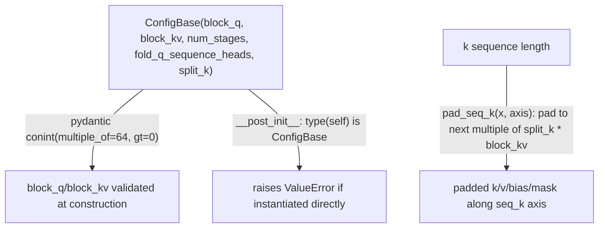

# tokamax._src.ops.attention.pallas_mosaic_gpu_common — pydantic-validated block/stage config, split_k sequence padding

## Overview

[`ConfigBase`](../catalog/tokamax/_src/ops/attention/pallas_mosaic_gpu_common.md#ConfigBase) is the
shared, `pydantic`-validated configuration base for tokamax's Pallas Mosaic-GPU attention kernels:
[`block_q`](../catalog/tokamax/_src/ops/attention/pallas_mosaic_gpu_common.md#ConfigBase.block_q)/
[`block_kv`](../catalog/tokamax/_src/ops/attention/pallas_mosaic_gpu_common.md#ConfigBase.block_kv)
must be positive multiples of 64, and
[`num_stages`](../catalog/tokamax/_src/ops/attention/pallas_mosaic_gpu_common.md#ConfigBase.num_stages)
is the number of TMA pipeline stages used for loading K/V.
[`PallasMosaicGpuFlashAttention.pad_seq_k`](../catalog/tokamax/_src/ops/attention/pallas_mosaic_gpu.md#PallasMosaicGpuFlashAttention.pad_seq_k)
pads the K sequence length to the next multiple of `split_k * block_kv` so the split-K reduction
divides evenly.

## Diagram

## Design rationale (why it's built this way)

**Block-size fields are validated via `pydantic`'s `conint(multiple_of=64, gt=0)` at construction
time, not checked ad hoc by kernel code.**
[`ConfigBase.block_q`](../catalog/tokamax/_src/ops/attention/pallas_mosaic_gpu_common.md#ConfigBase.block_q)/
[`block_kv`](../catalog/tokamax/_src/ops/attention/pallas_mosaic_gpu_common.md#ConfigBase.block_kv)
declare their constraint directly in the type annotation — an invalid block size (not a positive
multiple of 64) is rejected the moment a config object is constructed, rather than surfacing later
as a cryptic kernel-compilation or correctness failure; the code comment notes a `TODO` to relax
this to "multiple of 32" in the future, meaning 64 is a current, not fundamental, constraint.

**`ConfigBase` cannot be instantiated directly — its `__post_init__` explicitly rejects
`type(self) is ConfigBase`, forcing every real config to be a named subclass.** This is a
deliberate abstract-base-class discipline enforced at runtime (since Python dataclasses don't have
a built-in "abstract dataclass" concept) — every concrete kernel variant (forward, VJP, SM90/SM100)
gets its own subclass, so a config value's type alone identifies which kernel variant it configures.

**K-sequence padding for `split_k` is applied uniformly to every K/V-axis-aligned argument
(`k`/`v`/`bias`/`mask`/`k_start`/`k_end`), not just the raw K/V tensors.**
[`PallasMosaicGpuFlashAttention.pad_seq_k`](../catalog/tokamax/_src/ops/attention/pallas_mosaic_gpu.md#PallasMosaicGpuFlashAttention.pad_seq_k)
is mapped over every argument whose shape has a K/V-sequence axis (skipping arguments where that
axis is `None` or already size 1) — since splitting the K reduction across `split_k` chunks
requires every K/V-aligned tensor to divide evenly by `split_k * block_kv`, padding must be applied
consistently across all of them, not just the primary key/value arrays.

**`split_k > 1` is explicitly incompatible with causal masking or explicit `k_start`/`k_end`
ranges, currently.** The surrounding code raises `ValueError` ("split_k > 1 only supported without
causality and k_start/k_end") with a `TODO` marking this as a gap to close — splitting the K
reduction changes how partial results must be combined, and that combination logic doesn't yet
account for causal/ranged masking, so the two features are mutually exclusive for now rather than
silently producing incorrect results if combined.

## Entry points

- [`ConfigBase`](../catalog/tokamax/_src/ops/attention/pallas_mosaic_gpu_common.md#ConfigBase) —
  the shared config base every Pallas Mosaic-GPU attention kernel variant subclasses.
- [`PallasMosaicGpuFlashAttention.pad_seq_k`](../catalog/tokamax/_src/ops/attention/pallas_mosaic_gpu.md#PallasMosaicGpuFlashAttention.pad_seq_k) —
  reached to pad every K/V-sequence-aligned argument before a `split_k > 1` reduction.

## Mechanism (step-by-step)

1. **A concrete kernel variant defines a subclass of
   [`ConfigBase`](../catalog/tokamax/_src/ops/attention/pallas_mosaic_gpu_common.md#ConfigBase)**,
   inheriting
   [`block_q`](../catalog/tokamax/_src/ops/attention/pallas_mosaic_gpu_common.md#ConfigBase.block_q)/
   [`block_kv`](../catalog/tokamax/_src/ops/attention/pallas_mosaic_gpu_common.md#ConfigBase.block_kv)/
   [`num_stages`](../catalog/tokamax/_src/ops/attention/pallas_mosaic_gpu_common.md#ConfigBase.num_stages)
   validation and defaults, adding any variant-specific fields.
2. **Constructing a [`ConfigBase`](../catalog/tokamax/_src/ops/attention/pallas_mosaic_gpu_common.md#ConfigBase)
   instance runs `pydantic`'s field validators**, rejecting invalid block sizes immediately, then
   `__post_init__` rejects direct `ConfigBase` instantiation.
3. **When `split_k > 1`,**
   [`PallasMosaicGpuFlashAttention.pad_seq_k`](../catalog/tokamax/_src/ops/attention/pallas_mosaic_gpu.md#PallasMosaicGpuFlashAttention.pad_seq_k)
   **pads every K/V-sequence-aligned argument** to the next multiple of `split_k * block_kv`.

## Key data structures

- **[`ConfigBase`](../catalog/tokamax/_src/ops/attention/pallas_mosaic_gpu_common.md#ConfigBase)** —
  [`block_q`](../catalog/tokamax/_src/ops/attention/pallas_mosaic_gpu_common.md#ConfigBase.block_q)/
  [`block_kv`](../catalog/tokamax/_src/ops/attention/pallas_mosaic_gpu_common.md#ConfigBase.block_kv)
  (positive multiples of 64),
  [`num_stages`](../catalog/tokamax/_src/ops/attention/pallas_mosaic_gpu_common.md#ConfigBase.num_stages)
  (positive int, default 2), `fold_q_sequence_heads`, `split_k`.

## Dynamics (design intent)

Because `pydantic` validation runs at config-object construction (not at kernel-compile or -launch
time), an invalid config produced anywhere upstream (e.g. by an autotuning search generating
candidate configs) fails immediately at the point it's constructed, rather than propagating into a
compiled kernel invocation where the failure would be harder to trace back to its origin.

## Edge cases

- [`ConfigBase.__post_init__`](../catalog/tokamax/_src/ops/attention/pallas_mosaic_gpu_common.md#ConfigBase)
  uses `type(self) is ConfigBase` (an exact-type check, not `isinstance`) — this correctly allows
  any subclass to instantiate normally while blocking only the base class itself.
- The `TODO` comment on `block_q`/`block_kv` ("Relax block size constraints to multiple of 32")
  means the current `multiple_of=64` constraint is stricter than fundamentally required — a config
  search space could in principle explore finer block-size granularity once that constraint is
  relaxed.

## Open questions

- Whether relaxing the block-size constraint to multiples of 32 (per the `TODO`) has measurable
  performance implications (finer-grained autotuning search space vs. any hardware efficiency
  loss) is not addressed by this packet's cited subgraph.

## See also
- [tokamax-_src-ops-attention-base](tokamax-_src-ops-attention-base.md) — `DotProductAttention`,
  the op this configuration backs a Pallas Mosaic-GPU implementation of.
- [tokamax-_src-ops-attention-pallas_mosaic_gpu_kernel_sm100](tokamax-_src-ops-attention-pallas_mosaic_gpu_kernel_sm100.md) —
  a concrete kernel variant built on this shared config base.
