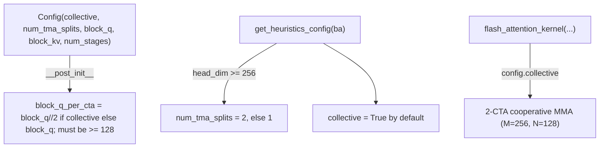

# tokamax._src.ops.attention.pallas_mosaic_gpu_kernel_sm100 — Blackwell flash attention, collective 2-CTA MMA, split TMA loads

<!-- connect:up:begin -->
> **Cross-repo concept:** part of [flash-attention](../../../concepts/flash-attention.md), [mosaic-kernel](../../../concepts/mosaic-kernel.md), [pallas-kernel](../../../concepts/pallas-kernel.md) across this wiki's repos.
<!-- connect:up:end -->
## Overview

[`flash_attention_kernel`](../catalog/tokamax/_src/ops/attention/pallas_mosaic_gpu_kernel_sm100.md#flash_attention_kernel)
is tokamax's Pallas Mosaic-GPU flash-attention kernel targeting SM100 (Blackwell) GPUs, extending
the shared [`ConfigBase`](tokamax-_src-ops-attention-pallas_mosaic_gpu_common.md) with
Blackwell-specific
[`Config`](../catalog/tokamax/_src/ops/attention/pallas_mosaic_gpu_kernel_sm100.md#Config) fields:
[`collective`](../catalog/tokamax/_src/ops/attention/pallas_mosaic_gpu_kernel_sm100.md#Config.collective)
(whether two CTAs cooperate on one 2-CTA MMA with `M=256, N=128`) and
[`num_tma_splits`](../catalog/tokamax/_src/ops/attention/pallas_mosaic_gpu_kernel_sm100.md#Config.num_tma_splits)
(splitting each K/V TMA load into chunks to better overlap load latency with compute).
[`get_heuristics_config`](../catalog/tokamax/_src/ops/attention/pallas_mosaic_gpu_kernel_sm100.md#get_heuristics_config)
derives sensible defaults for both from the input shape.

## Diagram

## Design rationale (why it's built this way)

**`collective` mode splits the Q block across two cooperating CTAs, and this constrains the
minimum per-CTA block size for TMEM slicing — enforced at config-construction time.**
[`Config.__post_init__`](../catalog/tokamax/_src/ops/attention/pallas_mosaic_gpu_kernel_sm100.md#Config)
computes `block_q_per_cta = block_q // 2 if collective else block_q` and raises `ValueError` if it's
below 128, with a message explaining the requirement is "to support TMEM slicing" — Blackwell's
tensor memory (TMEM) has a hardware-driven minimum granularity for how it can be sliced across two
collaborating CTAs, so an otherwise-plausible `block_q`/`collective` combination that would produce
too small a per-CTA slice is rejected immediately rather than failing later during kernel
compilation or execution.

**Splitting each K/V TMA load into `num_tma_splits` chunks trades load-latency-hiding granularity
for pipeline complexity, and its default value is picked based on head dimension.** The class
docstring for
[`num_tma_splits`](../catalog/tokamax/_src/ops/attention/pallas_mosaic_gpu_kernel_sm100.md#Config.num_tma_splits)
explains this "helps to better hide GMEM load latencies as we can notify TMA warp after part of the
mma, thus giving more time to TMA loads," and
[`get_heuristics_config`](../catalog/tokamax/_src/ops/attention/pallas_mosaic_gpu_kernel_sm100.md#get_heuristics_config)
picks `num_tma_splits = 2 if head_dim >= 256 else 1` — a larger head dimension means a larger
K/V tile to load per step, so splitting the load into more chunks gives the MMA warp earlier partial
data to start computing on, proportionally more valuable when there's more data to hide latency for.

## Entry points

- [`flash_attention_kernel`](../catalog/tokamax/_src/ops/attention/pallas_mosaic_gpu_kernel_sm100.md#flash_attention_kernel) —
  the top-level SM100 flash-attention kernel definition.
- [`get_heuristics_config`](../catalog/tokamax/_src/ops/attention/pallas_mosaic_gpu_kernel_sm100.md#get_heuristics_config) —
  reached to derive a default `Config` from the call's input shapes when no explicit or cached
  config is available (see [tokamax-_src-ops-op](tokamax-_src-ops-op.md)'s config-resolution
  priority chain).
- [`PallasMosaicGpuFlashAttention._fwd`](../catalog/tokamax/_src/ops/attention/pallas_mosaic_gpu.md#PallasMosaicGpuFlashAttention._fwd) —
  the `Op`-protocol forward implementation that invokes this kernel.

## Mechanism (step-by-step)

1. **[`get_heuristics_config`](../catalog/tokamax/_src/ops/attention/pallas_mosaic_gpu_kernel_sm100.md#get_heuristics_config)
   inspects the query/value shapes from `ba.args`**, choosing `num_tma_splits`/`collective`/
   `block_q`/`cluster_size` heuristically based on head dimension.
2. **A [`Config`](../catalog/tokamax/_src/ops/attention/pallas_mosaic_gpu_kernel_sm100.md#Config)
   is constructed**, validating (via `__post_init__`) that the effective per-CTA `block_q` is
   large enough for TMEM slicing when `collective` is set.
3. **[`PallasMosaicGpuFlashAttention._fwd`](../catalog/tokamax/_src/ops/attention/pallas_mosaic_gpu.md#PallasMosaicGpuFlashAttention._fwd)
   invokes [`flash_attention_kernel`](../catalog/tokamax/_src/ops/attention/pallas_mosaic_gpu_kernel_sm100.md#flash_attention_kernel)**
   with the resolved config, which internally pipelines K/V TMA loads (split per
   `num_tma_splits`) against the MMA compute loop.

## Key data structures

- **[`Config`](../catalog/tokamax/_src/ops/attention/pallas_mosaic_gpu_kernel_sm100.md#Config)** —
  extends [`ConfigBase`](tokamax-_src-ops-attention-pallas_mosaic_gpu_common.md) with
  [`num_tma_splits`](../catalog/tokamax/_src/ops/attention/pallas_mosaic_gpu_kernel_sm100.md#Config.num_tma_splits)
  and
  [`collective`](../catalog/tokamax/_src/ops/attention/pallas_mosaic_gpu_kernel_sm100.md#Config.collective).

## Dynamics (design intent)

Because `collective` mode processes `M=256` per 2-CTA pair (vs. `M=128` for a single CTA), enabling
it changes the effective work-per-launch-unit ratio — larger logical tiles processed cooperatively
across two CTAs, at the cost of requiring inter-CTA synchronization (cluster barriers) that a
non-collective single-CTA kernel doesn't need.

## Edge cases

- [`Config.__post_init__`](../catalog/tokamax/_src/ops/attention/pallas_mosaic_gpu_kernel_sm100.md#Config)'s
  TMEM-slicing check means a `collective=True` config requires `block_q >= 256` (since
  `block_q // 2 >= 128`) — a smaller `block_q` is only valid with `collective=False`.

## Open questions

- The full pipelining structure inside `flash_attention_kernel`'s deeply nested inner closures
  (warp-specialized load/compute/rescale loops) is not further decomposed here beyond the top-level
  `Config`/heuristics contract — see the packet's own citation graph for the specific nested
  closure names if tracing exact pipeline stages is needed.

## See also
- [tokamax-_src-ops-attention-pallas_mosaic_gpu_common](tokamax-_src-ops-attention-pallas_mosaic_gpu_common.md) —
  `ConfigBase`, the shared config base this module's `Config` extends.
- [tokamax-_src-ops-attention-base](tokamax-_src-ops-attention-base.md) — `DotProductAttention`,
  the op this kernel implements a backend for.
